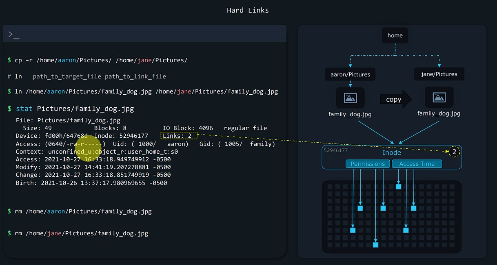
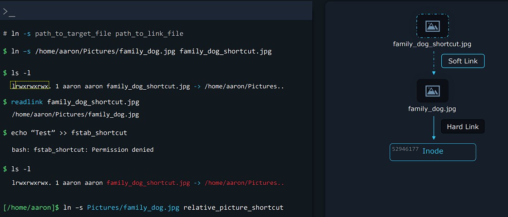
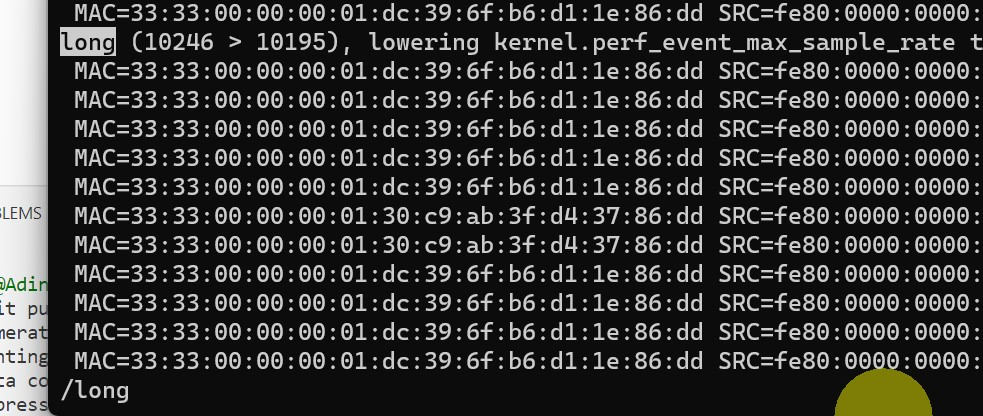
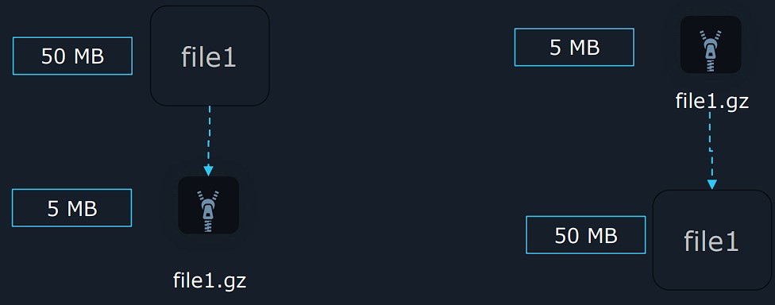
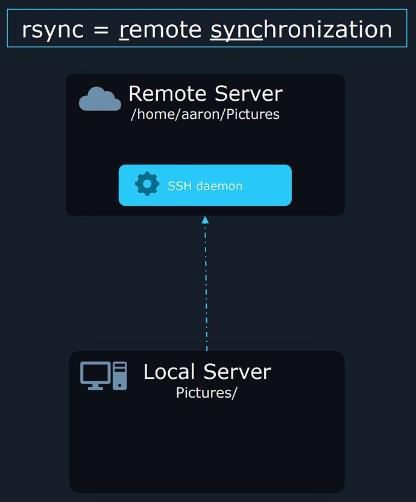
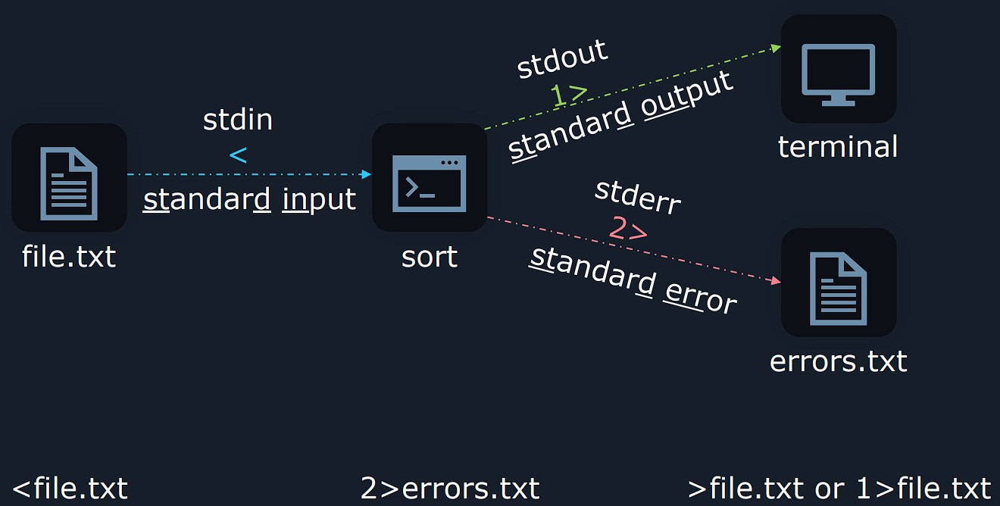

# 1. LFCS-SUMMARY - Essentials commands

## Essentials commands

###  &nbsp;&nbsp;&nbsp;&nbsp;&nbsp;&nbsp;&nbsp;&nbsp; <ins>Log into session (graphical and console)</ins>

* For Remote GUI, you can use :
  * VNC
  * RDP (Windows built-in)

* For Remote console, you can use :
  * SSH client (a Daemon is running on server, listenning for any incoming connections)
    * Linux / Mac console
    * PuTTY
    * WinSCP
  * Telenet (**Not encrypted so NOT RECOMMENDED**)

#### 🔖 <ins>List IP addresses</ins>
```sh
# See 'inet' section below
$	ip a

>

2: ens33: <BROADCAST,MULTICAST,UP,LOWER_UP> mtu 1500 qdisc fq_codel state UP group default qlen 1000
    link/ether 00:0c:29:8d:55:71 brd ff:ff:ff:ff:ff:ff
    altname enp2s1
    inet 192.168.178.140/24 metric 100 brd 192.168.178.255 scope global dynamic ens33
       valid_lft 862605sec preferred_lft 862605sec
    inet6 2001:7e8:c437:8601:20c:29ff:fe8d:5571/64 scope global dynamic mngtmpaddr noprefixroute
       valid_lft 6674sec preferred_lft 3074sec
    inet6 fe80::20c:29ff:fe8d:5571/64 scope link
       valid_lft forever preferred_lft forever
``` 

&nbsp;

### &nbsp;&nbsp;&nbsp;&nbsp;&nbsp;&nbsp;&nbsp;&nbsp; <ins>System documentation</ins>

#### 🔖 <ins>Display commands options (example with "**ls**")</ins>
```sh
$	ls --help

>

Usage: ls [OPTION]... [FILE]...
List information about the FILEs (the current directory by default).
Sort entries alphabetically if none of -cftuvSUX nor --sort is specified.

Mandatory arguments to long options are mandatory for short options too.
  -a, --all                  do not ignore entries starting with .
  -A, --almost-all           do not list implied . and ..
      --author               with -l, print the author of each file
``` 
```sh
$	man ls

>

NAME
       ls - list directory contents

SYNOPSIS
       ls [OPTION]... [FILE]...

DESCRIPTION
       List  information  about the FILEs (the current directory by default).  Sort entries alphabetically if none of
       -cftuvSUX nor --sort is specified.
```

&nbsp;

#### 🔖 <ins>Search for all man pages with a **KEY** word</ins>
```sh
# apropos <KEY_WORD_IN_SHORT_DESCRIPTIONS>
# apropos relies on a database a program must refresh it periodically
# We create it with 'sudo man db'
$	apropos director

>

# chroot (8) -> chroot is a section 8 of the manual
# Commands will be found in sections 1 and 8 -> use 'apropos -s 1,8 director'

addgnupghome (8)     - Create .gnupg home directories
basename (1)         - strip directory and suffix from filenames
bindtextdomain (3)   - set directory containing message catalogs
chroot (8)           - run command or interactive shell with special root directory
cp (1)               - copy files and directories
dbus-cleanup-sockets (1) - clean up leftover sockets in a directory
depmod.d (5)         - Configuration directory for depmod
```

&nbsp;

### &nbsp;&nbsp;&nbsp;&nbsp;&nbsp;&nbsp;&nbsp;&nbsp; <ins>Create, delete, copy, and move files and directories</ins>

#### 🔖 <ins>List current directory content (including hidden ones)</ins>
```sh
# Long listing format
$	ls -al /var/log

>

# drwxr-xr-x -> Directory format or not / Read, Write, Execute permissions for owner, user group, others
# User owner: root / Group owner: root
total 2560
-rw-r--r--  1 root      root             36073 Jul 26 18:12 alternatives.log
drwxr-xr-x  2 root      root              4096 Jul 29 08:12 apt
-rw-r-----  1 syslog    adm               7764 Jul 29 09:40 auth.log
-rw-r--r--  1 root      root             64549 Feb 17 17:19 bootstrap.log
-rw-rw----  1 root      utmp               384 Jul 26 18:11 btmp
```
```sh
# Human format
$	ls -lh /var/log

>

total 2.5M
-rw-r--r--  1 root      root             36K Jul 26 18:12 alternatives.log
drwxr-xr-x  2 root      root            4.0K Jul 29 08:12 apt
-rw-r-----  1 syslog    adm             7.6K Jul 29 09:40 auth.log
-rw-r--r--  1 root      root             64K Feb 17 17:19 bootstrap.log
```

&nbsp;

#### 🔖 <ins>Print working directory</ins>
```sh
$	pwd
```

&nbsp;

#### 🔖 <ins>Change directory</ins>
```sh
$	cd /        # Go to root directory
$	cd -        # Go to previous directory
$	cd          # Go to home directory
```

&nbsp;

#### 🔖 <ins>Create, copy, move, delete files</ins>
```sh
$	cd /        # Go to root directory
$	cd -        # Go to previous directory
$	cd          # Go to home directory

$   cp Receipt.pdf /Receipts/      # cp <SOURCE> <DESTINATION>, directory should end with /
$   cp -r OldReceipts/ Receipts/ # recursive copy

$   mv Receipt.pdf /Receipts/
$   mv Receipt.pdf NewReceiptName.pdf    
$   mv OldReceipts/ Receipts/     # no need of -r argument

$   rm Receipt.pdf /Receipts/
$   rm -r r OldReceipts/
```

&nbsp;

### &nbsp;&nbsp;&nbsp;&nbsp;&nbsp;&nbsp;&nbsp;&nbsp; <ins>Create and manage hard & soft links</ins>
File systems like ZFS, EXT4 keeps track of data with the help of **Inodes**.

> As a file might have blocks of data scattered all over the disk, the **Inode** remembers where all the pieces are stored.
>
> It also keeps track of metadata, like `permissions`, when the data was `last modified`

```sh
$	stat /var/log/kern.log

>

  File: /var/log/kern.log
  Size: 520641          Blocks: 1024       IO Block: 4096   regular file
Device: fd00h/64768d    Inode: 12990       Links: 1
Access: (0640/-rw-r-----)  Uid: (  107/  syslog)   Gid: (    4/     adm)
Access: 2023-07-26 18:11:27.743999845 +0000
Modify: 2023-07-29 10:26:45.995538868 +0000
Change: 2023-07-29 10:26:45.995538868 +0000
 Birth: 2023-07-26 18:11:27.743999845 +0000
```

<br/>

#### 🔖 <ins>Hard links</ins>

They are used to allow access to a shared file for multiple users. 

```sh
# ln path_to_target_file path_to_link_file
$ ln /home/aaron/Pictures/family_dog.jpg /home/jane/Pictures/family_dog.jpg
```
<!--- Center image --->
<div align="center">
  <a href="assets/Hard_Links_1.jpg" target="_blank">
    
  </a>
</div>

<div align="center">
  <i>Aaron has a picture of a dog. <b>Instead of copying the file to Jane Pictures folder</b>, we can create a second hard link to allow Janer to access to <b>data blocks</b> of the dog picture.</i>

  <br/>

  <i><ins>What will happen if Aaron deletes the file ?</ins> Jane <b>can still access the file</b> because the Inode still has 1 link. It is when it has <b>0 link</b> the <b>data itself will be erased</b> from the disk.</i>
</div>

Some limitations :

* We can only hard link files (**not directories**).
* Only hard link to files **on the same file system** (not possible with external disks).
* Having proper permissions
  * Adding users in the same group
  * Setting 660 with `chmod` command to targeted file
  
<br/>

#### 🔖 <ins>Soft links</ins>
Compared to Hard links : 

* `Soft links` are nothing more than a file **pointing to a path**. In fact they represent **shortcuts**.
* They can point to **directories** (contrary to Hard links)
* They also can point to **remote file systems**

```sh
# Same command as Hard link but with additional -s argument
# Note the difference in 'path_to_link_file'
$ ln -s /home/aaron/Pictures/family_dog.jpg family_dog_shortcut.jpg
```

If we change the destination folder name, the link will be broken (**highlighted in red**).

> To tackle this, we could create a soft link with a **relative path**

```sh
# If for example /home/aaron/ -> /home/eren/
ln –s Pictures/family_dog.jpg relative_picture_shortcut
```
<!--- Center image --->
<div align="center">
  <a href="assets/Soft_Links_1.jpg" target="_blank">
    
  </a>
</div>
<div align="center">
  <i>When typing <b>ls -l</b>, you can see that soft link will not show entirely the file path (contray to <b>readlink</b>)</i>
</div>

&nbsp;

### &nbsp;&nbsp;&nbsp;&nbsp;&nbsp;&nbsp;&nbsp;&nbsp; <ins> List, set, and change standard file permissions</ins>

#### 🔖 <ins>Owners and Groups</ins>

When typing `ls -l` we have the following output :

* *aaron* represents the **owner** 

  >(only him can change the permissions, excluding `root` user)
* *family* represents the **group**
```sh
$ ls -l
-rw-r-----. 1 aaron family 49 Oct 27 14:41 family_dog.jpg
```
```sh
# Changing group
$ chgrp wheel family_dog.jpg
$ ls -l
-rw-r-----. 1 aaron wheel 49 Oct 27 14:41 family_dog.jpg

# List groups
$ groups
aaron wheel family
```
```sh
# Changing owner
$ sudo chown jane family_dog.jpg
$ ls -l
-rw-r-----. 1 jane family 49 Oct 27 14:41 family_dog.jpg

# Changing owner and group
$ sudo chown aaron:family family_dog.jpg
$ ls -l
-rw-r-----. 1 aaron family 49 Oct 27 14:41 family_dog.jpg
```

&nbsp;

#### 🔖 <ins>File & Directory permissions</ins>
Based on the following output :
* The 1st character shows what **type of entry** this is : *file*, *special file*, *directory*, etc.  
* The others represents the **Read**, **Write**, **Execute** permissions for owner, group, others.

```sh
$ ls -l
-rwxrwxrw-. 1 aaron family 49 Oct 27 14:41 family_dog.jpg
```

<div align="center">
  <table>
    <tr>
      <th>File Type</th>
      <th>Identifier</th>
    </tr>
    <tr>
      <td>DIRECTORY</td>
      <td align="center">d</td>
    </tr>
    <tr>
      <td>REGULAR FILE</td>
      <td align="center">-</td>
    </tr>
    <tr>
      <td>CHARACTER DEVICE </td>
      <td align="center">c</td>
    </tr>
    <tr>
      <td>LINK</td>
      <td align="center">l</td>
    </tr>
    <tr>
      <td>SOCKET FILE</td>
      <td align="center">s</td>
    </tr>
    <tr>
      <td>PIPE</td>
      <td align="center">p</td>
    </tr>
    <tr>
      <td>BLOCK DEVICE</td>
      <td align="center">b</td>
    </tr> 
  </table>
</div>

### ⚠️ With the **Read**, **Write**, **Execute** on 📁 :

```sh
$ ls Pictures/            # if READ allowed, we can list content
$ mkdir Pictures/Family   # if WRITE allowed, we can create or delete subdirectories or files
$ cd Pictures/            # if EXECUTE allowed, we can enter into the Pictures directory
```
<br/>

##### &nbsp;&nbsp;&nbsp;&nbsp;&nbsp;&nbsp;&nbsp;&nbsp;&nbsp;&nbsp; <ins>**Changing permissions**</ins>
```sh
$ ls -l                        # User, Group, Others
-r--rw----. 1 aaron family 49 Oct 27 14:41 family_dog.jpg

# Giving WRITE permission to owner with '+'
$ chmod u+w family_dog.jpg
$ ls -l
-rw-rw----. 1 aaron family 49 Oct 27 14:41 family_dog.jpg

# Removing READ permission to owner with '-'
$ chmod u-r family_dog.jpg
$ ls -l
--w-rw----. 1 aaron family 49 Oct 27 14:41 family_dog.jpg

# Setting exact permissions to group with '='
$ chmod g=rwx family_dog.jpg
$ ls -l
--w-rwx---. 1 aaron family 49 Oct 27 14:41 family_dog.jpg

$ chmod g= family_dog.jpg      # Make empty permissions
$ ls -l
--w-------. 1 aaron family 49 Oct 27 14:41 family_dog.jpg
```

<br/>

##### &nbsp;&nbsp;&nbsp;&nbsp;&nbsp;&nbsp;&nbsp;&nbsp;&nbsp;&nbsp; <ins>**Chaining permissions**</ins>
```sh
# user: at least READ and WRITE
# group: only READ
# others: NO PERMISSIONS
$ chmod u+rw,g=r,o= family_dog.jpg
$ ls -l
-rw-r-----. 1 aaron family 49 Oct 27 14:41 family_dog.jpg
```

<br/>

##### &nbsp;&nbsp;&nbsp;&nbsp;&nbsp;&nbsp;&nbsp;&nbsp;&nbsp;&nbsp;  <ins>**Octal permissions**</ins>
```sh
$ stat family_dog.jpg
File: family_dog.jpg
  Size: 49 Blocks: 8 IO Block: 4096 regular file
Device: fd00h/64768d Inode: 52946177 Links: 1
Access: (0640/-rw-r-----) Uid: ( 1000/ aaron) Gid: ( 10/ wheel)
```

&nbsp;

###  &nbsp;&nbsp;&nbsp;&nbsp;&nbsp;&nbsp;&nbsp;&nbsp; <ins>SUID, SGID, and sticky bit</ins>

#### 🔖 <ins>SUID (Set User ID bit)</ins>
When setting this bit on a file : it means whenever this file is executed, it is going to be executed as **the owner of the file** (instead of the ID of the person running that file)
```sh
$ touch suidfile
$ ls -l suidfile
-rw-rw-r--. 1 aaron aaron 0 Apr 26 14:41 suidfile

# Before using the 3 digit permissions in octal format, we're goign to add a 4th digit, our SUID
$ chmod 4664 suidfile

# We can see a capital S replacing the x bit :  SUID is enabled for this file
# If anybody else were to be able to execute this file, IT WILL BE as the user Aaron
$ ls -l suidfile
-rwSrw-r--. 1 aaron aaron 0 Apr 26 15:00 suidfile

$ chmod 4764 suidfile

# When you see capital S, SUID is enabled but there is NO EXECUTE permissions
# When you see lowercase s, SUID and EXECUTE are both enabled.

$ ls -l suidfile
-rwsrw-r--. 1 aaron aaron 0 Apr 26 15:19 suidfile
```

<br/>

#### 🔖 <ins>SGID</ins>
Pretty much the same as the SUID, only it is going to apply for the group on a file.
```sh
$ touch sgidfile
$ ls -l sgidfile
-rwsrw-r--. 1 aaron aaron 0 Apr 26 14:41 sgidfile

# We're using the 2 instead of the 4 as the leading digit
$ chmod 2664 sgidfile
$ ls -l sgidfile
-rw-rwSr--. 1 aaron aaron 0 Apr 26 15:00 sgidfile

$ chmod 2674 sgidfile
$ ls -l sgidfile
-rw-rwsr--. 1 aaron aaron 0 Apr 26 15:19 sgidfile
```

```sh
# Finding content having the 4 leading digit. We don't care about permissions -> 000
$ find . -perm /4000
./suidfile
$ find . -perm /2000
./sgidfile
```

```sh
# Creating entry with BOTh leading bits (on user & group), using 6
$ touch both
$ chmod 6664 both
$ ls -l both
-rwSrwSr--. 1 aaron aaron 0 Apr 26 17:21 both

$ find . -perm /6000
./suidfile
./sgidfile
./both
```

<br/>

#### 🔖 <ins>Sticky bit</ins>
It is usually set on directories that **are shared between people** and it's going to **only allow the owner of a file** inside to be able to remove the file.
```sh
$ mkdir stickydir
$ ls -ld stickydir
drwxrwxr-x. 2 aaron aaron 6 Apr 26 20:54 stickydir

# Using leading bit 1
# $ chmod +t stickydir
$ chmod 1777 stickydir
# Sticky bit and EXECUTE ar both set, so we have a lowercase t
$ ls -ld stickydir
drwxrwxrwt. 2 aaron aaron 6 Apr 26 20:59 stickydir

$ chmod 1666 stickydir
$ ls -ld stickydir
drw-rw-rwT. 2 aaron aaron 6 Apr 26 21:24 stickydir
```

&nbsp;

###  &nbsp;&nbsp;&nbsp;&nbsp;&nbsp;&nbsp;&nbsp;&nbsp; <ins>Search for files</ins>
We're using `find [/path/to/directory] [search_parameters]` command.
```sh
# Find JPG files
$ find /usr/share/ -name '*.jpg'
1.jpg 2.jpg 3.jpg

# Find files larger then 10 Mb / 10 b / 10 kb / 10 Gb
$ find /lib64/ -size +10M           # +10c / +10k / +10G
large-file.txt

# Find files that have been modified in the last minute
$ find /dev/ -mmin -1
abc.txt

# Find files that have been modified more than 5 minutes ago
$ find /dev/ -mmin +5
cde.txt

# Find files that have been modified past 24h periods (betwwen 24 and 48h)
$ find /dev/ -mtime 2
xyz.txt

# Find without case sensitive
$ find -iname felix

# Find files starting by f
$ find -name "f*"
```
```sh
# Permissions: 664 = u+rw,g+rw,o+r
$ find –perm 664       # find files with exactly 664 permissions
$ find –perm u=rw,g=rw,o=r 
$ find –perm -664      # find files with at least 664 permissions
$ find –perm –u=rw,g=rw,o=r 
$ find -perm /664      # find files with any of these permissions
$ find –perm /u=rw,g=rw,o=r 
```

Linux has a thing called `Change Time` for files. But it is different from `Modified Time` (File creation or edition).

* `Modified Time` refers nthe time when contents have been modified
* `Change Time` refers to the time when metadata has been changed (data about the file, like permissions).
```sh
# Find files having changed time in the last 5 minutes (when someone has changed permissions)
$ find -cmin -5
```

We can also use search expressions
```sh
$ find -name "f*" -size 512k        # AND operator
$ find -name "f*" -o -size 512k     # OR operator

$ find –not -name "f*"              # NOT operator
$ find \! -name "f*"                # alternate NOT operator
```

&nbsp;

###  &nbsp;&nbsp;&nbsp;&nbsp;&nbsp;&nbsp;&nbsp;&nbsp; <ins>Compare and manipulate file content</ins>

#### 🔖 <ins>Read file</ins>

```sh
# Display file content (for small files)
$  cat /home/users.txt
user1
user2
user3

# Reverse version of cat
$ tac /home/users.txt
user3
user2
user1

# Display LARGE file content last 20 lines. It shows by default the last 10 lines (-n 10)
$ tail -n 20 /var/log/dnf.log
2021-11-02T19:22:58-0500 DEBUG DNF version: 4.7.0
2021-11-02T19:22:58-0500 DDEBUG Command: dnf makecache --timer
...

# Reverse version of tail
$ head -n 20 /var/log/dnf.log
2021-10-19T00:53:06-0500 INFO --- logging initialized ---
2021-10-19T00:53:06-0500 DDEBUG timer: config: 3 ms
...
```

<br/>

#### 🔖 <ins>Manipulating file</ins>

- We can use `sed` command to **preview** what changes would be done **without changing** the file

```sh
# userinfo.txt, a file with mispelled Canada

>

ravi seattle  usa    39483930 india
mark toronto  canada 12345678 canada
john newyork  usa    39348495 usa
ravi montreal canda  39484859 canda
mary ottawa   canda  39384940 canda


# Into single quotes, we have :
#   - s for substitute command (search and replace)
#   - g for global search (to replace all occurences)
$ sed 's/canda/canada/g' userinfo.txt

>

ravi seattle  usa     39483930 india
mark toronto  canada  12345678 canada
john newyork  usa     39348495 usa
ravi montreal canada  39484859 canada
mary ottawa   canada  39384940 canada

# Without 'g' argument, only 1st occurence is changed
$ sed 's/canda/canada/' userinfo.txt

>

ravi seattle  usa     39483930 india
mark toronto  canada  12345678 canada
john newyork  usa     39348495 usa
ravi montreal canada  39484859 canda
mary ottawa   canada  39384940 canda
```
To edit directly in the file, use the `-i` argument (--in-place)
```sh
$ sed –i 's/canda/canada/g' userinfo.txt
```

- `cut` command will extract ony the parts we need from a file. **' '** is the delimiter and **-f** the field we want to extract.
```sh
# To get the 1st column. -f 1 means the 1swt word we want to extract on each line.
$ cut –d ' ' –f 1 userinfo.txt
ravi
mark
john
ravi
mary

# To get the 3rd column
$ cut –d ',' –f 3 userinfo.txt
usa
canada
usa
canada
canada
```
- `uniq` command will get us unique entries from a file.
```sh
# We have the following column
usa
canada
usa
canada
canada


# uniq alone will find the 2 last canada are adjacent so it removes the last line
$ uniq countries.txt
usa
canada
usa
canada

$ sort countries.txt
canada
canada
canada
usa
usa

# The solution is to sort the list to get duplicates adjacent before using uniq
$ sort countries.txt | uniq
canada
usa
```

<br/>

#### 🔖 <ins>Comparing file</ins>
Using `diff` tool will allow us to see the differences between files.
```sh
# Imagine the following contents

# file 1
Only exists in file 1
Identical line 2
Identical line 3
Only exists in file 1

# file 2
Only exists in file 2
Identical line 2
Identical line 3
Only exists in file 2


# 1c1 tells us line 1 from file 1 is changed in line 1 on file 2
# 4c4 tells us line 4 from file 1 is changed in line 4 on file 2
$ diff file1 file2
1c1
< Only exists in file 1
---
> Only exists in file 2
4c4
< Only exists in file 1
---
> Only exists in file 2

# In LARGE files, we might have no idea where these lines are situated.
# -c will give us a bit of context and see what text is around these areas where the lines are different
$ diff -c file1 file2
*** file1       2023-07-30 14:46:15.250051872 +0000
--- file2       2023-07-30 14:46:28.329941301 +0000
***************
*** 1,4 ****
! Only exists in file 1
  Identical line 2
  Identical line 3
! Only exists in file 1
--- 1,4 ----
! Only exists in file 2
  Identical line 2
  Identical line 3
! Only exists in file 2

# Doing a side by side comparison
# $ sdiff file1 file2
$ diff -y file1 file2

Only exists in file 1                                         | Only exists in file 2
Identical line 2                                                Identical line 2
Identical line 3                                                Identical line 3
Only exists in file 1                                         | Only exists in file 2
```

&nbsp;

###  &nbsp;&nbsp;&nbsp;&nbsp;&nbsp;&nbsp;&nbsp;&nbsp; <ins>Pagers</ins>
`Pagers` are programs that allow us to open multiple pages of text and navigate through them while on terminal. There are 2 Pagers :

- `less`
- `more`

```sh
$ less /var/log/kern.log
```
<!--- Center image --->
<div align="center">
  <a href="assets/Pagers_1.jpg" target="_blank">
    
  </a>
</div>
<div align="center">
  <i>To search a key word, type <b>/</b>, followed by your key word (in the example, we look after <b>long</b>)</i>
  <br/>
  <i>To go to the next instance, type <b>n</b></i>
    <br/>
  <i>To go to the previous instance, type <b>N</b></i>
</div>

<br/>

```sh
# We move by page, using Space Bar
$ more /var/log/kern.log
```

&nbsp;

###  &nbsp;&nbsp;&nbsp;&nbsp;&nbsp;&nbsp;&nbsp;&nbsp; <ins>Search text in file with Grep</ins>
```sh
# grep [search_options] [search_pattern] [file_path]
$  grep -i 'Ubuntu' /var/log/kern.log               # -i for case insensitive

Jul 30 13:32:58 ubuntu kernel: [    0.000000] Linux version 5.15.0-78-generic (buildd@lcy02-amd64-008) (gcc (Ubuntu 11.3.0-1ubuntu1~22.04.1) 11.3.0, GNU ld (GNU Binutils for Ubuntu) 2.38) #85-Ubuntu SMP Fri Jul 7 15:25:09 UTC 2023 (Ubuntu 5.15.0-78.85-generic 5.15.99)
Jul 30 13:32:59 ubuntu kernel: [    6.750785] Loaded X.509 cert 'Canonical Ltd. Secure Boot Signing (Ubuntu Core 2019): c1d57b8f6b743f23ee41f4f7ee292f06eecadfb9'
Jul 30 13:32:59 ubuntu kernel: [  137.547769] CPU: 0 PID: 195 Comm: systemd-udevd 


# Search into all files under a directory and subdirectories
$  grep -r 'Ubuntu' /var/log/
$  grep -ir 'Ubuntu' /var/log/


# Reverse search
$  grep -vi 'Ubuntu' /var/log/kern.log


# It will find words having 'red'
$ grep –i 'red' /etc/os-release
BUG_REPORT_URL="https://bugzilla.redhat.com/"
REDHAT_SUPPORT_PRODUCT="Red Hat Enterprise Linux 8"
REDHAT_SUPPORT_PRODUCT_VERSION="CentOS Stream"
```

&nbsp;

###  &nbsp;&nbsp;&nbsp;&nbsp;&nbsp;&nbsp;&nbsp;&nbsp; <ins>Analyze text using basic regular expressions</ins>
Regular expressions are built with the help of operators like : `^`, `$`, `.`, `*`, `+`, `{}`, `?`, `|`, `[]`, `()`, `[^]`

```sh
$ grep '7' toto.log
# See #290803 and #298773 for details about how this could become a security
# 027, or even 077, could be considered better for privacy
ERASECHAR       0177
HOME_MODE       0750
PASS_WARN_AGE   7
7 # (examples: 022 -> 002, 077 -> 007) for non-root users, if the uid is


# Find words ending with  (KEY_WORD$)
# ===================================
$ grep '7$' /etc/login.defs
ERASECHAR       0177
PASS_WARN_AGE   7

# Find words beginning with  (^KEY_WORD)
# ======================================
7 # (examples: 022 -> 002, 077 -> 007) for non-root users, if the uid is

# +: Match The Previous Element 1 Or More Times 
# =============================================
$ grep -r '0\+' toto.log                   # Don't forget escaped character \)
# See #290803 and #298773 for details about how this could become a security
# 027, or even 077, could be considered better for privacy
ERASECHAR       0177
HOME_MODE       0750
7 # (examples: 022 -> 002, 077 -> 007) for non-root users, if the uid is
```
```sh
# Begins with /; has 0 or more characters between; ends with a /
# *: Match The Previous Element 0 Or More Times
$ grep -r '/.*/' /etc/
/etc/man_db.conf:# before /usr/man.
/etc/man_db.conf:MANDB_MAP /usr/man
/var/cache/man/fsstnd
/etc/man_db.conf:MANDB_MAP /usr/share/man
/var/cache/man
```

&nbsp;

###  &nbsp;&nbsp;&nbsp;&nbsp;&nbsp;&nbsp;&nbsp;&nbsp; <ins>Extended Regular Expressions</ins>
```sh
# $ grep -r '0\+' toto.log
$ grep -Er '0+' toto.log              # Using 'E' option avoids us to use excape character 
$ egrep -r '0+' toto.log
```
```sh
# Finding all strings that contain at least three zeros  -> {3,}
$ egrep -r '0{3,}' toto.log

# Finding all strings that contain , followed by, at least three zeros  -> {3,}
$ egrep -r '10{3,}' toto.log                      # Even 1 not followed by 0 match
1/600 (1 dot). 
/etc/pnm2ppa.conf: # valid blackness choices are 1 2 3 4; controls the
/etc/pnm2ppa.conf:#GammaR 1.0 # red enhancement
line options --uni
/etc/pnm2ppa.conf:#unimode 1
/etc/subuid-:aaron:100000:65536
/etc/subuid-:bob:165536:65536
/etc/subuid-:charles:231072:65536

# Finding all strings matching EXACTLY 1 followed by three zeros  -> {3}
$ egrep -r '10{3}' toto.log           
/etc/subuid-:aaron:100000:65536

# Finding all strings having EXACTLY three zeros  -> {3}
$ egrep -r '0{3}' toto.log           
/etc/subuid-:aaron:100000:65536

# Finding all strings that having 3, 4 or 5 zeros  -> {3,5}
$ egrep -r '0{3,5}' toto.log                     
/etc/subuid-:aaron:100000:65536
```
```sh
# Finding all strings matching 'disable' or 'disabled'  -> last 'd' is optional
$ egrep -r 'disabled?' /etc/
/etc/vmware-tools/tools.conf.example:# Set to true to disable the 
/etc/vmware-tools/tools.conf.example:#disabled=false

# Match one thing or the other  -> |
$ egrep -r 'enabled|disable?' /etc/
/etc/dleyna-server-service.conf:# If netf is enabled but the list is 
empty, it behaves as disabled.
```
```sh
# Matching any one lowercase from a to z  ->  [a-z]
$ egrep -r 'enabled|disable?' /etc/
/etc/dleyna-server-service.conf:# If netf is enabled but the list is 
empty, it behaves as disabled.

# Words having cat or cut
$ egrep -r 'c[au]t' /etc/
/etc/man_db.conf:# NOCACHE keeps man from creating cat pages.
/etc/nanorc:## Use cut-from-cursor-to-end-of-line by default.
```
```sh
# Words having /dev/, followed by any random characters
$ egrep -r '/dev/.*' /etc
/etc/smartmontools/smartd.conf:#/dev/twl0 -d 3ware,1 -a -s L/../../2/03
/etc/smartmontools/smartd.conf:#/dev/hdc,0 -a -s L/../../2/01

# Words having /dev/, followed by any characters having a or b or ... to z
$ egrep -r '/dev/[a-z]*' /etc/
/etc/smartmontools/smartd.conf:#/dev/twl0 -d 3ware,1 -a -s L/../../2/03
/etc/smartmontools/smartd.conf:#/dev/hdc,0 -a -s L/../../2/01

# Useful for finding words like /dev/sda or /dev/sda1 (for example)
# /dev followed by any characters between a-z [a-z]*, followed by a 1 character between 0-9 (optional) 
$ egrep -r '/dev/[a-z]*[0-9]?' /etc/
/etc/smartmontools/smartd.conf:#/dev/twa0 -d 3ware,1 -a -s L/../../2/03
/etc/smartmontools/smartd.conf:# On FreeBSD /dev/tws0 should be used instead
/etc/smartmontools/smartd.conf:#/dev/twl0 -d 3ware,0 -a -s L/../../2/01
/etc/smartmontools/smartd.conf:#/dev/twl0 -d 3ware,1 -a -s L/../../2/03
```
```sh
# Only /dev/tty0 will be highlighted. p0 will be ignored
$ egrep -r '/dev/[a-z]*[0-9]?' /etc/
/etc/sane.d/dc25.conf:#port=/dev/tty0p0

# Searching after /dev, some letters and a digit at the end.
# After that the same thing can repet 0, 1 or many more time : there can be other sequences of letters followed by 1 digit.
#
# /dev/tty0 would 1st match (-> [a-z]*[0-9]?) and then p0 would be added to this match by that repetition
#
# What makes it look for something to exist 0 or more times ? Thatis going to be the *
# But adding the * at the end would apply to the previous element only -> NOT GOOD
#
# Solution : Put the expression between ()   ->   ([a-z]*[0-9]?)*
$ egrep -r '/dev/([a-z]*[0-9]?)*' /etc/
/etc/sane.d/dc240.conf:port=/dev/ttyS0
/etc/sane.d/dc25.conf:#port=/dev/tty0p0
/etc/sane.d/dc25.conf:#port=/dev/ttyd1
/etc/sane.d/coolscan3.conf:#scsi:/dev/scanner
```
```sh
# Looking for lowercase or Uppercase letters with the | operator
$ egrep -r egrep -r '/dev/(([a-z]|[A-Z])*[0-9]?)*' /etc/
/etc/sane.d/dc240.conf:port=/dev/ttyS0
/etc/sane.d/dc240.conf:#port=/dev/ttyd1
/etc/sane.d/dc240.conf:#port=/dev/term                         #/a
/etc/sane.d/u12.conf:# device /dev/usbscanner

# Looking for Http but excludes Https
# http[^s]  -> ^ will exclude s
$ egrep –r 'http[^s]' /etc/

# After a /, there should not be any lowercase letter
$ egrep –r '/[^a-z]' /etc/
```

&nbsp;

###  &nbsp;&nbsp;&nbsp;&nbsp;&nbsp;&nbsp;&nbsp;&nbsp; <ins>Archive, backup, compress, unpack, and uncompress files</ins>
For backing up files, 3 steps :
1. Archive (packing all files and directories into 1 single file)  
  ➡️  `backup.tar` (tar for **ta**pe **ar**chive)
2. Compress                                                        
  ➡️  `backup.tar.gz`
3. Backup (where you would copy the compressed file to a remote location)                                                        

<br/>

`tar` is basically a packer and unpacker.

<br/>

#### 🔖 <ins>Displaying archive content</ins>
```sh
$ tar --list --file archive.tar
file1
file2
file3

# t for
# f for
$ tar -tf archive.tar
file1
file2
file3

$ tar tf archive.tar
file1
file2
file3
```

<br/>

#### 🔖 <ins>Packing files and Directories</ins>
```sh
$ tar --create --file archive.tar file1 
$ tar cf archive.tar file1

$ tar --append --file archive.tar file2 
$ tar rf archive.tar file2

$ tar --create –-file archive.tar Pictures/
Pictures/
Pictures/family_dog.jpg

$ tar --create –-file archive.tar /home/aaron/Pictures/
/home/aaron/Pictures/
/home/aaron/Pictures/family_dog.jpg
```

<br/>

#### 🔖 <ins>Extracting files</ins>

```sh
$ tar --list –-file archive.tar
$ tar tf archive.tar
Pictures/
Pictures/family_dog.jpg

# if pwd = /home/aaron/work/, our files willbe extracted like the result below.
# It is advised to check the content of our backup before
$ tar --extract –-file archive.tar
$ tar xf archive.tar
/home/aaron/work/Pictures/
/home/aaron/work/Pictures/family_dog.jp

# Extract to other directory
$ tar --extract –-file archive.tar --directory /tmp/ 
$ tar xf archive.tar –C /tmp/
```
```sh
# tar also stores permission and ownership information of all files and directories
# if when logged as Aaron, some files are owned by Jane, Aaron ha nos the necessary permissions to create a file owned by Jane, but root user has that
$ sudo tar --extract –-file archive.tar --directory /tmp
```

&nbsp;

###  &nbsp;&nbsp;&nbsp;&nbsp;&nbsp;&nbsp;&nbsp;&nbsp; <ins>Compress and Uncompress files</ins>
Most Linux systems have at least 3 compression utilities pre-installed : 
* `GZIP` 
* `BZIP2` 
* `XZ`

```sh
$ gzip file1              $ gunzip file1.gz         gzip --decompress file1.gz
file1.gz                  file1

$ bzip2 file2             $ bunzip file2.bz2        bzip2 --decompress file2.bz2
file2.bz2                 file2

$ xz file3                $ unxz file3.xz           xz --decompress file3.xz
file3.bz2                 file3
```
<!--- Center image --->
<div align="center">
  <a href="assets/Compress_Decompress_1.jpg" target="_blank">
    
  </a>
</div>

<br/>

We want to see what utility compresses our data better and which one produces a smaller file.

<br/>

Let's see about `ZIP`. This utility :

- **supports both packing and compression**. 

  `GZIP`, `BZIP2`, `XZ` don't do that (they're often paired up with an additional utility). See example below.
- can not pack / compress multiple files into a single file.

```sh
$ zip archive file1
$ zip archive.zip file1
adding: file1 (deflated 40%)

$ zip –r archive.zip Pictures/
adding: Pictures/ (stored 0%)
adding: Pictures/family_dog.jpg (stored 0%)

$ unzip archive.zip
Archive: archive.zip
replace file1? [y]es, [n]o, [A]ll, [N]one, [r]ename: 
```
```sh
# Without using ZIP

# Archive
$ tar --create --file archive.tar file1

# Compress
$ gzip archive.tar
archive.tar.gz


# To do the archive AND compress
$ tar --create –-gzip --file archive.tar.gz file1 
$ tar czf archive.tar.gz file1

$ tar --create –-bzip2 --file archive.tar.bz2 file1 
$ tar cjf archive.tar.bz2 file1

$ tar --create –-xz --file archive.tar.xz file1 
$ tar cJf archive.tar.xz file1
```
```sh
# Better option : tar has an auto compressed option to automatically figure out what compression utility to use based on the file name extension we choose for our archive.
$ tar --create –-autocompress --file archive.tar.gz file1
$ tar caf archive.xz file1

# When unpacking and decompressing, though, we don't have to tell tar what decompression utility to use
$ tar --extract --file archive.tar.gz
$ tar xf archive.tar.gz file1
```

&nbsp;

###  &nbsp;&nbsp;&nbsp;&nbsp;&nbsp;&nbsp;&nbsp;&nbsp; <ins>Backup files to a Remote System</ins>

A popular tool to back up data is `rsync` (remote synchronization). 

* It can kepp some directories on server 1 synchronized with some directories on server 2 by copying data through a network connection.
* The remote server must happen have a SSH daemon running on it.
<!--- Center image --->
<div align="center">
  <a href="assets/Backup_Remote_1.jpg" target="_blank">
    
  </a>
</div>

<br/>

```sh
# rsync SOURCE_REPO REMOTE_REPO 

# '-a' for archive, to synchronize subdirectories, permissions, modification times
# If you run this command a 2nd time, rsync will only copy data that has changed
$ rsync –a Pictures/ aaron@9.9.9.9:/home/aaron/Pictures/
$ rsync –a aaron@9.9.9.9:/home/aaron/Pictures/ Pictures/
$ rsync –a Pictures/ /Backups/Pictures/
```
```sh
# Backing up entire disk or partition  --> using dd
# This takes a picture of all the data on disk or partition

# Before saving disk or partition, UNMOUNT it to make sure that data is being changed while backing it up.

# 'if' for input file. 'of' for output file. 'bs' block size
# status=progress will tells our 'dd' utilisty to show progress
$ sudo dd if=/dev/vda of=diskimage.raw bs=1M status=progress
1340080128 bytes (1.3GB, 1.2GB) copied, 3s, 432 MB/s

# To restore, just reverse if and of
$ sudo dd if=diskimage.raw of=/dev/vda bs=1M status=progress
1340080128 bytes (1.3GB, 1.2GB) copied, 3s, 432 MB/
```

### ⚠️ WARNING :

> ⚠️ According to the instructor, we should not run the `dd` command on virtual machine because it is going to overwrite its virtual disk.

&nbsp;

###  &nbsp;&nbsp;&nbsp;&nbsp;&nbsp;&nbsp;&nbsp;&nbsp; <ins>Use input-output redirection (e.g. >, >>, |, 2>)</ins>
Now we look at how to redirect input and output in Linux. We have to understand first how some Linux programs deal with input and output.

<br/>

Let's take a look a `sort` utility.

`sort` expects to receive some text input. Usually it will get this input from a file. Then it will generate some text output with the sorted results.

```sh
# Unsorted file
$ cat file.txt
6
5
1
3
4
2

$ sort file.txt
1
2
3
4
5
6

# Using redirection to save sorted output in new file
# We call like this because sort should diplay output on terminal but we redirect it to a new file
$ sort file.txt > sortedfile.txt
$ cat sortedfile.txt
1
2
3
4
5
6
```

When using output redirection on the same file, you overwrite it by default. We can change this behavior by appending with `>>`.

```sh
$ date >> file.txt
$ date >> file.txt

# The bottom is the newest line
$ cat file.txt
Mon Nov 8 18:50:30 CST 2021
Mon Nov 8 18:50:31 CST 2021
```

<br/>

#### 🔖 <ins>stdin, stdout, stderr</ins>
- `stdin` : standard input
- `stdout` : standard output
- `stderr` : standard error

```sh
date < file.txt
date 1> output.txt
date 2> error.txt
```
<!--- Center image --->
<div align="center">
  <a href="assets/Output_Redirection_1.jpg" target="_blank">
    
  </a>
</div>


<br/>

When using `grep` utility, we can have errors messages due to permission errors, along the messages. With input and output redirection tricks we can get rid of this.

#### 🔖 <ins>Output redirection</ins>

```sh
$ grep –r '^The' /etc
grep: /etc/chrony.keys: Permission denied  # Error message
grep: /etc/brlapi.key: Permission denied   # Error message
/etc/brltty/Input/tn/all.txt:The two keys at the left 
rear (2 columns, 1 row):
/etc/brltty/Input/tn/all.txt:The four keys at the left 
middle (cross):

# This special /dev/null file is often used to get rid of unnecessary output
$ grep –r '^The' /etc/ 2>/dev/null
/etc/brltty/Input/tn/all.txt:The two keys at the left 
rear (2 columns, 1 row):
/etc/brltty/Input/tn/all.txt:The four keys at the left 
middle (cross):

# overwrite
$ grep –r '^The' /etc/ 1>output.txt 2>errors.txt
# append
$ grep –r '^The' /etc/ 1>>output.txt 2>>errors.txt
```
```sh
# If we'd want to save all output (including errors)  --> 2>&1 at the end
# 2>&1 -> errors go to standard output (1)
$ grep –r '^The' /etc/ > all_output.txt 2>&1

grep: /etc/brlapi.key: Permission denied
/etc/brltty/Input/tn/all.txt:The two keys at the left 
rear (2 columns, 1 row):
```

```sh
# If we WRONGLY place 2>&1, default output will be on screen and errors will be instead in the file
$ grep –r '^The' /etc/ 2>&1 1>all_output.txt
grep: /etc/cups/classes.conf: Permission denied
grep: /etc/cups/cups-files.conf: Permission denied
```
<br/>

#### 🔖 <ins>Input redirection</ins>

```sh
# With 'sendmail' command, we don't have an option to use an external file for writing content mail 
$ sort file.txt
$ sendemail someone@example.com

Hi Someone,
How are you today?
...
Talk to you soon
Bye

# We can resolve our issue with this trick  -->  the <
$ sendemail someone@example.com < emailcontent.txt 
```
```sh
# Wit <<EOF we signal the input we want to pass ends before the last line (where we type EOF)
$ sort <<EOF
> 6
> 3
> 2
> 5
> 1
> 4
> EOF              < ---- We will process to the sorting before EOF

1
2
3
4
5
6
```
```sh
# 1+2+3+4 is the input
$ bc <<<1+2+3+4
10
```
<br/>

#### 🔖 <ins>Piping</ins>
```sh
# Finding uncommented lines -> who don't begin with #  --> ^#
$ grep –v '^#' /etc/login.defs
...
CREATE_HOME yes
USERGROUPS_ENAB yes
ENCRYPT_METHOD SHA512

# Using Pipe for using sort after grep
$ grep –v '^#' /etc/login.defs | sort
CREATE_HOME yes
ENCRYPT_METHOD SHA512
GID_MAX 60000

# Using Pipe to align the output columns
$ grep –v '^#' /etc/login.defs | sort | column -t
CREATE_HOME       yes
ENCRYPT_METHOD    SHA512
GID_MAX           60000
```

&nbsp;

###  &nbsp;&nbsp;&nbsp;&nbsp;&nbsp;&nbsp;&nbsp;&nbsp; <ins>Work with SSL certificates</ins>

Nowadays, we are using an upgrad of SSL certificates called TLS (**Transport Layer Security**). By old habit, some tools stuck with the old name.

Certificates are used for :

- authenticating a website, proving it is a legitimate one..
- encrypting network traffic between the user and the website.

<br/>

#### 🔖 <ins>How do we create certificates ?</ins>

The tool **`openssl`** is used for this. Let's focus on **X.509 certifcates** creation, used on websites to do authentification ansd encryption.


##### &nbsp;&nbsp;&nbsp;&nbsp;&nbsp;&nbsp;&nbsp;&nbsp;&nbsp;&nbsp;  <ins>**Certificate Signing Request (CSR)**</ins>

A website uses a certificate to secure web traffic between the users and website. **But** when the users visit the site, **their browser also needs to trust** the certificate.

They have to check the **Certificate Authority**. For this :

- the website's owner sends the certificate to some company, like Google.
- the company uses its private key to sign the certificate
- once signed, any browser can then check the signature

```sh
# We generate a key of type RSA with 2048 bits
# -keyout for saving the private key into a file called key.pem
# -out for creating the CSR as req.pem
$ openssl req -newkey rsa:2048 -keyout key.pem -out req.pem


Generating a 2048 bit RSA private key
...........+++
.........+++
writing new private key to 'key.pem'
Enter PEM pass phrase:
Verifying - Enter PEM pass phrase:
-----
You are about to be asked to enter information that will be incorporated
into your certificate request.
What you are about to enter is what is called a Distinguished Name or a DN.
There are quite a few fields but you can leave some blank
For some fields there will be a default value,
If you enter '.', the field will be left blank.
-----
Country Name (2 letter code) [XX]:US
State or Province Name (full name) []:New-York
Locality Name (eg, city) [Default City]:Buffalo
Organization Name (eg, company) [Default Company Ltd]:kodekloud
Organizational Unit Name (eg, section) []:kodekloud courses
# VERY IMPORTANT PART
Common Name (eg, your name or your server's hostname) []:kodekloud.com 
Email Address []:sanjiv@kodekloud.com

Please enter the following 'extra' attributes
to be sent with your certificate request
A challenge password []:
An optional company name []:
```

<br/>

##### &nbsp;&nbsp;&nbsp;&nbsp;&nbsp;&nbsp;&nbsp;&nbsp;&nbsp;&nbsp;  <ins>**Other commands**</ins>

```sh
# An example for generating a self-signed certificate DIRECTLY, using the -X509 flag
$ openssl req -x509 -newkey rsa:4096 -days 365 -keyout myprivate.key -out mycertificate.crt
```
```sh
# To display info about the certificate
$ openssl x509 -in mycertificate.crt -text

Certificate:
    Data:
        Version: 3 (0x2)
        Serial Number:
            aa:ac:d9:f7:e3:f0:e7:3f
    Signature Algorithm: sha256WithRSAEncryption
        Issuer: C=US, ST=New-York, L=Buffalo, O=kodekloud, OU=kodekloud courses, CN=kodekloud.com/emailAddress=snjiiv@kodekloud.com
        Validity
            Not Before: Oct 15 09:27:34 2023 GMT
            Not After : Oct 14 09:27:34 2024 GMT
        Subject: C=US, ST=New-York, L=Buffalo, O=kodekloud, OU=kodekloud courses, CN=kodekloud.com/emailAddress=snjiiv@kodekloud.com```
```

&nbsp;

###  &nbsp;&nbsp;&nbsp;&nbsp;&nbsp;&nbsp;&nbsp;&nbsp; <ins>Basic Git Operations</ins>

See video **31. Basic Git Operations✨**

&nbsp;

###  &nbsp;&nbsp;&nbsp;&nbsp;&nbsp;&nbsp;&nbsp;&nbsp; <ins>Staging and Committing changes</ins>

See video **32. Staging and Committing changes✨**

&nbsp;

###  &nbsp;&nbsp;&nbsp;&nbsp;&nbsp;&nbsp;&nbsp;&nbsp; <ins>Git Branches</ins>

See video **33. Git Branches✨**