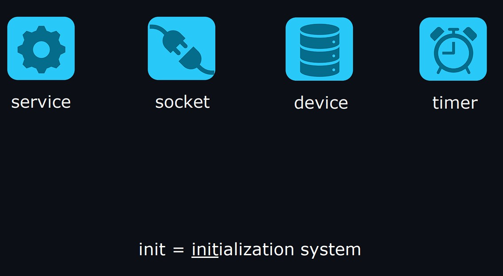
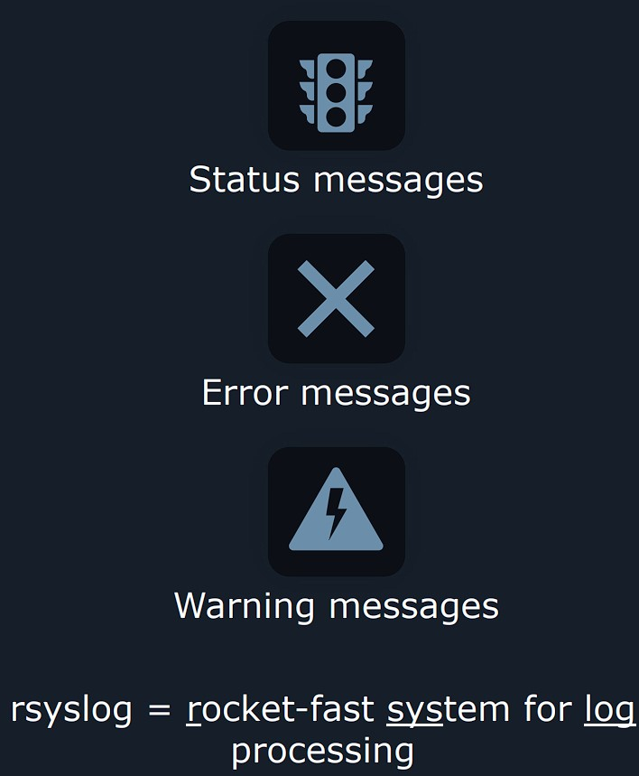
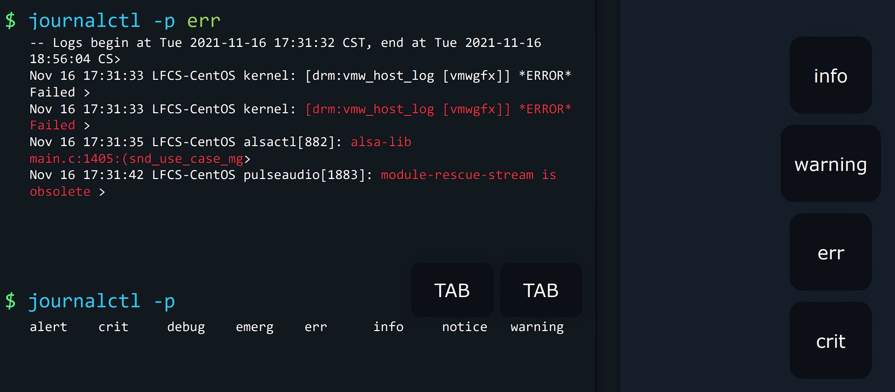
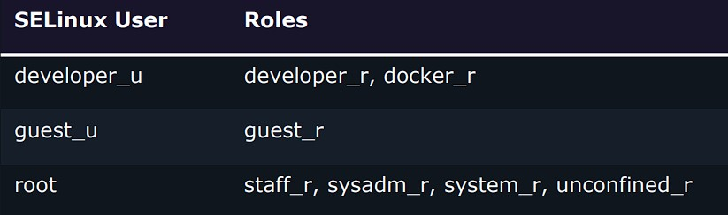

# LFCS Notes

## Operation of Running Systems

###  &nbsp;&nbsp;&nbsp;&nbsp;&nbsp;&nbsp;&nbsp;&nbsp; <ins>Boot, reboot, and shutdown a system safely</ins>

To reboot or shut down a Linux machine, we will often use the sytem control command : `systemctl`.

Some commands require the administrator privileges.

```sh
# Reboot machine
$ sudo systemctl reboot
[sudo] password for aaron:

# Shutdown machine
$ sudo systemctl poweroff
[sudo] password for aaron:
```
Rarely you might find in stituations where the system refuses to reboot or shut down normally. This might be because some program is misbeheaving or stuck in some way and it doesn't want to close properly.

➡️ <ins> <span style="color:#FF8A8A">**NOT RECOMMENDED** (unless absolutelly necessary)</span></ins> : we can force close all programs and reboot in a more abrupt way.


```sh
$ sudo systemctl reboot --force 
$ sudo systemctl poweroff --force

# If neither of those is working, we can pass force twice
$ sudo systemctl reboot --force --force           # It is like rebooting instanly
$ sudo systemctl poweroff --force --force         # It is like unplugging the computer
```

<br/>

#### 🔖 <ins>Scheduling</ins>
We might need to reboot servers at the middle of night. Instand of waking up, just for a reboot of machine, we can instruct Linux to do this on its own.

The `shutdown` command is better suited for scheduled reboots or shutdowns.

```sh
$ sudo shutdown 02:00         # In 24h format, between 00:00 and 23:59 

# To shutdown a certain number of minutes later  --> +x
$ sudo shutdown +15

# To reboor  --> -r
$ sudo shutdown -r 02:00
$ sudo shutdown -r +15

# To set the wall message : for warning logged in users.
$ sudo shutdown -r +1 'Scheduled restart to do an offline-backup of our database'
```

&nbsp;

###  &nbsp;&nbsp;&nbsp;&nbsp;&nbsp;&nbsp;&nbsp;&nbsp; <ins>Boot or change system into different operating modes</ins>

#### 🔖 <ins>Changing default boot target</ins>

The first thing we want to know before is what is our **default** boot target.
```sh
# graphical.target -> The OS is configured to boot into a graphical environment
# By reading the instructions inside this target file, the OS knows :
#   - what programs it needs to launch 
#   - what order to boot into the target
$ systemctl get-default      
graphical.target
```

If we don't need to load up on graphical user interface, we can change the default boot target.
```sh
# We can see it removes the old default target file and creates a new symlink.
#
# The multi-user target is something that will make Linux boot normally with all of its Daemons, Databases, servers, utilities and whatever we might have configured. Only the graphical interface is going to be skipped.
#
# Everything will be text-based.
# It is called like this because while Linux is booting in this mode, multiple users can log in and use the system at the same time.
$ sudo systemctl set-default multi-user.target      
Created symlink /etc/systemd/system/default.target → /lib/systemd/system/multi-user.target.

# Let's take a look on what's going on when we boot into a multi user target, by rebooting
$ sudo shutdown -r now

$ systemctl get-default
multi-user.target
```
If we want to change to a different target : imagine we want to get back to the graphical desktop because we need to use a 3D modeling application for 1 hour, <span style="color:#FF8A8A"><ins>**instead of changing the default boot**</ins></span>.

➡️ We use the `isolate` directive.

```sh
$ sudo systemctl isolate graphical.target
```
Other useful targets
```sh
# Useful for debugging in case the program is loaded by the other targets for making your system unstable.
$ sudo systemctl isolate emergency.target

# We will be dropped into a root shell. We can type commands as a system administrator : DB backups (while db not online), fix system settings and so on. 
$ sudo systemctl isolate rescue.target
```

&nbsp;

###  &nbsp;&nbsp;&nbsp;&nbsp;&nbsp;&nbsp;&nbsp;&nbsp; 📽️ <ins>Install, configure and troubleshoot bootloaders</ins>

One of the 1st programs that loads up when we power up is called `bootloader` : its purpose is to start the **Linux kernel**. The most popular boatloader is **GRUB** (Grand Unified Bootloader).

<br/>

#### 🔖 <ins>What if OS is not booting at all ?</ins>
1. You download an iso file and you boot on it
2. Depending of the Linux distribution, you need to select `Troubleshooting` to load the **rescue image.**
3. You select the option to mount this image on `/mnt/sysroot`
4. In the tutorial, you type in the shell the command to make `/mnt/sysroot`, the root of your active system :
    ```sh
    $ chroot /mnt/sysroot
    ```
5. We will generate a BIOS configuration file :
    ```sh
    # For BIOS
    $ grub2-mkconfig -o /boot/grub2/grub.cfg

    # For EFI (on CentOS). The -o option had directed to write the file to a specific location.
    $ grub2-mkconfig -o /boot/efi/EFI/centos/grub.cfg
    ```
6. 
    - <ins>**BIOS**</ins> : 
    
    <br/>
    
    When the computer boots through BIOS mode, it looks for the bootloader at the very beginning of the disk : **we need to place the GRUB file in the 1st disk's sectors**. 

    First we need to know which disk to install the GRUB. We will display all block devices.
    ```sh
    # sda1 for PHYSICAL disk / vda1 for VIRTUAL disk
    $ lsblk
    NAME          MAJ:MIN RM SIZE  RO TYPE MOUNTPOINT
    sda             8:0    0 20G    0 disk
    ├─sda1          8:1    0  1G    0 part /boot         # Partition where we find GRUB, configuration files
    ├─sda2          8:2    0  2G    0 part [SWAP]
    └─sda3          8:3    0 17G    0 part /             # Our file system
    ```

    GRUB file should be installed on the first sector of disk `sda`.
    ```sh
    # /dev is a special device file pointing to the 1st virtual disk (in the example, the 1st physical disk in on virtual machine)
    $ grub2-install /dev/sda
    ```

    <br/>

    - <ins>**EFI**</ins> : 
    
    <br/>

    Don't look for the bootloader on 1st sectors of disk. Let's look for the bootloader in a file **on a special boot partition**. We can use this command to automatically place the bootloader files in their proper location.
    ```sh
    # dnf is the package manaer for CentOS. For another Linux distribution the command could differ
    $ dnf reinstall grub2-efi grub2-efi-modules shim
    ```

    <br/>

7. We can exit to change root environment and exit again to reboot the machine.
    ```sh
    $ exit
    $ exit
    ```

8. Once rebooted, without Live CD, we can arrive at a console terminal. If we want to make some configuration changes to the settings for Grub bootloader, we can edit a particular file :
    ```sh
    $ sudo vim /etc/default/grub

    >

    # If you change this file, run 'update-grub' afterwards to update
    # /boot/grub/grub.cfg.
    # For full documentation of the options in this file, see:
    #   info -f grub -n 'Simple configuration'

    GRUB_DEFAULT=0
    GRUB_TIMEOUT_STYLE=hidden
    GRUB_TIMEOUT=5                  # OS GRUB is displayed for 5 seconds
    GRUB_DISTRIBUTOR=`lsb_release -i -s 2> /dev/null || echo Debian`
    GRUB_CMDLINE_LINUX_DEFAULT=""   
    GRUB_CMDLINE_LINUX=""           # We can specify commands for changing kernel behaviour, disable things. 

    # Regenerate the file used to be read by our Bootloader, with our new settings
    $ grub2-mkconfig -o /boot/grub2/grub.cfg
    ```

&nbsp;

###  &nbsp;&nbsp;&nbsp;&nbsp;&nbsp;&nbsp;&nbsp;&nbsp; <ins>Use scripting to automate system maintenance tasks</ins>

Scripts are files where we can add multiple instructions for our command interpreter (the Bash). 

⚠️ When writing a `script.sh`, we have to add this sentence at **the 1st line to make our script work**. `#!` is called a **shebang**, followed by the full path of the command interpreter :

```sh
#!/bin/bash
```

<br/>

Script content examples :

```sh
#!/bin/bash

#Log the date and time the script was last executed
date >> /tmp/script.log
cat /proc/version >> /tmp/script.log    # It is a special file that has detailed information about the current Linux kernel version that is running our OS.
```

```sh
#!/bin/bash

# If /tmp/archive.tar.gz already exists
if test -f /tmp/archive.tar.gz; then
  mv /tmp/archive.tar.gz /tmp/archive.tar.gz.OLD
  tar acf /tmp/archive.tar.gz /etc/dnf/
else
  tar acf /tmp/archive.tar.gz /etc/dnf/
fi
```

```sh
#!/bin/sh
# Check whether 0anacron was run today already
if test -r /var/spool/anacron/cron.daily; then
  day=`cat /var/spool/anacron/cron.daily`
fi
if [ `date +%Y%m%d` = "$day" ]; then
  exit 0
fi
# Do not run jobs when on battery power
online=1
for psupply in AC ADP0 ; do
  sysfile="/sys/class/power_supply/$psupply/online"
  if [ -f $sysfile ] ; then
    if [ `cat $sysfile 2>/dev/null`x = 1x ]; then
      online=1
      break
    else
      online=0
    fi
  fi
done
if [ $online = 0 ]; then
  exit 0
fi
```

<br/>

To be able to run the script, we **first need to make it executable**, by setting the permissions.

```sh
# Only the owner can execute the script
$ chmod u+x script.sh

# Everyone can execute the script
$ chmod +x script.sh 
```

&nbsp;

###  &nbsp;&nbsp;&nbsp;&nbsp;&nbsp;&nbsp;&nbsp;&nbsp; <ins>Manage the startup process and services (In Services Configuration)</ins>

Let's examine how to manage startup processes and services in Linux. With **init system**, we can specify clear instructions about :

- How to start a specific application ?
- What to do when a program crashes ?
- What commands to issue when a program is restarted ?


These instructions are called **units** : they are simply text files that describe the necessary logic. Units can be of various types, such as :

- ***service*** : posseses instructions on how to start up a program, what to do when restarted and so on.
- *socket*
- *device*
- *timer* : tells the init system it should lauch a specific application once per week

<!--- Center image --->
<div align="center">
  <a href="assets/Services_1.jpg" target="_blank">
    
  </a>
</div>

<br/>

A **service unit** tells the init system all it needs to know about how it should manage the entire lifecycle of a certain application. `systemd.service` is an example of service unit.

<br/>

#### 🔖 <ins>Use case : SSH Daemon</ins>
There is a service unit that instructs init system about how to start the SSH Daemon to let users connect to the servers and how to keep it running.

```sh
$ systemctl cat sshd.service

>

# /usr/lib/systemd/system/sshd.service
[Unit]
Description=OpenSSH server daemon
Documentation=man:sshd(8) man:sshd_config(5)
After=network.target sshd-keygen.target
Wants=sshd-keygen.target
[Service]
Type=notify
EnvironmentFile=-/etc/crypto-policies/back-ends/opensshserver.config
EnvironmentFile=-/etc/sysconfig/sshd
ExecStart=/usr/sbin/sshd -D $OPTIONS $CRYPTO_POLICY                     #
ExecReload=/bin/kill -HUP $MAINPID                                      #
KillMode=process
Restart=on-failure                                                      #
RestartSec=42s
[Install]
WantedBy=multi-user.targe
```
```sh
# If we want to edit this service file, we can run this command
$ sudo systemctl edit --full sshd.service

# If we want to cancel our edits and return the service file to its factory default settings 
$ sudo systemctl revert sshd.service
```
```sh
# To see the status (if program has started, if it has encountered any errors)
$ sudo systemctl status sshd.service

# To stop a service
$ sudo systemctl stop sshd.service

# To start a service
$ sudo systemctl start sshd.service
```

### ⚠️ WARNING :

```sh
# To restart a service
$ sudo systemctl restart sshd.service

# If some users are actively using that program, restart may interrupt their work temporarily.
# There is a MORE gentle way to reload a program settings without completely closing and reopenening the application.
$ sudo systemctl reload sshd.service


# It's worth noting that not all applications support being reloaded with the `reload` option but we have a command that can automatically try a graceful reload first, and then a restart if reload is not supported by the app.
$ sudo systemctl reload-or-restart sshd.service
```

<br/>

```sh
# If we want to diable ssh logins completely, we could prevent the SSH Daemon from automatically starting up at boot time.
$ sudo systemctl disable sshd.service

# Check if service enabled
$ sudo systemctl is-enabled sshd.service
disabled


# Enable and start / disable and stop service
$ sudo systemctl enable --now sshd.service
$ sudo systemctl disable --now sshd.service
```

### ⚠️ WARNING :
To REALLY avoid a service to run (a servcie 1 can still re-enable a service 2, even if disabled), use the `mask` option.

If we need to use the service again, please do not forget to `unmask`

```sh
$ sudo systemctl mask atd.service

# Masked services can not start
$ sudo systemctl enable atd.service
Failed to enable unit: Unit file /etc/systemd/system/atd.service is masked.
$ sudo systemctl start atd.service
Failed to start atd.service: Unit atd.service is masked.

# Unmask
$ sudo systemctl unmask atd.service
```

<br/>

```sh
# To list all services
$ sudo systemctl list-units --type service --all
UNIT LOAD ACTIVE SUB DESCRIPTION 
accounts-daemon.service loaded active running Accounts Service 
alsa-restore.service loaded inactive dead Save/Restore Sound Card >
alsa-state.service loaded active running Manage Sound Card State >
apparmor.service not-found inactive dead apparmor.service
atd.service loaded active running Job spooling tools 
auditd.service loaded active running Security Auditing Service
auth-rpcgss-module.service loaded inactive dead Kernel Module supportin>
```

&nbsp;

###  &nbsp;&nbsp;&nbsp;&nbsp;&nbsp;&nbsp;&nbsp;&nbsp; 📽️ <ins>Create systemd Services ✨</ins>

In a  nutshell, the **service** manages the entire lifecycle of an application according to instructions we add to our **service file**.

<br/>

##### &nbsp;&nbsp;&nbsp;&nbsp;&nbsp;&nbsp;&nbsp;&nbsp;&nbsp;&nbsp; <ins>**Service file**</ins>

```sh
# Let's create our service file
# systemd-cat is an utility that receives the message and logs it
# We're simulating tha app has crashed after 5 seconds
$ vi /usr/local/bin/myapp.sh

#!/bin/sh
echo "MyApp started" | systemd-cat -t MyApp -p info
sleep 5
echo "MyApp crashed" | systemd-cat -t MyApp -p err
```
```sh
# Make the script executable for all
$ chmod a+x /usr/local/bin/myapp.sh
```

<br/>

##### &nbsp;&nbsp;&nbsp;&nbsp;&nbsp;&nbsp;&nbsp;&nbsp;&nbsp;&nbsp; <ins>**Service**</ins>

We will create a service by using SSH daemon service as a **template**.

```sh
$ cp /lib/systemd/system/sshd.service /etc/systemd/system/myapp.service
```
```sh
# Creating the service unit file
$ vi /etc/systemd/system/myapp.service


[Unit]
Description=My Application
After=network.target auditd.service                           # This tells systemd when it should run the service unit.

[Service]
ExecStartPre=echo "Systemd is preparing to startMyApp"        # Example we could run a program that scan DBs for errors, before starting the DB server itself.
ExecStart=/usr/local/bin/myapp.sh
# ExecReload=/bin/kill -HUP $MAINPID                          # This specifies what should be executed when an administrator runs the Systemctl reload command.
KillMode=process                                              # It specifies how this application should be stopped when running Systemctl stop. Here we tell to only kill the main process and not any of the child processes.
Restart=always
RestartSec=5s
Type=simple						      # If 'notify', it tells systemd that the application will notify it when it is finished starting up

[Install]
WantedBy=multi-user.target
```

<br/>

The first thing that we have to do is whenever we add or remove or edit the service file, we have to reload the systemd daemon :

```sh
$ systemctl daemon-reload
```

Then we can start our new created service :

```sh
$ systemctl start myapp.service
```

To see the logs :

```sh
$ journalctl -f

-- Logs begin at Sun 2023-10-15 11:00:28 CEST. --
Oct 15 13:00:01 localhost.localdomain systemd[1]: Created slice User Slice of root.
Oct 15 13:00:01 localhost.localdomain systemd[1]: Started Session 16 of user root.
Oct 15 13:00:01 localhost.localdomain CROND[3835]: (root) CMD (/usr/lib64/sa/sa1 1 1)
Oct 15 13:00:01 localhost.localdomain systemd[1]: Removed slice User Slice of root.
Oct 15 13:00:02 localhost.localdomain MyApp[3844]: MyApp crashed
Oct 15 13:00:07 localhost.localdomain systemd[1]: myapp.service holdoff time over, scheduling restart.
Oct 15 13:00:07 localhost.localdomain systemd[1]: Stopped My Application.
Oct 15 13:00:07 localhost.localdomain systemd[1]: Started My Application.
Oct 15 13:00:07 localhost.localdomain MyApp[3847]: MyApp started
Oct 15 13:00:12 localhost.localdomain MyApp[3851]: MyApp crashed
```

&nbsp;

###  &nbsp;&nbsp;&nbsp;&nbsp;&nbsp;&nbsp;&nbsp;&nbsp; 📽️ <ins>Diagnose and manage processes</ins>

The command to inspect processes is `ps`. It only shows us the state of processes at the exact moment that we execute the command.

```sh
$ ps

    PID TTY          TIME CMD
   1578 pts/0    00:00:00 bash
   1587 pts/0    00:00:00 ps


# Show all in user format
# TIME represents CPU time. 1s represents 100% of CPU core use.
# If we use 50% for 10s, it will display 5s of TIME.
$ ps aux

USER         PID %CPU %MEM    VSZ   RSS TTY      STAT START   TIME COMMAND
root        1531  0.0  0.2  17196 10876 ?        Ss   17:08   0:00 sshd: ubuntu [priv]
ubuntu      1577  0.0  0.2  17196  7980 ?        S    17:08   0:00 sshd: ubuntu@pts/0


# Display process of PID 1
$ ps u 1

USER         PID %CPU %MEM    VSZ   RSS TTY      STAT START   TIME COMMAND
root           1  0.1  0.3 167584 13132 ?        Ss   16:58   0:05 /sbin/init


# Display processes started by a specific user (ubuntu in our case)
$ ps u -U ubuntu

USER         PID %CPU %MEM    VSZ   RSS TTY      STAT START   TIME COMMAND
ubuntu      1514  0.0  0.2  17068  9612 ?        Ss   17:08   0:00 /lib/systemd/systemd --user
ubuntu      1515  0.0  0.1 170496  5000 ?        S    17:08   0:00 (sd-pam)
ubuntu      1521  0.0  0.1   8744  5352 tty1     S+   17:08   0:00 -bash
ubuntu      1577  0.0  0.2  17196  7980 ?        R    17:08   0:00 sshd: ubuntu@pts/0
ubuntu      1578  0.0  0.1   8732  5364 pts/0    Ss   17:08   0:00 -bash
ubuntu      1741  0.0  0.0  10068  1664 pts/0    R+   18:17   0:00 ps u -U ubuntu


# Display processes containing the word syslog in its name
$ pgrep -a syslog

943 /usr/sbin/rsyslogd -n -iNONE
```

The command `top` displays the processes by CPU most usage order.

```sh
$ top

top - 18:12:53 up  1:14,  2 users,  load average: 0.00, 0.00, 0.00
Tasks: 208 total,   1 running, 207 sleeping,   0 stopped,   0 zombie
%Cpu(s):  0.0 us,  0.0 sy,  0.0 ni, 99.8 id,  0.2 wa,  0.0 hi,  0.0 si,  0.0 st
MiB Mem :   3877.8 total,   3015.8 free,    325.9 used,    536.1 buff/cache
MiB Swap:   2826.0 total,   2826.0 free,      0.0 used.   3327.5 avail Mem

    PID USER      PR  NI    VIRT    RES    SHR S  %CPU  %MEM     TIME+ COMMAND
   1649 root      20   0       0      0      0 I   0.3   0.0   0:00.27 kworker/u256:1-events_power_efficient
      1 root      20   0  167584  13132   8416 S   0.0   0.3   0:05.81 systemd
      2 root      20   0       0      0      0 S   0.0   0.0   0:00.05 kthreadd
```

<br/>

#### 🔖 <ins>Process niceness</ins>

It is a concept to define **priority** for processes. Its value is between -20 and 19 (lower = less nice and means **higher priority** for the process).

> Process A = -19 and Process B = 20. Both needs all CPU resource 
>
> ➡️ Process A might use CPU 90% of time, while Process B will get very little CPU time only when there's something left to spare.

There is command to set this nice value :

```sh
# Display in long format
$ ps l

F   UID     PID    PPID PRI  NI    VSZ   RSS WCHAN  STAT TTY        TIME COMMAND
4  1000    1521     965  20   0   8744  5352 do_sel S+   tty1       0:00 -bash
0  1000    1578    1577  20   0   8732  5396 do_wai Ss   pts/0      0:00 -bash
0  1000    1759    1578  20   0  10068  1608 -      R+   pts/0      0:00 ps l


# Set nice value (NEGATIVE only allowed with root user)
$ sudo nice -n -12 bash
$ nice -n 11 bash

# NI goes from 0 to 11
$ ps lax
$ ps l

F   UID     PID    PPID PRI  NI    VSZ   RSS WCHAN  STAT TTY        TIME COMMAND
4  1000    1521     965  20   0   8744  5352 do_sel S+   tty1       0:00 -bash
0  1000    1578    1577  20   0   8732  5396 do_wai Ss   pts/0      0:00 -bash
0  1000    1760    1578  31  11   8660  5268 do_wai SN   pts/0      0:00 bash
0  1000    1766    1760  31  11  10068  1592 -      RN+  pts/0      0:00 ps l
```

```sh
root@ubuntu:~# ps lax | grep "-12"
Usage: grep [OPTION]... PATTERNS [FILE]...
Try 'grep --help' for more information.

root@ubuntu:~# ps lax | grep "\-12"
F   UID     PID    PPID PRI  NI    VSZ   RSS WCHAN  STAT TTY        TIME COMMAND
F   UID     PID    PPID PRI  NI    VSZ   RSS WCHAN  STAT TTY        TIME COMMAND
4     0    1786    1776  31  11  11500  5728 do_pol SN+  pts/0      0:00 sudo nice -n -12 bash
1     0    1787    1786  31  11  11500   880 do_pol SNs  pts/1      0:00 sudo nice -n -12 bash
0     0    1798    1788  19  -1   6476  2428 pipe_r S<+  pts/1      0:00 grep --color=auto \-12
```
<br/>

#### 🔖 <ins>Parent-Child processes</ins>

```sh
# Display relationship between parent-child processes (including CPU usage)
$ ps fax

USER         PID %CPU %MEM    VSZ   RSS TTY      STAT START   TIME COMMAND
root         977  0.0  0.2  15420  9280 ?        Ss   16:59   0:00 sshd: /usr/sbin/sshd -D [listener] 0 of 10-100 startups
root        1531  0.0  0.2  17196 10876 ?        Ss   17:08   0:00  \_ sshd: ubuntu [priv]
ubuntu      1577  0.0  0.2  17196  7980 ?        S    17:08   0:00      \_ sshd: ubuntu@pts/0
ubuntu      1578  0.0  0.1   8732  5396 pts/0    Ss   17:08   0:00          \_ -bash
ubuntu      1760  0.0  0.1   8660  5268 pts/0    SN   18:43   0:00              \_ bash
ubuntu      1771  0.0  0.0  10404  3808 pts/0    RN+  18:49   0:00                  \_ ps faux


$ sudo renice 11 1759          # Set nice value to existing process, with affiliated PID value
```

<br/>

#### 🔖 <ins>Processes signals</ins>

They are like **high priority messages** that send specific instructions to processes (for example : stopping what they're doing, to do a special request). 

But it only works if the applications are programmed specifically to respond that signal.

> The only exceptions are the signals called `SIGSTOP` and `SIGKILL`. They can not be ignored by any processes.
>
> - When processes receive `SIGSTOP`, their execution is going to be paused until `SIGCONT` is called.
> - With `SIGKILL` terminates the process.

<br/>

We can display the list of signals here :

```sh
$ kill -L
 1) SIGHUP       2) SIGINT       3) SIGQUIT      4) SIGILL       5) SIGTRAP
 6) SIGABRT      7) SIGBUS       8) SIGFPE       9) SIGKILL     10) SIGUSR1
11) SIGSEGV     12) SIGUSR2     13) SIGPIPE     14) SIGALRM     15) SIGTERM
16) SIGSTKFLT   17) SIGCHLD     18) SIGCONT     19) SIGSTOP     20) SIGTSTP
21) SIGTTIN     22) SIGTTOU     23) SIGURG      24) SIGXCPU     25) SIGXFSZ
26) SIGVTALRM   27) SIGPROF     28) SIGWINCH    29) SIGIO       30) SIGPWR
31) SIGSYS      34) SIGRTMIN    35) SIGRTMIN+1  36) SIGRTMIN+2  37) SIGRTMIN+3
38) SIGRTMIN+4  39) SIGRTMIN+5  40) SIGRTMIN+6  41) SIGRTMIN+7  42) SIGRTMIN+8
43) SIGRTMIN+9  44) SIGRTMIN+10 45) SIGRTMIN+11 46) SIGRTMIN+12 47) SIGRTMIN+13
48) SIGRTMIN+14 49) SIGRTMIN+15 50) SIGRTMAX-14 51) SIGRTMAX-13 52) SIGRTMAX-12
53) SIGRTMAX-11 54) SIGRTMAX-10 55) SIGRTMAX-9  56) SIGRTMAX-8  57) SIGRTMAX-7
58) SIGRTMAX-6  59) SIGRTMAX-5  60) SIGRTMAX-4  61) SIGRTMAX-3  62) SIGRTMAX-2
63) SIGRTMAX-1  64) SIGRTMAX

# Restarting process OpenSSH server daemon
$ systemctl status sshd.service
● ssh.service - OpenBSD Secure Shell server
     Loaded: loaded (/lib/systemd/system/ssh.service; enabled; vendor preset: enabled)
     Active: active (running) since Wed 2023-08-16 16:59:55 UTC; 2h 17min ago
   Main PID: 977 (sshd)

$ kill -SIGHUP 977

$ systemctl status sshd.service
● ssh.service - OpenBSD Secure Shell server
     Loaded: loaded (/lib/systemd/system/ssh.service; enabled; vendor preset: enabled)
     Active: active (running) since Wed 2023-08-16 16:59:55 UTC; 2h 18min ago

Aug 16 19:18:03 ubuntu sshd[977]: Received SIGHUP; restarting.
Aug 16 19:18:03 ubuntu sshd[977]: Server listening on 0.0.0.0 port 22.
```

<br/>

#### 🔖 <ins>Background and Foreground processes</ins>

We use the `&` at the end to execute a command in background. 

### ⚠️NOTE
> Another nice example of using background process : <ins>*backing up 500 GB of data*</ins>

```sh
root@ubuntu:~# sleep 300 &
[1] 1826
root@ubuntu:~# echo toto
toto

# Display background processes
root@ubuntu:~# jobs
[1]+  Running                 sleep 300 &
```

To return a background process to foreground.
```sh
root@ubuntu:~# jobs
[1]+  Running                 sleep 300 &
root@ubuntu:~# fg 1
sleep 300

# To stop a foreground process without aborting it (CTRL + Z)
^Z
[1]+  Stopped                 sleep 300

# To resume it in background
root@ubuntu:~# bg 1
[1]+ sleep 300 &
root@ubuntu:~# jobs
[1]+  Done                    sleep 300
```

<br/>

#### 🔖 <ins>Display files & directories using a Process</ins>

```sh
root@ubuntu:~# pgrep -a bash
1788 bash

root@ubuntu:~# lsof -p 1788
COMMAND  PID USER   FD   TYPE DEVICE SIZE/OFF   NODE NAME
bash    1788 root  cwd    DIR  253,0     4096 524290 /root
bash    1788 root  rtd    DIR  253,0     4096      2 /
bash    1788 root  txt    REG  253,0  1396520    518 /usr/bin/bash
bash    1788 root  mem    REG  253,0    27002  11747 /usr/lib/x86_64-linux-gnu/gconv/gconv-modules.cache
bash    1788 root  mem    REG  253,0  3048928  13130 /usr/lib/locale/locale-archive
bash    1788 root  mem    REG  253,0  2216304  11059 /usr/lib/x86_64-linux-gnu/libc.so.6
bash    1788 root  mem    REG  253,0   200136  11218 /usr/lib/x86_64-linux-gnu/libtinfo.so.6.3
bash    1788 root  mem    REG  253,0   240936  10908 /usr/lib/x86_64-linux-gnu/ld-linux-x86-64.so.2
bash    1788 root    0u   CHR  136,1      0t0      4 /dev/pts/1
bash    1788 root    1u   CHR  136,1      0t0      4 /dev/pts/1
bash    1788 root    2u   CHR  136,1      0t0      4 /dev/pts/1
bash    1788 root  255u   CHR  136,1      0t0      4 /dev/pts/1
```

```sh
root@ubuntu:~# ls -l /var/log/syslog
-rw-r-----  1 syslog    adm             532100 Aug 16 19:41 syslog

# Here we can see which processes are using this file
root@ubuntu:~# lsof /var/log/syslog
COMMAND  PID   USER   FD   TYPE DEVICE SIZE/OFF NODE NAME
rsyslogd 943 syslog    7w   REG  253,0   532100 2768 /var/log/syslog
```

&nbsp;

###  &nbsp;&nbsp;&nbsp;&nbsp;&nbsp;&nbsp;&nbsp;&nbsp; <ins>Locate and analyze system log files</ins>

On a server we always want to know what happened :

- Who did what ?
- What worked ?
- What didn't work ?
- What errors were encountered ?
- Who accessed the system ?
- Etc.

Everything that happened is saved in **logs**. The Linux kernel and most programs that run on it generate status messages, error messages, warnings and so on.

`rsyslog` is a logging daemon, used to collect, organize and store logs in `/var/logs` directory.

<!--- Center image --->
<div align="center">
  <a href="assets/Logs_1.jpg" target="_blank">
    
  </a>
</div>

<br/>

```sh
# Let's look for SSH logs
# We can see that session login info are in /var/log/auth.log
# On CentOS there are in /var/log/secure
# We can see the date, the hostname
$ grep -r 'ssh' /var/log/

/var/log/auth.log.1:Aug  8 19:13:24 ubuntu sshd[1175]: Accepted password for ubuntu from 192.168.178.120 port 60689 ssh2
/var/log/auth.log.1:Aug  8 19:13:24 ubuntu sshd[1175]: pam_unix(sshd:session): session opened for user ubuntu(uid=1000) by (uid=0)
```

<br/>

#### 🔖 <ins>Journal Daemon (on moderne Linux)</ins>

Nowadays, modern Linux OS started using an additional way to keep track of logs : there is a program called `Journal Daemon`, who is a bit smarter at how it collects data.

`journalctl` command lets us analyze logs more efficiently.

```sh
# journalctl lets us filter for logs generated by a specific command

# Locate sudo command files 
$ which sudo
/usr/bin/sudo


# Showing us the logs generated by the command
$ journalctl /usr/bin/sudo

Jul 26 19:24:47 ubuntu sudo[16290]:   ubuntu : TTY=tty1 ; PWD=/home/ubuntu ; USER=root ; COMMAND=/usr/sbin/shutdown -h now
Jul 26 19:24:47 ubuntu sudo[16290]: pam_unix(sudo:session): session opened for user root(uid=0) by ubuntu(uid=1000)
Jul 26 19:24:47 ubuntu sudo[16290]: pam_unix(sudo:session): session closed for user root
```

```sh
# To display logs for a unit (see Manage the startup process and services) 

$ systemctl status sshd.service
● ssh.service - OpenBSD Secure Shell server
     # You see here the real name of the service
     Loaded: loaded (/lib/systemd/system/ssh.service; enabled; vendor preset: enabled) 

# As expected, no entries 
$ journalctl -u sshd.service
-- No entries --

# If we have checked the real name above
$ journalctl -u ssh.service
Jul 26 18:11:28 ubuntu systemd[1]: Starting OpenBSD Secure Shell server...
Jul 26 18:11:28 ubuntu sshd[929]: Server listening on 0.0.0.0 port 22.
Jul 26 18:11:28 ubuntu systemd[1]: Started OpenBSD Secure Shell server.
```

<br/>

Another useful commands

```sh
# To display at the END
$ journalctl -e
Aug 19 08:05:16 ubuntu kernel: [UFW BLOCK] IN=ens33 OUT= MAC=33:33:00:00:00:01:dc:39:6f:b6:d1:1e:86:dd SRC=fe80:0000:0000:0>
Aug 19 08:05:53 ubuntu kernel: [UFW BLOCK] IN=ens33 OUT= MAC=01:00:5e:00:00:01:dc:39:6f:b6:d1:1e:08:00 SRC=192.168.178.1 DS>
Aug 19 08:07:58 ubuntu kernel: [UFW BLOCK] IN=ens33 OUT= MAC=01:00:5e:00:00:01:dc:39:6f:b6:d1:1e:08:00 SRC=192.168.178.1 DS>
lines 972-1000/1000 (END)  # We are at the END


# To display IN LIVE the logs 
$ journalctl -f.


# To filter and display specific log type (info, warning, err or crit)
$ journalctl -p err
Jul 26 18:11:20 ubuntu kernel: [Firmware Bug]: cpu 0, try to use APIC520 (LVT offset 2) for vector 0xf4, but the register i>
Jul 26 18:11:20 ubuntu kernel: [Firmware Bug]: cpu 1, try to use APIC520 (LVT offset 2) for vector 0xf4, but the register i>
Jul 26 18:11:20 ubuntu kernel: piix4_smbus 0000:00:07.3: SMBus Host Controller not enabled!
Jul 26 18:11:20 ubuntu kernel: sd 32:0:0:0: [sda] Assuming drive cache: write through


# To display info log type with message beginning by letter b
$ journalctl -p info -g '^b'
Jul 26 18:11:20 ubuntu kernel: BIOS-provided physical RAM map:
Jul 26 18:11:20 ubuntu kernel: BIOS-e820: [mem 0x0000000000000000-0x000000000009e7ff] usable
Jul 26 18:11:20 ubuntu kernel: Block layer SCSI generic (bsg) driver version 0.4 loaded (major 243)
Jul 26 18:11:20 ubuntu kernel: blacklist: Loading compiled-in revocation X.509 certificates
```

<!--- Center image --->
<div align="center">
  <a href="assets/Logs_2.jpg" target="_blank">
    
  </a>
</div>
<div align="center">
  <i>The different types of logs : <b>alert</b>, <b>crit</b>, <b>debug</b>, <b>emerg</b>, <b>err</b>, <b>info</b>, <b>notice</b>, <b>warning</b></i>
</div>

<br/>

```sh
# To display logs since 02:00
$ journalctl -S 02:00
Aug 19 07:06:10 ubuntu kernel: Linux version 5.15.0-78-generic (buildd@lcy02-amd64-008) (gcc (Ubuntu 11.3.0-1ubuntu1~22.04.>
Aug 19 07:06:10 ubuntu kernel: Command line: BOOT_IMAGE=/vmlinuz-5.15.0-78-generic root=/dev/mapper/ubuntu--vg-ubuntu--lv ro
Aug 19 07:06:10 ubuntu kernel: KERNEL supported cpus:
Aug 19 07:06:10 ubuntu kernel:   Intel GenuineIntel
Aug 19 07:06:10 ubuntu kernel:   AMD AuthenticAMD


# To display logs between 01:00 AM and 02:00 (also date)
$ journalctl -S 01:00 -U 02:00
$ journalctl -S '2021-11-16 01:00:33' -U '2021-11-16 02:00:50'
-- No entries --


# To see logs on the current boot (0 picks the current boot, -1 the previous boot)
$ journalctl -b 0
Aug 19 07:06:10 ubuntu kernel: Linux version 5.15.0-78-generic (buildd@lcy02-amd64-008) (gcc (Ubuntu 11.3.0-1ubuntu1~22.04.>
Aug 19 07:06:10 ubuntu kernel: Command line: BOOT_IMAGE=/vmlinuz-5.15.0-78-generic root=/dev/mapper/ubuntu--vg-ubuntu--lv ro

$ journalctl -b -1
Aug 17 18:45:39 ubuntu kernel: Linux version 5.15.0-78-generic (buildd@lcy02-amd64-008) (gcc (Ubuntu 11.3.0-1ubuntu1~22.04.>
Aug 17 18:45:39 ubuntu kernel: Command line: BOOT_IMAGE=/vmlinuz-5.15.0-78-generic root=/dev/mapper/ubuntu--vg-ubuntu--lv ro
```

### ⚠️NOTE

> Contrary to Ubuntu server, on CentOS the journal is only kept in memory (when powering off or rebooting, all logs are lost). We can create a directory where to save the logs `mkdir :var/log/journal/`

<br/>

#### 🔖 <ins>See who logged in</ins>

```sh
$ last
ubuntu   pts/1        192.168.178.120  Sat Aug 19 08:11   still logged in
ubuntu   pts/0        192.168.178.120  Sat Aug 19 08:11   still logged in
ubuntu   pts/0        192.168.178.120  Sat Aug 19 07:07 - 08:11  (01:04)
reboot   system boot  5.15.0-78-generi Sat Aug 19 07:06   still running
ubuntu   tty1                          Thu Aug 17 18:48 - down   (01:52)
reboot   system boot  5.15.0-78-generi Thu Aug 17 18:45 - 20:40  (01:54)
ubuntu   pts/0        192.168.178.119  Wed Aug 16 17:08 - 19:43  (02:34)


# Shows when each user logged in the last time.
$ lastlog
Username         Port     From             Latest
root                                       **Never logged in**
daemon                                     **Never logged in**
bin                                        **Never logged in**
ubuntu           pts/1    192.168.178.120  Sat Aug 19 08:11:32 +0000 2023
```

&nbsp;

###  &nbsp;&nbsp;&nbsp;&nbsp;&nbsp;&nbsp;&nbsp;&nbsp; <ins>Schedule tasks to run at a set date and time</ins>

To schedule a repetitive task, we can use different tools :

- `cron` that lets administrators to pick exact times of the day when the automated tasks should run.
- `anacron`, despite not running at the exact minute but only by day, is useful in the following case :
  - `cron` can miss the job if the computer was powering on 1 minute after the scheduled task
  - `anacron`, on the other hand, will check up the job for today. If not run, it will execute it.

  <br/>

#### 🔖 <ins>Cron</ins>
Note about the syntax and special characters :

- `*` = match all possible values (i.e. every hour)
- `,` = match multiple values (i.e. 15, 45)
- `-` = range of values (i.e. 2-4)
- `/` = specifies steps (i.e. */4)

```sh
$ cat /etc/crontab
# Example of job definition:
# .---------------- minute (0 - 59)
# |  .------------- hour (0 - 23)
# |  |  .---------- day of month (1 - 31)
# |  |  |  .------- month (1 - 12) OR jan,feb,mar,apr ...
# |  |  |  |  .---- day of week (0 - 6) (Sunday=0 or 7) OR sun,mon,tue,wed,thu,fri,sat
# |  |  |  |  |
# *  *  *  *  * user-name command to be executed
17 *    * * *   root    cd / && run-parts --report /etc/cron.hourly
25 6    * * *   root    test -x /usr/sbin/anacron || ( cd / && run-parts --report /etc/cron.daily )
47 6    * * 7   root    test -x /usr/sbin/anacron || ( cd / && run-parts --report /etc/cron.weekly )
52 6    1 * *   root    test -x /usr/sbin/anacron || ( cd / && run-parts --report /etc/cron.monthly )
```

```sh
$ which touch
/usr/bin/touch

# To edit the user's cron table (for good practices we will not use the whole system's cront table for our jobs)
$ crontab -e
# To create a file named test_passed every 6:35
35 6 * * * /usr/bin/touch test_passed


# To list all jobs of user's cron table
$ crontab -l
# To create a file named test_passed every 6:35
35 6 * * * /usr/bin/touch test_passed

# As root
root@ubuntu:~# crontab -l
no crontab for root
```

```sh
# To remove completely a cron table
$ crontab -r
$ sudo crontab -r -u jane
```

There are special directories where you can store yours scripts for repetitive jobs : 

- daily = **/etc/cron.daily/**
- hourly = **/etc/cron.hourly/**
- monthly = **/etc/cron.monthly/**
- weekly = **/etc/cron.weekly/**

<br/>

##### &nbsp;&nbsp;&nbsp;&nbsp;&nbsp;&nbsp;&nbsp;&nbsp;&nbsp;&nbsp; <ins>**Procedure for scheduling with Cron**</ins>

```sh
$ touch shellscript
$ sudo cp shellscript /etc/cron.hourly/

# To make the script readable and executable
$ sudo chmod +rx /etc/cron.hourly/shellscript

# Later if we want to remove the file
$ sudo rm /etc/cron.hourly/shellscript
```

<br/>

#### 🔖 <ins>Anacron</ins>

With this tool, we don't care about the time the job is going to run : we just want to run **daily**, **monthly** or **once every few days** <ins> <span style="color:#FF8A8A">**no matter what the time of the day is**</span></ins>

To schedule a job, we edit the file at `/etc/anacrontab`.

```sh
$ sudo vim /etc/anacrontab

# These replace cron's entries
# period-in-days delay-in-minutes job-identifier  command

  1              5                cron.daily      run-parts --report /etc/cron.daily
  7             10                cron.weekly     run-parts --report /etc/cron.weekly
  @monthly      15                cron.monthly    run-parts --report /etc/cron.monthly

# Job runs every 3 days
# 10 different jobs could have missed because the machine was powered off during that day : it wouldn't be healthy to run 10 jobs all at the same time. So we pick a delay for each one and make anacron rn each job after waiting a specific number of minutes. In our case 10 minutes.
# job-identifier is used for logging
# Just like Cron, whe should specify the full path to the command or script to run.
  3             10                test_job        /usr/bin/touch /root/anacron_created_this


# Check if anacron syntax is correct. In this case there is an error at Line 17.
$ anacron -T
anacron: Invalid syntax in /etc/anacrontab on line 17 - skipping this line
```

Some commands :

```sh
# To run something at 3 PM. By pressing ENTER we can specify multiple commands (1st one is 'touch'). To save, type CTRL + D
$ at 15:00
warning: commands will be executed using /bin/sh
at Tue Aug 29 15:00:00 2023
at> /usr/bin/touch file_created_by_at
at> /usr/bin/touch file_created_by_at_2
at>  <EOT>                                # CTRL + D
job 1 at Tue Aug 29 15:00:00 2023


# To run something at August 20 2022 at 2:30
$ at '2:30 August 20 2022'

# To run something 30 minutes later
$  at 'now + 30 minutes'
$ at 'now + 3 hours'
$ at 'now + 3 days'
$ at 'now + 3 weeks'
$ at 'now + 3 months'
```

```sh
# To see what jobs are scheduled to run
# Our Job ID is 1
$ atq
1       Tue Aug 29 15:00:00 2023 a root

# To see what a job is sipposed to do (here our Job ID 1)
$ at -c 1
...
/usr/bin/touch file_created_by_at
/usr/bin/touch file_created_by_at_2

# To remove Job ID 1
$ atrm 1
```

&nbsp;

###  &nbsp;&nbsp;&nbsp;&nbsp;&nbsp;&nbsp;&nbsp;&nbsp; 📽️ <ins>Verify completion of scheduled jobs</ins>

When running scheduled jobs with `cron` or `anacron` :
 
* you can see logs in `/var/log/cron` (in CentOs by default). In other OS you may need to specify a path to a log output.
* or you can use `journalctl -e`
```sh
Aug 30 16:09:01 ubuntu CRON[57818]: (root) CMD (/bin/echo "Just testing" >> /var/log/cron)
Aug 30 16:09:01 ubuntu CRON[57817]: pam_unix(cron:session): session closed for user root
Aug 30 16:10:01 ubuntu CRON[57821]: (root) CMD (/bin/echo "Just testing" >> /var/log/cron)
Aug 30 16:35:20 ubuntu anacron[57858]: Anacron 2.3 started on 2023-08-30
```

&nbsp;

###  &nbsp;&nbsp;&nbsp;&nbsp;&nbsp;&nbsp;&nbsp;&nbsp; <ins>Update software to provide required functionality and security</ins>
Most attacks on the Internet are targeting old software because of known security vulnerabilities : so upgrading everything to the latest version available is the best defense against these common attacks.

Fortunaletly, Linux OS have what are called **package managers** : these keep track of what we have installed on our systems. Also they make it easy to install, remove or upgrade software packages.

```sh
# To check what old packages can be upgraded
$ dnf check-upgrade

Extra Packages for Enterprise Linux 7 - x86_64                                              3.6 MB/s |  17 MB     00:04
CentOS-7 - Base                                                                             4.0 MB/s |  10 MB     00:02
CentOS-7 - Updates                                                                          4.7 MB/s |  28 MB     00:05
CentOS-7 - Extras                                                                           1.1 MB/s | 360 kB     00:00

NetworkManager.x86_64                                                1:1.18.8-2.el7_9                                updates
NetworkManager-adsl.x86_64                                           1:1.18.8-2.el7_9                                updates
NetworkManager-glib.x86_64                                           1:1.18.8-2.el7_9                                updates
```

```sh
# To upgrade all packages
$ dnf upgrade

Last metadata expiration check: 1:06:46 ago on Thu 31 Aug 2023 10:10:56 AM PDT.
Dependencies resolved.
============================================================================================================================
 Package                                            Arch          Version                              Repository      Size
============================================================================================================================
Upgrading:
 epel-release                                       noarch        7-14                                 epel            15 k
 NetworkManager                                     x86_64        1:1.18.8-2.el7_9                     updates        1.9 M

 ...

 Transaction Summary
============================================================================================================================
Install    1 Package
Upgrade  336 Packages

Total download size: 602 M
Is this ok [y/N]:
```

&nbsp;

###  &nbsp;&nbsp;&nbsp;&nbsp;&nbsp;&nbsp;&nbsp;&nbsp; <ins>Manage software with dnf</ins>

#### 🔖 <ins>What is a software repository ?</ins>

A **software repository** contains software packages. These packages include things such as programs, configuration files, librairies and so on : everything that is needed to bring functionality to our OS.

CentOS comes with a few repositories enabled by default. These repos have a huge collection of software packages, stored on some servers on the Internet.

```sh
$ dnf repolist

Last metadata expiration check: 0:02:48 ago on Fri 01 Sep 2023 01:18:57 AM PDT.
repo id                              repo name                                                                    status
base                                 CentOS-7 - Base                                                              10,072
*epel                                Extra Packages for Enterprise Linux 7 - x86_64                               13,770
extras                               CentOS-7 - Extras                                                               518
updates                              CentOS-7 - Updates                                                            5,176


# To get the Web addresses of the online repositories
$ dnf repolist -v

Repo-id      : base
Repo-name    : CentOS-7 - Base
Repo-revision: 1604001756
Repo-updated : Thu 29 Oct 2020 01:03:00 PM PDT
Repo-pkgs    : 10,072
Repo-size    : 8.9 G
Repo-mirrors : http://mirrorlist.centos.org/?release=7&arch=x86_64&repo=os&infra=$infra
Repo-baseurl : http://ftp.plusline.net/centos/7.9.2009/os/x86_64/ (9 more)                  # HERE
Repo-expire  : 172,800 second(s) (last: Fri 01 Sep 2023 01:18:56 AM PDT)
Repo-filename: /etc/yum.repos.d/CentOS-Base.repo

...
```

CentOS has **optional repositories** we can enable and we can see by using the `dnf` command.

```sh
$ dnf repolist --all

repo id                                                   repo name                                                                                         status
base                                                      CentOS-7 - Base                                                                                   enabled: 10,072
base-debuginfo                                            CentOS-7 - Debuginfo                                                                              disabled
base-source                                               CentOS-7 - Base Sources                                                                           disabled
c7-media                                                  CentOS-7 - Media                                                                                  disabled


# To enable a repo (example : base-debuginfo). You may need to run before "dnf install 'dnf-command(config-manager)'"
$ dnf config-manager --enable base-debuginfo

# To disable a repo
$ dnf config-manager --disable base-debuginfo
```

Sometimes even the optional CentOS repositories might not have the sofwtare we need. In these cases, we might need to add a 3rd party repository from an external provider.

For example, the Docker has their external repository and we can add it to our OS with this command :

```sh
$ dnf config-manager --add-repo https://download.docker.com/linux/centos/docker-ce.repo

Adding repo from: https://download.docker.com/linux/centos/docker-ce.repo


$ dnf repolist -v

Repo-id      : docker-ce-stable
Repo-name    : Docker CE Stable - x86_64
Repo-revision: 1690814364
Repo-updated : Mon 31 Jul 2023 07:39:24 AM PDT
Repo-pkgs    : 259
Repo-size    : 5.4 G
Repo-baseurl : https://download.docker.com/linux/centos/7/x86_64/stable
Repo-expire  : 172,800 second(s) (last: Fri 01 Sep 2023 01:49:31 AM PDT)
Repo-filename: /etc/yum.repos.d/docker-ce.repo          # The information about the repository is contained in that file


# To remove the repository, we can simply remove the file
$ rm /etc/yum.repos.d/docker-ce.repo
```

Sometimes we may not be sure that what the exact name of a package is, but we can search through their descriptions and maybe find a match.

```sh
# How we look for anything that might match web server
$ dnf search web server

jetty-websocket-server.noarch : websocket-server module for Jetty
ghc-happstack-server.x86_64 : Happstack web server


# Search for web server with the exact order
$ dnf search 'web server'

nikto.noarch : Web server scanner
ghc-happstack-server.x86_64 : Happstack web server
nginx.x86_64 : A high performance web server and reverse proxy server


# To get more info
$ dnf info nginx

Name         : nginx
Epoch        : 1
Version      : 1.20.1
Release      : 10.el7
Arch         : x86_64
Size         : 588 k
Source       : nginx-1.20.1-10.el7.src.rpm
Repo         : epel
Summary      : A high performance web server and reverse proxy server
URL          : https://nginx.org
License      : BSD
Description  : Nginx is a web server and a reverse proxy server for HTTP, SMTP, POP3 and
             : IMAP protocols, with a strong focus on high concurrency, performance and low
             : memory usage.
```

<br/>

#### 🔖 <ins>Commands</ins>

```sh
# To install a package
$ dnf install nginx

# If we accidentally remove a program file or a configuration file, we can reinstall it
$ dnf reinstall nginx

# To remove a package
$ dnf remove nginx

$ sudo dnf remove libcurl-7.61.1-22.el8.x86_64
$ sudo dnf remove libcurl-7.61.1-22.el8
$ sudo dnf remove libcurl
```

When needed to install a specific software who needs a lot of packages, it can be tedious to type every package name : we can use in this case a `group` install.

```sh
$ dnf group list
# To see more groups
$ dnf group list --hidden

Available Environment Groups:
   GNOME Desktop
Available Groups:
   Electronic Lab


# To install the group 'GNOME Desktop'
$ dnf group install 'GNOME Desktop'

# If we want to install with some extra optional packages
$ dnf group install --with-optional 'GNOME Desktop'

# To remove
$ dnf group remove 'GNOME Desktop'
```

```sh
# To download a package in the old fashion
$ wget https://download.nomachine.com/download/7.7/Linux/nomachine_7.7.4_1_x86_64.rpm

$ sudo dnf install ./nomachine_7.7.4_1_x86_64.rpm
$ sudo dnf remove nomachine
```

```sh
# To automatically remove packages left behind
$ dnf autoremove

# To get a summary of previous actions with dnf package manager
$ dnf history

ID     | Command line             | Date and time    | Action(s)      | Altered
-------------------------------------------------------------------------------
     5 | remove nginx             | 2023-09-01 02:06 | Removed        |    3
     4 | reinstall nginx          | 2023-09-01 02:00 | R              |    2
     3 | install nginx            | 2023-09-01 01:59 | Install        |    3
     2 | install dnf-command(conf | 2023-09-01 01:30 | Install        |    2
     1 | upgrade                  | 2023-08-31 11:59 | I, U           |  337 EE
```

&nbsp;

###  &nbsp;&nbsp;&nbsp;&nbsp;&nbsp;&nbsp;&nbsp;&nbsp; <ins>Identify the component of a Linux distribution that a file belongs to</ins>
Imagine you accidentally mess up a configuration file, you want your original file back. 

But **which software package installed that file ?** 

* If we have made bad edits with `anacron` : 

```sh
# You can find out which package installed this (here the name is 'cronie-anacron')
$ dnf provides /etc/anacrontab
cronie-anacron-1.4.11-25.el7_9.x86_64 : Utility for running regular jobs
Repo        : @System
Matched from:
Filename    : /etc/anacrontab

cronie-anacron-1.4.11-23.el7.x86_64 : Utility for running regular jobs
Repo        : base
Matched from:
Filename    : /etc/anacrontab

# We can remove our config file and reinstall to get back our original file
$ rm /etc/anacrontab
$ dnf reinstall cronie-anacron
``` 

* If we need access to a certain command, for example Docker, but we don't know what packages provide this utility.

```sh
# We can identify whick package contains a certain file
$ dnf provides docker

docker-2:1.13.1-102.git7f2769b.el7.centos.x86_64 : Automates deployment of containerized applications
Repo        : extras
Matched from:
Provide    : docker = 2:1.13.1-102.git7f2769b.el7.centos

docker-2:1.13.1-103.git7f2769b.el7.centos.x86_64 : Automates deployment of containerized applications
Repo        : extras
Matched from:
Provide    : docker = 2:1.13.1-103.git7f2769b.el7.centos


# Instead of looking for which package provides a file, we can get a list of all files that a package contains
$ dnf repoquery --list nginx
/etc/logrotate.d/nginx
/etc/nginx/fastcgi.conf
/etc/nginx/fastcgi.conf.default
/etc/nginx/fastcgi_params
/etc/nginx/fastcgi_params.default
/etc/nginx/koi-utf
/etc/nginx/koi-win
/etc/nginx/mime.types
```

&nbsp;

###  &nbsp;&nbsp;&nbsp;&nbsp;&nbsp;&nbsp;&nbsp;&nbsp; <ins>Manage Software with the Package Manager</ins>

See video **48. Manage Software with the Package Manager✨**

&nbsp;

###  &nbsp;&nbsp;&nbsp;&nbsp;&nbsp;&nbsp;&nbsp;&nbsp; <ins>Configure the Repositories of the Package Manager</ins>

See video **49. Configure the Repositories of the Package Manager✨**

&nbsp;

###  &nbsp;&nbsp;&nbsp;&nbsp;&nbsp;&nbsp;&nbsp;&nbsp; <ins>Install Software by Compiling Source Code</ins>

See video **50. Install Software by Compiling Source Code✨**

&nbsp;

###  &nbsp;&nbsp;&nbsp;&nbsp;&nbsp;&nbsp;&nbsp;&nbsp; <ins>Verify the integrity and availability of resources</ins>

#### 🔖 <ins>Resources</ins>

As time goes by, a server will usually use up more and more resources. **How do we know when we're running out of storage space ?** We can use use the `df` (disk free utility).

```sh
# Ignore tmpfs : they're virtual file systems
$ df -h
Filesystem      Size  Used Avail Use% Mounted on
devtmpfs        1.9G     0  1.9G   0% /dev
tmpfs           1.9G     0  1.9G   0% /dev/shm
tmpfs           1.9G   12M  1.9G   1% /run
tmpfs           1.9G     0  1.9G   0% /sys/fs/cgroup
/dev/sda3        27G  5.7G   22G  22% /
/dev/sda1       297M  213M   85M  72% /boot
tmpfs           378M     0  378M   0% /run/user/1000
```

To see how much disk space a specific directory is using, use the `du` (disk usage utility) :

```sh
# -s for summarize, -h for human format
$ du -sh /var/log
8.4M    /var/log
```

To see how **memory** is used :

```sh
$ free -h

              total        used        free      shared  buff/cache   available
Mem:           3.7G        270M        3.2G         11M        201M        3.2G
Swap:          3.0G          0B        3.0G
```

With the `uptime` command, we can see how heavily the CPU cores were used by the programs :

```sh
# 1st number : load average for the last one minute
# 2nd number : load average for the last 5 minutes
# 3rd number : refers to the last 15 minutes

# If we see for 1st number a load average of 1.0, it means that one CPU core has been used at full cupacity in the last one minute
$ uptime
 07:01:12 up  1:54,  2 users,  load average: 0.00, 0.01, 0.05
```

If we want to see some details about the specific CPU used on the system, we can use `lscpu` command :

```sh
$  lscpu

Architecture:          x86_64
CPU op-mode(s):        32-bit, 64-bit
Byte Order:            Little Endian
CPU(s):                2
On-line CPU(s) list:   0,1
Thread(s) per core:    1
Core(s) per socket:    2
Socket(s):             1
NUMA node(s):          1
Vendor ID:             AuthenticAMD
CPU family:            25
Model:                 80
Model name:            AMD Ryzen 9 5900HX with Radeon Graphics
Stepping:              0
CPU MHz:               3293.724
BogoMIPS:              6587.44
Hypervisor vendor:     VMware
Virtualization type:   full
```

To see some details about other hardware on the system :

```sh
$ lspci

00:00.0 Host bridge: Intel Corporation 440BX/ZX/DX - 82443BX/ZX/DX Host bridge (rev 01)
00:01.0 PCI bridge: Intel Corporation 440BX/ZX/DX - 82443BX/ZX/DX AGP bridge (rev 01)
00:07.0 ISA bridge: Intel Corporation 82371AB/EB/MB PIIX4 ISA (rev 08)
00:07.1 IDE interface: Intel Corporation 82371AB/EB/MB PIIX4 IDE (rev 01)
00:07.3 Bridge: Intel Corporation 82371AB/EB/MB PIIX4 ACPI (rev 08)
00:07.7 System peripheral: VMware Virtual Machine Communication Interface (rev 10)
00:0f.0 VGA compatible controller: VMware SVGA II Adapter
00:10.0 SCSI storage controller: Broadcom / LSI 53c1030 PCI-X Fusion-MPT Dual Ultra320 SCSI (rev 01)
00:11.0 PCI bridge: VMware PCI bridge (rev 02)
00:15.0 PCI bridge: VMware PCI Express Root Port (rev 01)
```

<br/>

#### 🔖 <ins>Partitions</ins>

To check a file system for errors, we must first mount it. So, to verify a **XFS** file system, we'd use a command like this one : `xfs_repair`

> https://www.linuxtechi.com/repair-corrupted-xfs-filesystem-xfs-repair/?utm_content=cmp-true
> https://www.thegeekdiary.com/how-to-create-an-xfs-filesystem/

```sh
# First let's check an unmounted disk (here : sdb)
$ lsblk | grep sd

sda      8:0    0   30G  0 disk
├─sda1   8:1    0  300M  0 part /boot
├─sda2   8:2    0    3G  0 part [SWAP]
└─sda3   8:3    0 26.7G  0 part /
sdb      8:16   0    8G  0 disk


# Get info about disks
$ parted -l

Model: VMware, VMware Virtual S (scsi)
Disk /dev/sda: 32.2GB
Sector size (logical/physical): 512B/512B
Partition Table: msdos
Disk Flags:

Number  Start   End     Size    Type     File system     Flags
 1      1049kB  316MB   315MB   primary  xfs             boot
 2      316MB   3537MB  3221MB  primary  linux-swap(v1)
 3      3537MB  32.2GB  28.7GB  primary  xfs


Error: /dev/sdb: unrecognised disk label
Model: VMware, VMware Virtual S (scsi)
Disk /dev/sdb: 8590MB
Sector size (logical/physical): 512B/512B
Partition Table: unknown
Disk Flags:


# Creating XFS filesystem with internal log on the same device
$ mkfs.xfs /dev/sdb
meta-data=/dev/sdb               isize=512    agcount=4, agsize=524288 blks
         =                       sectsz=512   attr=2, projid32bit=1
         =                       crc=1        finobt=0, sparse=0
data     =                       bsize=4096   blocks=2097152, imaxpct=25
         =                       sunit=0      swidth=0 blks
naming   =version 2              bsize=4096   ascii-ci=0 ftype=1
log      =internal log           bsize=4096   blocks=2560, version=2
         =                       sectsz=512   sunit=0 blks, lazy-count=1
realtime =none                   extsz=4096   blocks=0, rtextents=0


# Check info about sdb (see Disk Flags)
$ parted -l

Model: VMware, VMware Virtual S (scsi)
Disk /dev/sdb: 8590MB
Sector size (logical/physical): 512B/512B
Partition Table: loop
Disk Flags:

Number  Start  End     Size    File system  Flags
 1      0.00B  8590MB  8590MB  xfs


# Run command
$ xfs_repair -v /dev/sdb
Phase 1 - find and verify superblock...
        - block cache size set to 355592 entries
Phase 2 - using internal log
        - zero log...
zero_log: head block 2 tail block 2
        - scan filesystem freespace and inode maps...
        - found root inode chunk
Phase 3 - for each AG...
        - scan and clear agi unlinked lists...
        - process known inodes and perform inode discovery...
        - agno = 0
        - agno = 1
        - agno = 2
        - agno = 3
        - process newly discovered inodes...
Phase 4 - check for duplicate blocks...
        - setting up duplicate extent list...
        - check for inodes claiming duplicate blocks...
        - agno = 0
        - agno = 1
        - agno = 2
        - agno = 3
Phase 5 - rebuild AG headers and trees...
        - agno = 0
        - agno = 1
        - agno = 2
        - agno = 3
        - reset superblock...
Phase 6 - check inode connectivity...
        - resetting contents of realtime bitmap and summary inodes
        - traversing filesystem ...
        - agno = 0
        - agno = 1
        - agno = 2
        - agno = 3
        - traversal finished ...
        - moving disconnected inodes to lost+found ...
Phase 7 - verify and correct link counts...

        XFS_REPAIR Summary    Fri Sep  1 09:07:01 2023

Phase           Start           End             Duration
Phase 1:        09/01 09:07:01  09/01 09:07:01
Phase 2:        09/01 09:07:01  09/01 09:07:01
Phase 3:        09/01 09:07:01  09/01 09:07:01
Phase 4:        09/01 09:07:01  09/01 09:07:01
Phase 5:        09/01 09:07:01  09/01 09:07:01
Phase 6:        09/01 09:07:01  09/01 09:07:01
Phase 7:        09/01 09:07:01  09/01 09:07:01

Total run time:
done
```

To check and repair an **EXT4** file system :
> https://phoenixnap.com/kb/linux-format-disk

```sh
# /dev/sdb is using XFS file system. Let'es format it
$ lsblk -f

NAME   FSTYPE LABEL UUID                                 MOUNTPOINT
sda
├─sda1 xfs          fb381173-b9a2-4660-8d46-33e2740020ac /boot
├─sda2 swap         fe94ec59-524c-48d9-b1e0-efa52a69854f [SWAP]
└─sda3 xfs          6b82faad-2059-4ea8-bf1f-eb7c1fa74dc0 /
sdb    xfs          3b2118b3-4f06-4055-be4f-9a1eeb9a184a
sr0

# Format to EXT4 
$ sudo mkfs -t ext4 /dev/sdb

mke2fs 1.42.9 (28-Dec-2013)
/dev/sdb is entire device, not just one partition!
Proceed anyway? (y,n) y
Filesystem label=
OS type: Linux
Block size=4096 (log=2)
Fragment size=4096 (log=2)
Stride=0 blocks, Stripe width=0 blocks
524288 inodes, 2097152 blocks
104857 blocks (5.00%) reserved for the super user
First data block=0
Maximum filesystem blocks=2147483648
64 block groups
32768 blocks per group, 32768 fragments per group
8192 inodes per group
Superblock backups stored on blocks:
        32768, 98304, 163840, 229376, 294912, 819200, 884736, 1605632

Allocating group tables: done
Writing inode tables: done
Creating journal (32768 blocks): done
Writing superblocks and filesystem accounting information: done


# Using the command
$ sudo fsck.ext4 -v -f -p /dev/sdb

          11 inodes used (0.00%, out of 524288)
           0 non-contiguous files (0.0%)
           0 non-contiguous directories (0.0%)
             # of inodes with ind/dind/tind blocks: 0/0/0
             Extent depth histogram: 3
       74895 blocks used (3.57%, out of 2097152)
           0 bad blocks
           1 large file

           0 regular files
           2 directories
           0 character device files
           0 block device files
           0 fifos
           0 links
           0 symbolic links (0 fast symbolic links)
           0 sockets
------------
           2 files
```

<br/>

#### 🔖 <ins>Processes</ins>

How to make sure that key processes are working correctly on our system ?

```sh
# Green light -> service is currently running
$ systemctl list-dependencies

default.target
● ├─abrt-ccpp.service
● ├─abrt-oops.service
● ├─abrt-vmcore.service
● ├─abrt-xorg.service
● ├─crond.service
● ├─...
```
```sh
# To kill a program (here crond.service)
$ sudo pkill crond
```

&nbsp;

###  &nbsp;&nbsp;&nbsp;&nbsp;&nbsp;&nbsp;&nbsp;&nbsp; <ins>Change kernel runtime parameters, persistent and non-persistent</ins>

Let's look at changing persistent and non persistent kernel runtime parameters in Linux.

**Runtime parameters** are settings for how the Linux kernel does its job internally. Since the kernel deals with low level stuff like allocating memory handling, network traffic and so on, most of these settings revolve around those types of things.

```sh
# To see all kernel runtime currently in use
# net -> network
# vm  -> virtual memory
# fs  -> file system
$ sysctl -a

fs.pipe-user-pages-hard = 0
fs.pipe-user-pages-soft = 16384
sysctl: permission denied on key 'fs.protected_hardlinks'
sysctl: permission denied on key 'fs.protected_symlinks'
net.ipv6.conf.default.disable_ipv6 = 0

# To disable IPv6. BUT ONCE WE REBOOT THE SYSTEM, it is set to 0 again, by default.
$ sudo sysctl -w net.ipv6.conf.default.disable_ipv6=1
net.ipv6.conf.default.disable_ipv6 = 1

# To check the current value per parameter
$ sysctl net.ipv6.conf.default.disable_ipv6
net.ipv6.conf.default.disable_ipv6 = 1
```

As mentioned early, the `net.ipv6.conf.default.disable_ipv6` will set to 0 again after a rebbot : this iw what we call a **non-persistent** parameter.

<br/>

#### 🔖 <ins>How do we make a change **persistent** ?</ins>

We have to create a `*.conf` file in `/etc/sysctl.d` folder.

```sh
$ man sysctl.d

NAME
       sysctl.d - Configure kernel parameters at boot

SYNOPSIS
       /etc/sysctl.d/*.conf
```

Let's say we want to look only at memory related parameters.

```sh
$ sysctl -a | grep vm

vm.panic_on_oom = 0
vm.percpu_pagelist_fraction = 0
vm.stat_interval = 1
# we're using 30% of disk memory when we run out of RAM
vm.swappiness = 30
```

We will create a file named `swap-less.conf` in **`/etc/sysctl.d`** directory. Now every time the Linux OS boots, this parameter will be set to 29.

```sh
$ sudo vim /etc/sysctl.d/swap-less.conf
vm.swappiness = 29

# If we want Linux to adjust parameters immediately
$ sudo sysctl -p /etc/sysctl.d/swap-less.conf
vm.swappiness = 29
```

&nbsp;

###  &nbsp;&nbsp;&nbsp;&nbsp;&nbsp;&nbsp;&nbsp;&nbsp; <ins>List and Identify SELinux/AppArmor file and process contexts</ins>

We have seen the file and directory permissions but it is not enough today with the current sophisticated cyber attacks. Linux kernel can be extended with modules and there is security module called SELInux (**Security-Enhanced Linux**) that adds advanced capabilities of restricting access.

```sh
# AS USER
# =======
$  ls -l
-rw-rw-r--. 1 cento cento 0 Sep  2 03:45 user.log

$ ls -Z
-rw-rw-r--. cento cento unconfined_u:object_r:user_home_t:s0 user.log


# AS ROOT
# =======
$  ls -l
-rw-r--r--. 1 root root    0 Sep  2 03:40 text.log

$ ls -Z
-rw-r--r--. root root unconfined_u:object_r:admin_home_t:s0 text.log
```

**`unconfined_u:object_r:user_home_t:s0`** is called SELinux context label.

- `unconfined_u` : **user**
- `object_r` : **role**
- `user_home_t`  : **type**
- `s0` : **level**

Every Linux user who logs in to a system is mapped to a SE Linux user as part of the Linux policy configuration.

After the user is identified, a decision is made to see if it can assume the role. Each user can only assume a predefined set of roles. 

<!--- Center image --->
<div align="center">
  <a href="assets/SE_Linux_1.jpg" target="_blank">
    
  </a>
</div>
<div align="center">
  <i>A Developer should only be able to enter roles like developer_r or docker_r, to allow them to read and write application code, lauch Docker and so on</i>
</div>

&nbsp;

If the role can be entered, next a check is performed to see if this role can transition to the type.

This restriction bubble (`user_home_t`) is called :

- <ins><span style="color:#FF8A8A">**type**</span></ins> : when dealing with files and directories
- <ins><span style="color:#FF8A8A">**domain**</span></ins> : when dealing with processes 

It acts like a proctective software jail.

&nbsp;

Going throught this 3 step path (user to role to type), the security module achieves 3 important things :

1. Only certain users can enter certain roles and certain types. 
2. It lets authorized users and processes do their job, by granting the 
permissions they need.
3. Authorized users and processes are allowed to take only a limited 
set of actions. 
4. Everything else is denied.

> <ins>The fourth protect us against a hijacked program :</ins>
> 
> Imagine a hacker takes control of the Apache program that serves Web pages to our website visitor.
<br/>
> They are still restricted to SELinux domain, so they aren't able to step out of thos boundaries : they're in a virtual jail and the damage they can do thus is greatly reduced.


Usually the most important part of Linux context is <ins><span style="color:#FF8A8A">**the type or domain**</span></ins> (the 3rd part of our label).

<br/>

#### 🔖 <ins>Commands</ins>

```sh
# To see all processes 
$  ps axZ

# SSH daemon is resctricted to sshd_t domain
# This domain contains a strict set of policies that define what this process is allowed to do.
system_u:system_r:sshd_t:s0-s0:c0.c1023 1044 ?  Ss     0:00 /usr/sbin/sshd -D
system_u:system_r:tuned_t:s0      1046 ?        Ssl    0:03 /usr/bin/python2 -Es /usr/sbin/tuned -l -P


# Checking the /usr/sbin/sshd file. 
# Not anything can enter sshd_t domain. Only files that have the same sshd_exec_t domain SELinux type in their label can enter this domain and so start the process.
$ ls -Z /usr/sbin/sshd
-rwxr-xr-x. root root system_u:object_r:sshd_exec_t:s0 /usr/sbin/sshd
```

```sh
# Anything labeled with unconfined_t is running unrestricted
unconfined_u:unconfined_r:unconfined_t:s0-s0:c0.c1023 1667 ? D   0:00 sshd: cento@pts/0
```

<br/>

What got applied to our user when we logged in ?

```sh
$ id -Z
unconfined_u:unconfined_r:unconfined_t:s0-s0:c0.c1023

# To see how the mapping is done to SE Linux user
# When root logs in it is map to unconfined_u
$ sudo semanage login -l

Login Name           SELinux User         MLS/MCS Range        Service

__default__          unconfined_u         s0-s0:c0.c1023       *
root                 unconfined_u         s0-s0:c0.c1023       *
system_u             system_u             s0-s0:c0.c1023       *


# To see the roles that each user can have on this system
$ sudo semanage user -l

                Labeling   MLS/       MLS/
SELinux User    Prefix     MCS Level  MCS Range                      SELinux Roles

guest_u         user       s0         s0                             guest_r
root            user       s0         s0-s0:c0.c1023                 staff_r sysadm_r system_r unconfined_r
staff_u         user       s0         s0-s0:c0.c1023                 staff_r sysadm_r system_r unconfined_r
sysadm_u        user       s0         s0-s0:c0.c1023                 sysadm_r
system_u        user       s0         s0-s0:c0.c1023                 system_r unconfined_r
unconfined_u    user       s0         s0-s0:c0.c1023                 system_r unconfined_r
user_u          user       s0         s0                             user_r
xguest_u        user       s0         s0                             xguest_r
```

```sh
# To see if SELinux is enabled and actively restricting actions
# 3 possible status : 
# - Enforcing
# - Permissive (allows everything and just locking actions that should have been restricted instead of denying them)
# - Disabled
$ getenforce
Enforcing
```

&nbsp;

###  &nbsp;&nbsp;&nbsp;&nbsp;&nbsp;&nbsp;&nbsp;&nbsp; <ins>Create and enforce MAC using SELinux</ins>

See video **56. Create and enforce MAC using SELinux✨**