# LFCS Notes

## Networking

###  &nbsp;&nbsp;&nbsp;&nbsp;&nbsp;&nbsp;&nbsp;&nbsp; <ins>Configure IPv4 and IPv6 networking and hostname resolution</ins>

See video **71. Configure IPv4 and IPv6 networking and hostname resolution✨**

&nbsp;

###  &nbsp;&nbsp;&nbsp;&nbsp;&nbsp;&nbsp;&nbsp;&nbsp; 📽️ <ins>Configure networking and hostname resolution statically or dynamically</ins>

Any device connected to a network needs an IP address. If it needs to use the Internet, a gateway and DNS resolver are required.

If a device wants to reach **Google.com** :

- it asks a DNS resolver what is the IP address of Google.com
- the resolver responds 203.0.113.9
- at this point the device can now talk to the gateway and ask its data to reach 203.0.113.9
- the gateway then sends the data out from the local network to another network
- our data bounces from network to network, gateway to gateway, unti it reaches its destination.

<br/>

All these can be configured either dynamically or statically :

- network settings
- IP addresses
- gateways
- DNS resolvers
- network routes
- etc.

<br/>

 With **dynamic** configuration device receives its settings from a service like DHCP (Dynamic Host Configuration Protocol).

 
<br>

#### 🔖 <ins>Basic commands</ins>

```sh
# Find out the name of network interface. Our 1st network adapter is ens33
$   ip link show
    ip l

1: lo: <LOOPBACK,UP,LOWER_UP> mtu 65536 qdisc noqueue state UNKNOWN mode DEFAULT group default qlen 1000
    link/loopback 00:00:00:00:00:00 brd 00:00:00:00:00:00
2: ens33: <BROADCAST,MULTICAST,UP,LOWER_UP> mtu 1500 qdisc pfifo_fast state UP mode DEFAULT group default qlen 1000
    link/ether 00:0c:29:84:a7:96 brd ff:ff:ff:ff:ff:ff
3: virbr0: <NO-CARRIER,BROADCAST,MULTICAST,UP> mtu 1500 qdisc noqueue state DOWN mode DEFAULT group default qlen 1000
    link/ether 52:54:00:cf:2c:b4 brd ff:ff:ff:ff:ff:ff
4: virbr0-nic: <BROADCAST,MULTICAST> mtu 1500 qdisc pfifo_fast master virbr0 state DOWN mode DEFAULT group default qlen 1000
    link/ether 52:54:00:cf:2c:b4 brd ff:ff:ff:ff:ff:ff


# To see the IP addresses configured for different network interfaces
# Physical networks cards use wires and always have name beginning with 'e'
# Wireless networks cards always have name beginning with 'w'
$   ip address show
    ip a

1: lo: <LOOPBACK,UP,LOWER_UP> mtu 65536 qdisc noqueue state UNKNOWN group default qlen 1000
    link/loopback 00:00:00:00:00:00 brd 00:00:00:00:00:00
    inet 127.0.0.1/8 scope host lo
       valid_lft forever preferred_lft forever
    inet6 ::1/128 scope host
       valid_lft forever preferred_lft forever
2: ens33: <BROADCAST,MULTICAST,UP,LOWER_UP> mtu 1500 qdisc pfifo_fast state UP group default qlen 1000
    link/ether 00:0c:29:84:a7:96 brd ff:ff:ff:ff:ff:ff
    inet 192.168.25.135/24 brd 192.168.25.255 scope global noprefixroute dynamic ens33
       valid_lft 1462sec preferred_lft 1462sec
    inet6 fe80::6855:affd:a4a1:7345/64 scope link noprefixroute
       valid_lft forever preferred_lft forever
3: virbr0: <NO-CARRIER,BROADCAST,MULTICAST,UP> mtu 1500 qdisc noqueue state DOWN group default qlen 1000
    link/ether 52:54:00:cf:2c:b4 brd ff:ff:ff:ff:ff:ff
    inet 192.168.122.1/24 brd 192.168.122.255 scope global virbr0
       valid_lft forever preferred_lft forever
4: virbr0-nic: <BROADCAST,MULTICAST> mtu 1500 qdisc pfifo_fast master virbr0 state DOWN group default qlen 1000
    link/ether 52:54:00:cf:2c:b4 brd ff:ff:ff:ff:ff:ff
```

```sh
# Show routing table
#
# default is the default IP address of the gateway (192.168.25.2)
$   ip route show
    ip r

default via 192.168.25.2 dev ens33 proto dhcp metric 100
192.168.25.0/24 dev ens33 proto kernel scope link src 192.168.25.135 metric 100
192.168.122.0/24 dev virbr0 proto kernel scope link src 192.168.122.1


# To see which DNS resolvers the system is currently using
#
# Our DNS resolver here is the same as our default gateway (192.168.25.2)
$   cat /etc/resolv.conf

# Generated by NetworkManager
search localdomain
nameserver 192.168.25.2
```

When the OS system boots, it configures the network according to the settings that we find in **`/etc/sysconfig/network-scripts/`**

```sh
$   ls /etc/sysconfig/network-scripts/

ifcfg-ens33
...


# We can see our network is dynamically configured through DHCP (BOOTPROTO)
# For a static configuration, replace dhcp by 'none'
$   cat /etc/sysconfig/network-scripts/ifcfg-ens33
TYPE="Ethernet"
PROXY_METHOD="none"
BROWSER_ONLY="no"
BOOTPROTO="dhcp"
DEFROUTE="yes"
IPV4_FAILURE_FATAL="no"
IPV6INIT="yes"
IPV6_AUTOCONF="yes"
IPV6_DEFROUTE="yes"
IPV6_FAILURE_FATAL="no"
IPV6_ADDR_GEN_MODE="stable-privacy"
NAME="ens33"
UUID="0a56980a-355b-42ea-996f-6a239ea29995"
DEVICE="ens33"
ONBOOT="yes"
```

To edit static hosname resolution

```sh
$   sudo vi /etc/hosts

127.0.0.1   localhost localhost.localdomain localhost4 localhost4.localdomain4
::1         localhost localhost.localdomain localhost6 localhost6.localdomain6
```

&nbsp;

In Red Hat family, a program called **Network Manager** is used for managing anything what is related to network.

It also includes 2 useful tools for a network configuration : 

- **`nmtui`** (Network Manager Text User Interface)
- **`nmcli`**
 
<br>

#### 🔖 <ins>NMTUI</ins>

```sh
$   sudo nmtui

# After having edited, if we want to apply changes without rebooting (here ens33)
$   sudo nmcli device reapply ens33
Connection successfully reapplied to device 'ens33'.
```

<!--- Center image --->
<div align="center">
  <a href="assets/Networking_1.jpg" target="_blank">
    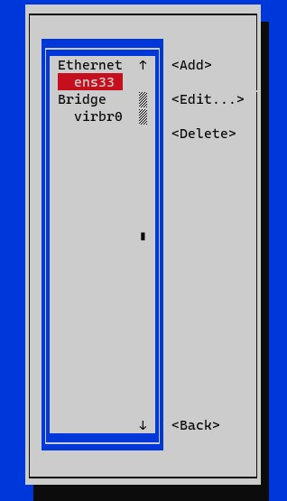
  </a>
    <a href="assets/Networking_2.jpg" target="_blank">
    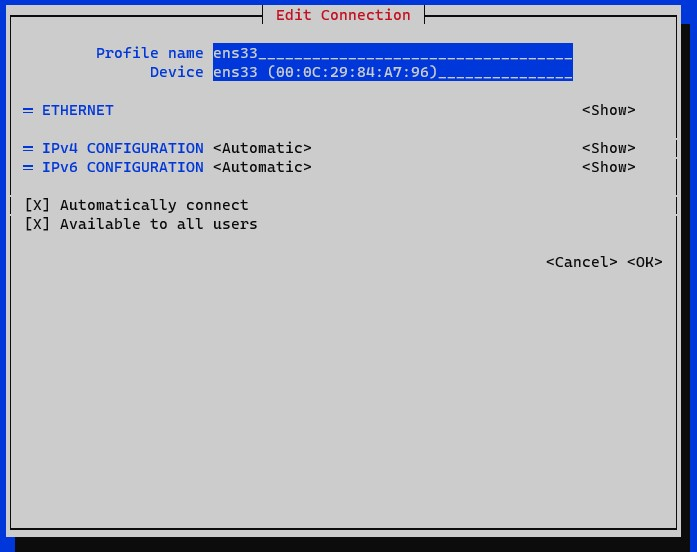
  </a>
</div>
<div align="center">
  <i>First, you will have to select <b>Edit a connection</b></i>
    <br/>
  <i>In Device section, what is between () is the <b>MAC address</b></i>
</div>

<br/>

<!--- Center image --->
<div align="center">
    <a href="assets/Networking_3.jpg" target="_blank">
        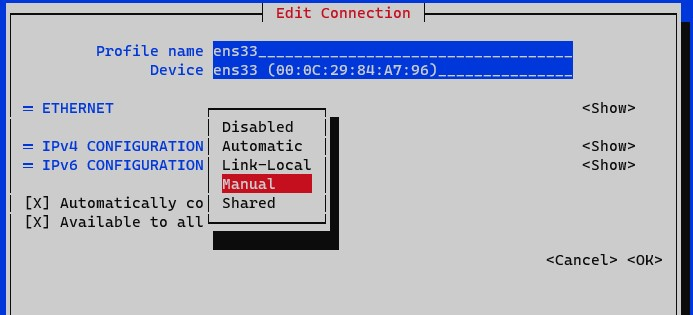
    </a>
    <a href="assets/Networking_4.jpg" target="_blank">
        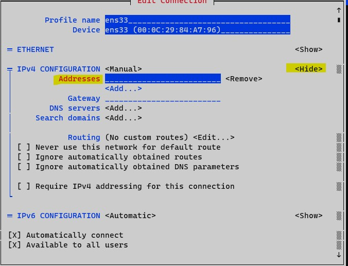
    </a>
</div>
<div align="center">
  <i>To set a static IP address, set to <b>Manual</b></i>
  <br/>
   <i>Then we add our IP address</i>
</div>


&nbsp;

###  &nbsp;&nbsp;&nbsp;&nbsp;&nbsp;&nbsp;&nbsp;&nbsp; <ins>Configure network services to start automatically at boot</ins>

See video **69. Configure network services to start automatically at boot**

&nbsp;

###  &nbsp;&nbsp;&nbsp;&nbsp;&nbsp;&nbsp;&nbsp;&nbsp; <ins>Start, stop, and check the status of network services</ins>

Most servers have a least a few services running on them, dealing with network data in a way or another :

- sshd
- httpd
- chronyd

Let's see how we can inspect what programs are currently running and waiting for incoming network connections with one of the following utilities :

- **`ss`** (which could replace netstat)
- **`netstat`**

```sh
# To see programs that are ready to accept incoming network connections
# -l for listing who is listening
# -t for TCP
# -u for UDP
# -n for numeric values
# -p for showing processes involved with every entry or output
#
# *:22 means the program is listening for incoming connections from anywhere on port 22
# To see a list of connections coming from the OUTSIDE world, see 0.0.0.0 (which means we accept connections from any external IP address)
# [::]:* means we accept IPv6 connections from anywhere
$   sudo ss -tunlp
Netid  State      Recv-Q Send-Q            Local Address:Port                             Peer Address:Port         Process
tcp    LISTEN     0      128                             *:22                                          *:*          users:(("sshd",pid=1041,fd=3))

tcp    LISTEN     0      128                          [::]:22                                       [::]:*          users:(("sshd",pid=1041,fd=4))


# [::]:22, we can see connections on Port 22 are accepted by our Process, the SSH daemon, running under PID 1041
$   ps 1041
   PID TTY      STAT   TIME COMMAND
  1041 ?        Ss     0:00 /usr/sbin/sshd -D


$   sudo lsof -p 1041
COMMAND  PID USER   FD   TYPE             DEVICE SIZE/OFF    NODE NAME
sshd    1041 root  cwd    DIR                8,3      224      64 /
sshd    1041 root  rtd    DIR                8,3      224      64 /
sshd    1041 root  txt    REG                8,3   852952 1647666 /usr/sbin/sshd
sshd    1041 root  mem    REG                8,3    61560   85458 /usr/lib64/libnss_files-2.17.so
sshd    1041 root  mem    REG                8,3    68192  134156 /usr/lib64/libbz2.so.1.0.6
sshd    1041 root  mem    REG                8,3    99944  134279 /usr/lib64/libelf-0.176.so
...
```

```sh
# To check the status of the network services
$   systemctl status sshd.service
● sshd.service - OpenSSH server daemon
   Loaded: loaded (/usr/lib/systemd/system/sshd.service; enabled; vendor preset: enabled)
   Active: active (running) since Mon 2023-09-11 01:39:43 PDT; 3h 44min ago
     Docs: man:sshd(8)
           man:sshd_config(5)
 Main PID: 1041 (sshd)
    Tasks: 1
   CGroup: /system.slice/sshd.service
           └─1041 /usr/sbin/sshd -D

Sep 11 01:39:42 localhost.localdomain systemd[1]: Starting OpenSSH server daemon...
Sep 11 01:39:43 localhost.localdomain sshd[1041]: Server listening on 0.0.0.0 port 22.
Sep 11 01:39:43 localhost.localdomain sshd[1041]: Server listening on :: port 22.
Sep 11 01:39:43 localhost.localdomain systemd[1]: Started OpenSSH server daemon.
Sep 11 01:40:01 localhost.localdomain sshd[1650]: Accepted password for cento from 192.168.25.2 port 51630 ssh2
```

&nbsp;

###  &nbsp;&nbsp;&nbsp;&nbsp;&nbsp;&nbsp;&nbsp;&nbsp; <ins>Configure bridge and bonding devices✨</ins>

We will look at 2 different concepts of : 

- how to **bridge** network devices
- how to **bond** network devices

<!--- Center image --->
<div align="center">
  <a href="assets/Bridge_Bond_1.jpg" target="_blank">
    
    </a>
</div>

<br>

> <ins>**What does it mean Bridge / Bond ?**</ins>
>
> It means that we can take 2 or more network devices and glue them together under the OS. **And this creates a virtual network device**. 
>
> in one case it is called a bridge. On the other one, a bond.

<!--- Center image --->
<div align="center">
  <a href="assets/Bridge_Bond_2.jpg" target="_blank">
    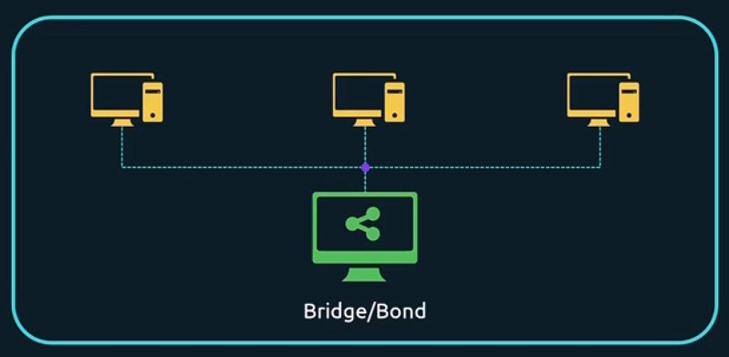
    </a>
</div>

<br>

#### 🔖 <ins>Bond</ins>

Normally our servers will have a connection to the network by connecting to a switch or whatever is. 

<span style="color:#FF8A8A"><ins>**The problem**</ins></span> with this is that if the network goes down, then the server is disconnected from the network (single point of failure) : 

- we can add another network interface and connect to the switch but it is not an ideal solution because this would be **a separate interface with a separate IP address**.

- depending on the routing, one interface is going to be preferred over the other

<!--- Center image --->
<div align="center">
  <a href="assets/Bridge_Bond_3.jpg" target="_blank">
    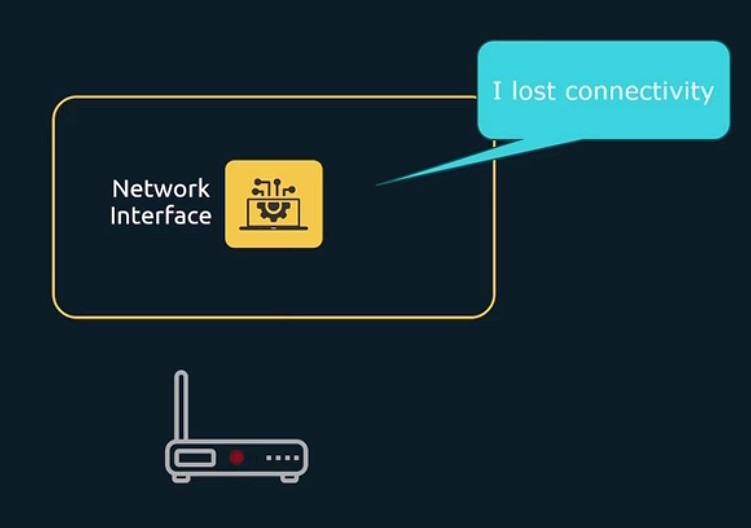
    </a>
  <a href="assets/Bridge_Bond_4.jpg" target="_blank">
    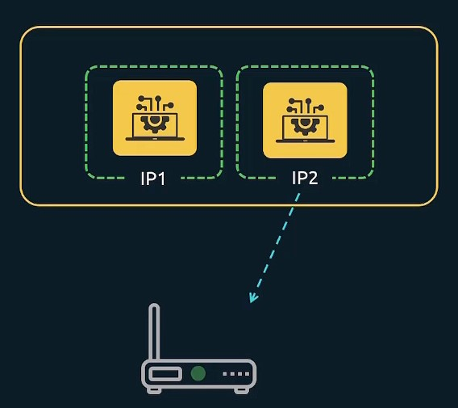
    </a>
</div>

<br>

> What we can do is create a bond which takes both interfaces and make them look and operate like **one single interface**, a **Bond**.
>
> Now since it is a single interface, traffic will be load balanced over it.

<!--- Center image --->
<div align="center">
  <a href="assets/Bridge_Bond_5.jpg" target="_blank">
    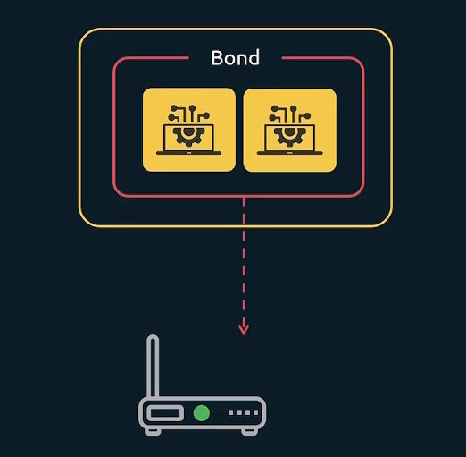
    </a>
</div>

<br>

Linux can handle network traffic through theses bonds in many ways to decide how it should handle it, by using what we called **bonding mode**.

- mode=0 (round-robin)
- mode=1 (active-backup)
- mode=2 (balance-xor)
- mode=3 (broadcast)
- mode=4 (IEEE 802.3ad)
- mode=5 (adaptive transmit load balancing)
- mode=6 (adaptive load balancing)

<br>

#### 🔖 <ins>Bridge</ins>

So if both bridging and bonding glue together multiple network devices in a single virtual one, **how are these methods different ?**

> https://www.cloudkb.net/setup-network-bonding-bridge-centos/

A **Bridge** is used **<ins>to connect</ins> 2 or more separated network devices** for talking to each other as if they were part of the same network.

In Linux networking terms, the Bridge is also called the **controller** and the network devices part of the Bridge are called **ports**.

<!--- Center image --->
<div align="center">
    <a href="assets/Bridge_Bond_6.jpg" target="_blank">
        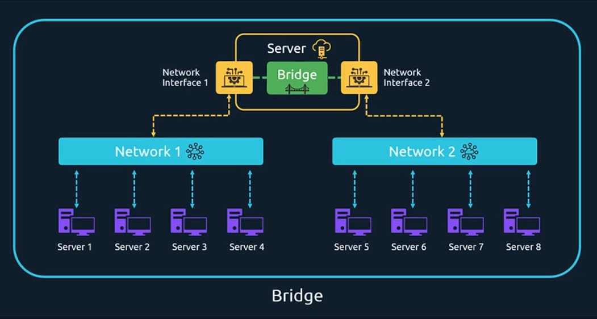
    </a>
</div>
<div align="center">
  <i>We have an imaginary server at the top, <b>with 2 network cards</b>, connected to Network 1 and 2</i>
  <br/>
  <i>When adding the 2 network interfaces to a <b>bridge</b>, they can now talk to each other.</i>
</div>

<br/>

On the other hand, a **Bond** refers to the **<ins>combination of network interfaces</ins>** on one host for redundancy, making some connection to some network **more resilient** and able to keep working even if a network card goes down or gets disconnected.

It also increases the network throughput : if we combine 2 network cards of 1000 mbps, it would get an higher value (not certainly 2000 mbps).

<!--- Center image --->
<div align="center">
    <a href="assets/Bridge_Bond_7.jpg" target="_blank">
        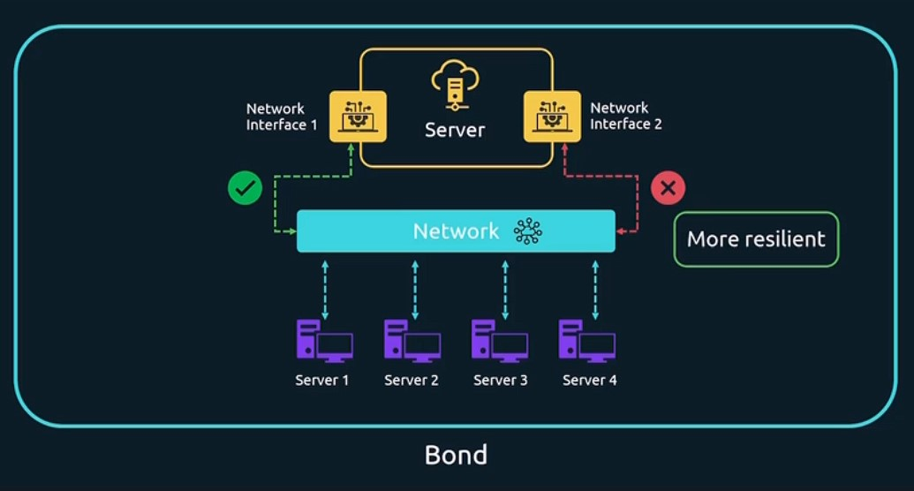
    </a>
</div>

<br/>

<!--- Center image --->
<div align="center">
    <a href="assets/Bridge_Bond_8.jpg" target="_blank">
        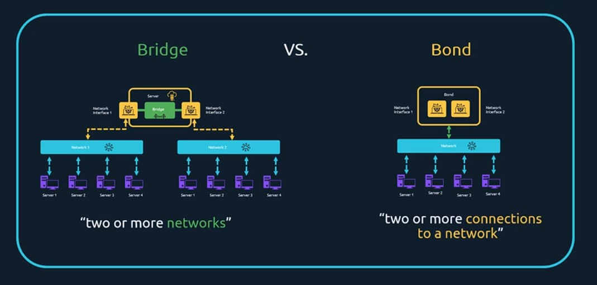
    </a>
</div>

&nbsp;

###  &nbsp;&nbsp;&nbsp;&nbsp;&nbsp;&nbsp;&nbsp;&nbsp; <ins>Implement packet filtering</ins>

Data in a network is broken up in little pieces called **packets**. A JPEG might be sent as 100 of such small network packets between Computer A and B, and **by default** a computer **will accept any network packets** it receives. 

2 scenarios when receiving packets :

- if a program is configured, it intercepts and processes the packets.
- if not, packets are discarded

<!--- Center image --->
<div align="center">
    <a href="assets/Packet_Filter_1.jpg" target="_blank">
        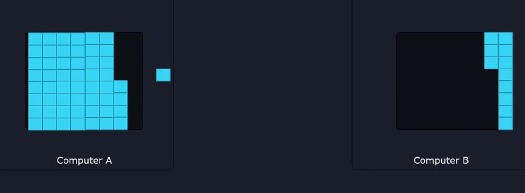
    </a>
</div>

<br/>

To enhance security, a firewall can be added in the system and will filter out what network packets are allowed to come into the system and even what packets are allowed to go.

<!--- Center image --->
<div align="center">
    <a href="assets/Packet_Filter_2.jpg" target="_blank">
        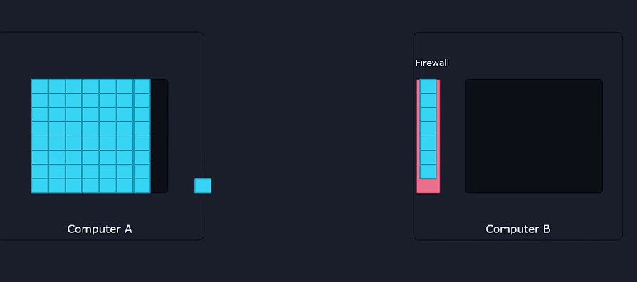
    </a>
</div>

<br/>

We have a tool called `**FirewallD**` for filtering packets. This firewall manager puts every network interfaces in what we call **zones**.

**<ins>Each zone has its own set of rules :</ins>** 

<br>

#### 🔖 <ins>Example 1</ins>

For example we have a server with 1 wireless and 1 wired interface network :

- The wireless one is added in a zone called **Drop**, which is very restrictive and blocks all incoming connections.
- The wired one is on a zone called **Trusted**, where all connections are accepted (we trust all network traffic in our office).

<!--- Center image --->
<div align="center">
    <a href="assets/Packet_Filter_3.jpg" target="_blank">
        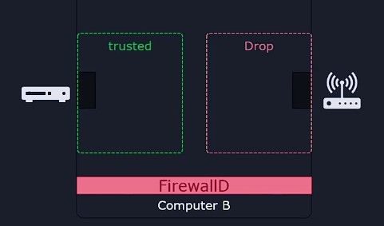
    </a>
</div>

<br/>

> <ins>**Public** is the used default zone :</ins>
>
> - In this zone, every incoming connection is blocked, except what we explicitly choose to allow.
> - The logic is that the main policy is to deny incoming connections to all ports : **only allowing** incoming connections **to specifically enabled services**

```sh
# We can check what zone is currently default
$   firewall-cmd --get-default-zone
public

# To set default zone to public
$   firewall-cmd --set-default-zone=public
Warning: ZONE_ALREADY_SET: public
success
```

```sh
# To see the current firewall rules
$   firewall-cmd --list-all

public (active)
  target: default
  icmp-block-inversion: no
  interfaces: ens33
  sources:
  # Incoming connections for these services are allowed
  # A service here is a friendly name for allowing connections to a certain port
  services: dhcpv6-client ssh
  ports: 22/tcp
  protocols:
  masquerade: no
  forward-ports:
  source-ports:
  icmp-blocks:
  rich rules:


# If we want to see what port number corresponds to a service (here ssh)
$   firewall-cmd --info-service=ssh

ssh
  ports: 22/tcp
  protocols:
  source-ports:
  modules:
  destination:
```

<br>

#### 🔖 <ins>Example 2</ins>

Let's say we installed an HTTP server like Apache or Nginx.

```sh
# If we want to allow traffic to the HTTP service
$   firewall-cmd --add-service=http
success

# If we want to allow TCP connections to port 80
$   firewall-cmd --add-port=80/tcp
success
```


```sh
# To deny traffic to the HTTP service
$   firewall-cmd --remove-service=http
$   firewall-cmd --remove-port=80/tcp
```

<br/>


 <br/>

> We have seen one logic with the **Public** zone, but we can use another logic : Instead of filtering traffic based on incoming ports, we can have **rules on where the traffic is coming from**

 ```sh
 # Allow incoming traffic from this IP range in trusted zone : 10.11.12.0 to 10.11.12.255
 $  firewall-cmd --add-source=10.11.12.0/24 --zone=trusted
success


# Now our firewall is filtering network traffic through two zones : public and trusted.
# We can check out what zones are actively filtering traffic with this command
$   firewall-cmd --get-active-zones
public
  interfaces: ens33
trusted
  sources: 10.11.12.0/24


# To remove the AP address filter
$   firewall-cmd --remove-source=10.11.12.0/24 --zone=trusted
success

$   firewall-cmd --get-active-zones
public
  interfaces: ens33
 ```


<br>

#### 🔖 <ins>Permanent rules</ins>

All the rules we add are not permanent : if we reboot our system, all rules will be lost. 

To make a rule permanent, follow these steps :

```sh
# We allow incoming traffic to port 12345
$   sudo firewall-cmd --add-port=12345/tcp
success

# We check
$   sudo firewall-cmd --list-all
public (active)
target: default
icmp-block-inversion: no
interfaces: enp0s3
sources: 
services: cockpit dhcpv6-client http ssh
ports: 12345


# ONCE we are satisfied, we make the rule permanent
$   sudo firewall-cmd --runtime-to-permanent
success
```
```sh
# Another way to make a permanent rule
#
# BEWARE : this command makes it permanent BUT not active in the current session
$   sudo firewall-cmd --add-port=12345/tcp --permanent
```

&nbsp;

###  &nbsp;&nbsp;&nbsp;&nbsp;&nbsp;&nbsp;&nbsp;&nbsp; <ins>Demo: Configure bridge and bonding devices</ins>

See video **76. Demo: Configure bridge and bonding devices ✨**

&nbsp;

###  &nbsp;&nbsp;&nbsp;&nbsp;&nbsp;&nbsp;&nbsp;&nbsp; <ins>Configure packet filtering</ins>

See video **77. Configure packet filtering ✨**

&nbsp;

###  &nbsp;&nbsp;&nbsp;&nbsp;&nbsp;&nbsp;&nbsp;&nbsp; <ins>Port Redirection, and NAT (Network Address Translation)</ins>

See video **75. Port Redirection, and NAT (Network Address Translation) ✨**

&nbsp;

###  &nbsp;&nbsp;&nbsp;&nbsp;&nbsp;&nbsp;&nbsp;&nbsp; <ins>Implement reverse proxies and load balancers</ins>

See video **78. Implement reverse proxies and load balancers ✨**

&nbsp;

###  &nbsp;&nbsp;&nbsp;&nbsp;&nbsp;&nbsp;&nbsp;&nbsp; <ins>Statically route IP traffic</ins>

#### 🔖 <ins>An example to understand Rounting</ins>

Computer A and computer B are each connected to 2 separated networks. To be able to communicate between them, we connect them through a Computer C (the **Router**) to route data packets from one network to the other.

We give to this computer 2 IP addresses so that it can talk to both networks :

- 10.0.0.100
- 192.168.0.100

<!--- Center image --->
<div align="center">
    <a href="assets/Static_Routing_1.jpg" target="_blank">
        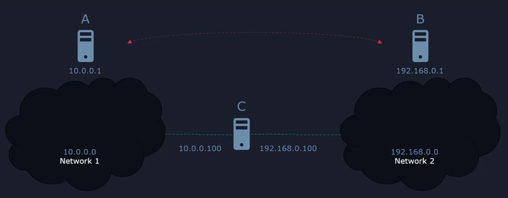
    </a>
</div>

<br/>

But we also need to add  **<ins>Network route</ins>** for knowing how to send data to another network. Here is the process for sending data :

```sh
# We tell computer A to send data to computer C at 10.0.0.100 to communicate with 192.168.0.0 network
$   sudo ip route add 192.168.0.0/24 via 10.0.0.100

# If we have multiple network based interfaces on the system, it is a good idea to specify the interface name where we want to apply this route
# 'dev' is an argument where we spcify the device name ens33 
$   sudo ip route add 192.168.0.0/24 via 10.0.0.100 dev ens33


# To delete the route
$   sudo ip route del 192.168.0.0/24
```
```sh
# To add a DEFAULT route (gateway) to route all traffic leaving our network
# It is an imaginary gate or a door through which data packets exit from our internal network
#
# If we want to send data to an IP address 1.2.3.4, and no specific route is found about how to reach it in the routing table, the data packet will be sent to the default route, the device at 10.0.0.100 in this case
$   sudo ip route add default via 10.0.0.100


# To delete the default route
$   sudo ip route del default via 10.0.0.100
```

<br>

#### 🔖 <ins>Permanent rules</ins>

Routes added with the **`ip`** command are temporary : they are lost at reboot. To make them permanent :

```sh
$   ip route show
default via 192.168.25.2 dev ens33 proto dhcp metric 100
192.168.25.0/24 dev ens33 proto kernel scope link src 192.168.25.136 metric 100
192.168.122.0/24 dev virbr0 proto kernel scope link src 192.168.122.1


# First we need to see what Network Manager Connection is currently active
$   nmcli connection show

NAME    UUID                                  TYPE      DEVICE
ens33   0a56980a-355b-42ea-996f-6a239ea29995  ethernet  ens33
virbr0  7ab7c234-da8b-4b1c-a3f3-86ad1c2bc1a3  bridge    virbr0


# Route all traffic through 10.0.0.100 to reach 192.168.0.0/24
$   sudo nmcli connection modify ens33 +ipv4.routes "192.168.0.0/24 10.0.0.100"


# To immediately apply 
$   sudo nmcli device reapply ens33
Connection successfully reapplied to device 'ens33'.


$   ip route show
default via 192.168.25.2 dev ens33 proto dhcp metric 100
10.0.0.100 dev ens33 proto static scope link metric 100
# Our new route is active
192.168.0.0/24 via 10.0.0.100 dev ens33 proto static metric 100
192.168.25.0/24 dev ens33 proto kernel scope link src 192.168.25.136 metric 100
192.168.122.0/24 dev virbr0 proto kernel scope link src 192.168.122.1


# To remove the route
$   sudo nmcli connection modify ens33 -ipv4.routes "192.168.0.0/24 10.0.0.100"
$   sudo nmcli device reapply ens33
$   ip route show
default via 192.168.25.2 dev ens33 proto dhcp metric 100
192.168.25.0/24 dev ens33 proto kernel scope link src 192.168.25.136 metric 100
192.168.122.0/24 dev virbr0 proto kernel scope link src 192.168.122.1
```

&nbsp;

###  &nbsp;&nbsp;&nbsp;&nbsp;&nbsp;&nbsp;&nbsp;&nbsp; <ins>Set and synchronize system time using time servers</ins>

Harware clocks in computers are not perfect : they slowly drift away from the real time. 

Nowadays our servers, laptops and phones get priodically the exact time from the Inetrnet, from **NTP (Network Time Protocol)** servers. 

Most modern OS include time synchronization software by default. But imagine the following case :

- We have a server configured in Germany and Singapore
- Looking at logs can be confusing, as we must add or substract a few hours to figure out when a certain event took place, relative to our own country's time.
- The 1st thing, we might want to do after launching a server is to set <span style="color:#06C258"><ins>**a specific time zone, preferably the one where we live**</ins></span>

<!--- Center image --->
<div align="center">
    <a href="assets/Synchronize_System_Time_1.jpg" target="_blank">
        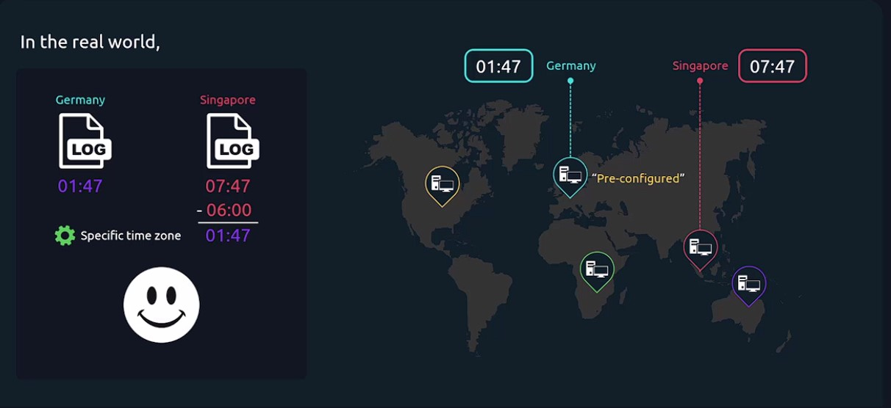
    </a>
</div>

<br/>

Time related operations can be performed with the **`timedatectl`** utility.

```sh
# To list the available time zones
$    timedatectl list-timezones

Africa/Abidjan
Africa/Accra
Africa/Addis_Ababa
Africa/Algiers


# To set a timezone
$    sudo timedatectl set-timezone Europe/Berlin

# To check our timezone. We see we are synchronized with a NTP server
$    timedatectl

      Local time: Wed 2023-09-13 18:32:24 CEST
  Universal time: Wed 2023-09-13 16:32:24 UTC
        RTC time: Wed 2023-09-13 16:32:23
       Time zone: Europe/Berlin (CEST, +0200)
     NTP enabled: yes
NTP synchronized: yes
 RTC in local TZ: no
      DST active: yes
 Last DST change: DST began at
                  Sun 2023-03-26 01:59:59 CET
                  Sun 2023-03-26 03:00:00 CEST
 Next DST change: DST ends (the clock jumps one hour backwards) at
                  Sun 2023-10-29 02:59:59 CEST
                  Sun 2023-10-29 02:00:00 CET
```

<br>

#### 🔖 <ins>If there is no synchronization with a NTP server</ins>

```sh
# Install systemd-timesyncd utility (Ubuntu)
$   sudo apt install systemd-timesyncd

# Turn on synchronization with NTP server
$   sudo timedatectl set-ntp true

# We can also check the service status
$   systemctl status systemd-timesyncd.service

# To edit the settings of systemd time synchro daemon + restart
# We can for example specify a NTP server
$   vi /etc/systemd/timesyncd.conf
$   systemctl restart systemd-timesyncd.service
```