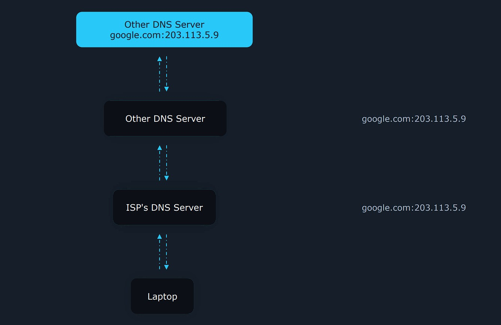
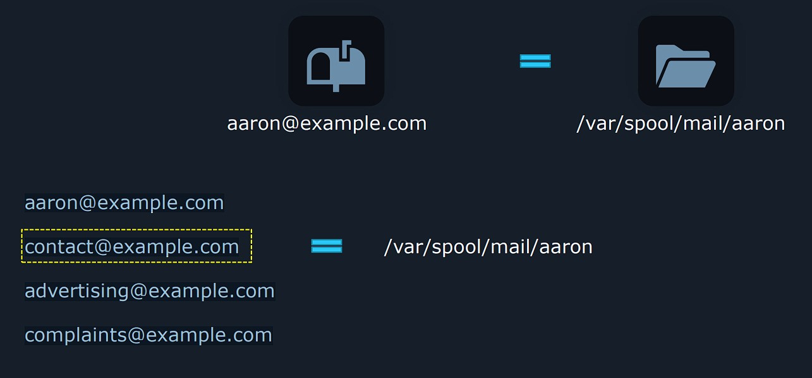

# LFCS Notes

## Service Configuration

###  &nbsp;&nbsp;&nbsp;&nbsp;&nbsp;&nbsp;&nbsp;&nbsp; <ins>Configure a caching DNS server</ins>

To understand why DNS caching is useful, let's take a look at this example :

- We open Web brower and enter **Google.com**
- Our computer needs to find out how it can reach this website. It sends this question through the network : **What is the IP address og Google.com**
- The request will often go to a DNS server hosted by our Internet Service Provider.

<br/>

Let's imagine this DNS server was just launched 2 seconds ago : it will not know the IP address, so **it will ask other DNS servers above it**. And so on until some computer can offer the anwser.  

Once a DNS server provides the answer, it returns through the same path and **this information is <ins>stored locally in the cache of every DNS server</ins> in the path**

Netx time, if the computer needs the IP address of Google.com, it can quickly get it from the ISP's DNS server.

<!--- Center image --->
<div align="center">
    <a href="assets/DNS_Caching_1.jpg" target="_blank">
        
    </a>
</div>

<br/>

To avoid having our Linux server asking again and again the IP address of Google.com, and so reduces our request time from 50 ms to 20, 10, or 5 ms it will be a good idea to create our own DNS server, just like the ISP's one.

<br/>

**`Bind`** is a popular application for hosting a DNS server.   

```sh 
# Install
# With 'bind-utils' we have extra programs that can be helpful when working with DNS servers : we have for example the Dig utility which can be used to query DNS information stored in this server
$   sudo dnf install bind bind-utils
```

Bind's main configuration is located at **`/etc/named.conf`**

```sh
# Before editing the file, we should take a look at the server's current IP address (192.168.25.137)
$   ip a
2: ens33: <BROADCAST,MULTICAST,UP,LOWER_UP> mtu 1500 qdisc pfifo_fast state UP group default qlen 1000
    link/ether 00:0c:29:84:a7:96 brd ff:ff:ff:ff:ff:ff
    inet 192.168.25.137/24 brd 192.168.25.255 scope global noprefixroute dynamic ens33
       valid_lft 1500sec preferred_lft 1500sec
    inet6 fe80::6855:affd:a4a1:7345/64 scope link noprefixroute
       valid_lft forever preferred_lft forever


# Let's see why this IP address is important
# We also look  at some lines
$   sudo vim /etc/named.conf

options {
        # It means we only accept incoming connections from the programs running on 
        # the same OS, not from the outside world
        # For any connections -> listen-on port 53 { any; };
        listen-on port 53 { 127.0.0.1; };
        ...
        # As set now Bind will only allow loalhost to query and ask for information 
        # from its DNS database
        # That means means only programs running on the same OS can request DNS data from 
        # Bind
        allow-query     { localhost; };


        
        # This lets our Bind server get DNS data from other DNS servers on Internet 
        # when it does not have it available in its cache
        recursion yes;
```

<br/>

To make sure it auto starts at each boot

```sh
$   sudo systemctl start named.service
$   sudo systemctl enable named.service
```

<br/>

By default, our firewall blocks any incoming connections. If we want external computers to connect to our DNS Daemon, we need to add a new rule using our **`firewall-cmd`** command :

```sh
# Now connections to our DNS service are allowed
$   sudo firewall-cmd --add-service=dns --permanent
success
```
```sh
# It took 788 ms for Bind service to request as it gets its data from other DNS servers
$   dig @127.0.0.1 google.com
...
;; Query time: 788 msec


# If we run the same command after, it took 0 ms. In the deafult configuration of our DNS server, it automatically caches DNS data
$   dig @127.0.0.1 google.com
...

# 216.239.34.10 is the IP address of ns2.google.com
# 172587 is the TTL (Time to Live) : the response will be cached for another 172587 s
# when it expires, the cache will be deleted
ns2.google.com.         172587  IN      A       216.239.34.10
;; Query time: 0 msec
```

&nbsp;

###  &nbsp;&nbsp;&nbsp;&nbsp;&nbsp;&nbsp;&nbsp;&nbsp; 📽️ <ins>Maintain a DNS zone</ins>

A **Zone** can group DNS data for a specific domain. We could have a zone for **`dot.com`** or another domain.
 
<br>

#### 🔖 <ins>Example</ins>

Lets' imagine the we bought **`example.com`** and we own thus domain so that we can tell the Internet that if it needs the DNS entries for `example.com`, it has to go to our DNS / Name server **`ns1.example.com`** (10.11.12.9) and ask for information.

People enter **`www.example.com`** and DNS requests are sent to ns1.example.com to ask what is the IP address of `www.example.com`.

Currently our Bind server can't anwser because it has no such entry available. Let's see how we can do this :

- The 1st thing to do is to edit the Bind main configuration file :

```sh
$    sudo vim /etc/named.conf

zone "example.com" IN {
# Typing 'master' indicates us that this is the master data, the main information about the zone that can be found on the Internet. master server is the source of truth, whith the slave server can auto synchonize with the master and keep a sort of backup in case the master goes down.
        type master;

# It simply tells Bind where our zone file can be found. We will need this exact name for the next step
        file "example.com.zone";
};
```

<br/>

- The next step is to add the zone file, by using a preexisting file as a template : **`/var/named/named.localhost`**

<br/>

> More details here :
>
> https://bind9.readthedocs.io/en/latest/chapter3.html
>
> https://mirror.apps.cam.ac.uk/pub/doc/redhat/redhat7.3/rhl-rg-en-7.3/s1-bind-configuration.html
>
>https://www.digitalocean.com/community/tutorials/how-to-configure-bind-as-a-private-network-dns-server-on-ubuntu-14-04

```sh
# We do a copy, while preserving the same user and group owners. Otherwise the Bind daemon won't have permission to read it.
$   sudo cp --preserve=ownership /var/named/named.localhost /var/named/example.com.zone
$   sudo ls /var/named/
data  dynamic  example.com.zone  named.ca  named.empty  named.localhost  named.loopback  slaves


# Now we're going to edit this zone file
$   sudo vim /var/named/example.com.zone

# $TTL 1H means we keep the DNS data in cache for 1 hour
# 
# IN                             the domain (Internet)
# SOA                            the type of entry (Start of Authority)
# administrator.example.com.     the data for the entry
#                                - as it is preceded by the @, this is the email 
#                                  address where we can obtain contact info
#                                 (@administrator.example.com)
$TTL 1H
# In this 1st @ the entry applies to the original domain (example.com)
@       IN SOA  @ administrator.example.com. (
            # serial field, incremented each time we make a change to our zone
                                        0       ; serial
                                        1D      ; refresh
                                        1H      ; retry
                                        1W      ; expire
                                        3H )    ; minimum

# NS for Name Server. 
# We are going to start telling the Internet where it can find DNS data for example.com 
# With only this info, the Internet could not know where example.com is located. This is why we will add the authoritative entries below with the IP addresses.
@               NS      ns1.example.com.
@               NS      ns2.example.com.
# Adding a A (authoritative) record for indicating the address IP of ns1 and ns2 (to be discovered by external devices).
# ns1 and ns2 don't have the DOT at the end : they are called subdomains
ns1             A       10.11.12.9
ns2             A       10.11.12.10

# Imagine we want people to be able to access our website when typing 'example' in their Web browsers. We can add a like like this to point to the address or IP address. 
# We begin with @, because it refers to example.com.
# 203.0.113.15 represents the public IP address of our site
@               A       203.0.113.15

# If people want to access through www.example.com
# Another solution, using a CNAME (canonical name). CNAME is almost like a redirection : www.example.com should go to the same place as example.com
# Only one of both solutions can be chosen
# www             A       203.0.113.15
www             CNAME   203.0.113.15


# MX (Mail Exchanger) record is used for resolving SMTP addresses. It tells other servers where they should send their emails
# Compared to the others, we have 4 fields instead of 3. 
# 10 and 20 represent the priority of each entry : when we send a mail John@example.com, we try to send 1st to mail.example.com
example.com.    MX 10   mail.example.com.
                MX 20   mail2.example.com.
# Like above, we need to precise the IP address
mail            A       203.0.113.80
mail2           A       203.0.113.81

example.com.    TXT     "We can write anything in here!"
```

- After having save the changes, we restart the service

```sh
$   sudo systemctl restart named.service

# We can check if all changes are saved
$   dig @localhost example.com ANY

;; QUESTION SECTION:
;example.com.                   IN      ANY

;; ANSWER SECTION:
example.com.            3600    IN      TXT     "We can write anything in here!"
example.com.            3600    IN      MX      10 mail.example.com.
example.com.            3600    IN      MX      20 mail2.example.com.
example.com.            3600    IN      SOA     example.com. administrator.example.com. 0 86400 3600 604800 10800
example.com.            3600    IN      NS      ns1.example.com.
example.com.            3600    IN      NS      ns2.example.com.
example.com.            3600    IN      A       203.0.113.15

;; ADDITIONAL SECTION:
mail.example.com.       3600    IN      A       203.0.113.80
mail2.example.com.      3600    IN      A       203.0.113.81
ns1.example.com.        3600    IN      A       10.11.12.9
ns2.example.com.        3600    IN      A       10.11.12.10
```

&nbsp;

###  &nbsp;&nbsp;&nbsp;&nbsp;&nbsp;&nbsp;&nbsp;&nbsp; <ins>Configure email aliases</ins>

We receive an email for **aaron@example.com**. This email must be stored somewhere so Aaron can read it later when he logs in : in Red Hat or CentOS it will usually be saved to the file **`/var/spool/mail/aaron`**.

<br/>

Now let's imagine we want our website visitors sending us emails to these addresses, Aaron being the contact's point :

<!--- Center image --->
<div align="center">
    <a href="assets/Email_1.jpg" target="_blank">
        
    </a>
</div>

<br/>

We could use **Email Aliases** (a mapping) to send all these emails to him.

<br>

#### 🔖 <ins>Postfix</ins>

We'll create a simple mail server with a program called **`postfix`**.

```sh
$   sudo dnf install postfix
$   sudo systemctl start postfix
$   sudo systemctl enable postfix
```

<br/>

Postfix accept emails at localhost. Let's test :

```sh
# Our user is cento, so we are not using aaron@localhost
$   sendmail cento@localhost <<< "Hello, I'm just testing email."
$   cat /var/spool/mail/cento

From root@localhost.localdomain  Sat Sep 16 10:44:58 2023
Return-Path: <root@localhost.localdomain>
X-Original-To: cento@localhost
Delivered-To: cento@localhost.localdomain
Received: by localhost.localdomain (Postfix, from userid 0)
        id A5BE7208B5EC; Sat, 16 Sep 2023 10:44:58 +0200 (CEST)
Message-Id: <20230916084458.A5BE7208B5EC@localhost.localdomain>
Date: Sat, 16 Sep 2023 10:44:58 +0200 (CEST)
From: root@localhost.localdomain (root)

Hello, I'm just testing email.
```

<br>

#### 🔖 <ins>Alias</ins>

Aliases are defined in this file and we will add a line for creating them : **`/etc/aliases`**

```sh
# ALIAS: USERNAME
$   sudo vim /etc/aliases
advertising: cento

# Inform our Mail daemon (Postfix) about the new alias
$   sudo newaliases

# Let's try sending email
$   sendmail advertising@localhost <<< "Hello, I'm just testing ads email."
$   cat /var/spool/mail/cento
From root@localhost.localdomain  Sat Sep 16 10:44:58 2023
Return-Path: <root@localhost.localdomain>
X-Original-To: cento@localhost
Delivered-To: cento@localhost.localdomain
Received: by localhost.localdomain (Postfix, from userid 0)
        id A5BE7208B5EC; Sat, 16 Sep 2023 10:44:58 +0200 (CEST)
Message-Id: <20230916084458.A5BE7208B5EC@localhost.localdomain>
Date: Sat, 16 Sep 2023 10:44:58 +0200 (CEST)
From: root@localhost.localdomain (root)

Hello, I'm just testing email.

From root@localhost.localdomain  Sat Sep 16 11:00:20 2023
Return-Path: <root@localhost.localdomain>
X-Original-To: advertising@localhost
Delivered-To: advertising@localhost.localdomain
Received: by localhost.localdomain (Postfix, from userid 0)
        id 5EC16208B5EE; Sat, 16 Sep 2023 11:00:20 +0200 (CEST)
Message-Id: <20230916090020.5EC16208B5EE@localhost.localdomain>
Date: Sat, 16 Sep 2023 11:00:20 +0200 (CEST)
From: root@localhost.localdomain (root)

Hello, I'm just testing ads email.
```

```sh
# To create an alias to multiple users (for a contact@example.com)
#
# /var/spool/mail/cento
# /var/spool/mail/john
# /var/spool/mail/jane
$   sudo vim /etc/aliases
contact: cento, john, jane


# To route mail to an external mailbox stored at some other service
# This takes email coming at our server and forward to cento@somewebsite.com
$   sudo vim /etc/aliases
advertising: cento@somewebsite.com
```

&nbsp;

###  &nbsp;&nbsp;&nbsp;&nbsp;&nbsp;&nbsp;&nbsp;&nbsp; 📽️ <ins>Configure an IMAP and IMAPS service</ins>

When we receive email on some server, we also need an easy way to read it : we could create a service like Gmail.com by installing and configuring a web App like **Roundcube**.

<br/>

What if we want to access our emails with a program like Outlook, Thunderbird or an app on our phone ? We need an **IMAP server** (Internet Message Access Protocol). A common IMAP Daemon used is **Dovecot**.

> An email client like Outlook logs into Dovecot and after successful log in, Dovecot retrieves emails for the user (stored on our server) and then it sends them to the email client.

The client and server are synchronized in the sense that if we delete an email from the client, it will also be deleted from the email server.

IMAP does not encrypt data sent through the network between the user and the server : **IMAPS** (IMAP over SSL) was invented to solve this problem. Nowadays, we have replaced SSL by TLS.

- Let's install Dovecot :
```sh
$   sudo dnf install dovecot
$   sudo systemctl start dovecot
$   sudo systemctl enable dovecot
Created symlink from /etc/systemd/system/multi-user.target.wants/dovecot.service to /usr/lib/systemd/system/dovecot.service.
```

<br/>

- When we first start out, the firewall is going to be blocking incoming connections. If we want the outside world to be able to log into our IMAP service, we'll need to allow those types of connections.

```sh
$   sudo firewall-cmd --add-service=imap
$   sudo firewall-cmd --add-service=imaps
success

# Make them permanent
$   sudo firewall-cmd --runtime-to-permanent
success
```

<br/>

- Let's configure an IMAP and IMAPS server. For this let's take a look at the main configuration file of Dovecot :

#### ⚠️ NOTE :

> The video onlys showed some important pieces. You may need to dig deeper :
>
> https://www.plesk.com/blog/various/setting-up-and-configuring-a-linux-mail-server/
```sh
# Will enable both IMAP and IMAPS
$   sudo vim /etc/dovecot/dovecot.conf
protocols = imap
listen = 10.11.12.9

# You can see a lot of conf files here
$   ls /etc/dovecot/conf.d/

10-auth.conf      10-ssl.conf        20-pop3.conf                 auth-deny.conf.ext        auth-sql.conf.ext
10-director.conf  15-lda.conf        90-acl.conf                  auth-dict.conf.ext        auth-static.conf.ext
10-logging.conf   15-mailboxes.conf  90-plugin.conf               auth-ldap.conf.ext        auth-system.conf.ext
10-mail.conf      20-imap.conf       90-quota.conf                auth-master.conf.ext      auth-vpopmail.conf.ext
10-master.conf    20-lmtp.conf       auth-checkpassword.conf.ext  auth-passwdfile.conf.ext


# If we want to change default ports, for listening on for incoming connections
# Example for IMAPS : change 993 to 789
$   sudo vim /etc/dovecot/conf.d/10-master.conf

service imap-login {
  inet_listener imap {
    #port = 143
  }
  inet_listener imaps {
    port = 789
    #ssl = yes
  }


# To edit the default location of our stored emails
 # /var/mail is symbolically linked with /var/spool/mail
$   sudo vim /etc/dovecot/conf.d/10-mail.conf

#   mail_location = maildir:~/Maildir
   mail_location = mbox:~/mail:INBOX=/var/mail/%u              
#   mail_location = mbox:/var/mail/%d/%1n/%n:INDEX=/var/indexes/%d/%1n/%n


# To secure traffic between our server and client, Dovecot needs a TLS (Transport Layer Security) certificate
# You can generate a TLS certificate with Certbot utility
$   sudo vim /etc/dovecot/conf.d/10-ssl.conf

ssl = required

ssl_cert = </etc/pki/dovecot/certs/dovecot.pem
ssl_key = </etc/pki/dovecot/private/dovecot.pem
```

&nbsp;

###  &nbsp;&nbsp;&nbsp;&nbsp;&nbsp;&nbsp;&nbsp;&nbsp; 📽️ <ins>Configure SSH servers and clients</ins>


#### 🔖 <ins>SSH server</ins>

Our server is running an OpenSSH Daemon. 

- So let's jump straight to how we can configure it

```sh
$   sudo vim /etc/ssh/sshd_config

# Default port
Port 22

# The AddressFamily is a bit obscure but it is going to give us a chance to find how we can get more info about some config options.
# Let's use 'man sshd_config' and search for 'Family', typing '/Family'
# Then if we want to accept incoming connections only from IPv4
AddressFamily inet

# If we have 2 IP addresses (203.0.113.1 connected on Internet and 10.11.12.9 connected on Intranet), we could tell ou daemon to only listen to the internal IP address (to be only accessible to employees from internal network)
ListenAddress 10.11.12.9

# Allow root user to log in from an SSH connection. To disable it
PermitRootLogin no

# Disabling Password authentication means we can only log in though SSH Keys (like Gitlab)
PasswordAuthentication no

# Running graphical application on server but from our local screen
X11Forwarding yes

# To only allow a Password authentication for a specific User (cento), even if disabled
PasswordAuthentication no
Match user cento
        PasswordAuthentication yes
```

- Reload service after having saved configs

```sh
$   sudo systemctl reload sshd.service
```

<br/>

#### 🔖 <ins>SSH client</ins>

> More info :
>
> https://linuxize.com/post/using-the-ssh-config-file/?utm_content=cmp-true

```sh
# Config file from client
$   sudo vim /home/USER/.ssh/config

Host centos
        HostName 10.11.12.9
        Port 2322
        User aaron


$   sudo chmod 600 /home/USER/.ssh/config

# Instead of using 'ssh aaron@10.11.12.9 -p 2322'
$   ssh centos
```
```sh
# Genetare private public key
$   ssh-keygen

# Log in into the server with private key : for this we have to copy the public key to the server
# Content of public key will be copied to cento's home directory, into the .ssh/authorized_keys file
$   ssh-copy-id cento@10.11.12.9


$   chmod 600 authorized_keys    
```
```sh
# To remove an old fingerprint
$   ssh-keygen -R 10.11.12.9
```
```sh
# Config file for SSH client from server
$   sudo vim /etc/ssh/ssh_config

# We can customize SSH client connection in this folder by creating our .conf files
$   sudo ls /etc/ssh/ssh_config.d/

# Here we define another default port
$   sudo vim /etc/ssh/ssh_config.d/99-our-settings.conf
Port 229
```

&nbsp;

###  &nbsp;&nbsp;&nbsp;&nbsp;&nbsp;&nbsp;&nbsp;&nbsp; 📽️ <ins>Restrict access to the HTTP proxy server</ins>

> More info :
>
> https://adamtheautomator.com/squid-proxy/
>
> https://linuxhint.com/squid-proxy-configuration-linux/

Imagine we have an intranet where the employees want to visit a website like Google.com : their connection go straight to that web server.

We can add a **Proxy server** where their outgoing connections will go through. With this setup we can :

- scan web traffic
- prevent known viruses : if someone tries to download an infected email, attachment, etc. , this can be stopped.
- block certain websites
- cache frequently accessed websites, greatly speeding up we activities and downloads
- etc.

<br/>

- Let's install **`Squid`** and auto-start the service

```sh
$   sudo dnf install squid -y
$   sudo systemctl start squid
$   sudo systemctl enable squid
Created symlink from /etc/systemd/system/multi-user.target.wants/squid.service to /usr/lib/systemd/system/squid.service.
```


<br/>

- We add rules to our firewall

```sh
$   sudo firewall-cmd --add-service=squid --permanent
success
```

<br/>

- Let's fine tune who can access the proxy server and what they can access, so we can add access rules to a specific file.

>These ACL lines, alone, don't do anything : they basically jsut define some filters but do not apply them. After added these lines, we need to specifically allow or deny access to each ACL.


#### ⚠️ NOTE :

> When creating your rules, Squid will look at the 1st rule and so on : it means that you have to design well your rules to apply them **<ins>in a specific order</ins>**
```sh
# acl           Access Control List
# localnet      The name of the acl. We can choose any name we want
# src           Source type
# 10.0.0.0/8    The rul will apply to any network traffic coming from an Ip starting with 10. 
$   sudo vim /etc/squid/squid.conf

# If we want a set of IP to have access to our proxy
acl external src 203.0.113.0/24

# This defines an ACL, based on the destination port.
acl SSL_ports port 443
acl Safe_ports port 80          # http
acl Safe_ports port 21          # ftp

# This rule says, when someone tries to access something though HTTP (http_access), access is denied if the port does not belong to 'Safe_ports' (80, 21, etc.)
http_access deny !Safe_ports


# To deny access to youtube.com and all of its subdomains
acl youtube dstdomain .youtube.com
http_access deny youtube

# To deny access ONLY to youtube.com, remove the DOT
acl youtube dstdomain youtube.com
http_access deny youtube
```

- Once chnages are saved, we reload the service.

```sh
$   sudo systemctl reload squid.service

# If we want to make them available immedialtly, with the irsk in disrupting current sessions
$   sudo systemctl restart squid.service
```

&nbsp;

###  &nbsp;&nbsp;&nbsp;&nbsp;&nbsp;&nbsp;&nbsp;&nbsp; 📽️ <ins>Configure an HTTP server</ins>

> More info :
>
> https://www.digitalocean.com/community/tutorials/how-to-set-up-apache-virtual-hosts-on-ubuntu-20-04
> https://www.arubacloud.com/tutorial/how-to-enable-https-protocol-with-apache-2-on-ubuntu-20-04.aspx

- Install Apache server

```sh
$   sudo dnf install httpd -y
```

- The Daemon listens for incoming connections on port 80 by default. We need to allow HTTP/HTTPS with firewall

```sh
$   sudo firewall-cmd --add-service=http --permanent
$   sudo firewall-cmd --add-service=https
$   sudo firewall-cmd --runtime-to-permanent
```

<br/>

#### 🔖 <ins>HTTP</ins>

- Let's do some tests to navigate to some different Web pages, using the port 80 or 8080. Below are some important properties to pay attention.

```sh
$   sudo vim /etc/httpd/conf/httpd.conf

# Listen 10.11.12.9:8080
Listen 80

ServerAdmin webserver@example.com

# ServerName www.example.com:80
# ServerName 10.11.12.9
ServerName localhost

DocumentRoot "/var/www/html"
```

<br/>

#### ⚠️ NOTE :

- For the following example : our HTTP server will host 2 websites, **Blog** & **Store**

```sh
# Let's create a new file
$   sudo vim /etc/httpd/conf.d/two-websites.conf

# Let's add virtual hosts 
# Our Virtual Host is VirtualHost *:80, so our server might have 2 or more IP addresses.
# For example HTTp daemon might listen for incoming connections on both internal (10.11.12.9) and external network (203.0.113.5)
#
# That line tells our HTTPD it should use these settings in VirtualHost, no matter from which IP the website visitor is connected to (internal or external).
<VirtualHost *:80>
        ServerName store.example.com
        DocumentRoot "/var/www/store/"
</VirtualHost>

<VirtualHost *:80>
        ServerName blog.example.com
        DocumentRoot "/var/www/blog/"
</VirtualHost>


# For only access from private network, to serve a private website
<VirtualHost 10.11.12.9:80>
        xxx
        xxx
</VirtualHost>
```
```sh
# A tool to check your Apache Configs
$   apachectl configtest

AH00112: Warning: DocumentRoot [/var/www/store/] does not exist
AH00112: Warning: DocumentRoot [/var/www/blog/] does not exist
# AH00558: httpd: Could not reliably determine the server's fully qualified domain name, using localhost.localdomain. Set the 'ServerName' directive globally to suppress this message
Syntax OK
```

<br/>

- Let's create some **`.html`** files

```sh
$   sudo echo "This is the MAIN website" > /var/www/html/index.html
$   sudo echo "This is the BLOG" > /var/www/blog/index.html
$   sudo echo "This is the STORE" > /var/www/store/index.html
```

<br/>

#### 🔖 <ins>HTTPS</ins>

- To enable HTTPS, we're going to generate some TLS certificates and configure the Daemon to use HTTPS. We can also change the Web server administrator.

```sh
$   sudo dnf install mod_ssl -y
```

```sh
$   sudo vim /etc/httpd/conf.d/ssl.conf

Listen 443 https
```

<br/>

- While using **`certbot`**, it will usually add new configuration files for https enabled websites.

```sh
# Config for Virtual host in HTTPS
<VirtualHost *:443>
        ServerName www.example.com
        SSLEngine on
        SSLCertificateFile "/path/to/file.cert"
        SSLCertificateKeyFile "/path/to/file.key"
</VirtualHost>
```

- As httpd is modular, you can find modules here. For enabling some functionnalities we have to edit a file and uncomment :

```sh
$   ls /etc/httpd/conf.modules.d/

00-base.conf  00-dav.conf  00-lua.conf  00-mpm.conf  00-proxy.conf  00-ssl.conf  00-systemd.conf  01-cgi.conf
```

&nbsp;

###  &nbsp;&nbsp;&nbsp;&nbsp;&nbsp;&nbsp;&nbsp;&nbsp; 📽️ <ins>Configure HTTP server log files</ins>

> More info :
>
> https://linuxize.com/post/apache-log-files/?utm_content=cmp-true

**`httpd`** keeps track of important events : it stores data in :

- `error.log`
- `access.log` : who visits the website, what pages they accessed, what Web browser they used, etc.

<br/>

The default logging settings ared defined in :

```sh
$   sudo cat /etc/httpd/conf/httpd.conf

# /etc/httpd is also a symlink (symbolic Linux/ UNIX link that points to another file or folder on your computer, or a connected file system). It points to /var/log/httpd/
ServerRoot "/etc/httpd"
ErrorLog "logs/error_log"

# LogLevel: Control the number of messages logged to the error_log.
# Possible values include: debug, info, notice, warn, error, crit,
# alert, emerg.
#
LogLevel warn


    #
    # If you prefer a logfile with access, agent, and referer information
    # (Combined Logfile Format) you can use the following directive.
    #
    CustomLog "logs/access_log" combined
```

<br/>

In our Virtual Hosts, we can configure the path to lologshs :

```sh
<VirtualHost *:80>
        ServerName store.example.com
        DocumentRoot "/var/www/store/"
        # Using the 'combined' format
        CustomLog "/var/log/httpd/store.example.com_access.log" combined
        ErrorLog "/var/log/httpd/store.example.com_error.log"
</VirtualHost>
```

&nbsp;

###  &nbsp;&nbsp;&nbsp;&nbsp;&nbsp;&nbsp;&nbsp;&nbsp; 📽️ <ins>Restrict access to a web page</ins>

With the 2 created Virtual Hosts, we will learn about disabling them. 

- Let's create a disabled file

```sh
$   sudo mv /etc/httpd/conf.d/two-websites.conf /etc/httpd/conf.d/two-websites.conf.disabled
$   sudo systemctl reload httpd.service
```

- Let's create 3 file into `/var/www/html/admin`

```sh
$   sudo mkdir /var/www/html/admin
$   sudo touch /var/www/html/admin/file{1..3}
```

```sh
# Let's take a look at how the default config file restricts or allows access to DocumentRoot
$   sudo vim /etc/httpd/conf/httpd.conf

DocumentRoot "/var/www/html"

<Directory "/var/www/html">
    # The Options directive is both complicated and important.  Please see
    # http://httpd.apache.org/docs/2.4/mod/core.html#options
    # for more information.
    #
    # - Leaving 'Indexes' makes the page http://localhost/admin/ accessible 
    # - Removing 'FollowSymLinks' avoids us to download a file when clicking on a link
    # Options Indexes FollowSymLinks
    Options FollowSymLinks

    #
    # AllowOverride controls what directives may be placed in .htaccess files.
    # It can be "All", "None", or any combination of the keywords:
    #   Options FileInfo AuthConfig Limit
    #
    AllowOverride None

    #
    # Controls who can get stuff from this server.
    #
    Require all granted
</Directory>


# This config will allow access to the Web page, only from these IP
<Directory "/var/www/html/admin/">
    Require ip 192.168.1.79 203.0.1.113
</Directory>
<Directory "/var/www/html/admin/">
    # Allo access for 192.168.1.1 through 192.168.1.255
    Require ip 192.168.1
</Directory>

#
# The following lines prevent .htaccess and .htpasswd files from being
# viewed by Web clients.
#
<Files ".ht*">
    Require all denied
</Files>
```

<br/>

- We can also protect a sensitive area of our website with a username and password

```sh
# We generate this file (a password for the website access)
$   sudo htpasswd -c /etc/httpd/passwords cento
New password:
Re-type new password:
Adding password for user cento


$   sudo cat /etc/httpd/passwords
cento:$apr1$QNnV/DyV$Pwj/d7yNxY1VP2sSkJ/Uv/


# To add another entry
$   sudo htpasswd /etc/httpd/passwords john

# To delete  entry
$   sudo htpasswd -D /etc/httpd/passwords john
```
```sh
$   sudo vim /etc/httpd/conf/httpd.conf

<Directory "/var/www/html/admin/">
    AuthType Basic
    AuthBasicProvider File
    AuthName "Secret Admin Page"
    AuthUserFile /etc/httpd/passwords
    Require valid-user
</Directory>
```

&nbsp;

###  &nbsp;&nbsp;&nbsp;&nbsp;&nbsp;&nbsp;&nbsp;&nbsp; 📽️ <ins>Configure a database server (MariaDB)✨</ins>

See video **90. Configure a database server**

&nbsp;

###  &nbsp;&nbsp;&nbsp;&nbsp;&nbsp;&nbsp;&nbsp;&nbsp; 📽️ <ins>Manage and configure containers (Docker)✨</ins>

See video **91. Manage and configure containers**

&nbsp;

###  &nbsp;&nbsp;&nbsp;&nbsp;&nbsp;&nbsp;&nbsp;&nbsp; 📽️ <ins>Manage and configure Virtual Machines (Qemu)</ins>

There are many softwares using the virtualization. In Linux the most popular one is **`QEMU (Quick Emulator) KVM (Kernel based Virtual Machine)`** : they are 2 pieces of a software that interconnect.

Qemu simulates a virtual computer and KVM is a code included in the Linux kernel that uses harware technology meant to speed up virtual machines.

<br/>

For our demo, we will focus on a tool called **`virsh`** : it lets us manage virtual machines on the command line.

```sh
# libvirt includes utilities that let us interact with VM
# qemu-kvm lets us create and run them
$   dnf install libvirt qemu-kvm
```

<br/>

Next we create a <span style="color:#06C258">**configuration file**</span>. Here we neglect the hard disks and network card :

```sh
# hvm means harware virtual machine
$   vi testmachine.xml

<domain type="qemu">
  <name>TestMachine</name>
  <memory unit="GiB">1</memory>
  <vcpu>1</vcpu>
  <os>
    <type arch='x86_64'>hvm</type>
  </os>
</domain>
```

<br/>

And we create the virtual machine :

```sh
$   virsh define testmachine.xml
Domain TestMachine defined from testmachine.xml
```

<br/>

The machine doesn't start automatically. Let's start it :

```sh
$   virsh start TestMachine
Domain TestMachine started


$   virsh list --all

 Id    Name                           State
----------------------------------------------------
 1     TestMachine                    running
```

<br/>

To reboot the machine :

```sh
$   virsh reboot TestMachine

Domain TestMachine is being rebooted

# Forcing a reboot
$   virsh reset TestMachine
```

<br/>

To shutdown the machine :

```sh
$   virsh shutdown TestMachine

Domain TestMachine is being shutdown

# Forcing a shutdown
$   virsh destroy TestMachine
```

<br/>

To destroy the machine with all its storage (**`--remove-all-storage`**) :

```sh
$   virsh undefine --remove-all-storage TestMachine

Domain TestMachine has been undefined
```

<br/>

To get resource info :

```sh
$   virsh dominfo TestMachine

Id:             -
Name:           TestMachine
UUID:           a28a3b96-0671-486d-995c-ffb47d3d25e7
OS Type:        hvm
State:          shut off
CPU(s):         1
Max memory:     1048576 KiB
Used memory:    1048576 KiB
Persistent:     yes
Autostart:      disable
Managed save:   no
Security model: selinux
Security DOI:   0


# Setting vCPU max to 2
$   virsh setvcpus TestMachine 2 --config
error: invalid argument: requested vcpus is greater than max allowable vcpus for the persistent domain: 2 > 1


$   virsh setvcpus TestMachine 2 --config --maximum
$   virsh setvcpus TestMachine 2 --config

# Setting RAM
$   virsh setmaxmem TestMachine 2048M --config
```

&nbsp;

###  &nbsp;&nbsp;&nbsp;&nbsp;&nbsp;&nbsp;&nbsp;&nbsp; 📽️ <ins>Manage Virtual Machines – virt-install (Virt-Manager)✨</ins>

See video **93. Manage Virtual Machines – virt-install**