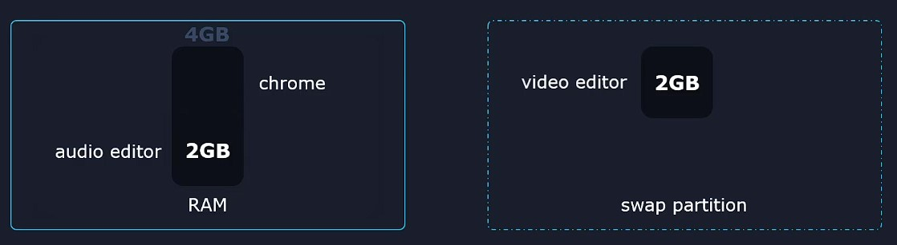
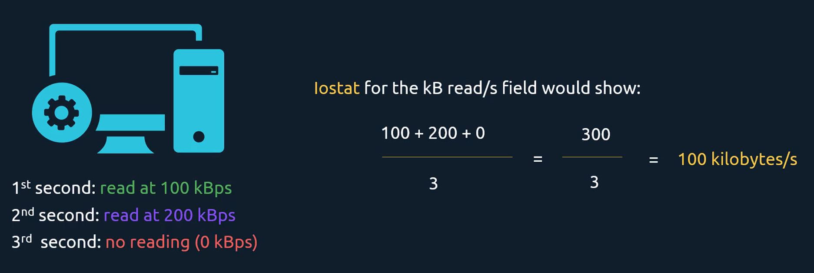
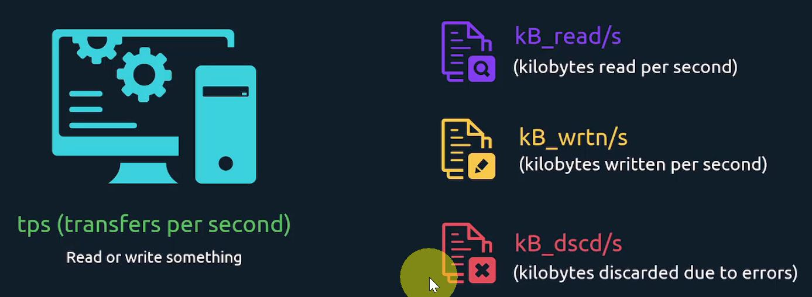

# LFCS Notes

##  Storage Management

###  &nbsp;&nbsp;&nbsp;&nbsp;&nbsp;&nbsp;&nbsp;&nbsp; 📽️ <ins>List, create, delete, and modify physical storage partitions</ins>

Imagine we have a 2 Tb SSD and we want to install Windows and Linux :

- Windows uses the NTFS file system
- Linux uses EXT4 file system

<br/>

We can divide (partition) the SSD into 2 partitions.

- To see what partitions exist on Linux system :

```sh
# S from 'SDA' means serial. That's where any devices that may be connected to a SATA port like SSD on motherboard.
#
# /dev/sda points to the device
# /dev/sda1 points to the partition
$   lsblk

NAME   MAJ:MIN RM  SIZE RO TYPE MOUNTPOINT
sda      8:0    0   30G  0 disk
├─sda1   8:1    0  300M  0 part /boot
├─sda2   8:2    0    3G  0 part [SWAP]
└─sda3   8:3    0 26.7G  0 part /
sdb      8:16   0    8G  0 disk
sr0     11:0    1 1024M  0 rom


# This partition utilisty shows the list of partitions of the block device /dev/sda
# A storage is divided into sectors
#
# If /dev/sda1 is at sector 2048 (Start) and we multiply by 512 (sector size) that leaves us with 1,048,576 bytes, which is 1 Mbytes : it means that that this partition has 1 Mbytes of free space before it (scetor 0 to 2047 are not partitioned).
#
# This is done in case of a bootloader needs to be installed in that area. 
$   sudo fdisk -l /dev/sda

Disk /dev/sda: 32.2 GB, 32212254720 bytes, 62914560 sectors
Units = sectors of 1 * 512 = 512 bytes
Sector size (logical/physical): 512 bytes / 512 bytes
I/O size (minimum/optimal): 512 bytes / 512 bytes
Disk label type: dos
Disk identifier: 0x0009c911

   Device Boot      Start         End      Blocks   Id  System
/dev/sda1   *        2048      616447      307200   83  Linux
/dev/sda2          616448     6907903     3145728   82  Linux swap / Solaris
/dev/sda3         6907904    62914559    28003328   83  Linux
```

<br/>

- We've added a 2nd storage device : let's create the partition

```sh
# We can see there is no partition on /dev/sdb
$  lsblk

NAME   MAJ:MIN RM  SIZE RO TYPE MOUNTPOINT
sda      8:0    0   30G  0 disk
├─sda1   8:1    0  300M  0 part /boot
├─sda2   8:2    0    3G  0 part [SWAP]
└─sda3   8:3    0 26.7G  0 part /
sdb      8:16   0    8G  0 disk
sr0     11:0    1 1024M  0 rom


# Before creating a partition, we need to decide if we'll use MBR or GPT.
# If we're working with VERY OLD hardware ---> we must use MBR partition tables
#                                         ---> we select 'dos' in our label type selection 
# If recent hardware                      ---> we select 'gpt' in our label type selection 
$   sudo cfdisk /dev/sdb
```
```sh
# Step 01 : New -> Primary -> 2G -> Beginning -> Bootable -> Write
# Step 02 : New -> Logical -> 4G -> Beginning -> Write
# Step 03 : New -> Logical -> 2G -> Beginning -> Type -> 'Linux Swap' -> Write
# Step 04 : Quit
                        cfdisk (util-linux 2.23.2)

                           Disk Drive: /dev/sdb
                      Size: 8589934592 bytes, 8589 MB
           Heads: 255   Sectors per Track: 63   Cylinders: 1044

   Name        Flags     Part Type FS Type         [Label]       Size (MB)
 -------------------------------------------------------------------------
   sdb1        Boot       Primary  Linux                           1998.75    
   sdb5                   Logical  Linux                           3997.49
   sdb6                   Logical  Linux swap / Solaris            1998.75
                          Pri/Log  Free Space                       594.97*
```
```sh
# We have created the partition /dev/sdb6 to be used as swap. It is currently empty with no data inside.
# Before it can be used as swap, it has to be prepared.
# What we have done before was basically to write some small data on the partition labels, so the system knows this is meant to be used as a swap area.
$  lsblk

NAME   MAJ:MIN RM  SIZE RO TYPE MOUNTPOINT
sda      8:0    0   30G  0 disk
├─sda1   8:1    0  300M  0 part /boot
├─sda2   8:2    0    3G  0 part [SWAP]
└─sda3   8:3    0 26.7G  0 part /
sdb      8:16   0    8G  0 disk
├─sdb1   8:17   0  1.9G  0 part
├─sdb2   8:18   0    1K  0 part
├─sdb5   8:21   0  3.7G  0 part
└─sdb6   8:22   0  1.9G  0 part
sr0     11:0    1 1024M  0 rom
```
&nbsp;

###  &nbsp;&nbsp;&nbsp;&nbsp;&nbsp;&nbsp;&nbsp;&nbsp; <ins>Configure and manage swap space</ins>

**Swap** is an area where Linux can temporarily move some data from RAM memory.

#### 🔖 <ins>Example</ins>

We have a computer of 4 GB of RAM where we have opened :

- a video editor (2GB)
- an audio editor (2GB)

<br/>

When we open a Web Broweser, **we will move inactive applications to Swap partition** to free up memory bytes. In our case we move the video editor.

<!--- Center image --->
<div align="center">
    <a href="assets/Swap_1.jpg" target="_blank">
        
    </a>
</div>

<br/>

#### 🔖 <ins>Commands</ins>

To check if the system uses any kind of swap areas.

```sh
$  swapon --show

NAME      TYPE      SIZE USED PRIO
/dev/sda2 partition   3G   0B   -2
```

We tell Linux to use the partition to swap


```sh
# Using /dev/sdb6 for swaping
$  sudo mkswap /dev/sdb6

Setting up swapspace version 1, size = 1951860 KiB
no label, UUID=02d3ad30-52a8-4383-ac1c-3ad587129175

# Then, swap /dev/sdb6
$  sudo swapon --verbose /dev/sdb6

swapon /dev/sdb6
swapon: /dev/sdb6: found swap signature: version 1, page-size 4, same byte order
swapon: /dev/sdb6: pagesize=4096, swapsize=1998708736, devsize=1998710784
```
```sh
$  swapon --show

NAME      TYPE      SIZE USED PRIO
/dev/sda2 partition   3G   0B   -2
/dev/sdb6 partition 1.9G   0B   -3


$  lsblk

NAME   MAJ:MIN RM  SIZE RO TYPE MOUNTPOINT
sda      8:0    0   30G  0 disk
├─sda1   8:1    0  300M  0 part /boot
├─sda2   8:2    0    3G  0 part [SWAP]
└─sda3   8:3    0 26.7G  0 part /
sdb      8:16   0    8G  0 disk
├─sdb1   8:17   0  1.9G  0 part
├─sdb2   8:18   0    1K  0 part
├─sdb5   8:21   0  3.7G  0 part
└─sdb6   8:22   0  1.9G  0 part [SWAP]
```

#### ⚠️ NOTE :

> **However there is a problem :** if we reboot the machine, /dev/sdb6 won't be used as swap <span style="color:#FF8A8A"><ins>**anymore**</ins></span>. We will see later how to automatically use a swap every time the OS boots up. 

<br/>

To stop using a partition as swap

```sh
$  sudo swapoff /dev/sdb6

$  lsblk

NAME   MAJ:MIN RM  SIZE RO TYPE MOUNTPOINT
sda      8:0    0   30G  0 disk
├─sda1   8:1    0  300M  0 part /boot
├─sda2   8:2    0    3G  0 part [SWAP]
└─sda3   8:3    0 26.7G  0 part /
sdb      8:16   0    8G  0 disk
├─sdb1   8:17   0  1.9G  0 part
├─sdb2   8:18   0    1K  0 part
├─sdb5   8:21   0  3.7G  0 part
└─sdb6   8:22   0  1.9G  0 part
sr0     11:0    1 1024M  0 rom
```

<br/>

#### 🔖 <ins>File as swap</ins>

Instead of partitions, we can also use **<ins>simple files</ins>** as swap.

First we need to create an empty file and fill it with 0 : that is **binary zeros**.

```sh
# 'if=/dev/zero' tells the utility 'dd' to use the input file at /dev/zero
#                /dev/zero is a special device file that generates an infinite number of 0 when 
#                          an application reads from it.
# 'of=/swap' tells to copy the input file to output file /swap
# 'bs=1M count=128' tells to write a block size of 1M 128 times.
# 'status=progress' shows the progress status
$  sudo dd if=/dev/zero of=/swap bs=1M count=128 status=progress

128+0 records in
128+0 records out
134217728 bytes (134 MB) copied, 0.209511 s, 641 MB/s
```
Regular Users should not be allowed to read this swap file : that is because this potentially gives them access to the memory contents of programs other users might be using.

We'll set permissions to only allow the root user to read and write this file.

```sh
$  sudo chmod 600 /swap
```

<br/>

Formatting this file as a swap is the same as before. But instead of using a file like `/dev/sdb6` that points to a partition, we will just use a **regular file** in our command.

```sh
$  sudo mkswap /swap

Setting up swapspace version 1, size = 131068 KiB
no label, UUID=2f28013a-8384-4729-a1bc-f789ad880f9d


# Now we can use this as swap on the file system
$  sudo swapon --verbose /swap

swapon /swap
swapon: /swap: found swap signature: version 1, page-size 4, same byte order
swapon: /swap: pagesize=4096, swapsize=134217728, devsize=134217728
```
```sh
$  sudo swapon --show

NAME      TYPE      SIZE USED PRIO
/dev/sda2 partition   3G   0B   -2
/swap     file      128M   0B   -3
```

&nbsp;

###  &nbsp;&nbsp;&nbsp;&nbsp;&nbsp;&nbsp;&nbsp;&nbsp; 📽️ <ins>Create and configure file systems</ins>

To be able to store files and directories inside a partition, we first need to create a file system on it using the **`mkfs`** utility :

- `mkfs.xfs`
- `mkfs.ext4`

```sh
$  lsblk

NAME   MAJ:MIN RM  SIZE RO TYPE MOUNTPOINT
sda      8:0    0   30G  0 disk
├─sda1   8:1    0  300M  0 part /boot
├─sda2   8:2    0    3G  0 part [SWAP]
└─sda3   8:3    0 26.7G  0 part /
sdb      8:16   0    8G  0 disk
├─sdb1   8:17   0  1.9G  0 part
├─sdb2   8:18   0    1K  0 part
├─sdb5   8:21   0  3.7G  0 part
└─sdb6   8:22   0  1.9G  0 part
sr0     11:0    1 1024M  0 rom


# Create XFS file system on CentOS 7
$  sudo mkfs.xfs -L "BackupVolume" /dev/sdb5

meta-data=/dev/sdb5              isize=512    agcount=4, agsize=243985 blks
         =                       sectsz=512   attr=2, projid32bit=1
         =                       crc=1        finobt=0, sparse=0
data     =                       bsize=4096   blocks=975940, imaxpct=25
         =                       sunit=0      swidth=0 blks
naming   =version 2              bsize=4096   ascii-ci=0 ftype=1
log      =internal log           bsize=4096   blocks=2560, version=2
         =                       sectsz=512   sunit=0 blks, lazy-count=1
realtime =none                   extsz=4096   blocks=0, rtextents=0
```

<br/>

XFS comes with built-in modules. Let's say we want to change the label.

```sh
$  xfs

xfs_admin      xfs_db         xfs_freeze     xfs_info       xfs_logprint   xfs_mkfile     xfs_repair
xfs_bmap       xfsdump        xfs_fsr        xfsinvutil     xfs_mdrestore  xfs_ncheck     xfsrestore
xfs_copy       xfs_estimate   xfs_growfs     xfs_io         xfs_metadump   xfs_quota      xfs_rtcp


# Display label
$  sudo xfs_admin  -l /dev/sdb5
label = "BackupVolume"


# To change label
$  sudo xfs_admin  -L "FirstFS" /dev/sdb1

writing all SBs
new label = "FirstFS"


$  sudo xfs_admin  -l /dev/sdb5
label = "FirstFS"
```

```sh
# To change label for EXT4, first see 'man mkfs.ext4' to find about tune2fs
$  sudo tune2fs  -L "SecondFS" /dev/sdb2
```

&nbsp;

###  &nbsp;&nbsp;&nbsp;&nbsp;&nbsp;&nbsp;&nbsp;&nbsp; <ins>Configure systems to mount file systems during boot</ins>

Let's see how to configure Linux systems to mount file systems at ordering boot time. There is a directory often used for temporarily mounting a random file system : **`/mnt/`**.

<br/>

- We want to mount the XFS file system, stored on the partition `/dev/sdb5`

```sh
$  sudo mount /dev/sdb1 /mnt/
```

- With the file system mounted at `/mnt`, we can easily create a file on it

```sh
$  sudo touch /mnt/testfile
$  sudo ls -l /mnt/

total 0
-rw-r--r--. 1 root root 0 Sep 21 19:07 testfile


$  lsblk

NAME   MAJ:MIN RM  SIZE RO TYPE MOUNTPOINT
sda      8:0    0   30G  0 disk
├─sda1   8:1    0  300M  0 part /boot
├─sda2   8:2    0    3G  0 part [SWAP]
└─sda3   8:3    0 26.7G  0 part /
sdb      8:16   0    8G  0 disk
├─sdb1   8:17   0  1.9G  0 part /mnt
├─sdb2   8:18   0    1K  0 part
├─sdb5   8:21   0  3.7G  0 part
└─sdb6   8:22   0  1.9G  0 part
sr0     11:0    1 1024M  0 rom
```

- To unmount

```sh
$  sudo umount /mnt/

$ lsblk

NAME   MAJ:MIN RM  SIZE RO TYPE MOUNTPOINT
sda      8:0    0   30G  0 disk
├─sda1   8:1    0  300M  0 part /boot
├─sda2   8:2    0    3G  0 part [SWAP]
└─sda3   8:3    0 26.7G  0 part /
sdb      8:16   0    8G  0 disk
├─sdb1   8:17   0  1.9G  0 part
├─sdb2   8:18   0    1K  0 part
├─sdb5   8:21   0  3.7G  0 part
└─sdb6   8:22   0  1.9G  0 part
sr0     11:0    1 1024M  0 rom
```

<br/>

#### ⚠️ NOTE :

> **If we want to know the UUID of a partition :** if we connect wrongly hardwares on motherboard, partitions will not match the real disks. 
>
> By specifying the UUID instead, we avoid a bad result at OS boot.

```sh
$   lsblk

NAME   MAJ:MIN RM  SIZE RO TYPE MOUNTPOINT
sda      8:0    0   20G  0 disk
├─sda1   8:1    0  300M  0 part /boot
├─sda2   8:2    0    2G  0 part [SWAP]
└─sda3   8:3    0 17.7G  0 part /
sdb      8:16   0    8G  0 disk
├─sdb1   8:17   0  1.9G  0 part
├─sdb2   8:18   0    1K  0 part
├─sdb5   8:21   0  3.7G  0 part
└─sdb6   8:22   0  1.9G  0 part [SWAP]
sr0     11:0    1 1024M  0 rom


$   blkid /dev/sdb5
/dev/sdb5: LABEL="BackupVolume" UUID="4c539fb2-e7c0-47c8-8464-ac1dc0b9bda4" TYPE="xfs"
```

<br/>

When a Linux OS boots up, it automatically mount some file systems (`/boot`) : it does this according to instructions in a file **`/etc/fstab`**.

```sh
# We create a directory where we will mount /dev/sdb5
$  sudo mkdir /mybackups/

# The 1st field points to the block device that represents a partition or some kind of storage space
# The 2nd field (/boot) specifies the mount point (the directory where we want to mount our file system)
# The 3rd field specifies the file system type
# The 4th field (defaults) will contain the mount options. defaults is the default mounting.
# The 5th field (0) is an utility called dump. It should backup this file system. 0 means that backup is disabled.
#
# While systems can get sometimes corrupted, the last field (0) decides what happens when errors are detected. 3 possible values : 0,1 or 2.
# In practice we often write 1 for the root file system where the OS is installed, 2 for all other file systems.
$  sudo vim /etc/fstab

UUID=6b82faad-2059-4ea8-bf1f-eb7c1fa74dc0 /                       xfs     defaults        0 0
UUID=fb381173-b9a2-4660-8d46-33e2740020ac /boot                   xfs     defaults        0 0
UUID=fe94ec59-524c-48d9-b1e0-efa52a69854f swap                    swap    defaults        0 0

#/dev/sdb5                                 /mybackups              xfs     defaults        0 2
UUID=4c539fb2-e7c0-47c8-8464-ac1dc0b9bda4 /mybackups              xfs     defaults        0 2


# To mount a swap partition
# 0 0 --> swap is not meant to be backup or scanned for errors
/dev/sdb6                                 none                    swap    defaults        0 0


# After editingthis file, we need to update our system daemon
$  sudo systemctl daemon-reload
```

<br/>

The `lsblk` doesn't show any changes. This is when we reboot that changes are taking effect

```sh
$  ls -l /mybackups/
total 0

$  lsblk
NAME   MAJ:MIN RM  SIZE RO TYPE MOUNTPOINT
sda      8:0    0   20G  0 disk
├─sda1   8:1    0  300M  0 part /boot
├─sda2   8:2    0    2G  0 part [SWAP]
└─sda3   8:3    0 17.7G  0 part /
sdb      8:16   0    8G  0 disk
├─sdb1   8:17   0  1.9G  0 part
├─sdb2   8:18   0    1K  0 part
├─sdb5   8:21   0  3.7G  0 part /mybackups
└─sdb6   8:22   0  1.9G  0 part [SWAP]
sr0     11:0    1 1024M  0 rom


# SWAP partition
$  sudo swapon --show
NAME      TYPE      SIZE USED PRIO
/dev/sda2 partition   2G   0B   -2
/dev/sdb6 partition 1.9G   0B   -3


# We reboot the OS
$  sudo systemctl reboot

# We now verify the changes and we can see that our partition is auto mounted
$  ls -l /mybackups/
total 0
-rw-r--r--. 1 root root 0 Sep 21 19:07 testfile


$  lsblk
NAME   MAJ:MIN RM  SIZE RO TYPE MOUNTPOINT
sda      8:0    0   30G  0 disk
├─sda1   8:1    0  300M  0 part /boot
├─sda2   8:2    0    3G  0 part [SWAP]
└─sda3   8:3    0 26.7G  0 part /
sdb      8:16   0    8G  0 disk
├─sdb1   8:17   0  1.9G  0 part /mybackups
├─sdb2   8:18   0    1K  0 part
├─sdb5   8:21   0  3.7G  0 part
└─sdb6   8:22   0  1.9G  0 part
sr0     11:0    1 1024M  0 rom 


# SWAP partition auto mounted
$  sudo swapon --show
NAME      TYPE      SIZE USED PRIO
/dev/sdb6 partition 1.9G   0B   -2
/dev/sda2 partition   3G   0B   -3
```

&nbsp;

###  &nbsp;&nbsp;&nbsp;&nbsp;&nbsp;&nbsp;&nbsp;&nbsp; <ins>Configure systems to mount file systems on demand</ins>

We can configure our system to mount a rarely used partition when it is needed : 

> a computer can boot up and nothing will be mounted in `/backups/` but as soon as a user or a program tries to read or write to this directory, the OS mounts what is required. When not required, it is unmounted automatically.
>
> We call this **on demand mounting**

This method is used specifically **for remote file systems** : it is *<ins>for avoiding a lot of traffic network</ins>*, if we have 100 servers that must communicate with this remote file system.

<br/>

#### 🔖 <ins>Network File Sharing</ins>

When we want to mount a file system or a directory stored on a different server, the most often used solution is the **network file sharing**.

```sh
$   sudo dnf install nfs-utils -y
$   sudo systemctl start nfs-server.service
$   sudo systemctl enable nfs-server.service
```
```sh
$   sudo mkdir /remotedir
$   sudo touch /remotedir/remote_file_1
$   sudo touch /remotedir/remote_file_2
```
Next we need to tell the NFS server what directories it should share to the network.
```sh
$   sudo vim /etc/exports
# remotedir directory should be accessible to computers having the IP address 127.0.0.1. ro for read-only
/remotedir 127.0.0.1(ro)


$   sudo systemctl reload autofs.service
```

<br/>

#### 🔖 <ins>On Demand Mounting Utility</ins>

The most often used utility is **`autofs`**.

```sh
$   sudo dnf install autofs -y
$   sudo systemctl start autofs.service
$   sudo systemctl enable autofs.service
```

To mount on demand

```sh
$   sudo vim /etc/auto.master
# We use /shares/ for auto mounting. If not exists, we automatically create it
# Automatically options for /shares/ are defined in /etc/auto.shares 
# We unmount the directory if not used for 400 s (by default : 300 s)
/shares/ /etc/auto.shares --timeout=400


# mynetworkshare is the resulting directoring, when mounting /shares/
# 'fstype=auto' : we tell autofs to auto detect the file system type
# '127.0.0.1:/remotedir' is the location of our NFS share. It tells us to mount the /remotedir directory from the NFS server that can be found at 127.0.0.1
$   sudo vim /etc/auto.shares
mynetworkshare -fstype=auto 127.0.0.1:/remotedir


# We can also use this utility for local mounting
$   sudo vim /etc/auto.shares
myext4files -fstype=auto :/dev/sdb2
```

<br/>

With `/etc/auto.master` and `/etc/auto.shares` edited, we can now reload autofs.

```sh
$   sudo systemctl reload autofs.service

# We'll see that it's empty and nothing is mounted yet
$   ls /shares/
$   sudo systemctl reload nfs-server.service


# shares is the parent directory, mynetworkshare is the child
$   ls -l /shares/
total 0
drwxr-xr-x. 2 root root 48 Sep 22 11:25 mynetworkshare

$   ls -l /shares/mynetworkshare
total 0
-rw-r--r--. 1 root root 0 Sep 22 11:25 remote_file_1
-rw-r--r--. 1 root root 0 Sep 22 11:25 remote_file_2
```

<br/>

#### ⚠️ NOTE :

> **If we don't want the parent-child scheme :** we just want to point directly to the child directory.

```sh
# With '/-' : we basically say there is no parent directory for the on demand mount points.
$   sudo vim /etc/auto.master
# /shares/ /etc/auto.shares --timeout=400
/- /etc/auto.shares --timeout=400


# We need to define the absolute path
$   sudo vim /etc/auto.shares
# mynetworkshare -fstype=auto 127.0.0.1:/remotedir
# myext4files -fstype=auto :/dev/sdb2

/mynetworkshare -fstype=auto 127.0.0.1:/remotedir
/localfiles/myext4files -fstype=auto :/dev/sdb2


$   sudo systemctl reload autofs.service
$   sudo systemctl reload nfs-server.service


$   ls -l /shares/
ls: cannot access /shares/: No such file or directory

$   ls -l /mynetworkshare/
total 0
-rw-r--r--. 1 root root 0 Sep 22 11:25 remote_file_1
-rw-r--r--. 1 root root 0 Sep 22 11:25 remote_file_2
```

&nbsp;

###  &nbsp;&nbsp;&nbsp;&nbsp;&nbsp;&nbsp;&nbsp;&nbsp; <ins>Evaluate and compare the basic file system features and options</ins>

`lsblk` gives us a nice overwiew of what is mounted and where. But what if we want more details ? 

- What file system is mounted ?
- What are the mount options for this file system ?

<br/>

First let's look at another command that shows everything that is mounted on the system.

```sh
$   findmnt

TARGET                                SOURCE           FSTYPE     OPTIONS
/                                     /dev/sda3        xfs        rw,relatime,seclabel,attr2,inode64,noquota
├─/sys                                sysfs            sysfs      rw,nosuid,nodev,noexec,relatime,seclabel
│ ├─/sys/kernel/security              securityfs       securityfs rw,nosuid,nodev,noexec,relatime
│ └─ ...
├─ ...
├─/mybackups                          /dev/sdb5        xfs        rw,relatime,seclabel,attr2,inode64,noquota
├─/var/lib/nfs/rpc_pipefs             sunrpc           rpc_pipefs rw,relatime
├─ ...
└─ ...

# Only show XFS file system
# OPTIONS represents the Mount options
$   findmnt -t xfs
TARGET       SOURCE    FSTYPE OPTIONS
/            /dev/sda3 xfs    rw,relatime,seclabel,attr2,inode64,noquota
├─/boot      /dev/sda1 xfs    rw,relatime,seclabel,attr2,inode64,noquota
└─/mybackups /dev/sdb5 xfs    rw,relatime,seclabel,attr2,inode64,noquota
```

<br/>

**Mount Options** tells the file system how to behave, what rules it should follow while it is mounted. We can mount a file system with specific options :

```sh
# We can make a partition like /dev/sdb2 read-only and mount it on /mnt/
#
# noexec : makes impossible to launch a program stored in this file system
# nosuid : disables the SID permission that allow programs to run with root privileges without needing the sudo command 
$   sudo mount -o ro,noexec,nosuid /dev/sdb2 /mnt


$   findmnt -t xfs,ext4
TARGET       SOURCE    FSTYPE OPTIONS
/            /dev/sda3 xfs    rw,relatime,seclabel,attr2,inode64,noquota
├─/boot      /dev/sda1 xfs    rw,relatime,seclabel,attr2,inode64,noquota
├─/mnt       /dev/sdb2 ext4   ro,noexec,nosuid,relatime,seclabel
└─/mybackups /dev/sdb5 xfs    rw,relatime,seclabel,attr2,inode64,noquota

$   sudo touch /mnt/testfile
touch: cannot touch '/mnt/testfile': Read-only file system
```

<br/>

If we want to remount a partition after option changes, use the **`remount`** option

```sh
$   sudo mount -o remount,rw,noexec,nosuid /dev/sdb2 /mnt
```

For specifying the mount options at OS boot:

```sh
$  sudo vim /etc/fstab
# UUID=4c539fb2-e7c0-47c8-8464-ac1dc0b9bda4 /mybackups              xfs     defaults        0 2
UUID=4c539fb2-e7c0-47c8-8464-ac1dc0b9bda4 /mybackups              xfs     ro,noexec        0 2


$  sudo systemctl reboot
```

&nbsp;

###  &nbsp;&nbsp;&nbsp;&nbsp;&nbsp;&nbsp;&nbsp;&nbsp; <ins>Use remote filesystems – NFS</ins>

See video **103. Use remote filesystems – NFS ✨**


&nbsp;

###  &nbsp;&nbsp;&nbsp;&nbsp;&nbsp;&nbsp;&nbsp;&nbsp; <ins>Use Network Block Devices</ins>

See video **104. Use Network Block Devices ✨**

&nbsp;

###  &nbsp;&nbsp;&nbsp;&nbsp;&nbsp;&nbsp;&nbsp;&nbsp; <ins>Monitor storage performance✨</ins>

Like CPUs and RAMs, storage devices also have their own limits : 

- due to **size**
- also when it comes to **read / write** operations that can be performed over a period of time

<br/>

#### 🔖 <ins>To monitor CPUs and Memories</ins>

```
$   top
$   htop
```

<br/>

#### 🔖 <ins>To monitor storage</ins>

We have commands that allow us to track read / write operations.

- package **`systat`**

```sh
# I/O statistics
# We can see how many times we've written to a storage device
$   iostat

Linux 3.10.0-1160.el7.x86_64 (localhost.localdomain)    10/15/2023      _x86_64_        (1 CPU)

avg-cpu:  %user   %nice %system %iowait  %steal   %idle
           0.33    0.01    0.50    0.01    0.00   99.15

Device:            tps    kB_read/s    kB_wrtn/s    kB_read    kB_wrtn
sda               6.52       219.20        26.13     987381     117708
sdb               0.08         2.40         0.45      10812       2048
sdc               0.02         0.29         0.00       1311          0
sdd               0.01         0.09         0.00        391          0
sde               0.01         0.05         0.00        243          0
md0               0.01         0.26         0.00       1192          0


# Showing stats only for the past 10 seconds
$   iostat 10
```

The `kB_read/s` displays an average value, since server's boot up :

```txt
Average usage / Total uptime
```

<!--- Center image --->
<div align="center">
    <a href="assets/IOstat_1.jpg" target="_blank">
        
    </a>
    <a href="assets/IOstat_2.jpg" target="_blank">
        
    </a>
</div>

<br/>

```sh
# Process ID statistics
# We see per process how many times they read : write to a storage device
$   pidstat -d

Linux 3.10.0-1160.el7.x86_64 (localhost.localdomain)    10/15/2023      _x86_64_        (1 CPU)

07:14:47 PM   UID       PID   kB_rd/s   kB_wr/s kB_ccwr/s  Command
07:14:47 PM     0         1    100.12     14.53      0.33  systemd
07:14:47 PM     0       304      0.04      0.00      0.00  xfsaild/sda3
```

<br/>

### ⚠️ WARNING :

Here a way for having <b><span style="color:#06C258">I/O statistics in live (per 1 second)</span></b> :

```sh
$   iostat 1

Linux 3.10.0-1160.el7.x86_64 (localhost.localdomain)    10/15/2023      _x86_64_        (1 CPU)

avg-cpu:  %user   %nice %system %iowait  %steal   %idle
           0.29    0.01    0.41    0.01    0.00   99.28

Device:            tps    kB_read/s    kB_wrtn/s    kB_read    kB_wrtn
sda               5.56       170.44        20.45    1013701     121645
sdb               0.06         1.82         0.34      10812       2048
sdc               0.02         0.22         0.00       1311          0
sdd               0.01         0.07         0.00        391          0
sde               0.01         0.04         0.00        243          0
md0               0.01         0.20         0.00       1192          0

avg-cpu:  %user   %nice %system %iowait  %steal   %idle
           0.00    0.00    0.00    0.00    0.00  100.00

Device:            tps    kB_read/s    kB_wrtn/s    kB_read    kB_wrtn
sda               0.00         0.00         0.00          0          0
sdb               0.00         0.00         0.00          0          0
sdc               0.00         0.00         0.00          0          0
sdd               0.00         0.00         0.00          0          0
sde               0.00         0.00         0.00          0          0
md0               0.00         0.00         0.00          0          0
```
```sh
$   pidstat -d 1

Linux 3.10.0-1160.el7.x86_64 (localhost.localdomain)    10/15/2023      _x86_64_        (1 CPU)

07:16:41 PM   UID       PID   kB_rd/s   kB_wr/s kB_ccwr/s  Command

07:16:42 PM   UID       PID   kB_rd/s   kB_wr/s kB_ccwr/s  Command
```

&nbsp;

###  &nbsp;&nbsp;&nbsp;&nbsp;&nbsp;&nbsp;&nbsp;&nbsp; 📽️ <ins>Manage and configure LVM storage</ins>

LVM stands for **Logical Volume Manager** and it is a great way to give <span style="color:#06C258"><ins>**storage flexibility in Linux**</ins></span>. 

Whether we have free space on different portions of a disk or on multiple disks, we can combine them together en represent them as one regular continuous partition.

```sh
$   sudo dnf install lvm2
```

Before we start, here are some common letters related to LVM :

- **`pv`** : physical volume (represents real storage devices like disk or partition)
- **`vg`** : volume group ()
- **`lv`** : logical volume
- **`pe`** : physical extent

<br/>

In the following example, we have added 3 new disks (**sdb**, **sdd** and **sde**). We will add 2 of them as pv to LVM.

```sh
$   sudo lvmdiskscan

  /dev/sda1 [     300.00 MiB]
  /dev/sda2 [       2.00 GiB]
  /dev/sda3 [     <17.71 GiB]
  /dev/sdb1 [       1.86 GiB]
  /dev/sdb5 [       3.72 GiB]
  /dev/sdb6 [       1.86 GiB]
  /dev/sdc  [       5.00 GiB]
  /dev/sdd  [       5.00 GiB]
  /dev/sde  [       5.00 GiB]
  3 disks
  6 partitions
  0 LVM physical volume whole disks
  0 LVM physical volumes
```

<br/>

#### 🔖 <ins>Physical Volume and Volume Group</ins>

- First thing to do is to pass the **block device files** pointing to these 2 partitions.

```sh
$   sudo pvcreate /dev/sdc /dev/sdd
  Physical volume "/dev/sdc" successfully created.
  Physical volume "/dev/sdd" successfully created.


# To see what pv are attached to LVM
# PFree shows how much this is still unpartitioned and not used by logical volumes
$   sudo pvs
  PV         VG Fmt  Attr PSize PFree
  /dev/sdc      lvm2 ---  5.00g 5.00g
  /dev/sdd      lvm2 ---  5.00g 5.00g
```

- Now LVM has the physical devices where it can store data . So next we tell how to use this storage capacity : we'are going **to add the PVs to a Volume Group (VG)**

```sh
# Creating a VG and adding the 2 disks of 5G
# This is going to be seen as a single continuous 10G disk
$   sudo vgcreate my_volume_1 /dev/sdc /dev/sdd
  Volume group "my_volume_1" successfully created
```

<br/>

- If we want to expand our VG, we would add a new PV to the LVM, <span style="color:#06C258"><ins>**by extending the VG**</ins></span>. 

```sh
# Current Vg size
$   sudo vgs
  VG          #PV #LV #SN Attr   VSize VFree
  my_volume_1   2   0   0 wz--n- 9.99g 9.99g

# Adding the new disk to our VG
$   sudo pvcreate /dev/sde
  Physical volume "/dev/sde" successfully created.

$   sudo vgextend my_volume_1 /dev/sde
  Volume group "my_volume_1" successfully extended


$   sudo vgs
  VG          #PV #LV #SN Attr   VSize   VFree
  my_volume_1   3   0   0 wz--n- <14.99g <14.99g
```

- To remove a PV from a VG

```sh
$   sudo vgreduce my_volume_1 /dev/sde
  Removed "/dev/sde" from volume group "my_volume_1"

# If we don't need it anymore, we can remove from LVM entirely  
$   sudo pvremove /dev/sde
  Labels on physical volume "/dev/sde" successfully wiped.
```

<br/>

#### 🔖 <ins>Logical Volume</ins>

The VG is <span style="color:#FF8A8A"><ins>**not partitioned yet**</ins></span> : so we need to add a **Logical Volume**.

```sh
# We create a LV (partition) on our VG
$   sudo lvcreate --size 2G --name partiton_1 my_volume_1
  Logical volume "partiton_1" created.


# VFree was 9.99g, now it is 7.99g  
$   sudo vgs
  VG          #PV #LV #SN Attr   VSize VFree
  my_volume_1   2   1   0 wz--n- 9.99g 7.99g  

```

- To list the LV

```sh
$   sudo lvcreate --size 6G --name partition_2 my_volume_1
  Logical volume "partiton_1" created.


# HERE
$   sudo lvs
  LV          VG          Attr       LSize Pool Origin Data%  Meta%  Move Log Cpy%Sync Convert
  partition_2 my_volume_1 -wi-a----- 6.00g
  partiton_1  my_volume_1 -wi-a----- 2.00g


$   sudo vgs
  VG          #PV #LV #SN Attr   VSize VFree
  my_volume_1   2   2   0 wz--n- 9.99g 1.99g  
```

<br/>

#### 🔖 <ins>Physical Extent</ins>

Imagine we have 2 hard disks of 4 MB and we add them as a 8 MB VG ➡️ we create LV of 8MB on this VG.

Now we write a 8MB file :

- To an application it looks like it writes this file into a file system that exists on a single continuous disk.
- But in reality, LVM has split this data into 2 **Physical Extents** : a 4 MB pe will be written on the 1st hard disk and another 4 MB on the 2nd disk.

<br/>

Here we tell LVM to expand the 1st LV to all the extents that are available.

```sh
$   sudo vgs
  VG          #PV #LV #SN Attr   VSize VFree
  my_volume_1   2   2   0 wz--n- 9.99g 1.99g  


$   sudo lvs
  LV          VG          Attr       LSize Pool Origin Data%  Meta%  Move Log Cpy%Sync Convert
  partition_2 my_volume_1 -wi-a----- 6.00g
  partiton_1  my_volume_1 -wi-a----- 2.00g

# =====================================================================================

$   sudo lvresize --extents 100%VG my_volume_1/partiton_1
  Reducing 100%VG to remaining free space 3.99 GiB in VG.
  Size of logical volume my_volume_1/partiton_1 changed from 2.00 GiB (512 extents) to 3.99 GiB (1022 extents).
  Logical volume my_volume_1/partiton_1 successfully resized.

# =====================================================================================

# We can see VFree is now at 0 
$   sudo vgs
  VG          #PV #LV #SN Attr   VSize VFree
  my_volume_1   2   2   0 wz--n- 9.99g    0


$   sudo lvs
  LV          VG          Attr       LSize Pool Origin Data%  Meta%  Move Log Cpy%Sync Convert
  partition_2 my_volume_1 -wi-a----- 6.00g
  partiton_1  my_volume_1 -wi-a----- 3.99g
```

<br/>

We can see it is easy to resize a partition or LV in a LVM compared to a normal partition.

Let's say we want to shrink it again.

```sh
$   sudo lvs
  LV          VG          Attr       LSize Pool Origin Data%  Meta%  Move Log Cpy%Sync Convert
  partition_2 my_volume_1 -wi-a----- 6.00g
  partiton_1  my_volume_1 -wi-a----- 3.99g

# =====================================================================================

$   sudo lvresize --size 2G my_volume_1/partiton_1
  WARNING: Reducing active logical volume to 2.00 GiB.
  THIS MAY DESTROY YOUR DATA (filesystem etc.)
Do you really want to reduce my_volume_1/partiton_1? [y/n]: y
  Size of logical volume my_volume_1/partiton_1 changed from 3.99 GiB (1022 extents) to 2.00 GiB (512 extents).
  Logical volume my_volume_1/partiton_1 successfully resized.

# =====================================================================================

$   sudo lvs
  LV          VG          Attr       LSize Pool Origin Data%  Meta%  Move Log Cpy%Sync Convert
  partition_2 my_volume_1 -wi-a----- 6.00g
  partiton_1  my_volume_1 -wi-a----- 2.00g
```

<br/>

To display the details about LV

```sh
$   sudo lvdisplay
  --- Logical volume ---
  LV Path                /dev/my_volume_1/partiton_1
  LV Name                partiton_1
  VG Name                my_volume_1
  LV UUID                wP6NBl-jhgk-5JIO-HX4o-UWMM-uGqB-FPCZxZ
  LV Write Access        read/write
  LV Creation host, time localhost.localdomain, 2023-09-23 22:34:27 +0200
  LV Status              available
  # open                 0
  LV Size                2.00 GiB
  Current LE             512
  Segments               1
  Allocation             inherit
  Read ahead sectors     auto
  - currently set to     8192
  Block device           253:0

  --- Logical volume ---
  LV Path                /dev/my_volume_1/partition_2
  LV Name                partition_2
  VG Name                my_volume_1
  LV UUID                l581TL-iJEy-oko0-ZxiT-R6sA-iJZU-KSWbyc
  LV Write Access        read/write
  LV Creation host, time localhost.localdomain, 2023-09-23 22:36:26 +0200
  LV Status              available
  # open                 0
  LV Size                6.00 GiB
  Current LE             1536
  Segments               2
  Allocation             inherit
  Read ahead sectors     auto
  - currently set to     8192
  Block device           253:1
```

<br/>

> An empty LV is like an empty partition.
>
> To be able to store files and directories on a LV, we need to create a file system on it.

```sh
$   sudo mkfs.xfs /dev/my_volume_1/partiton_1

meta-data=/dev/my_volume_1/partiton_1 isize=512    agcount=4, agsize=131072 blks
         =                       sectsz=512   attr=2, projid32bit=1
         =                       crc=1        finobt=0, sparse=0
data     =                       bsize=4096   blocks=524288, imaxpct=25
         =                       sunit=0      swidth=0 blks
naming   =version 2              bsize=4096   ascii-ci=0 ftype=1
log      =internal log           bsize=4096   blocks=2560, version=2
         =                       sectsz=512   sunit=0 blks, lazy-count=1
realtime =none                   extsz=4096   blocks=0, rtextents=0
```

<br/>

### ⚠️ WARNING :

Now we want to resize a LV **with a filesystem on it**. <span style="color:#FF8A8A"><ins>**We should not use**</ins></span> this previous command : The XFS file system we just put on it, would still only use 2 GB.

```sh
$   sudo lvresize --size 3G my_volume_1/partiton_1
```

<br/>

So we can tell LVM to resize both the LV and the file system on it, by **passing another parameter** :

```sh
$   sudo lvresize --resizefs --size 3G my_volume_1/partiton_1

Phase 1 - find and verify superblock...
Phase 2 - using internal log
        - zero log...
        - scan filesystem freespace and inode maps...
        - found root inode chunk
Phase 3 - for each AG...
        - scan (but don't clear) agi unlinked lists...
        - process known inodes and perform inode discovery...
        - agno = 0
        - agno = 1
        - agno = 2
        - agno = 3
        - process newly discovered inodes...
Phase 4 - check for duplicate blocks...
        - setting up duplicate extent list...
        - check for inodes claiming duplicate blocks...
        - agno = 0
        - agno = 1
        - agno = 2
        - agno = 3
No modify flag set, skipping phase 5
Phase 6 - check inode connectivity...
        - traversing filesystem ...
        - traversal finished ...
        - moving disconnected inodes to lost+found ...
Phase 7 - verify link counts...
No modify flag set, skipping filesystem flush and exiting.
  Size of logical volume my_volume_1/partiton_1 changed from 2.00 GiB (512 extents) to 3.00 GiB (768 extents).
  Logical volume my_volume_1/partiton_1 successfully resized.
meta-data=/dev/mapper/my_volume_1-partiton_1 isize=512    agcount=4, agsize=131072 blks
         =                       sectsz=512   attr=2, projid32bit=1
         =                       crc=1        finobt=0 spinodes=0
data     =                       bsize=4096   blocks=524288, imaxpct=25
         =                       sunit=0      swidth=0 blks
naming   =version 2              bsize=4096   ascii-ci=0 ftype=1
log      =internal               bsize=4096   blocks=2560, version=2
         =                       sectsz=512   sunit=0 blks, lazy-count=1
realtime =none                   extsz=4096   blocks=0, rtextents=0
data blocks changed from 524288 to 786432
```
> One thing to keep in mind : some file systems **can grow in size but they can not shrink**.

&nbsp;

###  &nbsp;&nbsp;&nbsp;&nbsp;&nbsp;&nbsp;&nbsp;&nbsp; <ins>Create and configure encrypted storage</ins>

Even if you have a secured server where you set the correct Users access rights, **if the disk is physically stealed**, it can be read easily on the thief's computer. Whit an encrypted hard disk, the thief can not read data at home.

To encrypt the storage device on Linux, we can use a tool called **``**. This supports 2 modes of encryption :

- `plain` : it just takes our password end encrypts all data with it.
- `luks` (**Linux unified key setup**)

<br/>

```sh
$   sudo lvmdiskscan

  /dev/sda1 [     300.00 MiB]
  /dev/sda2 [       2.00 GiB]
  /dev/sda3 [     <17.71 GiB]
  /dev/sdb1 [       1.86 GiB]
  /dev/sdb5 [       3.72 GiB]
  /dev/sdb6 [       1.86 GiB]
  /dev/sdc  [       5.00 GiB] LVM physical volume
  /dev/sdd  [       5.00 GiB] LVM physical volume
  /dev/sde  [       5.00 GiB]
  1 disk
  6 partitions
  2 LVM physical volume whole disks
  0 LVM physical volumes
```

<br/>

#### 🔖 <ins>Plain</ins>

```sh
# The simplest way we can set up the disk to be encrypted in plain mode
#
# verify-passphrase : tells the utility to ask us for the password twice to make sure we didn't type it wrong.
# open : it tells the utility to open this device for reading encrypted data from it and writing encrypted data to it.
#
# --type plain : option added to 'open'. We tell it to use the encryption scheme called plain.
# my_secure_disk_e : a name we choose for our mapped device. We will find this created device at /dev/mapper/my_secure_disk_e
$   sudo cryptsetup --verify-passphrase open --type plain /dev/sde my_secure_disk_e
Enter passphrase for /dev/sde: 123456a.
Verify passphrase: 123456a.


$   sudo lvmdiskscan
  /dev/sda1                    [     300.00 MiB]
  /dev/sda2                    [       2.00 GiB]
  /dev/mapper/my_secure_disk_e [       5.00 GiB]
  /dev/sda3                    [     <17.71 GiB]
  /dev/sdb1                    [       1.86 GiB]
  /dev/sdb5                    [       3.72 GiB]
  /dev/sdb6                    [       1.86 GiB]
  /dev/sdc                     [       5.00 GiB] LVM physical volume
  /dev/sdd                     [       5.00 GiB] LVM physical volume
  /dev/sde                     [       5.00 GiB]
  2 disks
  6 partitions
  2 LVM physical volume whole disks
  0 LVM physical volumes
```

<br/>

We can create a XFS file system on **`/dev/sde my_secure_disk_e`** and mount it :

```sh
[root@localhost ~]# sudo mkfs.xfs /dev/mapper/my_secure_disk_e
meta-data=/dev/mapper/my_secure_disk_e isize=512    agcount=4, agsize=327680 blks
         =                       sectsz=512   attr=2, projid32bit=1
         =                       crc=1        finobt=0, sparse=0
data     =                       bsize=4096   blocks=1310720, imaxpct=25
         =                       sunit=0      swidth=0 blks
naming   =version 2              bsize=4096   ascii-ci=0 ftype=1
log      =internal log           bsize=4096   blocks=2560, version=2
         =                       sectsz=512   sunit=0 blks, lazy-count=1
realtime =none                   extsz=4096   blocks=0, rtextents=0
[root@localhost ~]# sudo mount /dev/mapper/my_secure_disk_e  /mnt
```


### ⚠️ NOTE

> So **`/dev/mapper/my_secure_disk_e`** is seen as regular unencrypted disk and this makes it easy for applications to write data to it and read data.
>
> **But behind the scenes, Linux does the following :**
> - It takes the data the utility `mkfs` wants to write to **`/dev/mapper/my_secure_disk_e`** disk
> - It encrypts it and then writes it in its encrypted form to **`/dev/sde`** disk
>
> <br/>
>
> - Whenever an application wants to read data from **`/dev/mapper/my_secure_disk_e`** disk, Linux reads the encrypted data from **`/dev/sde`**, decrypts it and sends it to the application.

<br/>

### ⚠️ WARNING

> **/dev/mapper/my_secure_disk_e** is a sort of FAKE disk. 
>
> It looks like a regular one with data clearly visible unencrypted. But every read and write happens on **`/dev/sde`** where data is decrypted and encrypted as needed.
>
> But this opens <span style="color:#FF8A8A"><ins>**a potential security hole :**</ins></span>
>
> If the mapping device **`/dev/mapper/my_secure_disk_e`** is opened, **encrypted data** from **`/dev/sde`** **is visible** /dev/mapper/my_secure_disk_e

Let's first unmount the XFS file system and close the map device. With **`/dev/mapper/my_secure_disk_e`** gone, <span style="color:#06C258"><ins>**there is no way to get useful data**</ins></span> from **`/dev/sde`** :

```sh
$   sudo umount /mnt
$   sudo cryptsetup close my_secure_disk_e
```

If the mapping device is closed, the data is safe.

<br/>

#### 🔖 <ins>Luks</ins>

Luks encryption is much easier to use.

First we need to format the disk or partition we intend to use with luks encryption. We don't need to specify the type of encryption. 

When we format a device with luks, that writes a little data to the storage device called a **header**. By reading this header, the crypsetup utility can automatically detect the encryption type.

```sh
$   sudo cryptsetup luksFormat /dev/sde

WARNING!
========
This will overwrite data on /dev/sde irrevocably.

Are you sure? (Type uppercase yes): YES
Enter passphrase for /dev/sde:
Verify passphrase:

```
To change the password (called the **encryption key**) :
```sh
# Contrary to plain mode, we don't need to re-encrypt all the data on the device.
$   sudo cryptsetup luksChangeKey /dev/sde

Enter passphrase to be changed:
Enter new passphrase:
Verify passphrase:
```

Once the device is formatted with `**luks**`, it can be openend with a command like this :

```sh
$   sudo cryptsetup open /dev/sde my_secure_luks_e
Enter passphrase for /dev/sde:
```

<br/>

Creating a file system on it and closing the mapping device are the same as before.

```sh
$   sudo mkfs.xfs /dev/mapper/my_secure_luks_e
$   sudo cryptsetup close my_secure_luks_e
```

<br/>

#### 🔖 <ins>Encrypting partially a disk</ins>

We have 2 partitions on /dev/sde : sde1 and sde2. We want to encrypt sde2.

```sh
$   sudo cryptsetup luksFormat /dev/sde2
$   sudo cryptsetup open /dev/sde2 my_secure_luks_e_partition_2
```
```sh
$   sudo cryptsetup --verify-passphrase open --type plain /dev/sde2 my_secure_disk_e
```

&nbsp;

###  &nbsp;&nbsp;&nbsp;&nbsp;&nbsp;&nbsp;&nbsp;&nbsp; <ins>Create and manage RAID devices</ins>

With **Raid**, we can take multiple storage devices and combine them into a single storage area. It is often used to prevent the loss of data whens disks become defective.

A group of disks in this setup is called an **array** and there are diffrent levels.

<br/>

#### 🔖 <ins>Level 0 (striped array)</ins>

A bunch of disks grouped in level 0 RAID and then Linux sees them as a single storage area. The total usable space is equal to the sum of all devices.

- This type of array is risky : if we lose 1 disk, the data on the entire array can be lost.
- Level 0 is not redundant.

<br/>

#### 🔖 <ins>Level 1 (mirrored array)</ins>

- When we write a file to this array, the file is written to all disks.
- When we lost data we can recover from other disks.


<br/>

#### 🔖 <ins>Level 5</ins>

- This requires a minimum of 3 disks
- We can lose one disk and our data will still be saved : because this RAID keeps a kind of small backup called **parity** on each disk that can be used to rebuild the lost data.
- If we have 3 disks of 1TB : 2 TB for storage and 1 TB for parity (0.33 TB on each disk).

<br/>

#### 🔖 <ins>Level 6</ins>

- Basically the same as Level 5 but we can **lose 2 disks instead of one** and still recover data.
- At least 4 disks are required to build such an array.

<br/>

#### 🔖 <ins>Level 10 or 1+0</ins>

- Combination of Level 0 and Level 1 : Data is safe even we lose the disk (level 1) and more storage space as we add more disks (level 0)

<br/>

#### 🔖 <ins>Commands</ins>

- First we need to wipe out the LVM.

```sh
# First we remove the volume group
$   sudo vgremove --force my_volume_1

  Logical volume "partiton_1" successfully removed
  Logical volume "partition_2" successfully removed
  Volume group "my_volume_1" successfully removed


# Then the physical volumes  
$   sudo pvremove /dev/sdc /dev/sdd /dev/sde
  No PV found on device /dev/sde.
  Labels on physical volume "/dev/sdc" successfully wiped.
  Labels on physical volume "/dev/sdd" successfully wiped.
```

<br/>

- To create arrays, we will use the utility called **`mdadm`** (Multiple Devices Administration)

```sh
# /dev/md0  : block device name assigned to this array
$   sudo mdadm --create /dev/md0 --level=0 --raid-devices=3 /dev/sdc /dev/sdd /dev/sde
mdadm: Defaulting to version 1.2 metadata
mdadm: array /dev/md0 started.
```

- We can now threat our array as a regular disk

> In case a 2nd array is added to the system, it should be assigned to /dev/md1, the 3rd to /dev/md2 and so on ...

```sh
# We could create a file system on it
$   sudo mkfs.ext4 /dev/md0

mke2fs 1.42.9 (28-Dec-2013)
Filesystem label=
OS type: Linux
Block size=4096 (log=2)
Fragment size=4096 (log=2)
Stride=128 blocks, Stripe width=384 blocks
983040 inodes, 3928320 blocks
196416 blocks (5.00%) reserved for the super user
First data block=0
Maximum filesystem blocks=2151677952
120 block groups
32768 blocks per group, 32768 fragments per group
8192 inodes per group
Superblock backups stored on blocks:
        32768, 98304, 163840, 229376, 294912, 819200, 884736, 1605632, 2654208

Allocating group tables: done
Writing inode tables: done
Creating journal (32768 blocks): done
Writing superblocks and filesystem accounting information: done
```

<br/>

- To stop or deactivate the array

```sh
$   sudo mdadm --stop /dev/md0
mdadm: stopped /dev/md0
```

### ⚠️ NOTE

When Linux boots up, it will scan what is called the super block of all devices : it will check which devices belong to a raid array. When they do, Linux will reassemble them into an array and they'll be found in **`/dev/md`** 1 to 7.

If we want to avoid that, we can wipe the data on these super blocks.

```sh
$   sudo mdadm --zero-superblock /dev/sdc /dev/sdd /dev/sde
```

<br/>

### ⚠️ NOTE

Here is the command of how to add spare disk to an array

```sh
# If sdc fails, the OS will detect sde and add it to the mirrored array
$   sudo mdadm --create /dev/md0 --level=1 --raid-devices=2 /dev/sdc /dev/sdd --spare-devices=1 /dev/sde

mdadm: Note: this array has metadata at the start and
    may not be suitable as a boot device.  If you plan to
    store '/boot' on this device please ensure that
    your boot-loader understands md/v1.x metadata, or use
    --metadata=0.90
Continue creating array? yes
mdadm: Defaulting to version 1.2 metadata
mdadm: array /dev/md0 started.
```

<br/>

### ⚠️ NOTE

We mount 2 disks at Level 1 and we want to increase the level of safety

```sh
# We stop the array and delete the super block
$   sudo mdadm --stop /dev/md0
$   sudo mdadm --zero-superblock /dev/sdc /dev/sdd /dev/sde

# We mount our level 1 with 2 disks
$   sudo mdadm --create /dev/md0 --level=1 --raid-devices=2 /dev/sdc /dev/sdd


# FINALLY we add the sde disk
$   sudo mdadm --manage /dev/md0 --add /dev/sde
mdadm: added /dev/sde


# TO REMOVE
$   sudo mdadm --manage /dev/md0 --remove /dev/sde
mdadm: added /dev/sde
```

To look at the status the arrays of our system

```sh
$   cat /proc/mdstat
Personalities : [raid0] [raid1]
md0 : active raid1 sde[2](S) sdd[1] sdc[0]
      5237760 blocks super 1.2 [2/2] [UU]

unused devices: <none>
```

&nbsp;

###  &nbsp;&nbsp;&nbsp;&nbsp;&nbsp;&nbsp;&nbsp;&nbsp; <ins>Create, manage and diagnose advanced file system permissions</ins>

We have set permissions for the owner (`bob`) and the group (`ftp`): 

```sh
$  ls -l /opt/databases/

total 0
-rw-rw-r--. 1 bob ftp 0 Oct  1 07:43 file1
-rw-rw-r--. 1 bob ftp 0 Oct  1 07:43 file2
-rw-rw-r--. 1 bob ftp 0 Oct  1 07:43 file3
```

<br/>

#### 🔖 <ins>Specific permissions</ins>

Now we want to make exceptions for **<span style="color:#06C258">1 or 2 users (John and Jane)</span>** for writing : we have to use the **`setfacl` (Set File Access Control List)** utility.

```sh
$   sudo setfacl --modify user:john:rw file3
# $   sudo setfacl --modify group:ftp:rw file3

# See the '+' mark on file3. It signals that ACL exists
$  ls -l /opt/databases/

total 0
-rw-rw-r--. 1 bob ftp 0 Oct  1 07:43 file1
-rw-rw-r--. 1 bob ftp 0 Oct  1 07:43 file2
-rw-rw-r--+ 1 bob ftp 0 Oct  1 07:43 file3
```

<br/>

To deny permissions to a specific user :

```sh
$   sudo setfacl --modify user:john:--- file3
```

<br/>

To remove from ACL :

```sh
$   sudo setfacl --remove user:john file3
```

<br/>

#### 🔖 <ins>Modifiy attribute</ins>

With the **`chattr`** utility, we can for example, make a file only accepting new content by appending them only :

```sh
# +a for append ONLY
$   sudo chattr +a newfile 

# -a for removing the attribute from a file
$   sudo chattr -a newfile
```
```sh
# +i to make a file immutable
$   sudo chattr +i newfile 
```

<br/>

To display attributes :

```sh
$   lsattr newfile
----i----------- newfile
```


&nbsp;

###  &nbsp;&nbsp;&nbsp;&nbsp;&nbsp;&nbsp;&nbsp;&nbsp; <ins>Setup user and group disk quotas for filesystems</ins>

We will learn about how to impose storage space quto for each user or group. 

- First we install the package.

```sh
$   sudo dnf install quota -y
```

- We choose which file systems we want to enforce quotas by editing our file

```sh
$   blkid /dev/sdb5
/dev/sdb5: LABEL="BackupVolume" UUID="4c539fb2-e7c0-47c8-8464-ac1dc0b9bda4" TYPE="xfs"


$   sudo vim /etc/fstab
# UUID=4c539fb2-e7c0-47c8-8464-ac1dc0b9bda4 /mybackups              xfs     defaults        0 2
UUID=4c539fb2-e7c0-47c8-8464-ac1dc0b9bda4 /mybackups              xfs     defaults,usrquota,grpquota        0 2
```

- We save the file and reboot the machine. 

```sh
$   sudo systemctl reboot
```

<br/>

Now the system will track how much space each user and group is using and enforce the limits we set up we will se later.


- Let's setup our environment test

```sh
[root@localhost ~]# sudo mkdir /mybackups/cento/
[root@localhost ~]# sudo chown cento:cento /mybackups/cento
[cento@localhost ~]# fallocate --length 100M /mybackups/cento/100Mfile
```

- We edit quotas for the user cento

```sh
$   sudo edquota --user cento
Disk quotas for user cento (uid 1000):
  Filesystem                   blocks       soft       hard     inodes     soft     hard
  /dev/sdb5                    102400       150M       200M          2        0        0
```

- Let's create a file of 60 M alongside with our 100M file.

  - The user is using 160M which exceeds 150M soft limit
  - A grace period of x days is allowed to the user for exeeding the soft limit : after this period, the user won't be able to write any more data.

- If we try to create 40 M alongside with our 160M file.

  - The hard limit is exceeded and the operation is aborted.
```sh
[cento@localhost ~]# fallocate --length 60M /mybackups/cento/60Mfile


# The * in block column tells us the quto has been exceeded the soft limit, so there is a grace period of 6 days.
$   sudo quota --user cento
Disk quotas for user cento (uid 1000):
     Filesystem  blocks   quota   limit   grace   files   quota   limit   grace
      /dev/sdb5  163840* 153600  204800   6days       3       0       0


$   fallocate --length 40M /mybackups/cento/40Mfile
fallocate: fallocate failed: Disk quota exceeded      
```

- We can set a limit on how many files and directories a user can create : Each directory or file uses an inode. So let's edit soft and hard limit for this.

```sh
# If we try to create a 5th file it will not work
$   sudo edquota --user cento

Disk quotas for user cento (uid 1000):
  Filesystem                   blocks       soft       hard     inodes     soft     hard
  /dev/sdb5                    163840     153600     204800          4        0        5


$   touch /mybackups/cento/TOTOfile2
touch: cannot touch ‘/mybackups/cento/TOTOfile2’: Disk quota exceeded
```

???
```sh
# This would create two files on the file system : 'aquota.group' and 'aquota.user'
$   sudo quotacheck --create-files --user --group /dev/sdb5

# To turn on the quota limit when mounting a file system
$   sudo quotaon /mnt/
```