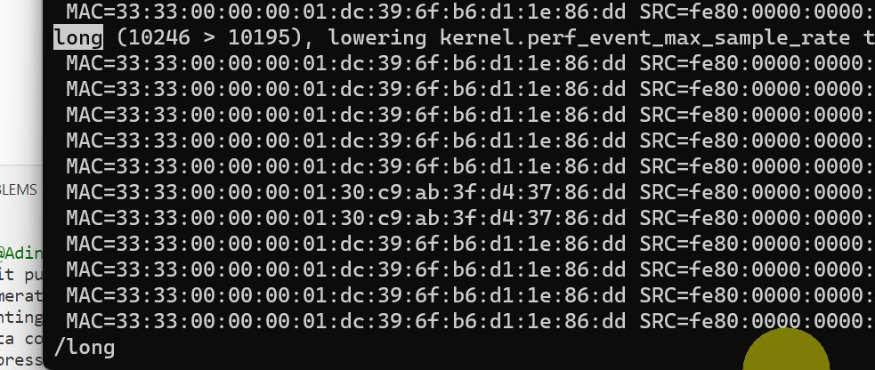
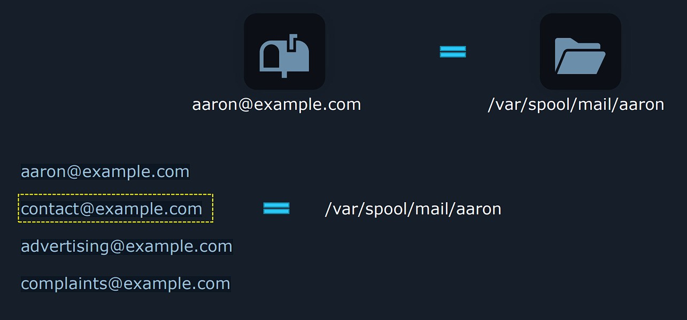
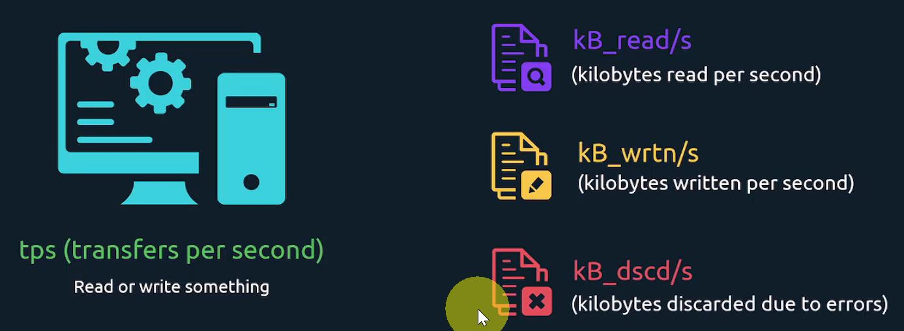

## Essentials commands

### &nbsp;&nbsp;&nbsp;&nbsp;&nbsp;&nbsp;&nbsp;&nbsp; <ins>Create and manage hard & soft links</ins>

#### 🔖 <ins>Hard links</ins>

They are used to allow access to a shared file for multiple users. 

```sh
# ln path_to_target_file path_to_link_file
$ ln /home/aaron/Pictures/family_dog.jpg /home/jane/Pictures/family_dog.jpg

# Aaron has a picture of a dog. Instead of copying the file to Jane Pictures folder, we can create a second hard link to allow Jane to access to data blocks of the dog picture.

# What will happen if Aaron deletes the file ? Jane can still access the file because the Inode still has 1 link. It is when it has 0 link the data itself will be erased from the disk.
$	stat /home/aaron/Pictures/family_dog.jpg

  File: /home/aaron/Pictures/family_dog.jpg
  Size: 520641          Blocks: 1024       IO Block: 4096   regular file
Device: fd00h/64768d    Inode: 12990       Links: 1   # HERE
Access: (0640/-rw-r-----)  Uid: (  107/  syslog)   Gid: (    4/     adm)
Access: 2023-07-26 18:11:27.743999845 +0000
Modify: 2023-07-29 10:26:45.995538868 +0000
Change: 2023-07-29 10:26:45.995538868 +0000
 Birth: 2023-07-26 18:11:27.743999845 +0000
```

<br/>

#### 🔖 <ins>Soft links</ins>
Compared to Hard links : 

* `Soft links` are nothing more than a file **pointing to a path**. In fact they represent **shortcuts**.
* They can point to **directories** (contrary to Hard links)
* They also can point to **remote file systems**
* If we change the destination folder name, the link will be broken (**highlighted in red**).

```sh
# Same command as Hard link but with additional -s argument
# Note the difference in 'path_to_link_file'
$ ln -s /home/aaron/Pictures/family_dog.jpg family_dog_shortcut.jpg
```
To get the absolute path from shortcut

```sh
$ readlink family_dog_shortcut.jpg

/home/aaron/Pictures/family_dog.jpg
```

&nbsp;

### &nbsp;&nbsp;&nbsp;&nbsp;&nbsp;&nbsp;&nbsp;&nbsp; <ins> List, set, and change standard file permissions</ins>

```sh
# Changing group
$ chgrp wheel family_dog.jpg
$ ls -l
-rw-r-----. 1 aaron wheel 49 Oct 27 14:41 family_dog.jpg

# List groups
$ groups
aaron wheel family

# Changing owner
$ sudo chown jane family_dog.jpg
$ ls -l
-rw-r-----. 1 jane family 49 Oct 27 14:41 family_dog.jpg

# Changing owner and group
$ sudo chown aaron:family family_dog.jpg
$ ls -l
-rw-r-----. 1 aaron family 49 Oct 27 14:41 family_dog.jpg
```

<br/>

#### 🔖 <ins>File & Directory permissions</ins>

Based on the following output :
* The 1st character shows what **type of entry** this is : *file*, *special file*, *directory*, etc.  
* The others represents the **Read**, **Write**, **Execute** permissions for owner, group, others.

```sh
$ ls -l
-rwxrwxrw-. 1 aaron family 49 Oct 27 14:41 family_dog.jpg
```

<div align="center">
  <table>
    <tr>
      <th>File Type</th>
      <th>Identifier</th>
    </tr>
    <tr>
      <td>DIRECTORY</td>
      <td align="center">d</td>
    </tr>
    <tr>
      <td>REGULAR FILE</td>
      <td align="center">-</td>
    </tr>
    <tr>
      <td>CHARACTER DEVICE </td>
      <td align="center">c</td>
    </tr>
    <tr>
      <td>LINK</td>
      <td align="center">l</td>
    </tr>
    <tr>
      <td>SOCKET FILE</td>
      <td align="center">s</td>
    </tr>
    <tr>
      <td>PIPE</td>
      <td align="center">p</td>
    </tr>
    <tr>
      <td>BLOCK DEVICE</td>
      <td align="center">b</td>
    </tr> 
  </table>
</div>

##### &nbsp;&nbsp;&nbsp;&nbsp;&nbsp;&nbsp;&nbsp;&nbsp;&nbsp;&nbsp; <ins>**Changing permissions**</ins>
```sh
$ ls -l                        # User, Group, Others
-r--rw----. 1 aaron family 49 Oct 27 14:41 family_dog.jpg

# Giving WRITE permission to owner with '+'
$ chmod u+w family_dog.jpg
$ ls -l
-rw-rw----. 1 aaron family 49 Oct 27 14:41 family_dog.jpg

# Removing READ permission to owner with '-'
$ chmod u-r family_dog.jpg
$ ls -l
--w-rw----. 1 aaron family 49 Oct 27 14:41 family_dog.jpg

# Setting exact permissions to group with '='
$ chmod g=rwx family_dog.jpg
$ ls -l
--w-rwx---. 1 aaron family 49 Oct 27 14:41 family_dog.jpg

$ chmod g= family_dog.jpg      # Make empty permissions
$ ls -l
--w-------. 1 aaron family 49 Oct 27 14:41 family_dog.jpg
```

##### &nbsp;&nbsp;&nbsp;&nbsp;&nbsp;&nbsp;&nbsp;&nbsp;&nbsp;&nbsp; <ins>**Chaining permissions**</ins>
```sh
# user: at least READ and WRITE
# group: only READ
# others: NO PERMISSIONS
$ chmod u+rw,g=r,o= family_dog.jpg
$ ls -l
-rw-r-----. 1 aaron family 49 Oct 27 14:41 family_dog.jpg
```

##### &nbsp;&nbsp;&nbsp;&nbsp;&nbsp;&nbsp;&nbsp;&nbsp;&nbsp;&nbsp;  <ins>**Octal permissions**</ins>
```sh
$ stat family_dog.jpg
File: family_dog.jpg
  Size: 49 Blocks: 8 IO Block: 4096 regular file
Device: fd00h/64768d Inode: 52946177 Links: 1
Access: (0640/-rw-r-----) Uid: ( 1000/ aaron) Gid: ( 10/ wheel)
```

&nbsp;

###  &nbsp;&nbsp;&nbsp;&nbsp;&nbsp;&nbsp;&nbsp;&nbsp; <ins>SUID, SGID, and sticky bit</ins>

#### 🔖 <ins>SUID (Set User ID bit)</ins>

When setting this bit on a file : it means whenever this file is executed, it is going to be executed as **the owner of the file** (instead of the ID of the person running that file)

```sh
$   man chmod

DESCRIPTION

       ...

       A numeric mode is from one to four octal digits (0-7), derived by adding up the bits with values 4,
       2, and 1.  Omitted digits are assumed to be leading zeros.  The first digit selects the set user ID
       (4) and set group ID (2) and restricted deletion  or  sticky  (1)  attributes.   The  second  digit
       selects permissions for the user who owns the file: read (4), write (2), and execute (1); the third
       selects permissions for other users in the file's group, with the same values; and the  fourth  for
       other users not in the file's group, with the same values.


$ ls -l suidfile
-rw-rw-r--. 1 aaron aaron 0 Apr 26 14:41 suidfile

# Before using the 3 digit permissions in octal format, we're goign to add a 4th digit, our SUID
$ chmod 4664 suidfile

# We can see a capital S replacing the x bit :  SUID is enabled for this file
# If anybody else were to be able to execute this file, IT WILL BE as the user Aaron
$ ls -l suidfile
-rwSrw-r--. 1 aaron aaron 0 Apr 26 15:00 suidfile

# Now we add the EXECUTE permission to user
$ chmod 4764 suidfile

# When you see capital S, SUID is enabled but there is NO EXECUTE permissions
# When you see lowercase s, SUID and EXECUTE are both enabled.

$ ls -l suidfile
-rwsrw-r--. 1 aaron aaron 0 Apr 26 15:19 suidfile
```

<br/>

#### 🔖 <ins>SGID</ins>
Pretty much the same as the SUID, only it is going to apply for the group on a file.
```sh
$ ls -l sgidfile
-rwsrw-r--. 1 aaron aaron 0 Apr 26 14:41 sgidfile

# We're using the 2 instead of the 4 as the leading digit
$ chmod 2664 sgidfile
$ ls -l sgidfile
-rw-rwSr--. 1 aaron aaron 0 Apr 26 15:00 sgidfile

$ chmod 2674 sgidfile
$ ls -l sgidfile
-rw-rwsr--. 1 aaron aaron 0 Apr 26 15:19 sgidfile
```
```sh
# Creating entry with BOTH leading bits (on user & group), using 6
$ chmod 6664 both
$ ls -l both
-rwSrwSr--. 1 aaron aaron 0 Apr 26 17:21 both
```

<br/>

#### 🔖 <ins>Sticky bit</ins>
It is usually set on directories that **are shared between people** and it's going to **only allow the owner of a file** inside to be able to remove the file.
```sh
$ mkdir stickydir
$ ls -ld stickydir
drwxrwxr-x. 2 aaron aaron 6 Apr 26 20:54 stickydir

# Using leading bit 1
# $ chmod +t stickydir
$ chmod 1777 stickydir

# Sticky bit and EXECUTE are both set, so we have a lowercase t
$ ls -ld stickydir
drwxrwxrwt. 2 aaron aaron 6 Apr 26 20:59 stickydir

# With Uppercase T, execute is not enabled
$ chmod 1666 stickydir
$ ls -ld stickydir
drw-rw-rwT. 2 aaron aaron 6 Apr 26 21:24 stickydir
```

&nbsp;

###  &nbsp;&nbsp;&nbsp;&nbsp;&nbsp;&nbsp;&nbsp;&nbsp; <ins>Search for files</ins>

```sh
# Find JPG files
$ find /usr/share/ -name '*.jpg'
1.jpg 2.jpg 3.jpg

# Find files larger then 10 Mb / 10 b / 10 kb / 10 Gb
$ find /lib64/ -size +10M           # +10c / +10k / +10G
large-file.txt

# Find files that have been modified in the last minute
$ find /dev/ -mmin -1

# Find files that have been modified more than 5 minutes ago
$ find /dev/ -mmin +5

# Find files that have been modified past 24h periods (betwwen 24 and 48h)
$ find /dev/ -mtime 2

# Find without sensitive case
$ find -iname felix

# Find files starting by the letter f
$ find -name "f*"

# Finding content having the 4 leading digit. We don't care about permissions -> 000
$ find . -perm /4000
```
```sh
# Permissions: 664 = u+rw,g+rw,o+r
$ find –perm 664       # find files with exactly 664 permissions
$ find –perm u=rw,g=rw,o=r 
$ find –perm -664      # find files with at least 664 permissions
$ find –perm –u=rw,g=rw,o=r 
$ find -perm /664      # find files with any of these permissions
$ find –perm /u=rw,g=rw,o=r 
```

<br/>

Linux has a thing called `Change Time` for files. But it is different from `Modified Time` (File creation or edition).

* `Modified Time` refers the time when contents have been modified
* `Change Time` refers to the time when metadata has been changed (data about the file, like permissions).
```sh
# Find files having changed time in the last 5 minutes (when someone has changed permissions)
$ find -cmin -5
```

We can also use search expressions
```sh
$ find -name "f*" -size 512k        # AND operator
$ find -name "f*" -o -size 512k     # OR operator

$ find –not -name "f*"              # NOT operator
$ find \! -name "f*"                # alternate NOT operator
```

&nbsp;

###  &nbsp;&nbsp;&nbsp;&nbsp;&nbsp;&nbsp;&nbsp;&nbsp; <ins>Compare and manipulate file content</ins>

#### 🔖 <ins>Manipulating file</ins>

##### &nbsp;&nbsp;&nbsp;&nbsp;&nbsp;&nbsp;&nbsp;&nbsp;&nbsp;&nbsp; <ins>**Replace content**</ins>

- We can use `sed` command to **preview** what changes would be done **without changing** the file

```sh
# userinfo.txt, a file with mispelled Canada
$ cat userinfo.txt

ravi montreal canda  39484859 canda
mary ottawa   canda  39384940 canda


# Into single quotes, we have :
#   - s for substitute command (search and replace)
#   - g for global search (to replace all occurences)
$ sed 's/canda/canada/g' userinfo.txt

ravi montreal canada  39484859 canada
mary ottawa   canada  39384940 canada


# Without 'g' argument, only 1st occurence is changed
$ sed 's/canda/canada/' userinfo.txt

ravi montreal canada  39484859 canda
mary ottawa   canada  39384940 canda
```
- To edit directly in the file, use the `-i` argument (--in-place)
```sh
$ sed –i 's/canda/canada/g' userinfo.txt
```

<br/>

##### &nbsp;&nbsp;&nbsp;&nbsp;&nbsp;&nbsp;&nbsp;&nbsp;&nbsp;&nbsp; <ins>**Extract content**</ins>

- `cut` command will extract ony the parts we need from a file. **' '** is the delimiter and **-f** the field we want to extract.

```sh
$ cat userinfo.txt

ravi montreal canda  39484859 canda
mary ottawa   canda  39384940 canda


# To get the 1st column. -f 1 means the 1swt word we want to extract on each line.
$ cut –d ' ' –f 1 userinfo.txt
ravi
mary


# To get the 3rd column
$ cut –d ',' –f 3 userinfo.txt
canda
canda
```
- `uniq` command will get us unique entries from a file.
```sh
# We have the following column
usa
canada
usa
canada
canada


# uniq alone will find the 2 last canada are adjacent so it removes the last line
$ uniq countries.txt
usa
canada
usa
canada


# The solution to get unique entires is to sort the list to get duplicates adjacent before using uniq
$ sort countries.txt
canada
canada
canada
usa
usa

$ sort countries.txt | uniq
canada
usa
```

<br/>

#### 🔖 <ins>Comparing file</ins>
- Using `diff` tool will allow us to see the differences between files.

```sh
# Imagine the following contents

# file 1                            # file 2
Only exists in file 1               Only exists in file 2
Identical line 2                    Identical line 2
Identical line 3                    Identical line 3
Only exists in file 1               Only exists in file 2


# 1c1 tells us line 1 from file 1 is changed in line 1 on file 2
# 4c4 tells us line 4 from file 1 is changed in line 4 on file 2
$ diff file1 file2
1c1
< Only exists in file 1
---
> Only exists in file 2
4c4
< Only exists in file 1
---
> Only exists in file 2
```

- In **LARGE** files, we might have no idea where these lines are situated : **`-c`** will give us a bit of context and see what text is around these areas where the lines are different

```sh
$ diff -c file1 file2
*** file1       2023-07-30 14:46:15.250051872 +0000
--- file2       2023-07-30 14:46:28.329941301 +0000
***************
*** 1,4 ****
! Only exists in file 1
  Identical line 2
  Identical line 3
! Only exists in file 1
--- 1,4 ----
! Only exists in file 2
  Identical line 2
  Identical line 3
! Only exists in file 2
```

- Doing a side by side comparison : use **`-y`** option

```sh
$ diff -y file1 file2

Only exists in file 1                                         | Only exists in file 2
Identical line 2                                                Identical line 2
Identical line 3                                                Identical line 3
Only exists in file 1                                         | Only exists in file 2
```

&nbsp;

###  &nbsp;&nbsp;&nbsp;&nbsp;&nbsp;&nbsp;&nbsp;&nbsp; <ins>Pagers</ins>
`Pagers` are programs that allow us to open multiple pages of text and navigate through them while on terminal. There are 2 Pagers :

- `less`
- `more`

```sh
$ less /var/log/kern.log
```
<!--- Center image --->
<div align="center">
  <a href="assets/Pagers_1.jpg" target="_blank">
    
  </a>
</div>
<div align="center">
  <i>To search a key word, type <b>/</b>, followed by your key word (in the example, we look after <b>long</b>)</i>
  <br/>
  <i>To go to the next instance, type <b>n</b></i>
    <br/>
  <i>To go to the previous instance, type <b>N</b></i>
</div>

<br/>

```sh
# We move by page, using Space Bar
$ more /var/log/kern.log
```


&nbsp;

###  &nbsp;&nbsp;&nbsp;&nbsp;&nbsp;&nbsp;&nbsp;&nbsp; <ins>Search text in file with Grep</ins>
```sh
# Finding words having 'ubuntu' or 'Ubuntu'
$  grep -i 'Ubuntu' /var/log/kern.log               # -i for case insensitive

ld (GNU Binutils for Ubuntu) 2.38) #85-Ubuntu SMP Fri Jul 7 15:25:09 UTC 2023 (Ubuntu 5.15.0-78.85-generic 5.15.99)
Jul 30 13:32:59 ubuntu kernel: [  137.547769] CPU: 0 PID: 195 Comm: systemd-udevd 


# Search into all files under a directory and subdirectories
$  grep -r 'Ubuntu' /var/log/
$  grep -ir 'Ubuntu' /var/log/


# Reverse search
$  grep -vi 'Ubuntu' /var/log/kern.log
```

<br/>

#### 🔖 <ins>Using Regex (Regular Expression)</ins>

> https://www.redswitches.com/blog/grep-regex/

Regular expressions are built with the help of operators :

- **Basic Regular Expression**
  - **`.`** replaces any character
  -  **`^`** matches the start of the string
  - **`$`** matches the end of the string
  - **`*`** matches zero or more times the preceding character
  - **`+`** matches 1 or more times the preceding character
  - **`?`** matches 0 or 1 times the preceding character
  - **`\`** Escape character, represents special characters
  - **`|`** is used as an OR operator

<br/>

- **Bracket Expression**
  - **`()`** Groups regular expressions
  - **`{}`** - Curly braces are used for quantifiers to specify the number of occurrences.
  - **`[]`** Matches any character within the brackets
  - **`[^]`** - **Negation**. For example, [^0-9] matches any character without a digit.


<br/>

- **Backslash Expression**
  - **`\b`** : Match a word boundary  
  - **`\>`** : Match an empty string at the end of a word.
  - **`\<`** : Match an empty string at the beginning of a word.
  - **`\s`** : Match a space.
  - **`\w`** : Match a word.

```sh
# Find words ending with  (KEY_WORD$ or KEY_WORD\>)
$ grep '7$' /etc/login.defs
$ grep '7\>' /etc/login.defs

PASS_WARN_AGE   7
UMASK           077


# Find words beginning with  (^KEY_WORD)
$ grep '^U' /etc/login.defs

UID_MIN                  1000
UID_MAX                 60000
UMASK           077
USERGROUPS_ENAB yes


# +: Match The Previous Element (0) one Or more Times  (Don't forget escaped character \)
# ===================================================
$ grep -r '0\+' /etc/login.defs

PASS_MIN_DAYS   0
UID_MIN                  1000
UID_MAX                 60000
SYS_UID_MIN               201
UMASK           077
```
```sh
# Finding text beginning with / ,  has 0 or more occurences for any characters (due to .) , and ends with a /
# *: Match The Previous Element 0 Or More Times
$ grep -r '/.*/' /etc/

/etc/man_db.conf:# before /usr/man.
/etc/man_db.conf:MANDB_MAP /usr/share/man
/var/cache/man
```

<br/>

#### 🔖 <ins>Extended Regular Expressions</ins>

```sh
# Finding all strings that contain at least three zeros  -> 0{3,}
$ egrep -r '0{3,}' /etc/login.defs
UID_MIN                  1000
UID_MAX                 60000


# Finding all strings that contain 1 , followed by, at least three zeros  -> 10{3,}
$ egrep -r '10{3,}' /home/cento/toto.log
UID_MIN                  1000
GID_MIN                  1000


$ egrep -r '1/0{3,}' /home/cento/toto.log
UID_TOTO_TEST            1/000


# Finding all strings matching EXACTLY 6 followed by three zeros  -> 60{3}
$ egrep -r '60{3}' /home/cento/toto.log
UID_MAX_TOTO_TEST        6000
GID_MAX                 60000


$ egrep -r '60{3}' /home/cento/toto.log
UID_MAX_TOTO_TEST        6000
GID_MAX                 60000


# Finding all strings matching EXACTLY 6, terminating by three zeros  -> 60{3}$
$ egrep -r '60{3}$' /home/cento/toto.log
UID_MAX_TOTO_TEST        6000


# Finding all strings that having 3 or 4 zeros  -> 0{3,4}
$  egrep -r '0{3,4}' /home/cento/toto.log
UID_MIN                  1000
UID_TOTO_TEST            1/000
UID_MAX                 60000
```
```sh
# Finding all strings matching 'disable' or 'disabled'  -> last 'd' is optional
$ egrep -r 'disabled?' /etc/
/etc/vmware-tools/tools.conf.example:# Set to true to disable the 
/etc/vmware-tools/tools.conf.example:#disabled=false

# Match one thing or the other  -> |
$ egrep -r 'enabled|disable?' /etc/
/etc/dleyna-server-service.conf:# If netf is enabled but the list is 
empty, it behaves as disabled.
```
```sh
# Matching any one lowercase from a to z  ->  [a-z]
$ egrep -r 'enabled|disable?' /etc/
/etc/dleyna-server-service.conf:# If netf is enabled but the list is 
empty, it behaves as disabled.

# Words having cat or cut
$ egrep -r 'c[au]t' /etc/
/etc/man_db.conf:# NOCACHE keeps man from creating cat pages.
/etc/nanorc:## Use cut-from-cursor-to-end-of-line by default.
```

```sh
# Only /dev/tty0 will be highlighted. p0 will be ignored
$ egrep -r '/dev/[a-z]*[0-9]?' /etc/
/etc/sane.d/dc25.conf:#port=/dev/tty0p0

# Searching after /dev, some letters and a digit at the end.
# After that the same thing can repet 0, 1 or many more time : there can be other sequences of letters followed by 1 digit.
#
# /dev/tty0 would 1st match (-> [a-z]*[0-9]?) and then p0 would be added to this match by that repetition
#
# What makes it look for something to exist 0 or more times ? Thatis going to be the *
# But adding the * at the end would apply to the previous element only -> NOT GOOD
#
# Solution : Put the expression between ()   ->   ([a-z]*[0-9]?)*
$ egrep -r '/dev/([a-z]*[0-9]?)*' /etc/
/etc/sane.d/dc240.conf:port=/dev/ttyS0
/etc/sane.d/dc25.conf:#port=/dev/tty0p0
/etc/sane.d/dc25.conf:#port=/dev/ttyd1
/etc/sane.d/coolscan3.conf:#scsi:/dev/scanner
```
```sh
# Looking for lowercase or Uppercase letters with the | operator
$ egrep -r egrep -r '/dev/(([a-z]|[A-Z])*[0-9]?)*' /etc/
/etc/sane.d/dc240.conf:port=/dev/ttyS0
/etc/sane.d/dc240.conf:#port=/dev/ttyd1
/etc/sane.d/dc240.conf:#port=/dev/term                         #/a
/etc/sane.d/u12.conf:# device /dev/usbscanner

# Looking for Http but excludes Https
# http[^s]  -> ^ will exclude s
$ egrep –r 'http[^s]' /etc/

# After a /, there should not be any lowercase letter
$ egrep –r '/[^a-z]' /etc/
```

&nbsp;

###  &nbsp;&nbsp;&nbsp;&nbsp;&nbsp;&nbsp;&nbsp;&nbsp; <ins>Archive, backup, compress, unpack, and uncompress files</ins>

For backing up files, 3 steps :
1. Archive (packing all files and directories into 1 single file)  
  ➡️  `backup.tar` (tar for **ta**pe **ar**chive)
2. Compress                                                        
  ➡️  `backup.tar.gz`
3. Backup (where you would copy the compressed file to a remote location)    

<br/>

#### 🔖 <ins>Displaying archive content</ins>

```sh
# t for listing
# f for using archive file or device ARCHIVE
$ tar -tf archive.tar
```

<br/>

#### 🔖 <ins>Packing files and Directories</ins>

```sh
# c for creating
# r for appending
$ tar -cf archive.tar file1
$ tar -rf archive.tar file2


# Used for unpacking later directly in current working directory
$ tar --create –-file archive.tar Pictures/
Pictures/
Pictures/family_dog.jpg

# Used for unpacking later in the origin location
$ tar --create –-file archive.tar /home/aaron/Pictures/
/home/aaron/Pictures/
/home/aaron/Pictures/family_dog.jpg
```

<br/>

#### 🔖 <ins>Extracting files</ins>

```sh
# When unpacking and decompressing, though, we don't have to tell tar what decompression utility to use
$ tar -xf archive.tar
$ tar -xf archive.tar.gz


# Extract to other directory
$ tar -xf archive.tar.gz –C /tmp/
```

<br/>

#### 🔖 <ins>Compressing files</ins>

> ⚠️ **`f`** option should be the last

```sh
# j for compressing archive through bzip2      -->      -cjf , NOT -cfj !!!!!!!!!!!!!!!
$ sudo tar -cjf /opt/archive.tar.bz2 /home/bob/databases/

# z for compressing archive through gzip
$ sudo tar -czf /opt/archive.tar.gz /home/bob/databases/

# J for compressing archive through xz
$ sudo tar -cJf /opt/archive.tar.xz /home/bob/databases/


# Better option : tar has an auto compressed option to automatically figure out what compression utility to use based on the file name extension we choose for our archive.
$ tar -caf archive.xz file1
```

<br/>

<ins>For **zip** archives, use **`zip`** utility :</ins>

```sh
$ zip archive.zip file1
$ zip –r archive.zip Pictures/

$ unzip archive.zip
Archive: archive.zip
replace file1? [y]es, [n]o, [A]ll, [N]one, [r]ename: 
```

&nbsp;

###  &nbsp;&nbsp;&nbsp;&nbsp;&nbsp;&nbsp;&nbsp;&nbsp; <ins>Backup files to a Remote System</ins>

A popular tool to back up data is `rsync` (remote synchronization). 

It can keep some directories on server 1 synchronized with some directories on server 2 by copying data through a network connection.

```sh
# rsync SOURCE_REPO REMOTE_REPO 

# '-a' for archive, to synchronize subdirectories, permissions, modification times
# If you run this command a 2nd time, rsync will only copy data that has changed
$ rsync –a Pictures/ aaron@9.9.9.9:/home/aaron/Pictures/
$ rsync –a aaron@9.9.9.9:/home/aaron/Pictures/ Pictures/
```

&nbsp;

###  &nbsp;&nbsp;&nbsp;&nbsp;&nbsp;&nbsp;&nbsp;&nbsp; <ins>Input and Output redirection</ins>

#### 🔖 <ins>Output redirection (e.g. >, >>, |, 2>, 2>&1)</ins>

```sh
# Save all errors while OVERWRITING with >
$  find library/ -type d 2> errors.out
$  cat  errors.out

find: ‘library/dir3848’: Permission denied


# Save stdout while APPENDING with >>
$  find library/ -type d >> standard.out
$  cat standard.out

library/dir9896


# Save both stderr and stdout
$  find library/ -type d > all.out 2>&1
$  cat all.out

find: ‘library/dir8868’: Permission denied
library/dir8872
```

<br/>

#### 🔖 <ins>Input redirection</ins>

```sh
# With 'sendmail' command, we don't have an option to use an external file for writing content mail 
$ sort file.txt
$ sendemail someone@example.com

Hi Someone,
How are you today?
...
Talk to you soon
Bye

# We can resolve our issue with this trick  -->  the <
$ sendemail someone@example.com < emailcontent.txt 


# Wit <<EOF we signal the input we want to pass ends before the last line (where we type EOF)
$ sort <<EOF
> 6
> 3
> 2
> 5
> 1
> 4
> EOF              < ---- We will process to the sorting before EOF

1
2
3
4
5
6


# 1+2+3+4 is the input  -->  << will append as a string. <<< do the addition
$ bc <<<1+2+3+4
10
```

&nbsp;
&nbsp;
&nbsp;

## Operation of Running Systems

###  &nbsp;&nbsp;&nbsp;&nbsp;&nbsp;&nbsp;&nbsp;&nbsp; <ins>Boot, reboot, and shutdown a system safely</ins>

#### 🔖 <ins>Scheduling</ins>

➡️ <ins> <span style="color:#FF8A8A">**NOT RECOMMENDED** (unless absolutelly necessary)</span></ins> : we can force close all programs and reboot in a more abrupt way.


```sh
# If neither of those is working, we can pass force twice
$ sudo systemctl reboot --force --force           # It is like rebooting instanly
$ sudo systemctl poweroff --force --force         # It is like unplugging the computer
```

```sh
$ sudo shutdown 02:00         # In 24h format, between 00:00 and 23:59 

# To shutdown a certain number of minutes later  --> +x
$ sudo shutdown +15

# To reboot  --> -r
$ sudo shutdown -r 02:00
$ sudo shutdown -r +15

# To set the wall message : for warning logged in users.
$ sudo shutdown -r +1 'Scheduled restart to do an offline-backup of our database'
```

&nbsp;

###  &nbsp;&nbsp;&nbsp;&nbsp;&nbsp;&nbsp;&nbsp;&nbsp; <ins>Boot or change system into different operating modes</ins>

```sh
# graphical.target -> The OS is configured to boot into a graphical environment
# By reading the instructions inside this target file, the OS knows :
#   - what programs it needs to launch 
#   - what order to boot into the target
$ systemctl get-default      
graphical.target
```
- If we don't need to load up on graphical user interface, we can change the default boot target **and after we restart the OS**.
```sh
# We can see it removes the old default target file and creates a new symlink.
#
# The multi-user target is something that will make Linux boot normally with all of its Daemons, Databases, servers, utilities and whatever we might have configured. Only the graphical interface is going to be skipped.
#
# Everything will be text-based.
# It is called like this because while Linux is booting in this mode, multiple users can log in and use the system at the same time.
$ sudo systemctl set-default multi-user.target      
Created symlink /etc/systemd/system/default.target → /lib/systemd/system/multi-user.target.
```

- If we want to change to a different target : imagine we want to get back to the graphical desktop because we need to use a 3D modeling application for 1 hour, <span style="color:#FF8A8A"><ins>**instead of changing the default boot**</ins></span>.

<br/>

➡️ We use the `isolate` directive.

```sh
$ sudo systemctl isolate graphical.target
```

- Other useful targets

```sh
# Useful for debugging in case the program is loaded by the other targets for making your system unstable.
$ sudo systemctl isolate emergency.target

# We will be dropped into a root shell. We can type commands as a system administrator : DB backups (while db not online), fix system settings and so on. 
$ sudo systemctl isolate rescue.target
```

&nbsp;

###  &nbsp;&nbsp;&nbsp;&nbsp;&nbsp;&nbsp;&nbsp;&nbsp; 📽️ <ins>Install, configure and troubleshoot bootloaders</ins>

#### 🔖 <ins>What if OS is not booting at all ?</ins>
1. You download an iso file and you boot on it
2. Depending of the Linux distribution, you need to select `Troubleshooting` to load the **rescue image.**
3. You select the option to mount this image on `/mnt/sysroot`
4. In the tutorial, you type in the shell the command to make `/mnt/sysroot`, the root of your active system :
    ```sh
    $ chroot /mnt/sysroot
    ```
5. We will generate a BIOS configuration file :
    ```sh
    # For BIOS
    $ grub2-mkconfig -o /boot/grub2/grub.cfg

    # For EFI (on CentOS). The -o option had directed to write the file to a specific location.
    $ grub2-mkconfig -o /boot/efi/EFI/centos/grub.cfg
    ```
6. 
    - <ins>**BIOS**</ins> : 
    
    <br/>
    
    When the computer boots through BIOS mode, it looks for the bootloader at the very beginning of the disk : **we need to place the GRUB file in the 1st disk's sectors**. 

    First we need to know which disk to install the GRUB. We will display all block devices.
    ```sh
    # sda1 for PHYSICAL disk / vda1 for VIRTUAL disk
    $ lsblk
    NAME          MAJ:MIN RM SIZE  RO TYPE MOUNTPOINT
    sda             8:0    0 20G    0 disk
    ├─sda1          8:1    0  1G    0 part /boot         # Partition where we find GRUB, configuration files
    ├─sda2          8:2    0  2G    0 part [SWAP]
    └─sda3          8:3    0 17G    0 part /             # Our file system
    ```

    GRUB file should be installed on the first sector of disk `sda`.
    ```sh
    # /dev is a special device file pointing to the 1st virtual disk (in the example, the 1st physical disk in on virtual machine)
    $ grub2-install /dev/sda
    ```

    <br/>

    - <ins>**EFI**</ins> : 
    
    <br/>

    Don't look for the bootloader on 1st sectors of disk. Let's look for the bootloader in a file **on a special boot partition**. We can use this command to automatically place the bootloader files in their proper location.
    ```sh
    # dnf is the package manaer for CentOS. For another Linux distribution the command could differ
    $ dnf reinstall grub2-efi grub2-efi-modules shim
    ```

    <br/>

7. We can exit to change root environment and exit again to reboot the machine.
    ```sh
    $ exit
    $ exit
    ```

8. Once rebooted, without Live CD, we can arrive at a console terminal. If we want to make some configuration changes to the settings for Grub bootloader, we can edit a particular file :
    ```sh
    $ sudo vim /etc/default/grub

    >

    # If you change this file, run 'update-grub' afterwards to update
    # /boot/grub/grub.cfg.
    # For full documentation of the options in this file, see:
    #   info -f grub -n 'Simple configuration'

    GRUB_DEFAULT=0
    GRUB_TIMEOUT_STYLE=hidden
    GRUB_TIMEOUT=5                  # OS GRUB is displayed for 5 seconds
    GRUB_DISTRIBUTOR=`lsb_release -i -s 2> /dev/null || echo Debian`
    GRUB_CMDLINE_LINUX_DEFAULT=""   
    GRUB_CMDLINE_LINUX=""           # We can specify commands for changing kernel behaviour, disable things. 

    # Regenerate the file used to be read by our Bootloader, with our new settings
    $ grub2-mkconfig -o /boot/grub2/grub.cfg
    ```

&nbsp;

###  &nbsp;&nbsp;&nbsp;&nbsp;&nbsp;&nbsp;&nbsp;&nbsp; <ins>Use scripting to automate system maintenance tasks</ins>

When writing a `script.sh`, we have to add this sentence at **the 1st line to make our script work**. `#!` is called a **shebang**, followed by the full path of the command interpreter :

```sh
#!/bin/bash

# If /tmp/archive.tar.gz already exists
if test -f /tmp/archive.tar.gz; then
  mv /tmp/archive.tar.gz /tmp/archive.tar.gz.OLD
  tar acf /tmp/archive.tar.gz /etc/dnf/
else
  tar acf /tmp/archive.tar.gz /etc/dnf/
fi
```

To be able to run the script, we **first need to make it executable**, by setting the permissions.

```sh
# Only the owner can execute the script
$ chmod u+x script.sh

# Everyone can execute the script
$ chmod +x script.sh 
```

&nbsp;

###  &nbsp;&nbsp;&nbsp;&nbsp;&nbsp;&nbsp;&nbsp;&nbsp; <ins>Manage the startup process and services (In Services Configuration)</ins>

```sh
# If we want to edit this service file, we can run this command
$ sudo systemctl edit --full sshd.service

# If we want to cancel our edits and return the service file to its factory default settings 
$ sudo systemctl revert sshd.service
```
```sh
# To see the status (if program has started, if it has encountered any errors)
$ sudo systemctl status sshd.service

# To stop a service
$ sudo systemctl stop sshd.service

# To start a service
$ sudo systemctl start sshd.service
```

### ⚠️ WARNING :

```sh
# To restart a service
$ sudo systemctl restart sshd.service

# If some users are actively using that program, restart may interrupt their work temporarily.
# There is a MORE gentle way to reload a program settings without completely closing and reopenening the application.
$ sudo systemctl reload sshd.service


# It's worth noting that not all applications support being reloaded with the `reload` option but we have a command that can automatically try a graceful reload first, and then a restart if reload is not supported by the app.
$ sudo systemctl reload-or-restart sshd.service
```

<br/>

```sh
# If we want to diable ssh logins completely, we could prevent the SSH Daemon from automatically starting up at boot time.
$ sudo systemctl disable sshd.service

# Check if service enabled
$ sudo systemctl is-enabled sshd.service
disabled


# Enable and start / disable and stop service
$ sudo systemctl enable --now sshd.service
$ sudo systemctl disable --now sshd.service
```

### ⚠️ WARNING :
To REALLY avoid a service to run (**a service 1 can still re-enable a service 2, even if disabled**), use the `mask` option.

If we need to use the service again, please do not forget to `unmask`

```sh
$ sudo systemctl mask atd.service

# Masked services can not start
$ sudo systemctl enable atd.service
Failed to enable unit: Unit file /etc/systemd/system/atd.service is masked.
$ sudo systemctl start atd.service
Failed to start atd.service: Unit atd.service is masked.

# Unmask
$ sudo systemctl unmask atd.service
```

<br/>

```sh
# To list all services
$ sudo systemctl list-units --type service --all
```

&nbsp;

###  &nbsp;&nbsp;&nbsp;&nbsp;&nbsp;&nbsp;&nbsp;&nbsp; 📽️ <ins>Create systemd Services ✨</ins>

In a  nutshell, the **service** manages the entire lifecycle of an application according to instructions we add to our **service file**.

##### &nbsp;&nbsp;&nbsp;&nbsp;&nbsp;&nbsp;&nbsp;&nbsp;&nbsp;&nbsp; <ins>**Service file**</ins>

```sh
# Let's create our service file
# systemd-cat is an utility that receives the message and logs it
# We're simulating tha app has crashed after 5 seconds
$ vi /usr/local/bin/myapp.sh

#!/bin/sh
echo "MyApp started" | systemd-cat -t MyApp -p info
sleep 5
echo "MyApp crashed" | systemd-cat -t MyApp -p err
```
```sh
# Make the script executable for all
$ chmod a+x /usr/local/bin/myapp.sh
```

<br/>

##### &nbsp;&nbsp;&nbsp;&nbsp;&nbsp;&nbsp;&nbsp;&nbsp;&nbsp;&nbsp; <ins>**Service**</ins>

We will create a service by using SSH daemon service as a **template**.

```sh
$ cp /lib/systemd/system/sshd.service /etc/systemd/system/myapp.service
```
```sh
# Creating the service unit file
$ vi /etc/systemd/system/myapp.service


[Unit]
Description=My Application
# This tells systemd when it should run the service unit.
After=network.target auditd.service                           

[Service]
# Example we could run a program that scan DBs for errors, before starting the DB server itself.
ExecStartPre=echo "Systemd is preparing to startMyApp"        
ExecStart=/usr/local/bin/myapp.sh

# This specifies what should be executed when an administrator runs the Systemctl reload command.
# ExecReload=/bin/kill -HUP $MAINPID

# It specifies how this application should be stopped when running Systemctl stop. Here we tell to only kill the main process and not any of the child processes.                    
KillMode=process                                             
Restart=always
RestartSec=5s
# If 'notify', it tells systemd that the application will notify it when it is finished starting up
Type=simple						      

[Install]
WantedBy=multi-user.target
```

<br/>

The first thing that we have to do is whenever we add or remove or edit the service file, we have to reload the systemd daemon :

```sh
$ systemctl daemon-reload
```

Then we can start our new created service :

```sh
$ systemctl start myapp.service
```

To see the logs :

```sh
$ journalctl -f

-- Logs begin at Sun 2023-10-15 11:00:28 CEST. --
Oct 15 13:00:01 localhost.localdomain systemd[1]: Created slice User Slice of root.
Oct 15 13:00:01 localhost.localdomain systemd[1]: Started Session 16 of user root.
Oct 15 13:00:01 localhost.localdomain CROND[3835]: (root) CMD (/usr/lib64/sa/sa1 1 1)
Oct 15 13:00:01 localhost.localdomain systemd[1]: Removed slice User Slice of root.
Oct 15 13:00:02 localhost.localdomain MyApp[3844]: MyApp crashed
Oct 15 13:00:07 localhost.localdomain systemd[1]: myapp.service holdoff time over, scheduling restart.
Oct 15 13:00:07 localhost.localdomain systemd[1]: Stopped My Application.
Oct 15 13:00:07 localhost.localdomain systemd[1]: Started My Application.
Oct 15 13:00:07 localhost.localdomain MyApp[3847]: MyApp started
Oct 15 13:00:12 localhost.localdomain MyApp[3851]: MyApp crashed
```

&nbsp;

###  &nbsp;&nbsp;&nbsp;&nbsp;&nbsp;&nbsp;&nbsp;&nbsp; 📽️ <ins>Diagnose and manage processes</ins>

The command to inspect processes is `ps`. It only shows us the state of processes at the exact moment that we execute the command.


```sh
# Show all in user format
# TIME represents CPU time. 1s represents 100% of CPU core use.
# If we use 50% for 10s, it will display 5s of TIME.
$ ps aux

USER         PID %CPU %MEM    VSZ   RSS TTY      STAT START   TIME COMMAND
root        1531  0.0  0.2  17196 10876 ?        Ss   17:08   0:00 sshd: ubuntu [priv]
ubuntu      1577  0.0  0.2  17196  7980 ?        S    17:08   0:00 sshd: ubuntu@pts/0


# Display process of PID 1
$ ps u 1

USER         PID %CPU %MEM    VSZ   RSS TTY      STAT START   TIME COMMAND
root           1  0.1  0.3 167584 13132 ?        Ss   16:58   0:05 /sbin/init


# Display processes started by a specific user (ubuntu in our case)
$ ps u -U ubuntu

USER         PID %CPU %MEM    VSZ   RSS TTY      STAT START   TIME COMMAND
ubuntu      1515  0.0  0.1 170496  5000 ?        S    17:08   0:00 (sd-pam)
ubuntu      1521  0.0  0.1   8744  5352 tty1     S+   17:08   0:00 -bash


# Display processes containing the word syslog in its name
$ pgrep -a syslog

943 /usr/sbin/rsyslogd -n -iNONE
```

<br/>

#### 🔖 <ins>Process niceness</ins>

It is a concept to define **priority** for processes. Its value is between -20 and 19 (lower = less nice and means **higher priority** for the process).

> Process A = -19 and Process B = 20. Both needs all CPU resource 
>
> ➡️ Process A might use CPU 90% of time, while Process B will get very little CPU time only when there's something left to spare.

```sh
# Set nice value (NEGATIVE only allowed with root user)
$ sudo nice -n -12 bash
$ nice -n 11 bash


# Set nice value to existing process, with affiliated PID value
$ sudo renice 11 1759     


# Display in long format : NI goes from 0 to 11
$ ps lax
$ ps l

F   UID     PID    PPID PRI  NI    VSZ   RSS WCHAN  STAT TTY        TIME COMMAND
4  1000    1521     965  20   0   8744  5352 do_sel S+   tty1       0:00 -bash
0  1000    1760    1578  31  11   8660  5268 do_wai SN   pts/0      0:00 bash
0  1000    1766    1760  31  11  10068  1592 -      RN+  pts/0      0:00 ps l
```

<br/>

#### 🔖 <ins>Parent-Child processes</ins>

```sh
# Display relationship between parent-child processes (including CPU usage)
$ ps fax

USER         PID %CPU %MEM    VSZ   RSS TTY      STAT START   TIME COMMAND
root         977  0.0  0.2  15420  9280 ?        Ss   16:59   0:00 sshd: /usr/sbin/sshd -D [listener] 0 of 10-100 startups
root        1531  0.0  0.2  17196 10876 ?        Ss   17:08   0:00  \_ sshd: ubuntu [priv]
ubuntu      1577  0.0  0.2  17196  7980 ?        S    17:08   0:00      \_ sshd: ubuntu@pts/0
ubuntu      1578  0.0  0.1   8732  5396 pts/0    Ss   17:08   0:00          \_ -bash
ubuntu      1760  0.0  0.1   8660  5268 pts/0    SN   18:43   0:00              \_ bash
ubuntu      1771  0.0  0.0  10404  3808 pts/0    RN+  18:49   0:00                  \_ ps faux
```

<br/>

#### 🔖 <ins>Processes signals</ins>

They are like **high priority messages** that send specific instructions to processes (for example : stopping what they're doing, to do a special request). 

But it only works if the applications are programmed specifically to respond that signal.

> The only exceptions are the signals called `SIGSTOP` and `SIGKILL`. They can not be ignored by any processes.
>
> - When processes receive `SIGSTOP`, their execution is going to be paused until `SIGCONT` is called.
> - With `SIGKILL` terminates the process.

<br/>

We can display the list of signals here :

```sh
$ kill -L
 1) SIGHUP       2) SIGINT       3) SIGQUIT      4) SIGILL       5) SIGTRAP
 6) SIGABRT      7) SIGBUS       8) SIGFPE       9) SIGKILL     10) SIGUSR1
11) SIGSEGV     12) SIGUSR2     13) SIGPIPE     14) SIGALRM     15) SIGTERM


# Restarting process OpenSSH server daemon (Get PID from status)
$ systemctl status sshd.service
● ssh.service - OpenBSD Secure Shell server
     Loaded: loaded (/lib/systemd/system/ssh.service; enabled; vendor preset: enabled)
     Active: active (running) since Wed 2023-08-16 16:59:55 UTC; 2h 17min ago
   Main PID: 977 (sshd)

$ kill -SIGHUP 977

$ systemctl status sshd.service
● ssh.service - OpenBSD Secure Shell server
     Loaded: loaded (/lib/systemd/system/ssh.service; enabled; vendor preset: enabled)
     Active: active (running) since Wed 2023-08-16 16:59:55 UTC; 2h 18min ago

Aug 16 19:18:03 ubuntu sshd[977]: Received SIGHUP; restarting.
Aug 16 19:18:03 ubuntu sshd[977]: Server listening on 0.0.0.0 port 22.
```

<br/>

#### 🔖 <ins>Background and Foreground processes</ins>

We use the `&` at the end to execute a command in background, like **backing up 500 GB of data**

```sh
# Use &
root@ubuntu:~# sleep 300 &
[1] 1826

root@ubuntu:~# echo toto
toto

# Display background processes
root@ubuntu:~# jobs
[1]+  Running                 sleep 300 &
```

To return a background process to foreground.
```sh
root@ubuntu:~# jobs
[1]+  Running                 sleep 300 &

root@ubuntu:~# fg 1
sleep 300

# To stop a foreground process without aborting it (CTRL + Z)
^Z
[1]+  Stopped                 sleep 300

# To resume it in background
root@ubuntu:~# bg 1
[1]+ sleep 300 &

root@ubuntu:~# jobs
[1]+  Done                    sleep 300
```

<br/>

#### 🔖 <ins>Display files & directories using a Process</ins>

```sh
root@ubuntu:~# lsof -p 1788

COMMAND  PID USER   FD   TYPE DEVICE SIZE/OFF   NODE NAME
bash    1788 root  cwd    DIR  253,0     4096 524290 /root
bash    1788 root  rtd    DIR  253,0     4096      2 /
bash    1788 root  txt    REG  253,0  1396520    518 /usr/bin/bash
bash    1788 root  255u   CHR  136,1      0t0      4 /dev/pts/1


# Here we can see which processes are using this file
root@ubuntu:~# lsof /var/log/syslog

COMMAND  PID   USER   FD   TYPE DEVICE SIZE/OFF NODE NAME
rsyslogd 943 syslog    7w   REG  253,0   532100 2768 /var/log/syslog
```

<br/>

#### 🔖 <ins>Journal Daemon (on moderne Linux)</ins>

`journalctl` command lets us analyze logs more efficiently

```sh
# journalctl lets us filter for logs generated by a specific command

# Locate sudo command files 
$ which sudo
/usr/bin/sudo


# Showing us the logs generated by the command
$ journalctl /usr/bin/sudo

Jul 26 19:24:47 ubuntu sudo[16290]:   ubuntu : TTY=tty1 ; PWD=/home/ubuntu ; USER=root ; COMMAND=/usr/sbin/shutdown -h now
Jul 26 19:24:47 ubuntu sudo[16290]: pam_unix(sudo:session): session opened for user root(uid=0) by ubuntu(uid=1000)
Jul 26 19:24:47 ubuntu sudo[16290]: pam_unix(sudo:session): session closed for user root
```

```sh
# To display logs for a unit (see Manage the startup process and services) 

$ systemctl status sshd.service
● ssh.service - OpenBSD Secure Shell server
     # You see here the real name of the service
     Loaded: loaded (/lib/systemd/system/ssh.service; enabled; vendor preset: enabled) 

# As expected, no entries 
$ journalctl -u sshd.service
-- No entries --

# If we have checked the real name above
$ journalctl -u ssh.service
Jul 26 18:11:28 ubuntu systemd[1]: Starting OpenBSD Secure Shell server...
Jul 26 18:11:28 ubuntu sshd[929]: Server listening on 0.0.0.0 port 22.
Jul 26 18:11:28 ubuntu systemd[1]: Started OpenBSD Secure Shell server.
```

<br/>

Another useful commands

```sh
# To display at the END
$ journalctl -e
Aug 19 08:07:58 ubuntu kernel: [UFW BLOCK] IN=ens33 OUT= MAC=01:00:5e:00:00:01:dc:39:6f:b6:d1:1e:08:00 SRC=192.168.178.1 DS>
lines 972-1000/1000 (END)  # We are at the END


# To display IN LIVE the logs 
$ journalctl -f.


# To filter and display specific log type (info, warning, err or crit)
$ journalctl -p err
Jul 26 18:11:20 ubuntu kernel: piix4_smbus 0000:00:07.3: SMBus Host Controller not enabled!
Jul 26 18:11:20 ubuntu kernel: sd 32:0:0:0: [sda] Assuming drive cache: write through


# To display info log type with message beginning by letter b (with grep 'g')
$ journalctl -p info -g '^b'
Jul 26 18:11:20 ubuntu kernel: BIOS-provided physical RAM map:
Jul 26 18:11:20 ubuntu kernel: blacklist: Loading compiled-in revocation X.509 certificates
```


```sh
# To display logs since 02:00
$ journalctl -S 02:00


# To display logs between 01:00 AM and 02:00 (also date)
$ journalctl -S 01:00 -U 02:00
$ journalctl -S '2021-11-16 01:00:33' -U '2021-11-16 02:00:50'
-- No entries --


# To see logs on the current boot (0 picks the current boot, -1 the previous boot)
$ journalctl -b 0
Aug 19 07:06:10 ubuntu kernel: Linux version 5.15.0-78-generic (buildd@lcy02-amd64-008) (gcc (Ubuntu 11.3.0-1ubuntu1~22.04.>


$ journalctl -b -1
Aug 17 18:45:39 ubuntu kernel: Linux version 5.15.0-78-generic (buildd@lcy02-amd64-008) (gcc (Ubuntu 11.3.0-1ubuntu1~22.04.>
```

### ⚠️NOTE

> Contrary to Ubuntu server, on CentOS the journal is only kept in memory (when powering off or rebooting, all logs are lost). 
>
> We can create a directory where to save the logs `mkdir :var/log/journal/`

<br/>

#### 🔖 <ins>See who logged in</ins>

```sh
$ last
ubuntu   pts/1        192.168.178.120  Sat Aug 19 08:11   still logged in
ubuntu   pts/0        192.168.178.120  Sat Aug 19 08:11   still logged in
ubuntu   pts/0        192.168.178.120  Sat Aug 19 07:07 - 08:11  (01:04)
reboot   system boot  5.15.0-78-generi Sat Aug 19 07:06   still running
ubuntu   tty1                          Thu Aug 17 18:48 - down   (01:52)
reboot   system boot  5.15.0-78-generi Thu Aug 17 18:45 - 20:40  (01:54)
ubuntu   pts/0        192.168.178.119  Wed Aug 16 17:08 - 19:43  (02:34)


# Shows when each user logged in the last time.
$ lastlog
Username         Port     From             Latest
root                                       **Never logged in**
daemon                                     **Never logged in**
bin                                        **Never logged in**
ubuntu           pts/1    192.168.178.120  Sat Aug 19 08:11:32 +0000 2023
```

&nbsp;

###  &nbsp;&nbsp;&nbsp;&nbsp;&nbsp;&nbsp;&nbsp;&nbsp; <ins>Schedule tasks to run at a set date and time</ins>

To schedule a repetitive task, we can use different tools :

- `cron` that lets administrators to pick exact times of the day when the automated tasks should run.
- `anacron`, despite not running at the exact minute but only by day, is useful in the following case :
  - `cron` can miss the job if the computer was powering on 1 minute after the scheduled task
  - `anacron`, on the other hand, will check up the job for today. If not run, it will execute it.

<br/>

#### 🔖 <ins>Cron</ins>

Note about the syntax and special characters :

- **`*`** = match all possible values (i.e. every hour)
- **`,`** = match multiple values (i.e. 15, 45)
- **`-`** = range of values (i.e. 2-4)
- **`/`** = specifies steps (i.e. */4)

```sh
$ cat /etc/crontab
# Example of job definition:
# .---------------- minute (0 - 59)
# |  .------------- hour (0 - 23)
# |  |  .---------- day of month (1 - 31)
# |  |  |  .------- month (1 - 12) OR jan,feb,mar,apr ...
# |  |  |  |  .---- day of week (0 - 6) (Sunday=0 or 7) OR sun,mon,tue,wed,thu,fri,sat
# |  |  |  |  |
# *  *  *  *  * user-name command to be executed
17 *    * * *   root    cd / && run-parts --report /etc/cron.hourly

# Here we edit a user's cron table (not the one from the whole system). In that case we don't specify a user
$  sudo crontab -e
0 3 * * mon,fri tar -czvf /opt/etcbackup.tar.gz /etc/
```
```sh
# To list all jobs of user's cron table
$ crontab -l
35 6 * * * /usr/bin/touch test_passed    # To create a file named test_passed every 6:35
```
```sh
# To remove completely a cron table
$ crontab -r
$ sudo crontab -r -u jane
```

<br/>

#### 🔖 <ins>Anacron</ins>

With this tool, we don't care about the time the job is going to run : we just want to run **daily**, **monthly** or **once every few days** <ins> <span style="color:#FF8A8A">**no matter what the time of the day is**</span></ins>

To schedule a job, we edit the file at `/etc/anacrontab`.


```sh
$ sudo vim /etc/anacrontab

# These replace cron's entries
# period-in-days delay-in-minutes job-identifier  command

  1              5                cron.daily      run-parts --report /etc/cron.daily
  7             10                cron.weekly     run-parts --report /etc/cron.weekly
  @monthly      15                cron.monthly    run-parts --report /etc/cron.monthly

# Job runs every 3 days
# 10 different jobs could have missed because the machine was powered off during that day : it wouldn't be healthy to run 10 jobs all at the same time. So we pick a delay for each one and make anacron rn each job after waiting a specific number of minutes. In our case 10 minutes.
#
# job-identifier is used for logging
# Just like Cron, whe should specify the full path to the command or script to run.
  3             10                test_job        /usr/bin/touch /root/anacron_created_this


# Check if anacron syntax is correct. In this case there is an error at Line 17.
$ anacron -T
anacron: Invalid syntax in /etc/anacrontab on line 17 - skipping this line
```

<br/>

We also can use the **`at`** utility :

```sh
# To run something at 3 PM. By pressing ENTER we can specify multiple commands (1st one is 'touch'). To save, type CTRL + D
$ at 15:00
warning: commands will be executed using /bin/sh
at Tue Aug 29 15:00:00 2023
at> /usr/bin/touch file_created_by_at
at> /usr/bin/touch file_created_by_at_2
at>  <EOT>                                # CTRL + D
job 1 at Tue Aug 29 15:00:00 2023


# To run something at August 20 2022 at 2:30
$ at '2:30 August 20 2022'

# To run something 30 minutes later, etc.
$ at 'now + 30 minutes'
$ at 'now + 3 hours'
$ at 'now + 3 days'
$ at 'now + 3 weeks'
$ at 'now + 3 months'
```
```sh
# To see what jobs are scheduled to run
# Our Job ID is 1
$ atq
1       Tue Aug 29 15:00:00 2023 a root

# To see what a job is supposed to do (here our Job ID 1)
$ at -c 1
...
/usr/bin/touch file_created_by_at
/usr/bin/touch file_created_by_at_2

# To remove Job ID 1
$ atrm 1
```

&nbsp;

###  &nbsp;&nbsp;&nbsp;&nbsp;&nbsp;&nbsp;&nbsp;&nbsp; 📽️ <ins>Verify completion of scheduled jobs</ins>

When running scheduled jobs with `cron` or `anacron` :
 
* you can see logs in `/var/log/cron` (in CentOs by default). In other OS you may need to specify a path to a log output.
* or you can use `journalctl -e`
```sh
$ journalctl -e

Aug 30 16:09:01 ubuntu CRON[57818]: (root) CMD (/bin/echo "Just testing" >> /var/log/cron)
Aug 30 16:09:01 ubuntu CRON[57817]: pam_unix(cron:session): session closed for user root
Aug 30 16:10:01 ubuntu CRON[57821]: (root) CMD (/bin/echo "Just testing" >> /var/log/cron)
Aug 30 16:35:20 ubuntu anacron[57858]: Anacron 2.3 started on 2023-08-30
```


&nbsp;

###  &nbsp;&nbsp;&nbsp;&nbsp;&nbsp;&nbsp;&nbsp;&nbsp; <ins>Manage software with dnf</ins>

#### 🔖 <ins>What is a software repository ?</ins>

A **software repository** contains software packages. These packages include things such as programs, configuration files, librairies and so on : everything that is needed to bring functionality to our OS.

- CentOS comes with a few repositories enabled by default. These repos have a huge collection of software packages, stored on some servers on the Internet.

```sh
$ dnf repolist

Last metadata expiration check: 0:02:48 ago on Fri 01 Sep 2023 01:18:57 AM PDT.
repo id                              repo name                                                                    status
base                                 CentOS-7 - Base                                                              10,072
*epel                                Extra Packages for Enterprise Linux 7 - x86_64                               13,770
...


# To get the Web addresses of the online repositories
$ dnf repolist -v

Repo-id      : base
Repo-name    : CentOS-7 - Base
Repo-revision: 1604001756
Repo-updated : Thu 29 Oct 2020 01:03:00 PM PDT
Repo-pkgs    : 10,072
Repo-size    : 8.9 G
Repo-mirrors : http://mirrorlist.centos.org/?release=7&arch=x86_64&repo=os&infra=$infra
Repo-baseurl : http://ftp.plusline.net/centos/7.9.2009/os/x86_64/ (9 more)                  # HERE
...
```

- CentOS has **optional repositories** we can enable and we can see by using the `dnf` command.

```sh
$ dnf repolist --all

repo id                                                   repo name                                                                                         status
base                                                      CentOS-7 - Base                                                                                   enabled: 10,072
base-debuginfo                                            CentOS-7 - Debuginfo                                                                              disabled


# To enable a repo (example : base-debuginfo). You may need to run before "dnf install 'dnf-command(config-manager)'"
$ dnf config-manager --enable base-debuginfo


# To disable a repo
$ dnf config-manager --disable base-debuginfo
```

- Sometimes even the optional CentOS repositories might not have the sofwtare we need. In these cases, we might need to add a 3rd party repository from an external provider. Here, let's install **Docker** :

```sh
$ dnf config-manager --add-repo https://download.docker.com/linux/centos/docker-ce.repo

Adding repo from: https://download.docker.com/linux/centos/docker-ce.repo


$ dnf repolist -v

Repo-id      : docker-ce-stable
Repo-name    : Docker CE Stable - x86_64
Repo-revision: 1690814364
Repo-updated : Mon 31 Jul 2023 07:39:24 AM PDT
Repo-pkgs    : 259
Repo-size    : 5.4 G
Repo-baseurl : https://download.docker.com/linux/centos/7/x86_64/stable
Repo-expire  : 172,800 second(s) (last: Fri 01 Sep 2023 01:49:31 AM PDT)
Repo-filename: /etc/yum.repos.d/docker-ce.repo          # The information about the repository is contained in that file


# To remove the repository, we can simply remove the file
$ rm /etc/yum.repos.d/docker
```

<br/>

- Sometimes we may not be sure that what the exact name of a package is, but we can search through their descriptions and maybe find a match.

```sh
# Search for web server with the exact order
$ dnf search 'web server'

nikto.noarch : Web server scanner
nginx.x86_64 : A high performance web server and reverse proxy server


# To get more info
$ dnf info nginx

Name         : nginx
Epoch        : 1
Version      : 1.20.1
...
```

<br/>

#### 🔖 <ins>Commands</ins>

```sh
# To install a package
$ dnf install nginx

# If we accidentally remove a program file or a configuration file, we can reinstall it
$ dnf reinstall nginx

# To remove a package
$ dnf remove nginx
```

When needed to install a specific software who needs a lot of packages, it can be tedious to type every package name : we can use in this case a `group` install.

```sh
$ dnf group list --hidden

Available Environment Groups:
   GNOME Desktop
Available Groups:
   Electronic Lab


# To install the group 'GNOME Desktop'
$ dnf group install 'GNOME Desktop'

# If we want to install with some extra optional packages
$ dnf group install --with-optional 'GNOME Desktop'

# To remove
$ dnf group remove 'GNOME Desktop'
```
```sh
# To automatically remove packages left behind
$ dnf autoremove

# To get a summary of previous actions with dnf package manager
$ dnf history

ID     | Command line             | Date and time    | Action(s)      | Altered
-------------------------------------------------------------------------------
     5 | remove nginx             | 2023-09-01 02:06 | Removed        |    3
     4 | reinstall nginx          | 2023-09-01 02:00 | R              |    2
     3 | install nginx            | 2023-09-01 01:59 | Install        |    3
     2 | install dnf-command(conf | 2023-09-01 01:30 | Install        |    2
     1 | upgrade                  | 2023-08-31 11:59 | I, U           |  337 EE
```

&nbsp;

###  &nbsp;&nbsp;&nbsp;&nbsp;&nbsp;&nbsp;&nbsp;&nbsp; <ins>Identify the component of a Linux distribution that a file belongs to</ins>
Imagine you accidentally mess up a configuration file, you want your original file back. 

But **which software package installed that file ?** If we have made bad edits with `anacron` : 

```sh
# You can find out which package installed this (here the name is 'cronie-anacron')
$ dnf provides /etc/anacrontab

cronie-anacron-1.4.11-25.el7_9.x86_64 : Utility for running regular jobs
Repo        : @System
Matched from:
Filename    : /etc/anacrontab


# We can remove our config file and reinstall to get back our original file
$ rm /etc/anacrontab
$ dnf reinstall cronie-anacron

# IF WE WANT TO UNINSTALL COMPLETELY
$ sudo dnf remove cronie-anacron -y
```
```sh
# Instead of looking for which package provides a file, we can get a list of all files that a package contains
$ dnf repoquery --list nginx

/etc/logrotate.d/nginx
/etc/nginx/fastcgi.conf
/etc/nginx/mime.types
```

&nbsp;

###  &nbsp;&nbsp;&nbsp;&nbsp;&nbsp;&nbsp;&nbsp;&nbsp; <ins>Verify the integrity and availability of resources</ins>

#### 🔖 <ins>Resources</ins>

As time goes by, a server will usually use up more and more resources. **How do we know when we're running out of storage space ?** We can use use the `df` (disk free utility).

```sh
# Ignore tmpfs : they're virtual file systems
$ df -h

Filesystem      Size  Used Avail Use% Mounted on
devtmpfs        1.9G     0  1.9G   0% /dev
/dev/sda3        27G  5.7G   22G  22% /
/dev/sda1       297M  213M   85M  72% /boot
tmpfs           378M     0  378M   0% /run/user/1000
```

- To see how much disk space a specific directory is using, use the `du` (disk usage utility) :

```sh
# -s for summarize, -h for human format
$ du -sh /var/log
8.4M    /var/log
```

- To see how **memory** is used :

```sh
$ free -h

              total        used        free      shared  buff/cache   available
Mem:           3.7G        270M        3.2G         11M        201M        3.2G
Swap:          3.0G          0B        3.0G
```

- With the `uptime` command, we can see how heavily the CPU cores were used by the programs :

```sh
# 1st number : load average for the last one minute
# 2nd number : load average for the last 5 minutes
# 3rd number : refers to the last 15 minutes

# If we see for 1st number a load average of 1.0, it means that one CPU core has been used at full cupacity in the last one minute
$ uptime
 07:01:12 up  1:54,  2 users,  load average: 0.00, 0.01, 0.05
```

- If we want to see some details about the specific CPU used on the system, we can use `lscpu` command :

```sh
$  lscpu

Architecture:          x86_64
CPU op-mode(s):        32-bit, 64-bit
...
```

- To see some details about other hardware on the system :

```sh
$ lspci

00:00.0 Host bridge: Intel Corporation 440BX/ZX/DX - 82443BX/ZX/DX Host bridge (rev 01)
00:01.0 PCI bridge: Intel Corporation 440BX/ZX/DX - 82443BX/ZX/DX AGP bridge (rev 01)
...
```

<br/>

#### 🔖 <ins>Partitions</ins>

> https://www.linuxtechi.com/repair-corrupted-xfs-filesystem-xfs-repair/?utm_content=cmp-true
> 
> https://www.thegeekdiary.com/how-to-create-an-xfs-filesystem/

To check a file system for errors, we must first mount it. So : 

- to verify a **XFS** file system, we'd use a command like this one : **`xfs_repair`**
- to verify a **EXT4** file system, we'd use a command like this one :  **`fsck`**

##### &nbsp;&nbsp;&nbsp;&nbsp;&nbsp;&nbsp;&nbsp;&nbsp;&nbsp;&nbsp; <ins>**XFS**</ins>

```sh
# First let's check an unmounted disk (here : sdb)
$ lsblk | grep sd

sda      8:0    0   30G  0 disk
├─sda1   8:1    0  300M  0 part /boot
├─sda2   8:2    0    3G  0 part [SWAP]
└─sda3   8:3    0 26.7G  0 part /
sdb      8:16   0    8G  0 disk


# Get info about disks
$ parted -l

Model: VMware, VMware Virtual S (scsi)
Disk /dev/sda: 32.2GB
Sector size (logical/physical): 512B/512B
Partition Table: msdos
Disk Flags:

Number  Start   End     Size    Type     File system     Flags
 1      1049kB  316MB   315MB   primary  xfs             boot
 2      316MB   3537MB  3221MB  primary  linux-swap(v1)
 3      3537MB  32.2GB  28.7GB  primary  xfs


Error: /dev/sdb: unrecognised disk label
Model: VMware, VMware Virtual S (scsi)
Disk /dev/sdb: 8590MB
Sector size (logical/physical): 512B/512B
Partition Table: unknown
Disk Flags:


# Creating XFS filesystem with internal log on the same device
$ mkfs.xfs /dev/sdb
meta-data=/dev/sdb               isize=512    agcount=4, agsize=524288 blks
         =                       sectsz=512   attr=2, projid32bit=1
         =                       crc=1        finobt=0, sparse=0
...


# Check info about sdb (see Disk Flags)
$ parted -l

Model: VMware, VMware Virtual S (scsi)
Disk /dev/sdb: 8590MB
Sector size (logical/physical): 512B/512B
Partition Table: loop
Disk Flags:

Number  Start  End     Size    File system  Flags
 1      0.00B  8590MB  8590MB  xfs


# Run command
$ xfs_repair -v /dev/sdb
Phase 1 - find and verify superblock...
        - block cache size set to 355592 entries
...

        XFS_REPAIR Summary    Fri Sep  1 09:07:01 2023

Phase           Start           End             Duration
Phase 1:        09/01 09:07:01  09/01 09:07:01
Phase 2:        09/01 09:07:01  09/01 09:07:01
Phase 3:        09/01 09:07:01  09/01 09:07:01
Phase 4:        09/01 09:07:01  09/01 09:07:01
Phase 5:        09/01 09:07:01  09/01 09:07:01
Phase 6:        09/01 09:07:01  09/01 09:07:01
Phase 7:        09/01 09:07:01  09/01 09:07:01

Total run time:
done
```

<br/>

##### &nbsp;&nbsp;&nbsp;&nbsp;&nbsp;&nbsp;&nbsp;&nbsp;&nbsp;&nbsp; <ins>**EXT4**</ins>

```sh
# /dev/sdb is using XFS file system. Let'es format it
$ lsblk -f

NAME   FSTYPE LABEL UUID                                 MOUNTPOINT
sda
├─sda1 xfs          fb381173-b9a2-4660-8d46-33e2740020ac /boot
├─sda2 swap         fe94ec59-524c-48d9-b1e0-efa52a69854f [SWAP]
└─sda3 xfs          6b82faad-2059-4ea8-bf1f-eb7c1fa74dc0 /
sdb    xfs          3b2118b3-4f06-4055-be4f-9a1eeb9a184a
sr0

# Format to EXT4 
$ sudo mkfs -t ext4 /dev/sdb

mke2fs 1.42.9 (28-Dec-2013)
/dev/sdb is entire device, not just one partition!
Proceed anyway? (y,n) y
...


# Using the command
$ sudo fsck.ext4 -v -f -p /dev/sdb

          11 inodes used (0.00%, out of 524288)
           ...
------------
           2 files
```

<br/>

#### 🔖 <ins>Processes</ins>


How to make sure that key processes are working correctly on our system ?

```sh
# Green light -> service is currently running
$ systemctl list-dependencies

default.target
● ├─abrt-ccpp.service
● ├─abrt-oops.service
● ├─abrt-vmcore.service
● ├─abrt-xorg.service
● ├─crond.service
● ├─...
```
```sh
# To kill a program (here crond.service)
$ sudo pkill crond
```

&nbsp;

###  &nbsp;&nbsp;&nbsp;&nbsp;&nbsp;&nbsp;&nbsp;&nbsp; <ins>Change kernel runtime parameters, persistent and non-persistent</ins>

<ins>**NOTE :**</ins> **non persistent** kernel runtime parameter is a reseted parameter at reboot. We need to make them persistent.

```sh
# To see all kernel runtime currently in use
# net -> network
# vm  -> virtual memory
# fs  -> file system
$ sysctl -a

fs.pipe-user-pages-hard = 0
sysctl: permission denied on key 'fs.protected_hardlinks'
sysctl: permission denied on key 'fs.protected_symlinks'
net.ipv6.conf.default.disable_ipv6 = 0

# To disable IPv6. BUT ONCE WE REBOOT THE SYSTEM, it is set to 0 again, by default.
$ sudo sysctl -w net.ipv6.conf.default.disable_ipv6=1
net.ipv6.conf.default.disable_ipv6 = 1

# To check the current value per parameter
$ sysctl net.ipv6.conf.default.disable_ipv6
net.ipv6.conf.default.disable_ipv6 = 1
```

```sh
# Let's say we want to look only at memory related parameters.
$ sysctl -a | grep vm

vm.panic_on_oom = 0
vm.percpu_pagelist_fraction = 0
vm.stat_interval = 1
# we're using 30% of disk memory when we run out of RAM
vm.swappiness = 30
```

<br/>

#### 🔖 <ins>How do we make a change **persistent** ?</ins>

We create a file named `swap-less.conf` in **`/etc/sysctl.d`** directory. 
  
  Now every time the Linux OS boots, this parameter will be set to 29.

```sh
$ sudo vim /etc/sysctl.d/swap-less.conf
vm.swappiness = 29


# If we want Linux to adjust parameters immediately
$ sudo sysctl -p /etc/sysctl.d/swap-less.conf
vm.swappiness = 29
```

&nbsp;

###  &nbsp;&nbsp;&nbsp;&nbsp;&nbsp;&nbsp;&nbsp;&nbsp; <ins>List and Identify SELinux/AppArmor file and process contexts</ins>

> https://github.blog/2023-07-05-introduction-to-selinux/

We have seen the file and directory permissions but it is not enough today with the current sophisticated cyber attacks. 

Linux kernel can be extended with modules and there is security module called SELInux (**Security-Enhanced Linux**) that adds advanced capabilities of restricting access.

<br/>

To display the SELinux context of a Unix file : **`ls -Z`**

```sh
# AS USER
# =======
$  ls -l
-rw-rw-r--. 1 cento cento 0 Sep  2 03:45 user.log

$ ls -Z
-rw-rw-r--. cento cento unconfined_u:object_r:user_home_t:s0 user.log


# AS ROOT
# =======
$  ls -l
-rw-r--r--. 1 root root    0 Sep  2 03:40 text.log

$ ls -Z
-rw-r--r--. root root unconfined_u:object_r:admin_home_t:s0 text.log
```

**`unconfined_u:object_r:user_home_t:s0`** is called SELinux context label.

- `unconfined_u` : **user**
- `object_r` : **role**
- `user_home_t`  : **type**
- `s0` : **level**

Every Linux user who logs in to a system is mapped to a SE Linux user as part of the Linux policy configuration.

```sh
# Anything labeled with unconfined_t is running unrestricted
unconfined_u:unconfined_r:unconfined_t:s0-s0:c0.c1023 1667 ? D   0:00 sshd: cento@pts/0
```

After the user is identified, a decision is made to see if it can assume the role. Each user can only assume a predefined set of roles. 

<!--- Center image --->
<div align="center">
  <a href="assets/SE_Linux_1.jpg" target="_blank">
    
  </a>
</div>
<div align="center">
  <i>A Developer should only be able to enter roles like developer_r or docker_r, to allow them to read and write application code, lauch Docker and so on</i>
</div>

&nbsp;

If the role can be entered, next a check is performed to see if this role can transition to the type.

This restriction bubble (`user_home_t`) is called :

- <ins><span style="color:#FF8A8A">**type**</span></ins> : when dealing with files and directories
- <ins><span style="color:#FF8A8A">**domain**</span></ins> : when dealing with processes 

<br/>

It acts like a proctective software jail.

&nbsp;

Going throught this 3 step path (user to role to type), the security module achieves 3 important things :

1. Only certain users can enter certain roles and certain types. 
2. It lets authorized users and processes do their job, by granting the 
permissions they need.
3. Authorized users and processes are allowed to take only a limited 
set of actions. 
4. Everything else is denied.

> <ins>The fourth protect us against a hijacked program :</ins>
> 
> Imagine a hacker takes control of the Apache program that serves Web pages to our website visitor.
<br/>
> They are still restricted to SELinux domain, so they aren't able to step out of thos boundaries : they're in a virtual jail and the damage they can do thus is greatly reduced.


Usually the most important part of Linux context is <ins><span style="color:#FF8A8A">**the type or domain**</span></ins> (the 3rd part of our label).

<br/>

#### 🔖 <ins>Commands</ins>

```sh
# To see all processes 
$  ps axZ

# SSH daemon is resctricted to sshd_t domain
# This domain contains a strict set of policies that define what this process is allowed to do.
system_u:system_r:sshd_t:s0-s0:c0.c1023 1044 ?  Ss     0:00 /usr/sbin/sshd -D
system_u:system_r:tuned_t:s0      1046 ?        Ssl    0:03 /usr/bin/python2 -Es /usr/sbin/tuned -l -P


# Checking the /usr/sbin/sshd file. 
# Not anything can enter sshd_t domain. Only files that have the same sshd_exec_t domain SELinux type in their label can enter this domain and so start the process.
$ ls -Z /usr/sbin/sshd
-rwxr-xr-x. root root system_u:object_r:sshd_exec_t:s0 /usr/sbin/sshd
```

<br/>

What got applied to our user when we logged in ?

```sh
$ id -Z
unconfined_u:unconfined_r:unconfined_t:s0-s0:c0.c1023

# To see how the mapping is done to SE Linux user
# When root logs in it is map to unconfined_u
$ sudo semanage login -l

Login Name           SELinux User         MLS/MCS Range        Service

__default__          unconfined_u         s0-s0:c0.c1023       *
root                 unconfined_u         s0-s0:c0.c1023       *
system_u             system_u             s0-s0:c0.c1023       *


# To see the roles that each user can have on this system
$ sudo semanage user -l

                Labeling   MLS/       MLS/
SELinux User    Prefix     MCS Level  MCS Range                      SELinux Roles

guest_u         user       s0         s0                             guest_r
root            user       s0         s0-s0:c0.c1023                 staff_r sysadm_r system_r unconfined_r
...
```

```sh
# To see if SELinux is enabled and actively restricting actions
# 3 possible status : 
# - Enforcing
# - Permissive (allows everything and just locking actions that should have been restricted instead of denying them)
# - Disabled
$ getenforce
Enforcing
```

&nbsp;
&nbsp;
&nbsp;

## User and Group Management

###  &nbsp;&nbsp;&nbsp;&nbsp;&nbsp;&nbsp;&nbsp;&nbsp; <ins>Create, delete, and modify local user accounts</ins>

#### 🔖 <ins>Create</ins>

Let's say we want to create **john** user :

- a new User **john** is added to the system
- a new group **john** is automatically created, set as the primary group
- a home directory **/home/john** is created, where John can store his personal files, directories and program settings.
- the default shell will be the program found at **/bin/bash**
- All the files from  **/etc/skel** will be copied to `/home/john`

```sh
# Command to create an User
$ sudo useradd john

$ ls -l /home/
drwx------. 15 cento cento 4096 Sep  2 03:45 cento
drwx------.  3 john  john    78 Sep  3 00:01 john

$ ls -a /etc/skel
.  ..  .bash_logout  .bash_profile  .bashrc  .mozilla


# Add an user with a specific User ID
$ sudo useradd --uid 1100 smith
```

<br/>

Default options for a created user


```sh
$ useradd --defaults

GROUP=100
HOME=/home
INACTIVE=-1
EXPIRE=
SHELL=/bin/bash
SKEL=/etc/skel
CREATE_MAIL_SPOOL=yes


$ cat /etc/login.defs

# *REQUIRED*
#   Directory where mailboxes reside, _or_ name of file, relative to the
#   home directory.  If you _do_ define both, MAIL_DIR takes precedence.
#   QMAIL_DIR is for Qmail
#
#QMAIL_DIR      Maildir
MAIL_DIR        /var/spool/mail
#MAIL_FILE      .mail
```

<br/>

##### &nbsp;&nbsp;&nbsp;&nbsp;&nbsp;&nbsp;&nbsp;&nbsp;&nbsp;&nbsp; <ins>**Password**</ins>

```sh
# To set a password
$ sudo passwd john

Changing password for user john.
New password:
Retype new password:
passwd: all authentication tokens updated successfully.
```

The account details such as usernames, user IDs, group IDs, preferred shells, etc. can be found at **`/etc/passwd`**.

```sh
$ cat /etc/passwd

# john:x:<USER_ID>:<GROUP_ID>::<HOME_DIRECTORY>:<PREFERRED_SHELL>
john:x:1001:1001::/home/otherdirectory/:/bin/othershell
```

<br/>

##### &nbsp;&nbsp;&nbsp;&nbsp;&nbsp;&nbsp;&nbsp;&nbsp;&nbsp;&nbsp; <ins>**System Account**</ins>

These accounts are intended for <ins><span style="color:#FF8A8A">**programs**</span></ins>. Contrary to user accounts, they don't have a home directory.

- Usually **Daemons** use system accounts
- a database program is running under a system account

```sh
# The numeric ID is maller than 1000
$ sudo useradd --system sysacc
```

<br>

#### 🔖 <ins>Delete</ins>

To delete an account and its group

```sh
$ sudo userdel john

# To also delete its home directory and mail spool
$ sudo userdel -r john
```

<br>

#### 🔖 <ins>Modify</ins>

Let's say we decide to recreate john account but we want to change some details, with **`usermod`** utility.

##### &nbsp;&nbsp;&nbsp;&nbsp;&nbsp;&nbsp;&nbsp;&nbsp;&nbsp;&nbsp; <ins>**Home directory**</ins>

```sh
$ ls -l /home
drwx------. 15 cento cento 4096 Sep  2 03:45 cento
drwx------.  3 john  john    78 Sep  3 01:15 john

# --move-home or -m ensures that old directory will be moved or renamed
$ sudo usermod -d /home/otherdirectory -m john

$ ls -l /home
drwx------. 15 cento cento 4096 Sep  2 03:45 cento
drwx------.  3 john  john    78 Sep  3 01:15 otherdirectory
```

##### &nbsp;&nbsp;&nbsp;&nbsp;&nbsp;&nbsp;&nbsp;&nbsp;&nbsp;&nbsp; <ins>**Username**</ins>

```sh
$ ls -l /home
drwx------. 15 cento cento 4096 Sep  2 03:45 cento
drwx------.  3 john  john    78 Sep  3 01:15 john

# Modify username
$ sudo usermod -l jane john

# john user name has changed
$ ls -l /home
drwx------. 15 cento cento 4096 Sep  2 03:45 cento
drwx------.  3 jane  john    78 Sep  3 01:15 otherdirectory
```

##### &nbsp;&nbsp;&nbsp;&nbsp;&nbsp;&nbsp;&nbsp;&nbsp;&nbsp;&nbsp; <ins>**Shell**</ins>

```sh
$ cat /etc/passwd
jane:x:1001:1001::/home/otherdirectory:/bin/bash

# Modify shell
$ sudo usermod -s /bin/othershell jane

$ cat /etc/passwd
jane:x:1001:1001::/home/otherdirectory:/bin/othershell
```

<br/>

- To disable or enable again an account :

```sh
$ sudo usermod -L jane

$ sudo usermod -U jane
```

- To set an expiration date or no expiration date to an account :

```sh
# Date format: YEAR-MONTH-DAY
$ sudo usermod -e 2021-12-10 jane

$ sudo usermod -e "" jane
```

<br/>

##### &nbsp;&nbsp;&nbsp;&nbsp;&nbsp;&nbsp;&nbsp;&nbsp;&nbsp;&nbsp; <ins>**chage (change age) utility**</ins>


- To set an expiration to a <ins><span style="color:#FF8A8A">**password**</span></ins> (chage for **ch**ange **age**):

```sh
# To set the password to expired immediately
$ sudo chage -d 0 jane

# To cancel previous action : unexpire the password
$ sudo chage -d -1 jane


# To make sure the user changes password every 30 days
$ sudo chage -M 30 jane

# To make sure the password never expires
$ sudo chage -M -1 jane
```

- To see when account expires :

```sh
$ sudo chage -l jane

Last password change                                    : Sep 03, 2023
Password expires                                        : never
Password inactive                                       : never
Account expires                                         : never
Minimum number of days between password change          : 0
Maximum number of days between password change          : 99999
Number of days of warning before password expires       : 7
```

<br>

#### 🔖 <ins>Other commands</ins>

```sh
# Find out the groups of user ray
$ id ray
uid=1003(ray) gid=1003(ray) groups=1003(ray),1001(admin)
```

&nbsp;

###  &nbsp;&nbsp;&nbsp;&nbsp;&nbsp;&nbsp;&nbsp;&nbsp; <ins>Create, delete, and modify local groups and group memberships</ins>

Groups can also have special effects. We have :

- <ins>The primary group (called **login group**) :</ins> 

  This is the group applied to you when you log in; in most user cases it has the same name as your login name. The primary group is used by default when creating new files (or directories), modifying files, or executing commands.

- <ins>The secondary group :</ins> 

    These are groups you are a member of beyond your primary group. As an example, this means that if a directory or file belongs to the www-data group (as used by the web server process in this case), then all www-data group members can read or modify these files directly (assuming the permissions also allow for this).

<br/>

#### 🔖 <ins>Create</ins>

```sh
$ sudo groupadd developers

# To add an User to this group
$ sudo gpasswd -a john developers

Adding user john to group developers


# To see in which groups the User belongs
# The first group after the : is the primary or login group
# What follows are the secondary or supplementary groups
$ groups john
john : john developers


# To remove from a group
$ sudo gpasswd -d john developers

Removing user john from group developers
```

<br>

#### 🔖 <ins>Modify</ins>
On rare occasions, we might want to change the primary group. We can do this with this command : 

```sh
# -g change the primary group
$ sudo usermod -g developers john
# -G change the secondary group
$ sudo usermod -G developers john


# We have added john to developers group : sudo gpasswd -a john developers
$ groups john
john : john developers


# Primary group is developers
$ groups john
john : developers
```

To rename a group, from developers to programmers :

```sh
$ groups john
john : developers

$ sudo groupmod -n programmers developers

$ groups john
john : programmers
```

### ⚠️ WARNING (note the difference here) :

- `gpasswd` : expects USERNAME then GROUP
- `usermod` : expects GROUP then USERNAME


<br>

#### 🔖 <ins>Delete</ins>

To delete a group :

```sh
$ sudo groupdel programmers
groupdel: cannot remove the primary group of user 'john'

# We have to change John's primary group to john group
$ sudo usermod --gid john john

$ sudo groupdel programmers
$ groups john
john : john
```

&nbsp;

###  &nbsp;&nbsp;&nbsp;&nbsp;&nbsp;&nbsp;&nbsp;&nbsp; <ins>Manage system-wide environment profiles</ins>

#### 🔖 <ins>Setting environment variables</ins>

```sh
# To display current user's environment variables
$  printenv

XDG_SESSION_ID=1
HOSTNAME=localhost.localdomain
SELINUX_ROLE_REQUESTED=
TERM=xterm-256color
SHELL=/bin/bash
HISTSIZE=1000             # Maximum size of the commands history for a shell it should have
SSH_CLIENT=192.168.25.2 51001 22
SELINUX_USE_CURRENT_RANGE=
SSH_TTY=/dev/pts/0
USER=cento


$ echo $HOSTNAME
localhost.localdomain


# To edit variables
$ vi /home/$USER/.bashrc
```

<br/>

If we want to make sure that some variable are set to a certain value **for every user that logs on the system**, we can add them to the **`/etc/environment`** file.

```sh
$ su -
$ sudo vim /etc/environment
KODEKLOUD=https://kodekloud.com

$ ls -l /etc/
-rw-r--r--.  1 root root       32 Sep  4 02:34 environment

$ logout
$ echo $KODEKLOUD
$ logout
Connection to 127.0.0.1 closed

$ ssh cento@127.0.0.1
$ echo $KODEKLOUD
https://kodekloud.com
```

<br>

#### 🔖 <ins>Scripts</ins>

What if we want to run a command every time a user logs in : we can use the special directory **`/etc/profile.d/`** to create a bash file.

```sh
$ sudo vim /etc/profile.d/lastlogin.sh

echo "Your last login was at: " > $HOME/lastlogin
date >> $HOME/lastlogin


$ logout
$ ls /home/cento/
Desktop  Documents  Downloads  lastlogin  Music  Pictures  Public  Templates  user.log  Videos

$ cat /home/cento/lastlogin
Your last login was at:
Mon Sep  4 03:25:45 PDT 2023
```

&nbsp;

###  &nbsp;&nbsp;&nbsp;&nbsp;&nbsp;&nbsp;&nbsp;&nbsp; <ins>Manage template user environment</ins>

When creating a new User account, all files from **`/etc/skel/`** are copied to the new User's home directory.

Here, we will create a README file that will be copied to the home directory of the new user.
```sh
$ sudo vi /etc/skel/README

Please don't run CPU-intensive 
processes between 8AM and 10PM.
```
```sh
# Let's create a new user 
$ sudo useradd trinity

# We can find that README was copied to /home/trinity
$ sudo ls -a /home/trinity
.  ..  .bash_logout  .bash_profile  .bashrc  .mozilla  README

$ cat /home/trinity/README
Please don't run CPU-intensive
processes between 8AM and 10PM.
```

<br/>

What if we want to add environment variables for our new User ? We could edit his/her `.bashrc` file : his/her bash login shell will execute the instructions in this file every tim she logs in.

```sh
$ echo $PATH
/usr/local/bin:/usr/bin:/usr/local/sbin:/usr/sbin:/home/cento/.local/bin:/home/cento/bin


$ vim /home/cento/.bashrc

# PATH="$HOME/.local/bin:$HOME/bin:$PATH"
# Our new entry to PATh is /opt/bin, preceded and followed by a colon : (the separator for each new entry)
# We have to make sure we add the entry before the $PATH
# By adding some extra applications in /opt/bin we can add this path variable for all users or for a specific user.
PATH="$HOME/.local/bin:$HOME/bin:/opt/bin:$PATH"


$ logout
Connection to 127.0.0.1 closed.

$ echo $PATH
/home/cento/.local/bin:/home/cento/bin:/opt/bin:/usr/local/bin:/usr/bin:/usr/local/sbin:/usr/sbin:/home/cento/.local/bin:/home/cento/bin
```

&nbsp;

###  &nbsp;&nbsp;&nbsp;&nbsp;&nbsp;&nbsp;&nbsp;&nbsp; <ins>Configure user resource limits</ins>

- In '**domain**' column:

  - We specify the username / @group / everyone (*) to impose limits
  - Limits on * will only apply to every user not mentioned int this list
  - A User's limit overrides an asterisk limit

<br/>

- In '**type**' column:

  - A **hard** limit can not be overridden by a regular user. It is the max value for a resource 
  - A **soft** limit, instead of a max value, is more like an initial value when the User lofgs in. The value can be raised to anything but never above the hard limit
  - The **-** sign specifies both a hard and soft limit.

```sh
$ sudo vim /etc/security/limits.conf

#<domain>      <type>  <item>         <value>
#
#@faculty        hard    nproc           50
#ftp             hard    nproc           0
#@student        -       maxlogins       4


# Every users can use to 30 processes but trinity can only go to 10 processes
trinity          hard   nproc            10
@developers      soft   nproc            20
*                -      nproc            30

# trinity should be able to run 20 processes at the most. When she logs in, she should be able to use up to her entire allocation without needing to manually raise her limit.
trinity          -      nproc            20

# CPU time 1s represents 100% of CPU core use. If 50%, 0.5s.
# Here a CPU time limit of 1 minute would take 1 minute to be consumed if the process had 100% cpu utilization, but 2 minutes to consume if the process used 50% utilization.
trinity          hard   cpu              1
```

Lets' limit the number of processes to 3.

```sh
#<domain>      <type>  <item>         <value>
trinity            -   nproc            3

# Let's lauch ps and pipe output to the less pager : we have 3 running processes
$ ps | less
   PID TTY          TIME CMD
  4282 pts/0    00:00:00 bash
  4324 pts/0    00:00:00 ps
  4325 pts/0    00:00:00 less

# Let's try to run 4 mores processes : 'ls', 'grep', 'bash' and 'less'. it is failing as expected
$ ls -a | grep bash | less
-bash: fork: retry: Resource temporarily unavailable
-bash: fork: retry: Resource temporarily unavailable
```

<br/>

To display the limits to our current session.

```sh
[trinity@localhost ~]$ ulimit -a
core file size          (blocks, -c) 0
data seg size           (kbytes, -d) unlimited
scheduling priority             (-e) 0
file size               (blocks, -f) unlimited
pending signals                 (-i) 14959
max locked memory       (kbytes, -l) 64
max memory size         (kbytes, -m) unlimited
open files                      (-n) 1024
pipe size            (512 bytes, -p) 8
POSIX message queues     (bytes, -q) 819200
real-time priority              (-r) 0
stack size              (kbytes, -s) 8192
cpu time               (seconds, -t) unlimited
max user processes              (-u) 3
virtual memory          (kbytes, -v) unlimited
file locks                      (-x) unlimited

# To set our max user processes to 5000
[trinity@localhost ~]$ ulimit -u 5000
-bash: ulimit: max user processes: cannot modify limit: Operation not permitted
```

&nbsp;

###  &nbsp;&nbsp;&nbsp;&nbsp;&nbsp;&nbsp;&nbsp;&nbsp; <ins>Manage User Privileges</ins>

There is a special file (**`/etc/sudoers`**) that defines who can use `sudo` and **under what conditions, what commands they can run and so on** <span style="color:#FF8A8A">**but we shouldn't edit this file directly**</span>. 

We use an utility called **`visudo`** that can check up our edits or correct to help us avoid mistakes in the file.

<br/>

Let's start editing '/etc/sudoers' using `visudo` command :

- **%wheel** : represents any members of wheel group. In this 1st colum we define who the policy is for.

- **ALL=** : it is the **host**. Here we could specify that these rules only apply if our server's hostname or IP address has a specific value. Here, with ALL, we run as root.

- **(ALL)** : it is the **run as field**. Here we could type a list of usernames.

- **ALL** : it is the **list of commands** that can be excuted with sudo.
```sh
$ sudo visudo

## Allows people in group wheel to run all commands
#
# The syntax :
# user/group  hot=(run_as_user)     command_list
%wheel  ALL=(ALL)       ALL
```

<br>

#### 🔖 <ins>Example</ins>

Let's define a policy for our User to let him :

- run **any `sudo`** command

```sh
cento  ALL=(ALL)       ALL
```

<br/>

- run any `sudo` command **as *trinity* and *john* user**

```sh
cento  ALL=(trinity,john)       ALL
```

<br/>

- run `sudo` command **to some specific commands**

```sh
cento  ALL=(ALL) /bin/ls, /bin/stat
```
```sh
cento  ALL= /bin/ls, /bin/stat
```

<br/>

- run any `sudo` command **without providing password**

```sh
cento  ALL=       NOPASSWD:ALL
```

&nbsp;

###  &nbsp;&nbsp;&nbsp;&nbsp;&nbsp;&nbsp;&nbsp;&nbsp; 📽️ <ins>Configure PAM (Pluggable Authentication Module)</ins>

When an User authenticates, he is allowed to do someting.

Actually not only people can authenticate but **programs can too** : if Program A needs confidential data from Program B, it needs to authenticate by providing some code. 

This is where **PAM** came into action. Some of them are already installed on CentOS. 

> You can for example enable authentication by USB stick with one of these modules.

<br/>

We already have used **`su`** to authenticate as root.


```sh
$ ls /etc/pam.d/

atd               fingerprint-auth-ac     ksu               pluto         runuser-l          sssd-shadowutils  systemd-user
chfn              gdm-autologin           liveinst          polkit-1      setup              su                vlock
...
```

- Currently, when you use the su command it will **ask for root's password** to allow you to log in as user root. **We can disable it**.

```sh
$  sudo vi /etc/pam.d/su

# Uncomment the following line to implicitly trust users in the "wheel" group.
auth            sufficient      pam_wheel.so trust use_uid
```

&nbsp;
&nbsp;
&nbsp;

## Networking

###  &nbsp;&nbsp;&nbsp;&nbsp;&nbsp;&nbsp;&nbsp;&nbsp; 📽️ <ins>Configure networking and hostname resolution statically or dynamically</ins>

Any device connected to a network needs an IP address. If it needs to use the Internet, a gateway and DNS resolver are required.

If a device wants to reach **Google.com** :

- it asks a DNS resolver what is the IP address of Google.com
- the resolver responds 203.0.113.9
- at this point the device can now talk to the gateway and ask its data to reach 203.0.113.9
- the gateway then sends the data out from the local network to another network
- our data bounces from network to network, gateway to gateway, unti it reaches its destination.

<br/>

#### 🔖 <ins>Basic commands</ins>

- Show IP

```sh
# Find out the name of network interface. Our 1st network adapter is ens33
$   ip link show
    ip l

2: ens33: <BROADCAST,MULTICAST,UP,LOWER_UP> mtu 1500 qdisc pfifo_fast state UP mode DEFAULT group default qlen 1000
    link/ether 00:0c:29:84:a7:96 brd ff:ff:ff:ff:ff:ff


# To see the IP addresses configured for different network interfaces
# Physical networks cards use wires and always have name beginning with 'e'
# Wireless networks cards always have name beginning with 'w'
$   ip address show
    ip a

2: ens33: <BROADCAST,MULTICAST,UP,LOWER_UP> mtu 1500 qdisc pfifo_fast state UP group default qlen 1000
    link/ether 00:0c:29:84:a7:96 brd ff:ff:ff:ff:ff:ff
    inet 192.168.25.135/24 brd 192.168.25.255 scope global noprefixroute dynamic ens33
       valid_lft 1462sec preferred_lft 1462sec
    inet6 fe80::6855:affd:a4a1:7345/64 scope link noprefixroute
       valid_lft forever preferred_lft forever
```

- Routing

```sh
# Show routing table
#
# default is the default IP address of the gateway (192.168.25.2)
$   ip route show
    ip r

default via 192.168.25.2 dev ens33 proto dhcp metric 100
192.168.25.0/24 dev ens33 proto kernel scope link src 192.168.25.135 metric 100
192.168.122.0/24 dev virbr0 proto kernel scope link src 192.168.122.1


# To see which DNS resolvers the system is currently using
#
# Our DNS resolver here is the same as our default gateway (192.168.25.2)
$   cat /etc/resolv.conf

# Generated by NetworkManager
search localdomain
nameserver 192.168.25.2
```
```sh
# Adding a temporary static route so that network traffic going to 192.168.5.0/24 is routed via the IP address of a host's NIC (172.28.128.64), which plays the Router's role
$   ip a

3: eth1: <BROADCAST,MULTICAST,UP,LOWER_UP> mtu 1500 qdisc fq_codel state UP group default qlen 1000
    link/ether 52:54:00:38:cd:9a brd ff:ff:ff:ff:ff:ff
    inet 172.28.128.64/24 brd 172.28.128.255 scope global dynamic noprefixroute eth1
       valid_lft 3185sec preferred_lft 3185sec
    inet6 fe80::5054:ff:fe38:cd9a/64 scope link 
       valid_lft forever preferred_lft forever


$   sudo ip route add 192.168.5.0/24 via 172.28.128.64
```
```sh
# Now, permanently route all traffic that must reach the 192.168.0.* network through the device that has the IP 172.28.128.100
# Also tell the NetworkManager to immediately apply the network settings we just changed.
$   sudo nmcli connection modify eth1 +ipv4.routes "192.168.0.0/24 172.28.128.100"

# Now tell the NetworkManager to apply the network settings we just changed:
$   sudo nmcli device reapply eth1
Connection successfully reapplied to device 'eth1'.
```

- Hostname

```sh
$   sudo vi /etc/hosts

127.0.0.1   localhost localhost.localdomain localhost4 localhost4.localdomain4
::1         localhost localhost.localdomain localhost6 localhost6.localdomain6
```

<br/>

When the OS system boots, it configures the network according to the settings that we find in **`/etc/sysconfig/network-scripts/`**

```sh
$   ls /etc/sysconfig/network-scripts/

ifcfg-ens33
...


# We can see our network is dynamically configured through DHCP (BOOTPROTO)
# For a static configuration, replace dhcp by 'none'
$   cat /etc/sysconfig/network-scripts/ifcfg-ens33
TYPE="Ethernet"
PROXY_METHOD="none"
BROWSER_ONLY="no"
BOOTPROTO="dhcp"
DEFROUTE="yes"
IPV4_FAILURE_FATAL="no"
IPV6INIT="yes"
...
```

<br/>

#### 🔖 <ins>NMTUI</ins>

Network Manager Text User Interface

```sh
$   sudo nmtui

# After having edited, if we want to apply changes without rebooting (here ens33)
$   sudo nmcli device reapply ens33
Connection successfully reapplied to device 'ens33'.
```

&nbsp;

###  &nbsp;&nbsp;&nbsp;&nbsp;&nbsp;&nbsp;&nbsp;&nbsp; <ins>Start, stop, and check the status of network services</ins>

Most servers have a least a few services running on them, dealing with network data in a way or another :

- sshd
- httpd
- chronyd

Let's see how we can inspect what programs are currently running and waiting for incoming network connections with one of the following utilities :

- **`ss`** (which could replace netstat)
- **`netstat`**

```sh
# To see programs that are ready to accept incoming network connections
# -l for listing who is listening
# -t for TCP
# -u for UDP
# -n for numeric values
# -p for showing processes involved with every entry or output
#
# *:22 means the program is listening for incoming connections from anywhere on port 22
# To see a list of connections coming from the OUTSIDE world, see 0.0.0.0 (which means we accept connections from any external IP address)
# [::]:* means we accept IPv6 connections from anywhere
$   sudo ss -tunlp
Netid  State      Recv-Q Send-Q            Local Address:Port                             Peer Address:Port         Process

tcp    LISTEN     0      128                             *:22                                          *:*          users:(("sshd",pid=1041,fd=3))

...


# [::]:22, we can see connections on Port 22 are accepted by our Process, the SSH daemon, running under PID 1041
$   ps 1041
   PID TTY      STAT   TIME COMMAND
  1041 ?        Ss     0:00 /usr/sbin/sshd -D


$   sudo lsof -p 1041
COMMAND  PID USER   FD   TYPE             DEVICE SIZE/OFF    NODE NAME
sshd    1041 root  rtd    DIR                8,3      224      64 /
sshd    1041 root  txt    REG                8,3   852952 1647666 /usr/sbin/sshd
...
```

<br/>

To start, stop, or check the status of network services, use **`systemctl`**

```sh
# To check the status of the network services
$   systemctl status sshd.service

● sshd.service - OpenSSH server daemon
   Loaded: loaded (/usr/lib/systemd/system/sshd.service; enabled; vendor preset: enabled)
   Active: active (running) since Mon 2023-09-11 01:39:43 PDT; 3h 44min ago
     Docs: man:sshd(8)
           man:sshd_config(5)
 Main PID: 1041 (sshd)
    Tasks: 1
   CGroup: /system.slice/sshd.service
           └─1041 /usr/sbin/sshd -D

Sep 11 01:39:42 localhost.localdomain systemd[1]: Starting OpenSSH server daemon...
Sep 11 01:39:43 localhost.localdomain sshd[1041]: Server listening on 0.0.0.0 port 22.
Sep 11 01:39:43 localhost.localdomain sshd[1041]: Server listening on :: port 22.
Sep 11 01:39:43 localhost.localdomain systemd[1]: Started OpenSSH server daemon.
Sep 11 01:40:01 localhost.localdomain sshd[1650]: Accepted password for cento from 192.168.25.2 port 51630 ssh2
```

&nbsp;

###  &nbsp;&nbsp;&nbsp;&nbsp;&nbsp;&nbsp;&nbsp;&nbsp; <ins>Implement packet filtering</ins>

Data in a network is broken up in little pieces called **packets**. A JPEG might be sent as 100 of such small network packets between Computer A and B, and **by default** a computer **will accept any network packets** it receives. 


To enhance security, a firewall can be added in the system and will filter out what network packets are allowed to come into the system and even what packets are allowed to go.

<!--- Center image --->
<div align="center">
    <a href="assets/Packet_Filter_2.jpg" target="_blank">
        
    </a>
</div>

<br/>

We have a tool called **`FirewallD`** for filtering packets. 

This firewall manager puts every network interfaces in what we call **zones**.

<br/>

**<ins>Each zone has its own set of rules :</ins>** 

#### 🔖 <ins>Example 1</ins>

For example we have a server with 1 wireless and 1 wired interface network :

- The wireless one is added in a zone called **Drop**, which is very restrictive and blocks all incoming connections.
- The wired one is on a zone called **Trusted**, where all connections are accepted (we trust all network traffic in our office).

<!--- Center image --->
<div align="center">
    <a href="assets/Packet_Filter_3.jpg" target="_blank">
        
    </a>
</div>

<br/>

> <ins>**Public** is the used default zone :</ins>
>
> - In this zone, every incoming connection is blocked, except what we explicitly choose to allow.
> - The logic is that the main policy is to deny incoming connections to all ports : **only allowing** incoming connections **to specifically enabled services**

<br/>

```sh
# We can check what zone is currently default
$   firewall-cmd --get-default-zone
public

# To set default zone to public
$   firewall-cmd --set-default-zone=public
Warning: ZONE_ALREADY_SET: public
success
```

```sh
# To see the current firewall rules
$   firewall-cmd --list-all

public (active)
  target: default
  icmp-block-inversion: no
  interfaces: ens33
  sources:
  # Incoming connections for these services are allowed
  # A service here is a friendly name for allowing connections to a certain port
  services: dhcpv6-client ssh
  ports: 22/tcp
  protocols:
  masquerade: no
  forward-ports:
  source-ports:
  icmp-blocks:
  rich rules:


# If we want to see what port number corresponds to a service (here ssh)
$   firewall-cmd --info-service=ssh

ssh
  ports: 22/tcp
  protocols:
  source-ports:
  modules:
  destination:
```

<br>

#### 🔖 <ins>Example 2</ins>

Let's say we installed an HTTP server like Apache or Nginx.

```sh
# If we want to allow traffic to the HTTP service
$   firewall-cmd --add-service=http
success

# If we want to allow TCP connections to port 80
$   firewall-cmd --add-port=80/tcp
success
```


```sh
# To deny traffic to the HTTP service
$   firewall-cmd --remove-service=http
$   firewall-cmd --remove-port=80/tcp
```

<br/>

> We have seen one logic with the **Public** zone, but we can use another logic : Instead of filtering traffic based on incoming ports, we can have **rules on where the traffic is coming from**

 <br/>

 ```sh
 # Allow incoming traffic from this IP range in trusted zone : 10.11.12.0 to 10.11.12.255
 $  firewall-cmd --add-source=10.11.12.0/24 --zone=trusted
success


# To remove the AP address filter
$   firewall-cmd --remove-source=10.11.12.0/24 --zone=trusted
success
 ```

<br/>

### ⚠️ WARNING : 

Based on what we saw, **`firewall-cmd`**, on a <span style="color:#06C258">**physical host with multiple NICs**</span>, allows us to define our set of rules by zone (<span style="color:#FF8A8A">**affiliated to a specific NIC**</span>)

 ```sh
 # Creating a new zone (here: 'extranet'). '--permanent' is mandatory
 $   firewall-cmd --permanent --new-zone=extranet


 # Now our firewall is filtering network traffic through two zones : public and trusted.
# We can check out what zones are actively filtering traffic with this command
$   firewall-cmd --get-active-zones
public
  interfaces: ens33
trusted
  sources: 10.11.12.0/24


# To assign an interface to a different zone (here : 'trusted')
$   firewall-cmd --zone=trusted --change-interface=ens33
 ```


<br>

#### 🔖 <ins>Permanent rules</ins>

All the rules we add are not permanent : if we reboot our system, all rules will be lost. 

To make a rule permanent, follow these steps :

```sh
# We allow incoming traffic to port 12345
$   sudo firewall-cmd --add-port=12345/tcp
success

# We check
$   sudo firewall-cmd --list-all
public (active)
target: default
icmp-block-inversion: no
interfaces: enp0s3
sources: 
services: cockpit dhcpv6-client http ssh
ports: 12345


# ONCE we are satisfied, we make the rule permanent
$   sudo firewall-cmd --runtime-to-permanent
success
```
```sh
# Another way to make a permanent rule
#
# BEWARE : this command makes it permanent BUT not active in the current session
$   sudo firewall-cmd --add-port=12345/tcp --permanent
```

&nbsp;

###  &nbsp;&nbsp;&nbsp;&nbsp;&nbsp;&nbsp;&nbsp;&nbsp; <ins>Statically route IP traffic</ins>

#### 🔖 <ins>An example to understand Rounting</ins>

Computer A and computer B are each connected to 2 separated networks. To be able to communicate between them, we connect them through a Computer C (the **Router**) to route data packets from one network to the other.

We give to this computer 2 IP addresses so that it can talk to both networks :

- 10.0.0.100
- 192.168.0.100

<!--- Center image --->
<div align="center">
    <a href="assets/Static_Routing_1.jpg" target="_blank">
        
    </a>
</div>

<br/>

But we also need to add  **<ins>Network route</ins>** for knowing how to send data to another network. Here is the process for sending data :

```sh
# We tell computer A to send data to computer C at 10.0.0.100 to communicate with 192.168.0.0 network
$   sudo ip route add 192.168.0.0/24 via 10.0.0.100

# If we have multiple network based interfaces on the system, it is a good idea to specify the interface name where we want to apply this route
# 'dev' is an argument where we spcify the device name ens33 
$   sudo ip route add 192.168.0.0/24 via 10.0.0.100 dev ens33


# To delete the route
$   sudo ip route del 192.168.0.0/24
```
```sh
# To add a DEFAULT route (gateway) to route all traffic leaving our network
# It is an imaginary gate or a door through which data packets exit from our internal network
#
# If we want to send data to an IP address 1.2.3.4, and no specific route is found about how to reach it in the routing table, the data packet will be sent to the default route, the device at 10.0.0.100 in this case
$   sudo ip route add default via 10.0.0.100


# To delete the default route
$   sudo ip route del default via 10.0.0.100
```

<br>

#### 🔖 <ins>Permanent rules</ins>

Routes added with the **`ip`** command are temporary : they are lost at reboot. To make them permanent :

```sh
$   ip route show
default via 192.168.25.2 dev ens33 proto dhcp metric 100
192.168.25.0/24 dev ens33 proto kernel scope link src 192.168.25.136 metric 100
192.168.122.0/24 dev virbr0 proto kernel scope link src 192.168.122.1


# First we need to see what Network Manager Connection is currently active
$   nmcli connection show

NAME    UUID                                  TYPE      DEVICE
ens33   0a56980a-355b-42ea-996f-6a239ea29995  ethernet  ens33
virbr0  7ab7c234-da8b-4b1c-a3f3-86ad1c2bc1a3  bridge    virbr0


# Route all traffic through 10.0.0.100 to reach 192.168.0.0/24
$   sudo nmcli connection modify ens33 +ipv4.routes "192.168.0.0/24 10.0.0.100"


# To immediately apply 
$   sudo nmcli device reapply ens33
Connection successfully reapplied to device 'ens33'.


$   ip route show
default via 192.168.25.2 dev ens33 proto dhcp metric 100
10.0.0.100 dev ens33 proto static scope link metric 100
# Our new route is active
192.168.0.0/24 via 10.0.0.100 dev ens33 proto static metric 100
192.168.25.0/24 dev ens33 proto kernel scope link src 192.168.25.136 metric 100
192.168.122.0/24 dev virbr0 proto kernel scope link src 192.168.122.1


# To remove the route
$   sudo nmcli connection modify ens33 -ipv4.routes "192.168.0.0/24 10.0.0.100"
$   sudo nmcli device reapply ens33
$   ip route show
default via 192.168.25.2 dev ens33 proto dhcp metric 100
192.168.25.0/24 dev ens33 proto kernel scope link src 192.168.25.136 metric 100
192.168.122.0/24 dev virbr0 proto kernel scope link src 192.168.122.1
```

&nbsp;

###  &nbsp;&nbsp;&nbsp;&nbsp;&nbsp;&nbsp;&nbsp;&nbsp; <ins>Set and synchronize system time using time servers</ins>

Harware clocks in computers are not perfect : they slowly drift away from the real time. 

Nowadays our servers, laptops and phones get priodically the exact time from the Inetrnet, from **NTP (Network Time Protocol)** servers. Most modern OS include time synchronization software by default. 

<br/>

<ins>Imagine the following case :</ins>

- We have a server configured in Germany and Singapore
- Looking at logs can be confusing, as we must add or substract a few hours to figure out when a certain event took place, relative to our own country's time.
- The 1st thing, we might want to do after launching a server is to set <span style="color:#06C258"><ins>**a specific time zone, preferably the one where we live**</ins></span>

<!--- Center image --->
<div align="center">
    <a href="assets/Synchronize_System_Time_1.jpg" target="_blank">
        
    </a>
</div>

<br/>

Time related operations can be performed with the **`timedatectl`** utility.

```sh
# To list the available time zones
$    timedatectl list-timezones

Africa/Abidjan
...


# To set a timezone
$    sudo timedatectl set-timezone Europe/Berlin

# To check our timezone. We see we are synchronized with a NTP server
$    timedatectl

      Local time: Wed 2023-09-13 18:32:24 CEST
  Universal time: Wed 2023-09-13 16:32:24 UTC
        RTC time: Wed 2023-09-13 16:32:23
       Time zone: Europe/Berlin (CEST, +0200)
     NTP enabled: yes
NTP synchronized: yes
 RTC in local TZ: no
      DST active: yes
 Last DST change: DST began at
                  Sun 2023-03-26 01:59:59 CET
                  Sun 2023-03-26 03:00:00 CEST
 Next DST change: DST ends (the clock jumps one hour backwards) at
                  Sun 2023-10-29 02:59:59 CEST
                  Sun 2023-10-29 02:00:00 CET
```

<br>

#### 🔖 <ins>If there is no synchronization with a NTP server</ins>

```sh
# Install systemd-timesyncd utility (Ubuntu)
$   sudo apt install systemd-timesyncd

# Turn on synchronization with NTP server
$   sudo timedatectl set-ntp true

# We can also check the service status
$   systemctl status systemd-timesyncd.service

# To edit the settings of systemd time synchro daemon + restart
# We can for example specify a NTP server
$   vi /etc/systemd/timesyncd.conf
$   systemctl restart systemd-timesyncd.service
```

&nbsp;
&nbsp;
&nbsp;

## Service Configuration

###  &nbsp;&nbsp;&nbsp;&nbsp;&nbsp;&nbsp;&nbsp;&nbsp; <ins>Configure a caching DNS server</ins>

To understand why DNS caching is useful, let's take a look at this example :

- We open Web brower and enter **Google.com**
- Our computer needs to find out how it can reach this website. It sends this question through the network : **What is the IP address og Google.com**
- The request will often go to a DNS server hosted by our Internet Service Provider.

<br/>

Let's imagine this DNS server was just launched 2 seconds ago : it will not know the IP address, so **it will ask other DNS servers above it**. And so on until some computer can offer the anwser.  

Once a DNS server provides the answer, it returns through the same path and **this information is <ins>stored locally in the cache of every DNS server</ins> in the path**

Netx time, if the computer needs the IP address of Google.com, it can quickly get it from the ISP's DNS server.

<!--- Center image --->
<div align="center">
    <a href="assets/DNS_Caching_1.jpg" target="_blank">
        
    </a>
</div>

<br/>

**To avoid** having our Linux server **asking again and again the IP** address of Google.com, and so reduces our request time from 50 ms to 20, 10, or 5 ms it will be <span style="color:#06C258">**a good idea to create our own DNS server**</span>, just like the ISP's one.

<br/>

**`Bind`** is a popular application for hosting a DNS server.   

```sh 
# Install
# With 'bind-utils' we have extra programs that can be helpful when working with DNS servers : we have for example the Dig utility which can be used to query DNS information stored in this server
$   sudo dnf install bind bind-utils
```

Bind's main configuration is located at **`/etc/named.conf`**

```sh
# Before editing the file, we should take a look at the server's current IP address (192.168.25.137)
$   ip a
2: ens33: <BROADCAST,MULTICAST,UP,LOWER_UP> mtu 1500 qdisc pfifo_fast state UP group default qlen 1000
    link/ether 00:0c:29:84:a7:96 brd ff:ff:ff:ff:ff:ff
    inet 192.168.25.137/24 brd 192.168.25.255 scope global noprefixroute dynamic ens33
       valid_lft 1500sec preferred_lft 1500sec
    inet6 fe80::6855:affd:a4a1:7345/64 scope link noprefixroute
       valid_lft forever preferred_lft forever


# Let's see why this IP address is important
# We also look  at some lines
$   sudo vim /etc/named.conf

options {
        # It means we only accept incoming connections from the programs running on the same OS, not from the outside world
        # For any connections -> listen-on port 53 { any; };
        listen-on port 53 { 127.0.0.1; };
        ...
        # As set now Bind will only allow loalhost to query and ask for information from its DNS database
        # That means means only programs running on the same OS can request DNS data from Bind
        allow-query     { localhost; };


        
        # This lets our Bind server get DNS data from other DNS servers on Internet when it does not have it available in its cache
        recursion yes;
```

<br/>

To make sure it auto starts at each boot

```sh
$   sudo systemctl start named.service
$   sudo systemctl enable named.service
```

<br/>

By default, our firewall blocks any incoming connections. If we want external computers to connect to our DNS Daemon, we need to add a new rule using our **`firewall-cmd`** command :

```sh
# Now connections to our DNS service are allowed
$   sudo firewall-cmd --add-service=dns --permanent
success
```

<br/>

Using **`dig`** utility retrieve all record types :

```sh
# It took 788 ms for Bind service to request as it gets its data from other DNS servers
$   dig @127.0.0.1 google.com
...
;; Query time: 788 msec


# If we run the same command after, it took 0 ms. In the deafult configuration of our DNS server, it automatically caches DNS data
$   dig @127.0.0.1 google.com
...

# 216.239.34.10 is the IP address of ns2.google.com
# 172587 is the TTL (Time to Live) : the response will be cached for another 172587 s
# when it expires, the cache will be deleted
ns2.google.com.         172587  IN      A       216.239.34.10
;; Query time: 0 msec
```

&nbsp;

###  &nbsp;&nbsp;&nbsp;&nbsp;&nbsp;&nbsp;&nbsp;&nbsp; 📽️ <ins>Maintain a DNS zone</ins>

A **Zone** can group DNS data for a specific domain. We could have a zone for **`dot.com`** or another domain.
 

#### 🔖 <ins>Example</ins>

Lets' imagine the we bought **`example.com`** and we own thus domain so that we can tell the Internet that if it needs the DNS entries for `example.com` : 

- it has to go to our DNS / Name server **`ns1.example.com`** (10.11.12.9) and ask for information.
- People enter **`www.example.com`** and DNS requests are sent to ns1.example.com to ask what is the IP address of `www.example.com`.

<br/>

Currently our Bind server can't anwser because it has no such entry available. Let's see how we can do this :

- The 1st thing to do is to edit the Bind main configuration file :

```sh
$    sudo vim /etc/named.conf

zone "example.com" IN {
# Typing 'master' indicates us that this is the master data, the main information about the zone that can be found on the Internet. master server is the source of truth, whith the slave server can auto synchonize with the master and keep a sort of backup in case the master goes down.
        type master;

# It simply tells Bind where our zone file can be found. We will need this exact name for the next step
        file "example.com.zone";
};
```

<br/>

- The next step is to add the zone file, by using a preexisting file as a template : **`/var/named/named.localhost`**

```sh
# We do a copy, while preserving the same user and group owners. Otherwise the Bind daemon won't have permission to read it.
$   sudo cp --preserve=ownership /var/named/named.localhost /var/named/example.com.zone
$   sudo ls /var/named/
data  dynamic  example.com.zone  named.ca  named.empty  named.localhost  named.loopback  slaves


# Now we're going to edit this zone file
$   sudo vim /var/named/example.com.zone

# $TTL 1H means we keep the DNS data in cache for 1 hour
# 
# IN                             the domain (Internet)
# SOA                            the type of entry (Start of Authority)
# administrator.example.com.     the data for the entry
#                                - as it is preceded by the @, this is the email 
#                                  address where we can obtain contact info
#                                 (@administrator.example.com)
$TTL 1H
# In this 1st @ the entry applies to the original domain (example.com)
@       IN SOA  @ administrator.example.com. (
            # serial field, incremented each time we make a change to our zone
                                        0       ; serial
                                        1D      ; refresh
                                        1H      ; retry
                                        1W      ; expire
                                        3H )    ; minimum

# NS for Name Server. 
# We are going to start telling the Internet where it can find DNS data for example.com 
# With only this info, the Internet could not know where example.com is located. This is why we will add the authoritative entries below with the IP addresses.
@               NS      ns1.example.com.
@               NS      ns2.example.com.
# Adding a A (authoritative) record for indicating the address IP of ns1 and ns2 (to be discovered by external devices).
# ns1 and ns2 don't have the DOT at the end : they are called subdomains
ns1             A       10.11.12.9
ns2             A       10.11.12.10

# Imagine we want people to be able to access our website when typing 'example' in their Web browsers. We can add a like like this to point to the address or IP address. 
# We begin with @, because it refers to example.com.
# 203.0.113.15 represents the public IP address of our site
@               A       203.0.113.15

# If people want to access through www.example.com
# Another solution, using a CNAME (canonical name). CNAME is almost like a redirection : www.example.com should go to the same place as example.com
# Only one of both solutions can be chosen
# www             A       203.0.113.15
www             CNAME   203.0.113.15


# MX (Mail Exchanger) record is used for resolving SMTP addresses. It tells other servers where they should send their emails
# Compared to the others, we have 4 fields instead of 3. 
# 10 and 20 represent the priority of each entry : when we send a mail John@example.com, we try to send 1st to mail.example.com
example.com.    MX 10   mail.example.com.
                MX 20   mail2.example.com.
# Like above, we need to precise the IP address
mail            A       203.0.113.80
mail2           A       203.0.113.81

example.com.    TXT     "We can write anything in here!"
```

- After having save the changes, we restart the service

```sh
$   sudo systemctl restart named.service

# We can check if all changes are saved
$   dig @localhost example.com ANY

;; QUESTION SECTION:
;example.com.                   IN      ANY

;; ANSWER SECTION:
example.com.            3600    IN      TXT     "We can write anything in here!"
example.com.            3600    IN      MX      10 mail.example.com.
example.com.            3600    IN      MX      20 mail2.example.com.
example.com.            3600    IN      SOA     example.com. administrator.example.com. 0 86400 3600 604800 10800
example.com.            3600    IN      NS      ns1.example.com.
example.com.            3600    IN      NS      ns2.example.com.
example.com.            3600    IN      A       203.0.113.15

;; ADDITIONAL SECTION:
mail.example.com.       3600    IN      A       203.0.113.80
mail2.example.com.      3600    IN      A       203.0.113.81
ns1.example.com.        3600    IN      A       10.11.12.9
ns2.example.com.        3600    IN      A       10.11.12.10
```

&nbsp;

###  &nbsp;&nbsp;&nbsp;&nbsp;&nbsp;&nbsp;&nbsp;&nbsp; <ins>Configure email aliases</ins>

We receive an email for **aaron@example.com**. This email must be stored somewhere so Aaron can read it later when he logs in : in Red Hat or CentOS it will usually be saved to the file **`/var/spool/mail/aaron`**.

<br/>

Now let's imagine we want our website visitors sending us emails to these addresses, Aaron being the contact's point :

<!--- Center image --->
<div align="center">
    <a href="assets/Email_1.jpg" target="_blank">
        
    </a>
</div>

<br/>

We could use **Email Aliases** (a mapping) to send all these emails to him.

<br>

#### 🔖 <ins>Postfix</ins>

We'll create a simple mail server with a program called **`postfix`**.

```sh
$   sudo dnf install postfix
$   sudo systemctl start postfix
$   sudo systemctl enable postfix
```

<br/>

Postfix accept emails at localhost. Let's test :

```sh
# Our user is cento, so we are not using aaron@localhost
$   sendmail cento@localhost <<< "Hello, I'm just testing email."
$   cat /var/spool/mail/cento

From root@localhost.localdomain  Sat Sep 16 10:44:58 2023
Return-Path: <root@localhost.localdomain>
X-Original-To: cento@localhost
Delivered-To: cento@localhost.localdomain
Received: by localhost.localdomain (Postfix, from userid 0)
        id A5BE7208B5EC; Sat, 16 Sep 2023 10:44:58 +0200 (CEST)
Message-Id: <20230916084458.A5BE7208B5EC@localhost.localdomain>
Date: Sat, 16 Sep 2023 10:44:58 +0200 (CEST)
From: root@localhost.localdomain (root)

Hello, I'm just testing email.
```

<br>

#### 🔖 <ins>Alias</ins>

Aliases are defined in this file and we will add a line for creating them : **`/etc/aliases`**

```sh
# ALIAS: USERNAME
$   sudo vim /etc/aliases
advertising: cento

# Inform our Mail daemon (Postfix) about the new alias
$   sudo newaliases

# Let's try sending email
$   sendmail advertising@localhost <<< "Hello, I'm just testing ads email."
$   cat /var/spool/mail/cento
From root@localhost.localdomain  Sat Sep 16 10:44:58 2023
Return-Path: <root@localhost.localdomain>
X-Original-To: cento@localhost
Delivered-To: cento@localhost.localdomain
Received: by localhost.localdomain (Postfix, from userid 0)
        id A5BE7208B5EC; Sat, 16 Sep 2023 10:44:58 +0200 (CEST)
Message-Id: <20230916084458.A5BE7208B5EC@localhost.localdomain>
Date: Sat, 16 Sep 2023 10:44:58 +0200 (CEST)
From: root@localhost.localdomain (root)

Hello, I'm just testing email.

From root@localhost.localdomain  Sat Sep 16 11:00:20 2023
Return-Path: <root@localhost.localdomain>
X-Original-To: advertising@localhost
Delivered-To: advertising@localhost.localdomain
Received: by localhost.localdomain (Postfix, from userid 0)
        id 5EC16208B5EE; Sat, 16 Sep 2023 11:00:20 +0200 (CEST)
Message-Id: <20230916090020.5EC16208B5EE@localhost.localdomain>
Date: Sat, 16 Sep 2023 11:00:20 +0200 (CEST)
From: root@localhost.localdomain (root)

Hello, I'm just testing ads email.
```

```sh
# To create an alias to multiple users (for a contact@example.com)
#
# /var/spool/mail/cento
# /var/spool/mail/john
# /var/spool/mail/jane
$   sudo vim /etc/aliases
contact: cento, john, jane


# To route mail to an external mailbox stored at some other service
# This takes email coming at our server and forward to cento@somewebsite.com
$   sudo vim /etc/aliases
advertising: cento@somewebsite.com
```

&nbsp;

###  &nbsp;&nbsp;&nbsp;&nbsp;&nbsp;&nbsp;&nbsp;&nbsp; 📽️ <ins>Configure an IMAP and IMAPS service</ins>

When we receive email on some server, we also need an easy way to read it : we could create a service like Gmail.com by installing and configuring a web App like **Roundcube**.

<br/>

What if we want to access our emails with a program like Outlook, Thunderbird or an app on our phone ? We need an **IMAP server** (Internet Message Access Protocol). A common IMAP Daemon used is **`dovecot`**.

<br/>

>-  An email client like Outlook logs into Dovecot 
> - After successful login, Dovecot retrieves emails for the user (stored on our server)
> - Then Dovecot sends the emails to the email client.

<br/>

The client and server are synchronized in the sense that if we delete an email from the client, it will also be deleted from the email server.

IMAP does not encrypt data sent through the network between the user and the server : **IMAPS** (IMAP over SSL) was invented to solve this problem. Nowadays, we have replaced SSL by TLS.

- Let's install **`dovecot`** :
```sh
$   sudo dnf install dovecot
$   sudo systemctl start dovecot
$   sudo systemctl enable dovecot
Created symlink from /etc/systemd/system/multi-user.target.wants/dovecot.service to /usr/lib/systemd/system/dovecot.service.
```

<br/>

- When we first start out, the firewall is going to be blocking incoming connections. If we want the outside world to be able to log into our IMAP service, we'll need to allow those types of connections.

```sh
$   sudo firewall-cmd --add-service=imap
$   sudo firewall-cmd --add-service=imaps
success

# Make them permanent
$   sudo firewall-cmd --runtime-to-permanent
success
```

<br/>

- Let's configure an IMAP and IMAPS server. For this let's take a look at the main configuration file of Dovecot :

#### ⚠️ NOTE :

> The video onlys showed some important pieces. You may need to dig deeper :
>
> https://www.plesk.com/blog/various/setting-up-and-configuring-a-linux-mail-server/
```sh
# Will enable both IMAP and IMAPS
$   sudo vim /etc/dovecot/dovecot.conf
protocols = imap
listen = 10.11.12.9

# You can see a lot of conf files here
$   ls /etc/dovecot/conf.d/

10-auth.conf      10-ssl.conf        20-pop3.conf                 auth-deny.conf.ext        auth-sql.conf.ext

...


# If we want to change default ports, for listening on for incoming connections
# Example for IMAPS : change 993 to 789
$   sudo vim /etc/dovecot/conf.d/10-master.conf

service imap-login {
  inet_listener imap {
    #port = 143
  }
  inet_listener imaps {
    port = 789
    #ssl = yes
  }


# To edit the default location of our stored emails
 # /var/mail is symbolically linked with /var/spool/mail
$   sudo vim /etc/dovecot/conf.d/10-mail.conf

#   mail_location = maildir:~/Maildir
   mail_location = mbox:~/mail:INBOX=/var/mail/%u              
#   mail_location = mbox:/var/mail/%d/%1n/%n:INDEX=/var/indexes/%d/%1n/%n


# To secure traffic between our server and client, Dovecot needs a TLS (Transport Layer Security) certificate
# You can generate a TLS certificate with Certbot utility
$   sudo vim /etc/dovecot/conf.d/10-ssl.conf

ssl = required

ssl_cert = </etc/pki/dovecot/certs/dovecot.pem
ssl_key = </etc/pki/dovecot/private/dovecot.pem
```

&nbsp;

###  &nbsp;&nbsp;&nbsp;&nbsp;&nbsp;&nbsp;&nbsp;&nbsp; 📽️ <ins>Configure SSH servers and clients</ins>


#### 🔖 <ins>SSH server</ins>

Our server is running an OpenSSH Daemon. 

- So let's jump straight to how we can configure it

```sh
$   sudo vim /etc/ssh/sshd_config

# Default port
Port 22

# The AddressFamily is a bit obscure but it is going to give us a chance to find how we can get more info about some config options.
# Let's use 'man sshd_config' and search for 'Family', typing '/Family'
# Then if we want to accept incoming connections only from IPv4
AddressFamily inet

# If we have 2 IP addresses (203.0.113.1 connected on Internet and 10.11.12.9 connected on Intranet), we could tell ou daemon to only listen to the internal IP address (to be only accessible to employees from internal network)
ListenAddress 10.11.12.9

# Allow root user to log in from an SSH connection. To disable it
PermitRootLogin no

# Disabling Password authentication means we can only log in though SSH Keys (like Gitlab)
PasswordAuthentication no

# Running graphical application on server but from our local screen
X11Forwarding yes

# To only allow a Password authentication for a specific User (cento), even if disabled
PasswordAuthentication no
Match user cento
        PasswordAuthentication yes
```

- Reload service after having saved configs

```sh
$   sudo systemctl reload sshd.service
```

<br/>

#### 🔖 <ins>SSH client</ins>

> More info :
>
> https://linuxize.com/post/using-the-ssh-config-file/?utm_content=cmp-true

```sh
# Config file from client
$   sudo vim /home/USER/.ssh/config

Host centos
        HostName 10.11.12.9
        Port 2322
        User aaron


$   sudo chmod 600 /home/USER/.ssh/config

# Instead of using 'ssh aaron@10.11.12.9 -p 2322'
$   ssh centos
```
```sh
# Genetare private public key
$   ssh-keygen

# Log in into the server with private key : for this we have to copy the public key to the server
# Content of public key will be copied to cento's home directory, into the .ssh/authorized_keys file
$   ssh-copy-id cento@10.11.12.9


$   chmod 600 authorized_keys    
```
```sh
# To remove an old fingerprint
$   ssh-keygen -R 10.11.12.9
```
```sh
# Config file for SSH client from server
$   sudo vim /etc/ssh/ssh_config

# We can customize SSH client connection in this folder by creating our .conf files
$   sudo ls /etc/ssh/ssh_config.d/

# Here we define another default port
$   sudo vim /etc/ssh/ssh_config.d/99-our-settings.conf
Port 229
```

&nbsp;

###  &nbsp;&nbsp;&nbsp;&nbsp;&nbsp;&nbsp;&nbsp;&nbsp; 📽️ <ins>Restrict access to the HTTP proxy server</ins>

> More info :
>
> https://adamtheautomator.com/squid-proxy/
>
> https://linuxhint.com/squid-proxy-configuration-linux/

Imagine we have an intranet where the employees want to visit a website like Google.com : their connection go straight to that web server.

<br/>

We can add a **Proxy server** where their outgoing connections will go through. With this setup we can :

- scan web traffic
- prevent known viruses : if someone tries to download an infected email, attachment, etc. , this can be stopped.
- block certain websites
- cache frequently accessed websites, greatly speeding up we activities and downloads
- etc.

<br/>

- Let's install **`Squid`** and auto-start the service

```sh
$   sudo dnf install squid -y
$   sudo systemctl start squid
$   sudo systemctl enable squid
Created symlink from /etc/systemd/system/multi-user.target.wants/squid.service to /usr/lib/systemd/system/squid.service.
```


<br/>

- We add rules to our firewall

```sh
$   sudo firewall-cmd --add-service=squid --permanent
success
```

<br/>

- Let's fine tune who can access the proxy server and what they can access, so we can add access rules to a specific file.

>These ACL lines, alone, don't do anything : they basically jsut define some filters but do not apply them. After added these lines, we need to specifically allow or deny access to each ACL.

<br/>

#### ⚠️ NOTE :

> When creating your rules, Squid will look at the 1st rule and so on : it means that you have to design well your rules to apply them **<ins>in a specific order</ins>**
```sh
# acl           Access Control List
# localnet      The name of the acl. We can choose any name we want
# src           Source type
# 10.0.0.0/8    The rul will apply to any network traffic coming from an Ip starting with 10. 
$   sudo vim /etc/squid/squid.conf

# If we want a set of IP to have access to our proxy
acl external src 203.0.113.0/24

# This defines an ACL, based on the destination port.
acl SSL_ports port 443
acl Safe_ports port 80          # http
acl Safe_ports port 21          # ftp

# This rule says, when someone tries to access something though HTTP (http_access), access is denied if the port does not belong to 'Safe_ports' (80, 21, etc.)
http_access deny !Safe_ports


# To deny access to youtube.com and all of its subdomains
acl youtube dstdomain .youtube.com
http_access deny youtube

# To deny access ONLY to youtube.com, remove the DOT
acl youtube dstdomain youtube.com
http_access deny youtube
```

- Once chnages are saved, we reload the service.

```sh
$   sudo systemctl reload squid.service

# If we want to make them available immedialtly, with the irsk in disrupting current sessions
$   sudo systemctl restart squid.service
```

&nbsp;

###  &nbsp;&nbsp;&nbsp;&nbsp;&nbsp;&nbsp;&nbsp;&nbsp; 📽️ <ins>Configure an HTTP server</ins>

> More info :
>
> https://www.digitalocean.com/community/tutorials/how-to-set-up-apache-virtual-hosts-on-ubuntu-20-04
> https://www.arubacloud.com/tutorial/how-to-enable-https-protocol-with-apache-2-on-ubuntu-20-04.aspx

- Install Apache server

```sh
$   sudo dnf install httpd -y
```

- The Daemon listens for incoming connections on port 80 by default. We need to allow HTTP/HTTPS with firewall

```sh
$   sudo firewall-cmd --add-service=http --permanent
$   sudo firewall-cmd --add-service=https
$   sudo firewall-cmd --runtime-to-permanent
```

<br/>

#### 🔖 <ins>HTTP</ins>

- Let's do some tests to navigate to some different Web pages, using the port 80 or 8080. Below are some important properties to pay attention.

```sh
$   sudo vim /etc/httpd/conf/httpd.conf

# Listen 10.11.12.9:8080
Listen 80

ServerAdmin webserver@example.com

# ServerName www.example.com:80
# ServerName 10.11.12.9
ServerName localhost

DocumentRoot "/var/www/html"
```

<br/>

#### ⚠️ NOTE :

- For the following example : our HTTP server will host 2 websites, **Blog** & **Store**

```sh
# Let's create a new file
$   sudo vim /etc/httpd/conf.d/two-websites.conf

# Let's add virtual hosts 
# Our Virtual Host is VirtualHost *:80, so our server might have 2 or more IP addresses.
# For example HTTp daemon might listen for incoming connections on both internal (10.11.12.9) and external network (203.0.113.5)
#
# That line tells our HTTPD it should use these settings in VirtualHost, no matter from which IP the website visitor is connected to (internal or external).
<VirtualHost *:80>
        ServerName store.example.com
        DocumentRoot "/var/www/store/"
</VirtualHost>

<VirtualHost *:80>
        ServerName blog.example.com
        DocumentRoot "/var/www/blog/"
</VirtualHost>


# For only access from private network, to serve a private website
<VirtualHost 10.11.12.9:80>
        xxx
        xxx
</VirtualHost>
```
```sh
# A tool to check your Apache Configs
$   apachectl configtest

AH00112: Warning: DocumentRoot [/var/www/store/] does not exist
AH00112: Warning: DocumentRoot [/var/www/blog/] does not exist
# AH00558: httpd: Could not reliably determine the server's fully qualified domain name, using localhost.localdomain. Set the 'ServerName' directive globally to suppress this message
Syntax OK
```

<br/>

- Let's create some **`.html`** files

```sh
$   sudo echo "This is the MAIN website" > /var/www/html/index.html
$   sudo echo "This is the BLOG" > /var/www/blog/index.html
$   sudo echo "This is the STORE" > /var/www/store/index.html
```

<br/>

#### 🔖 <ins>HTTPS</ins>

- To enable HTTPS, we're going to generate some TLS certificates and configure the Daemon to use HTTPS. We can also change the Web server administrator.

```sh
$   sudo dnf install mod_ssl -y
$   sudo dnf install certbot -y
```

```sh
$   sudo vim /etc/httpd/conf.d/ssl.conf

Listen 443 https
```

<br/>

- Let's create our certificate (you need an official email account) :

> https://www.digitalocean.com/community/tutorials/how-to-secure-apache-with-let-s-encrypt-on-ubuntu-20-04

```sh
# The Apache plugin will take care of reconfiguring Apache and reloading the configuration whenever necessary
$   sudo certbot --apache
Saving debug log to /var/log/letsencrypt/letsencrypt.log
The requested apache plugin does not appear to be installed


$   dnf install python-certbot-apache
$   sudo certbot --apache

Saving debug log to /var/log/letsencrypt/letsencrypt.log
Plugins selected: Authenticator apache, Installer apache
Enter email address (used for urgent renewal and security notices)
 (Enter 'c' to cancel): admin@example.com
Starting new HTTPS connection (1): acme-v02.api.letsencrypt.org
```

<br/>

- While using **`certbot`**, it will usually add new configuration files for https enabled websites.

```sh
# Config for Virtual host in HTTPS
<VirtualHost *:443>
        ServerName www.example.com
        SSLEngine on
        SSLCertificateFile "/path/to/file.cert"
        SSLCertificateKeyFile "/path/to/file.key"
</VirtualHost>
```

- As httpd is modular, you can find modules here. For enabling some functionnalities we have to edit a file and uncomment :

```sh
$   ls /etc/httpd/conf.modules.d/

00-base.conf  00-dav.conf  00-lua.conf  00-mpm.conf  00-proxy.conf  00-ssl.conf  00-systemd.conf  01-cgi.conf
```

&nbsp;

###  &nbsp;&nbsp;&nbsp;&nbsp;&nbsp;&nbsp;&nbsp;&nbsp; 📽️ <ins>Configure HTTP server log files</ins>

> More info :
>
> https://linuxize.com/post/apache-log-files/?utm_content=cmp-true

**`httpd`** keeps track of important events : it stores data in :

- `error.log`
- `access.log` : who visits the website, what pages they accessed, what Web browser they used, etc.

<br/>

The default logging settings ared defined in :

```sh
$   sudo cat /etc/httpd/conf/httpd.conf

# /etc/httpd is also a symlink (symbolic Linux/ UNIX link that points to another file or folder on your computer, or a connected file system). It points to /var/log/httpd/
ServerRoot "/etc/httpd"
ErrorLog "logs/error_log"

# LogLevel: Control the number of messages logged to the error_log.
# Possible values include: debug, info, notice, warn, error, crit,
# alert, emerg.
#
LogLevel warn


    #
    # If you prefer a logfile with access, agent, and referer information
    # (Combined Logfile Format) you can use the following directive.
    #
    CustomLog "logs/access_log" combined
```

<br/>

In our Virtual Hosts, we can configure the path to logs :

```sh
<VirtualHost *:80>
        ServerName store.example.com
        DocumentRoot "/var/www/store/"
        # Using the 'combined' format
        CustomLog "/var/log/httpd/store.example.com_access.log" combined
        ErrorLog "/var/log/httpd/store.example.com_error.log"
</VirtualHost>
```

&nbsp;

###  &nbsp;&nbsp;&nbsp;&nbsp;&nbsp;&nbsp;&nbsp;&nbsp; 📽️ <ins>Restrict access to a web page</ins>

With the 2 created Virtual Hosts, we will learn about disabling them. 

- Let's create a disabled file

```sh
$   sudo mv /etc/httpd/conf.d/two-websites.conf /etc/httpd/conf.d/two-websites.conf.disabled
$   sudo systemctl reload httpd.service
```

- Let's create 3 files into `/var/www/html/admin`

```sh
$   sudo mkdir /var/www/html/admin
$   sudo touch /var/www/html/admin/file{1..3}
```

```sh
# Let's take a look at how the default config file restricts or allows access to DocumentRoot
$   sudo vim /etc/httpd/conf/httpd.conf

DocumentRoot "/var/www/html"

<Directory "/var/www/html">
    # The Options directive is both complicated and important.  Please see
    # http://httpd.apache.org/docs/2.4/mod/core.html#options
    # for more information.
    #
    # - Leaving 'Indexes' makes the page http://localhost/admin/ accessible 
    # - Removing 'FollowSymLinks' avoids us to download a file when clicking on a link
    # Options Indexes FollowSymLinks
    Options FollowSymLinks

    #
    # AllowOverride controls what directives may be placed in .htaccess files.
    # It can be "All", "None", or any combination of the keywords:
    #   Options FileInfo AuthConfig Limit
    #
    AllowOverride None

    #
    # Controls who can get stuff from this server.
    #
    Require all granted
</Directory>


# This config will allow access to the Web page, only from these IP
<Directory "/var/www/html/admin/">
    Require ip 192.168.1.79 203.0.1.113
</Directory>
<Directory "/var/www/html/admin/">
    # Allow access for 192.168.1.1 through 192.168.1.255
    Require ip 192.168.1
</Directory>

#
# The following lines prevent .htaccess and .htpasswd files from being
# viewed by Web clients.
#
<Files ".ht*">
    Require all denied
</Files>
```

<br/>

- We can also protect a sensitive area of our website with a username and password

```sh
# We generate this file (a password for the website access)
$   sudo htpasswd -c /etc/httpd/passwords cento
New password:
Re-type new password:
Adding password for user cento


$   sudo cat /etc/httpd/passwords
cento:$apr1$QNnV/DyV$Pwj/d7yNxY1VP2sSkJ/Uv/


# To add another entry
$   sudo htpasswd /etc/httpd/passwords john

# To delete  entry
$   sudo htpasswd -D /etc/httpd/passwords john
```
```sh
$   sudo vim /etc/httpd/conf/httpd.conf

<Directory "/var/www/html/admin/">
    AuthType Basic
    AuthBasicProvider File
    AuthName "Secret Admin Page"
    AuthUserFile /etc/httpd/passwords
    Require valid-user
</Directory>
```

&nbsp;

###  &nbsp;&nbsp;&nbsp;&nbsp;&nbsp;&nbsp;&nbsp;&nbsp; 📽️ <ins>Manage and configure Virtual Machines (Qemu)</ins>

There are many softwares using the virtualization. In Linux the most popular one is **`QEMU (Quick Emulator) KVM (Kernel based Virtual Machine)`** : they are 2 pieces of a software that interconnect.

Qemu simulates a virtual computer and KVM is a code included in the Linux kernel that uses harware technology meant to speed up virtual machines.

<br/>

For our demo, we will focus on a tool called **`virsh`** : it lets us manage virtual machines on the command line.

```sh
# libvirt includes utilities that let us interact with VM
# qemu-kvm lets us create and run them
$   dnf install libvirt qemu-kvm
```

<br/>

Next we create a <span style="color:#06C258">**configuration file**</span>. Here we neglect the hard disks and network card :

```sh
# hvm means harware virtual machine
$   vi testmachine.xml

<domain type="qemu">
  <name>TestMachine</name>
  <memory unit="GiB">1</memory>
  <vcpu>1</vcpu>
  <os>
    <type arch='x86_64'>hvm</type>
  </os>
</domain>
```

<br/>

And we create the virtual machine :

```sh
$   virsh define testmachine.xml
Domain TestMachine defined from testmachine.xml
```

<br/>

The machine doesn't start automatically. Let's start it :

```sh
$   virsh start TestMachine
Domain TestMachine started


$   virsh list --all

 Id    Name                           State
----------------------------------------------------
 1     TestMachine                    running
```

<br/>

To reboot the machine :

```sh
$   virsh reboot TestMachine

Domain TestMachine is being rebooted

# Forcing a reboot
$   virsh reset TestMachine
```

<br/>

To shutdown the machine :

```sh
$   virsh shutdown TestMachine

Domain TestMachine is being shutdown

# Forcing a shutdown
$   virsh destroy TestMachine
```

<br/>

To destroy the machine with all its storage (**`--remove-all-storage`**) :

```sh
$   virsh undefine --remove-all-storage TestMachine

Domain TestMachine has been undefined
```

<br/>

To get resource info :

```sh
$   virsh dominfo TestMachine

Id:             -
Name:           TestMachine
UUID:           a28a3b96-0671-486d-995c-ffb47d3d25e7
OS Type:        hvm
State:          shut off
CPU(s):         1
...


# Setting vCPU max to 2
$   virsh setvcpus TestMachine 2 --config
error: invalid argument: requested vcpus is greater than max allowable vcpus for the persistent domain: 2 > 1


$   virsh setvcpus TestMachine 2 --config --maximum
$   virsh setvcpus TestMachine 2 --config

# Setting RAM
$   virsh setmaxmem TestMachine 2048M --config
```

&nbsp;
&nbsp;
&nbsp;

## Storage Management

###  &nbsp;&nbsp;&nbsp;&nbsp;&nbsp;&nbsp;&nbsp;&nbsp; 📽️ <ins>List, create, delete, and modify physical storage partitions</ins>

Imagine we have a 2 Tb SSD and we want to install Windows and Linux :

- Windows uses the NTFS file system
- Linux uses EXT4 file system

<br/>

We can divide (partition) the SSD into 2 partitions.

- To see what partitions exist on Linux system :

```sh
# S from 'SDA' means serial. That's where any devices that may be connected to a SATA port like SSD on motherboard.
#
# /dev/sda points to the device
# /dev/sda1 points to the partition
$   lsblk

NAME   MAJ:MIN RM  SIZE RO TYPE MOUNTPOINT
sda      8:0    0   30G  0 disk
├─sda1   8:1    0  300M  0 part /boot
├─sda2   8:2    0    3G  0 part [SWAP]
└─sda3   8:3    0 26.7G  0 part /
sdb      8:16   0    8G  0 disk
sr0     11:0    1 1024M  0 rom


# This partition utilisty shows the list of partitions of the block device /dev/sda
# A storage is divided into sectors
#
# If /dev/sda1 is at sector 2048 (Start) and we multiply by 512 (sector size) that leaves us with 1,048,576 bytes, which is 1 Mbytes : it means that that this partition has 1 Mbytes of free space before it (scetor 0 to 2047 are not partitioned).
#
# This is done in case of a bootloader needs to be installed in that area. 
$   sudo fdisk -l /dev/sda

Disk /dev/sda: 32.2 GB, 32212254720 bytes, 62914560 sectors
Units = sectors of 1 * 512 = 512 bytes
Sector size (logical/physical): 512 bytes / 512 bytes
I/O size (minimum/optimal): 512 bytes / 512 bytes
Disk label type: dos
Disk identifier: 0x0009c911

   Device Boot      Start         End      Blocks   Id  System
/dev/sda1   *        2048      616447      307200   83  Linux
/dev/sda2          616448     6907903     3145728   82  Linux swap / Solaris
/dev/sda3         6907904    62914559    28003328   83  Linux
```

<br/>

- We've added a 2nd storage device : let's create the partition

```sh
# We can see there is no partition on /dev/sdb
$  lsblk

NAME   MAJ:MIN RM  SIZE RO TYPE MOUNTPOINT
sda      8:0    0   30G  0 disk
├─sda1   8:1    0  300M  0 part /boot
├─sda2   8:2    0    3G  0 part [SWAP]
└─sda3   8:3    0 26.7G  0 part /
sdb      8:16   0    8G  0 disk
sr0     11:0    1 1024M  0 rom


# Before creating a partition, we need to decide if we'll use MBR or GPT.
# If we're working with VERY OLD hardware ---> we must use MBR partition tables
#                                         ---> we select 'dos' in our label type selection 
# If recent hardware                      ---> we select 'gpt' in our label type selection 
$   sudo cfdisk /dev/sdb
```
```sh
# Step 01 : New -> Primary -> 2G -> Beginning -> Bootable -> Write
# Step 02 : New -> Logical -> 4G -> Beginning -> Write
# Step 03 : New -> Logical -> 2G -> Beginning -> Type -> 'Linux Swap' -> Write
# Step 04 : Quit
                        cfdisk (util-linux 2.23.2)

                           Disk Drive: /dev/sdb
                      Size: 8589934592 bytes, 8589 MB
           Heads: 255   Sectors per Track: 63   Cylinders: 1044

   Name        Flags     Part Type FS Type         [Label]       Size (MB)
 -------------------------------------------------------------------------
   sdb1        Boot       Primary  Linux                           1998.75    
   sdb5                   Logical  Linux                           3997.49
   sdb6                   Logical  Linux swap / Solaris            1998.75
                          Pri/Log  Free Space                       594.97*
```
```sh
# We have created the partition /dev/sdb6 to be used as swap. It is currently empty with no data inside.
# Before it can be used as swap, it has to be prepared.
# What we have done before was basically to write some small data on the partition labels, so the system knows this is meant to be used as a swap area.
$  lsblk

NAME   MAJ:MIN RM  SIZE RO TYPE MOUNTPOINT
sda      8:0    0   30G  0 disk
├─sda1   8:1    0  300M  0 part /boot
├─sda2   8:2    0    3G  0 part [SWAP]
└─sda3   8:3    0 26.7G  0 part /
sdb      8:16   0    8G  0 disk
├─sdb1   8:17   0  1.9G  0 part
├─sdb2   8:18   0    1K  0 part
├─sdb5   8:21   0  3.7G  0 part
└─sdb6   8:22   0  1.9G  0 part
sr0     11:0    1 1024M  0 rom
```
&nbsp;

###  &nbsp;&nbsp;&nbsp;&nbsp;&nbsp;&nbsp;&nbsp;&nbsp; <ins>Configure and manage swap space</ins>

**Swap** is an area where Linux can temporarily move some data from RAM memory.

#### 🔖 <ins>Example</ins>

We have a computer of 4 GB of RAM where we have opened :

- a video editor (2GB)
- an audio editor (2GB)

<br/>

When we open a Web Broweser, **we will move inactive applications to Swap partition** to free up memory bytes. In our case we move the video editor.

<!--- Center image --->
<div align="center">
    <a href="assets/Swap_1.jpg" target="_blank">
        
    </a>
</div>

<br/>

#### 🔖 <ins>Commands</ins>

To check if the system uses any kind of swap areas.

```sh
$  swapon --show

NAME      TYPE      SIZE USED PRIO
/dev/sda2 partition   3G   0B   -2
```

We tell Linux to use the partition to swap


```sh
# Using /dev/sdb6 for swaping
$  sudo mkswap /dev/sdb6

Setting up swapspace version 1, size = 1951860 KiB
no label, UUID=02d3ad30-52a8-4383-ac1c-3ad587129175

# Then, swap /dev/sdb6
$  sudo swapon --verbose /dev/sdb6

swapon /dev/sdb6
swapon: /dev/sdb6: found swap signature: version 1, page-size 4, same byte order
swapon: /dev/sdb6: pagesize=4096, swapsize=1998708736, devsize=1998710784
```
```sh
$  swapon --show

NAME      TYPE      SIZE USED PRIO
/dev/sda2 partition   3G   0B   -2
/dev/sdb6 partition 1.9G   0B   -3


$  lsblk

NAME   MAJ:MIN RM  SIZE RO TYPE MOUNTPOINT
sda      8:0    0   30G  0 disk
├─sda1   8:1    0  300M  0 part /boot
├─sda2   8:2    0    3G  0 part [SWAP]
└─sda3   8:3    0 26.7G  0 part /
sdb      8:16   0    8G  0 disk
├─sdb1   8:17   0  1.9G  0 part
├─sdb2   8:18   0    1K  0 part
├─sdb5   8:21   0  3.7G  0 part
└─sdb6   8:22   0  1.9G  0 part [SWAP]
```

#### ⚠️ NOTE :

> **However there is a problem :** if we reboot the machine, /dev/sdb6 won't be used as swap <span style="color:#FF8A8A"><ins>**anymore**</ins></span>. We will see later how to automatically use a swap every time the OS boots up. 

<br/>

To stop using a partition as swap

```sh
$  sudo swapoff /dev/sdb6

$  lsblk

NAME   MAJ:MIN RM  SIZE RO TYPE MOUNTPOINT
sda      8:0    0   30G  0 disk
├─sda1   8:1    0  300M  0 part /boot
├─sda2   8:2    0    3G  0 part [SWAP]
└─sda3   8:3    0 26.7G  0 part /
sdb      8:16   0    8G  0 disk
├─sdb1   8:17   0  1.9G  0 part
├─sdb2   8:18   0    1K  0 part
├─sdb5   8:21   0  3.7G  0 part
└─sdb6   8:22   0  1.9G  0 part
sr0     11:0    1 1024M  0 rom
```

<br/>

#### 🔖 <ins>File as swap</ins>

Instead of partitions, we can also use **<ins>simple files</ins>** as swap.

First we need to create an empty file and fill it with 0 : that is **binary zeros**.

```sh
# 'if=/dev/zero' tells the utility 'dd' to use the input file at /dev/zero
#                /dev/zero is a special device file that generates an infinite number of 0 when 
#                          an application reads from it.
# 'of=/swap' tells to copy the input file to output file /swap
# 'bs=1M count=128' tells to write a block size of 1M 128 times.
# 'status=progress' shows the progress status
$  sudo dd if=/dev/zero of=/swap bs=1M count=128 status=progress

128+0 records in
128+0 records out
134217728 bytes (134 MB) copied, 0.209511 s, 641 MB/s
```
Regular Users should not be allowed to read this swap file : that is because this potentially gives them access to the memory contents of programs other users might be using.

We'll set permissions to only allow the root user to read and write this file.

```sh
$  sudo chmod 600 /swap
```

<br/>

Formatting this file as a swap is the same as before. But instead of using a file like `/dev/sdb6` that points to a partition, we will just use a <span style="color:#FF8A8A">**regular file**</span> in our command.

```sh
$  sudo mkswap /swap

Setting up swapspace version 1, size = 131068 KiB
no label, UUID=2f28013a-8384-4729-a1bc-f789ad880f9d


# Now we can use this as swap on the file system
$  sudo swapon --verbose /swap

swapon /swap
swapon: /swap: found swap signature: version 1, page-size 4, same byte order
swapon: /swap: pagesize=4096, swapsize=134217728, devsize=134217728
```
```sh
$  sudo swapon --show

NAME      TYPE      SIZE USED PRIO
/dev/sda2 partition   3G   0B   -2
/swap     file      128M   0B   -3
```


&nbsp;

###  &nbsp;&nbsp;&nbsp;&nbsp;&nbsp;&nbsp;&nbsp;&nbsp; 📽️ <ins>Create and configure file systems</ins>

To be able to store files and directories inside a partition, we first need to create a file system on it using the **`mkfs`** utility :

- `mkfs.xfs`
- `mkfs.ext4`

```sh
$  lsblk

NAME   MAJ:MIN RM  SIZE RO TYPE MOUNTPOINT
sda      8:0    0   30G  0 disk
├─sda1   8:1    0  300M  0 part /boot
├─sda2   8:2    0    3G  0 part [SWAP]
└─sda3   8:3    0 26.7G  0 part /
sdb      8:16   0    8G  0 disk
├─sdb1   8:17   0  1.9G  0 part
├─sdb2   8:18   0    1K  0 part
├─sdb5   8:21   0  3.7G  0 part
└─sdb6   8:22   0  1.9G  0 part
sr0     11:0    1 1024M  0 rom


# Create XFS file system on CentOS 7
$  sudo mkfs.xfs -L "BackupVolume" /dev/sdb5

meta-data=/dev/sdb5              isize=512    agcount=4, agsize=243985 blks
         =                       sectsz=512   attr=2, projid32bit=1
         =                       crc=1        finobt=0, sparse=0
data     =                       bsize=4096   blocks=975940, imaxpct=25
         =                       sunit=0      swidth=0 blks
naming   =version 2              bsize=4096   ascii-ci=0 ftype=1
log      =internal log           bsize=4096   blocks=2560, version=2
         =                       sectsz=512   sunit=0 blks, lazy-count=1
realtime =none                   extsz=4096   blocks=0, rtextents=0
```

<br/>

XFS comes with built-in modules. Let's say we want to change the label.

```sh
$  xfs

xfs_admin      xfs_db         xfs_freeze     xfs_info       xfs_logprint   xfs_mkfile     xfs_repair

...


# Display label
$  sudo xfs_admin  -l /dev/sdb5
label = "BackupVolume"


# To change label
$  sudo xfs_admin  -L "FirstFS" /dev/sdb1

writing all SBs
new label = "FirstFS"


$  sudo xfs_admin  -l /dev/sdb5
label = "FirstFS"
```

```sh
# To change label for EXT4, first see 'man mkfs.ext4' to find about tune2fs
$  sudo tune2fs  -L "SecondFS" /dev/sdb2
```

&nbsp;

###  &nbsp;&nbsp;&nbsp;&nbsp;&nbsp;&nbsp;&nbsp;&nbsp; <ins>Configure systems to mount file systems during boot</ins>

Let's see how to configure Linux systems to mount file systems at ordering boot time. There is a directory often used for temporarily mounting a random file system : **`/mnt/`**.

<br/>

- We want to mount the XFS file system, stored on the partition `/dev/sdb5`

```sh
$  sudo mount /dev/sdb1 /mnt/
```

- With the file system mounted at `/mnt`, we can easily create a file on it

```sh
$  sudo touch /mnt/testfile
$  sudo ls -l /mnt/

total 0
-rw-r--r--. 1 root root 0 Sep 21 19:07 testfile


$  lsblk

NAME   MAJ:MIN RM  SIZE RO TYPE MOUNTPOINT
sda      8:0    0   30G  0 disk
├─sda1   8:1    0  300M  0 part /boot
├─sda2   8:2    0    3G  0 part [SWAP]
└─sda3   8:3    0 26.7G  0 part /
sdb      8:16   0    8G  0 disk
├─sdb1   8:17   0  1.9G  0 part /mnt
├─sdb2   8:18   0    1K  0 part
├─sdb5   8:21   0  3.7G  0 part
└─sdb6   8:22   0  1.9G  0 part
sr0     11:0    1 1024M  0 rom
```

- To unmount

```sh
$  sudo umount /mnt/

$ lsblk

NAME   MAJ:MIN RM  SIZE RO TYPE MOUNTPOINT
sda      8:0    0   30G  0 disk
├─sda1   8:1    0  300M  0 part /boot
├─sda2   8:2    0    3G  0 part [SWAP]
└─sda3   8:3    0 26.7G  0 part /
sdb      8:16   0    8G  0 disk
├─sdb1   8:17   0  1.9G  0 part
├─sdb2   8:18   0    1K  0 part
├─sdb5   8:21   0  3.7G  0 part
└─sdb6   8:22   0  1.9G  0 part
sr0     11:0    1 1024M  0 rom
```

<br/>

#### ⚠️ NOTE :

> **If we want to know the UUID of a partition :** if we connect wrongly hardwares on motherboard, partitions will not match the real disks. 
>
> By specifying the UUID instead, we avoid a bad result at OS boot.

```sh
$   lsblk

NAME   MAJ:MIN RM  SIZE RO TYPE MOUNTPOINT
sda      8:0    0   20G  0 disk
├─sda1   8:1    0  300M  0 part /boot
├─sda2   8:2    0    2G  0 part [SWAP]
└─sda3   8:3    0 17.7G  0 part /
sdb      8:16   0    8G  0 disk
├─sdb1   8:17   0  1.9G  0 part
├─sdb2   8:18   0    1K  0 part
├─sdb5   8:21   0  3.7G  0 part
└─sdb6   8:22   0  1.9G  0 part [SWAP]
sr0     11:0    1 1024M  0 rom


$   blkid /dev/sdb5
/dev/sdb5: LABEL="BackupVolume" UUID="4c539fb2-e7c0-47c8-8464-ac1dc0b9bda4" TYPE="xfs"
```

<br/>

When a Linux OS boots up, it automatically mount some file systems (`/boot`) : it does this according to instructions in a file **`/etc/fstab`**.

```sh
# We create a directory where we will mount /dev/sdb5
$  sudo mkdir /mybackups/

# The 1st field points to the block device that represents a partition or some kind of storage space
# The 2nd field (/boot) specifies the mount point (the directory where we want to mount our file system)
# The 3rd field specifies the file system type
# The 4th field (defaults) will contain the mount options. defaults is the default mounting.
# The 5th field (0) is an utility called dump. It should backup this file system. 0 means that backup is disabled.
#
# While systems can get sometimes corrupted, the last field (0) decides what happens when errors are detected. 3 possible values : 0,1 or 2.
# In practice we often write 1 for the root file system where the OS is installed, 2 for all other file systems.
$  sudo vim /etc/fstab

UUID=6b82faad-2059-4ea8-bf1f-eb7c1fa74dc0 /                       xfs     defaults        0 0
UUID=fb381173-b9a2-4660-8d46-33e2740020ac /boot                   xfs     defaults        0 0
UUID=fe94ec59-524c-48d9-b1e0-efa52a69854f swap                    swap    defaults        0 0

#/dev/sdb5                                 /mybackups              xfs     defaults        0 2
UUID=4c539fb2-e7c0-47c8-8464-ac1dc0b9bda4 /mybackups              xfs     defaults        0 2


# To mount a swap partition
# 0 0 --> swap is not meant to be backup or scanned for errors
/dev/sdb6                                 none                    swap    defaults        0 0


# After editingthis file, we need to update our system daemon
$  sudo systemctl daemon-reload
```

<br/>

The `lsblk` doesn't show any changes. This is when we reboot that changes are taking effect

```sh
$  ls -l /mybackups/
total 0

$  lsblk
NAME   MAJ:MIN RM  SIZE RO TYPE MOUNTPOINT
sda      8:0    0   20G  0 disk
├─sda1   8:1    0  300M  0 part /boot
├─sda2   8:2    0    2G  0 part [SWAP]
└─sda3   8:3    0 17.7G  0 part /
sdb      8:16   0    8G  0 disk
├─sdb1   8:17   0  1.9G  0 part
├─sdb2   8:18   0    1K  0 part
├─sdb5   8:21   0  3.7G  0 part /mybackups
└─sdb6   8:22   0  1.9G  0 part [SWAP]
sr0     11:0    1 1024M  0 rom


# SWAP partition
$  sudo swapon --show
NAME      TYPE      SIZE USED PRIO
/dev/sda2 partition   2G   0B   -2
/dev/sdb6 partition 1.9G   0B   -3


# We reboot the OS
$  sudo systemctl reboot

# We now verify the changes and we can see that our partition is auto mounted
$  ls -l /mybackups/
total 0
-rw-r--r--. 1 root root 0 Sep 21 19:07 testfile


$  lsblk
NAME   MAJ:MIN RM  SIZE RO TYPE MOUNTPOINT
sda      8:0    0   30G  0 disk
├─sda1   8:1    0  300M  0 part /boot
├─sda2   8:2    0    3G  0 part [SWAP]
└─sda3   8:3    0 26.7G  0 part /
sdb      8:16   0    8G  0 disk
├─sdb1   8:17   0  1.9G  0 part /mybackups
├─sdb2   8:18   0    1K  0 part
├─sdb5   8:21   0  3.7G  0 part
└─sdb6   8:22   0  1.9G  0 part
sr0     11:0    1 1024M  0 rom 


# SWAP partition auto mounted
$  sudo swapon --show
NAME      TYPE      SIZE USED PRIO
/dev/sdb6 partition 1.9G   0B   -2
/dev/sda2 partition   3G   0B   -3
```

&nbsp;

###  &nbsp;&nbsp;&nbsp;&nbsp;&nbsp;&nbsp;&nbsp;&nbsp; <ins>Configure systems to mount file systems on demand</ins>

We can configure our system to mount a rarely used partition when it is needed : 

> a computer can boot up and nothing will be mounted in `/backups/` but as soon as a user or a program tries to read or write to this directory, the OS mounts what is required. When not required, it is unmounted automatically.
>
> We call this **on demand mounting**

This method is used specifically **for remote file systems** : it is *<ins>for avoiding a lot of traffic network</ins>*, if we have 100 servers that must communicate with this remote file system.

<br/>

#### 🔖 <ins>Network File Sharing</ins>

When we want to mount a file system or a directory stored on a different server, the most often used solution is the **network file sharing**.

```sh
$   sudo dnf install nfs-utils -y
$   sudo systemctl start nfs-server.service
$   sudo systemctl enable nfs-server.service
```
```sh
$   sudo mkdir /remotedir
$   sudo touch /remotedir/remote_file_1
$   sudo touch /remotedir/remote_file_2
```
Next we need to tell the NFS server what directories it should share to the network.
```sh
$   sudo vim /etc/exports
# remotedir directory should be accessible to computers having the IP address 127.0.0.1. ro for read-only
/remotedir 127.0.0.1(ro)


$   sudo systemctl reload autofs.service
```

<br/>

#### 🔖 <ins>On Demand Mounting Utility</ins>

The most often used utility is **`autofs`**.

```sh
$   sudo dnf install autofs -y
$   sudo systemctl start autofs.service
$   sudo systemctl enable autofs.service
```

To mount on demand

```sh
$   sudo vim /etc/auto.master
# We use /shares/ for auto mounting. If not exists, we automatically create it
# Automatically options for /shares/ are defined in /etc/auto.shares 
# We unmount the directory if not used for 400 s (by default : 300 s)
/shares/ /etc/auto.shares --timeout=400


# mynetworkshare is the resulting directoring, when mounting /shares/
# 'fstype=auto' : we tell autofs to auto detect the file system type
# '127.0.0.1:/remotedir' is the location of our NFS share. It tells us to mount the /remotedir directory from the NFS server that can be found at 127.0.0.1
$   sudo vim /etc/auto.shares
mynetworkshare -fstype=auto 127.0.0.1:/remotedir


# We can also use this utility for local mounting
$   sudo vim /etc/auto.shares
myext4files -fstype=auto :/dev/sdb2
```

<br/>

With `/etc/auto.master` and `/etc/auto.shares` edited, we can now reload autofs.

```sh
$   sudo systemctl reload autofs.service

# We'll see that it's empty and nothing is mounted yet
$   ls /shares/
$   sudo systemctl reload nfs-server.service


# shares is the parent directory, mynetworkshare is the child
$   ls -l /shares/
total 0
drwxr-xr-x. 2 root root 48 Sep 22 11:25 mynetworkshare

$   ls -l /shares/mynetworkshare
total 0
-rw-r--r--. 1 root root 0 Sep 22 11:25 remote_file_1
-rw-r--r--. 1 root root 0 Sep 22 11:25 remote_file_2
```

<br/>

#### ⚠️ NOTE :

> **If we don't want the parent-child scheme :** we just want to point directly to the child directory.

```sh
# With '/-' : we basically say there is no parent directory for the on demand mount points.
$   sudo vim /etc/auto.master
# /shares/ /etc/auto.shares --timeout=400
/- /etc/auto.shares --timeout=400


# We need to define the absolute path
$   sudo vim /etc/auto.shares
# mynetworkshare -fstype=auto 127.0.0.1:/remotedir
# myext4files -fstype=auto :/dev/sdb2

/mynetworkshare -fstype=auto 127.0.0.1:/remotedir
/localfiles/myext4files -fstype=auto :/dev/sdb2


$   sudo systemctl reload autofs.service
$   sudo systemctl reload nfs-server.service


$   ls -l /shares/
ls: cannot access /shares/: No such file or directory

$   ls -l /mynetworkshare/
total 0
-rw-r--r--. 1 root root 0 Sep 22 11:25 remote_file_1
-rw-r--r--. 1 root root 0 Sep 22 11:25 remote_file_2
```

&nbsp;

###  &nbsp;&nbsp;&nbsp;&nbsp;&nbsp;&nbsp;&nbsp;&nbsp; <ins>Evaluate and compare the basic file system features and options</ins>

`lsblk` gives us a nice overwiew of what is mounted and where. But what if we want more details ? 

- What file system is mounted ?
- What are the mount options for this file system ?

<br/>

First let's look at another command that shows everything that is mounted on the system.

```sh
$   findmnt

TARGET                                SOURCE           FSTYPE     OPTIONS
/                                     /dev/sda3        xfs        rw,relatime,seclabel,attr2,inode64,noquota
├─/sys                                sysfs            sysfs      rw,nosuid,nodev,noexec,relatime,seclabel
│ ├─/sys/kernel/security              securityfs       securityfs rw,nosuid,nodev,noexec,relatime
│ └─ ...
├─ ...
├─/mybackups                          /dev/sdb5        xfs        rw,relatime,seclabel,attr2,inode64,noquota
├─/var/lib/nfs/rpc_pipefs             sunrpc           rpc_pipefs rw,relatime
├─ ...
└─ ...

# Only show XFS file system
# OPTIONS represents the Mount options
$   findmnt -t xfs
TARGET       SOURCE    FSTYPE OPTIONS
/            /dev/sda3 xfs    rw,relatime,seclabel,attr2,inode64,noquota
├─/boot      /dev/sda1 xfs    rw,relatime,seclabel,attr2,inode64,noquota
└─/mybackups /dev/sdb5 xfs    rw,relatime,seclabel,attr2,inode64,noquota
```

<br/>

**Mount Options** tells the file system how to behave, what rules it should follow while it is mounted. We can mount a file system with specific options :

```sh
# We can make a partition like /dev/sdb2 read-only and mount it on /mnt/
#
# noexec : makes impossible to launch a program stored in this file system
# nosuid : disables the SID permission that allow programs to run with root privileges without needing the sudo command 
$   sudo mount -o ro,noexec,nosuid /dev/sdb2 /mnt


$   findmnt -t xfs,ext4
TARGET       SOURCE    FSTYPE OPTIONS
/            /dev/sda3 xfs    rw,relatime,seclabel,attr2,inode64,noquota
├─/boot      /dev/sda1 xfs    rw,relatime,seclabel,attr2,inode64,noquota
├─/mnt       /dev/sdb2 ext4   ro,noexec,nosuid,relatime,seclabel
└─/mybackups /dev/sdb5 xfs    rw,relatime,seclabel,attr2,inode64,noquota

$   sudo touch /mnt/testfile
touch: cannot touch '/mnt/testfile': Read-only file system
```

<br/>

If we want to remount a partition after option changes, use the **`remount`** option

```sh
$   sudo mount -o remount,rw,noexec,nosuid /dev/sdb2 /mnt
```

For specifying the mount options at OS boot:

```sh
$  sudo vim /etc/fstab
# UUID=4c539fb2-e7c0-47c8-8464-ac1dc0b9bda4 /mybackups              xfs     defaults        0 2
UUID=4c539fb2-e7c0-47c8-8464-ac1dc0b9bda4 /mybackups              xfs     ro,noexec        0 2


$  sudo systemctl reboot
```

&nbsp;

###  &nbsp;&nbsp;&nbsp;&nbsp;&nbsp;&nbsp;&nbsp;&nbsp; <ins>Monitor storage performance✨</ins>

Like CPUs and RAMs, storage devices also have their own limits : 

- due to **size**
- also when it comes to **read / write** operations that can be performed over a period of time

<br/>

#### 🔖 <ins>To monitor CPUs and Memories</ins>

```
$   top
$   htop
```

<br/>

#### 🔖 <ins>To monitor storage</ins>

We have commands that allow us to track read / write operations.

- package **`systat`**

```sh
# I/O statistics
# We can see how many times we've written to a storage device
$   iostat

Linux 3.10.0-1160.el7.x86_64 (localhost.localdomain)    10/15/2023      _x86_64_        (1 CPU)

avg-cpu:  %user   %nice %system %iowait  %steal   %idle
           0.33    0.01    0.50    0.01    0.00   99.15

Device:            tps    kB_read/s    kB_wrtn/s    kB_read    kB_wrtn
sda               6.52       219.20        26.13     987381     117708
sdb               0.08         2.40         0.45      10812       2048
...


# Showing stats only for the past 10 seconds
$   iostat 10
```

The `kB_read/s` displays an average value, since server's boot up :

```txt
Average usage / Total uptime
```

<!--- Center image --->
<div align="center">
    <a href="assets/IOstat_1.jpg" target="_blank">
        
    </a>
    <a href="assets/IOstat_2.jpg" target="_blank">
        
    </a>
</div>

<br/>

```sh
# Process ID statistics
# We see per process how many times they read : write to a storage device
$   pidstat -d

Linux 3.10.0-1160.el7.x86_64 (localhost.localdomain)    10/15/2023      _x86_64_        (1 CPU)

07:14:47 PM   UID       PID   kB_rd/s   kB_wr/s kB_ccwr/s  Command
07:14:47 PM     0         1    100.12     14.53      0.33  systemd
07:14:47 PM     0       304      0.04      0.00      0.00  xfsaild/sda3
```

<br/>

### ⚠️ WARNING :

Here a way for having <b><span style="color:#06C258">I/O statistics in live (per 1 second)</span></b> :

```sh
$   iostat 1
```
```sh
$   pidstat -d 1
```

&nbsp;

###  &nbsp;&nbsp;&nbsp;&nbsp;&nbsp;&nbsp;&nbsp;&nbsp; 📽️ <ins>Manage and configure LVM storage</ins>

LVM stands for **Logical Volume Manager** and it is a great way to give <span style="color:#06C258"><ins>**storage flexibility in Linux**</ins></span>. 

Whether we have free space on different portions of a disk or on multiple disks, we can combine them together en represent them as one regular continuous partition.

```sh
$   sudo dnf install lvm2
```

Before we start, here are some common letters related to LVM :

- **`pv`** : physical volume (represents real storage devices like disk or partition)
- **`vg`** : volume group ()
- **`lv`** : logical volume
- **`pe`** : physical extent

<br/>

In the following example, we have added 3 new disks (**sdb**, **sdd** and **sde**). We will add 2 of them as pv to LVM.

```sh
$   sudo lvmdiskscan

  /dev/sda1 [     300.00 MiB]
  /dev/sda2 [       2.00 GiB]
  /dev/sda3 [     <17.71 GiB]
  /dev/sdb1 [       1.86 GiB]
  /dev/sdb5 [       3.72 GiB]
  /dev/sdb6 [       1.86 GiB]
  /dev/sdc  [       5.00 GiB]
  /dev/sdd  [       5.00 GiB]
  /dev/sde  [       5.00 GiB]
  3 disks
  6 partitions
  0 LVM physical volume whole disks
  0 LVM physical volumes
```

<br/>

#### 🔖 <ins>Physical Volume and Volume Group</ins>

- First thing to do is to pass the **block device files** pointing to these 2 partitions.

```sh
$   sudo pvcreate /dev/sdc /dev/sdd
  Physical volume "/dev/sdc" successfully created.
  Physical volume "/dev/sdd" successfully created.


# To see what pv are attached to LVM
# PFree shows how much this is still unpartitioned and not used by logical volumes
$   sudo pvs
  PV         VG Fmt  Attr PSize PFree
  /dev/sdc      lvm2 ---  5.00g 5.00g
  /dev/sdd      lvm2 ---  5.00g 5.00g
```

- Now LVM has the physical devices where it can store data . So next we tell how to use this storage capacity : we'are going **to add the PVs to a Volume Group (VG)**

```sh
# Creating a VG and adding the 2 disks of 5G
# This is going to be seen as a single continuous 10G disk
$   sudo vgcreate my_volume_1 /dev/sdc /dev/sdd
  Volume group "my_volume_1" successfully created
```

<br/>

- If we want to expand our VG, we would add a new PV to the LVM, <span style="color:#06C258"><ins>**by extending the VG**</ins></span>. 

```sh
# Current Vg size
$   sudo vgs
  VG          #PV #LV #SN Attr   VSize VFree
  my_volume_1   2   0   0 wz--n- 9.99g 9.99g

# Adding the new disk to our VG
$   sudo pvcreate /dev/sde
  Physical volume "/dev/sde" successfully created.

$   sudo vgextend my_volume_1 /dev/sde
  Volume group "my_volume_1" successfully extended


$   sudo vgs
  VG          #PV #LV #SN Attr   VSize   VFree
  my_volume_1   3   0   0 wz--n- <14.99g <14.99g
```

<br/>

- To remove a PV from a VG

```sh
$   sudo vgreduce my_volume_1 /dev/sde
  Removed "/dev/sde" from volume group "my_volume_1"

# If we don't need it anymore, we can remove from LVM entirely  
$   sudo pvremove /dev/sde
  Labels on physical volume "/dev/sde" successfully wiped.
```

<br/>

#### 🔖 <ins>Logical Volume</ins>

The VG is <span style="color:#FF8A8A"><ins>**not partitioned yet**</ins></span> : so we need to add a **Logical Volume**.

```sh
# We create a LV (partition) on our VG
$   sudo lvcreate --size 2G --name partiton_1 my_volume_1
  Logical volume "partiton_1" created.


# VFree was 9.99g, now it is 7.99g  
$   sudo vgs
  VG          #PV #LV #SN Attr   VSize VFree
  my_volume_1   2   1   0 wz--n- 9.99g 7.99g  

```

- To list the LV

```sh
$   sudo lvcreate --size 6G --name partition_2 my_volume_1
  Logical volume "partiton_1" created.


# HERE
$   sudo lvs
  LV          VG          Attr       LSize Pool Origin Data%  Meta%  Move Log Cpy%Sync Convert
  partition_2 my_volume_1 -wi-a----- 6.00g
  partiton_1  my_volume_1 -wi-a----- 2.00g


$   sudo vgs
  VG          #PV #LV #SN Attr   VSize VFree
  my_volume_1   2   2   0 wz--n- 9.99g 1.99g  
```

<br/>

#### 🔖 <ins>Physical Extent</ins>

Imagine we have 2 hard disks of 4 MB and we add them as a 8 MB VG ➡️ we create LV of 8MB on this VG.

Now we write a 8MB file :

- To an application it looks like it writes this file into a file system that exists on a single continuous disk.
- But in reality, <span style="color:#06C258">LVM has split this data into 2 **Physical Extents**</span> : a 4 MB pe will be written on the 1st hard disk and another 4 MB on the 2nd disk.

<br/>

Here we tell LVM to expand the 1st LV to all the extents that are available.

```sh
$   sudo vgs
  VG          #PV #LV #SN Attr   VSize VFree
  my_volume_1   2   2   0 wz--n- 9.99g 1.99g  


$   sudo lvs
  LV          VG          Attr       LSize Pool Origin Data%  Meta%  Move Log Cpy%Sync Convert
  partition_2 my_volume_1 -wi-a----- 6.00g
  partiton_1  my_volume_1 -wi-a----- 2.00g

# =====================================================================================

$   sudo lvresize --extents 100%VG my_volume_1/partiton_1
  Reducing 100%VG to remaining free space 3.99 GiB in VG.
  Size of logical volume my_volume_1/partiton_1 changed from 2.00 GiB (512 extents) to 3.99 GiB (1022 extents).
  Logical volume my_volume_1/partiton_1 successfully resized.

# =====================================================================================

# We can see VFree is now at 0 
$   sudo vgs
  VG          #PV #LV #SN Attr   VSize VFree
  my_volume_1   2   2   0 wz--n- 9.99g    0


$   sudo lvs
  LV          VG          Attr       LSize Pool Origin Data%  Meta%  Move Log Cpy%Sync Convert
  partition_2 my_volume_1 -wi-a----- 6.00g
  partiton_1  my_volume_1 -wi-a----- 3.99g
```

<br/>

We can see it is easy to resize a partition or LV in a LVM compared to a normal partition.

Let's say we want to shrink it again.

```sh
$   sudo lvs
  LV          VG          Attr       LSize Pool Origin Data%  Meta%  Move Log Cpy%Sync Convert
  partition_2 my_volume_1 -wi-a----- 6.00g
  partiton_1  my_volume_1 -wi-a----- 3.99g

# =====================================================================================

$   sudo lvresize --size 2G my_volume_1/partiton_1
  WARNING: Reducing active logical volume to 2.00 GiB.
  THIS MAY DESTROY YOUR DATA (filesystem etc.)
Do you really want to reduce my_volume_1/partiton_1? [y/n]: y
  Size of logical volume my_volume_1/partiton_1 changed from 3.99 GiB (1022 extents) to 2.00 GiB (512 extents).
  Logical volume my_volume_1/partiton_1 successfully resized.

# =====================================================================================

$   sudo lvs
  LV          VG          Attr       LSize Pool Origin Data%  Meta%  Move Log Cpy%Sync Convert
  partition_2 my_volume_1 -wi-a----- 6.00g
  partiton_1  my_volume_1 -wi-a----- 2.00g
```

<br/>

To display the details about LV

```sh
$   sudo lvdisplay
  --- Logical volume ---
  LV Path                /dev/my_volume_1/partiton_1
  LV Name                partiton_1
  VG Name                my_volume_1
  LV UUID                wP6NBl-jhgk-5JIO-HX4o-UWMM-uGqB-FPCZxZ
  LV Write Access        read/write
  LV Creation host, time localhost.localdomain, 2023-09-23 22:34:27 +0200
  LV Status              available
  # open                 0
  LV Size                2.00 GiB
  Current LE             512
  Segments               1
...

  --- Logical volume ---
  LV Path                /dev/my_volume_1/partition_2
  LV Name                partition_2
  VG Name                my_volume_1
...
```

<br/>

> An empty LV is like an empty partition.
>
> To be able to store files and directories on a LV, we need to create a file system on it.

```sh
$   sudo mkfs.xfs /dev/my_volume_1/partiton_1

meta-data=/dev/my_volume_1/partiton_1 isize=512    agcount=4, agsize=131072 blks
         =                       sectsz=512   attr=2, projid32bit=1
         =                       crc=1        finobt=0, sparse=0
data     =                       bsize=4096   blocks=524288, imaxpct=25
         =                       sunit=0      swidth=0 blks
naming   =version 2              bsize=4096   ascii-ci=0 ftype=1
log      =internal log           bsize=4096   blocks=2560, version=2
         =                       sectsz=512   sunit=0 blks, lazy-count=1
realtime =none                   extsz=4096   blocks=0, rtextents=0
```

<br/>

### ⚠️ WARNING :

Now we want to resize a LV **with a filesystem on it**. <span style="color:#FF8A8A"><ins>**We should not use**</ins></span> this previous command : The XFS file system we just put on it, would still only use 2 GB.

```sh
$   sudo lvresize --size 3G my_volume_1/partiton_1
```

<br/>

So we can tell LVM to resize both the LV and the file system on it, by **passing another parameter** :

```sh
$   sudo lvresize --resizefs --size 3G my_volume_1/partiton_1

Phase 1 - find and verify superblock...
Phase 2 - using internal log
        - zero log...
        - scan filesystem freespace and inode maps...
        - found root inode chunk
...
```
> One thing to keep in mind : some file systems **can grow in size but they can not shrink**.

&nbsp;

###  &nbsp;&nbsp;&nbsp;&nbsp;&nbsp;&nbsp;&nbsp;&nbsp; <ins>Create and configure encrypted storage</ins>

Even if you have a secured server where you set the correct Users access rights, **if the disk is physically stealed**, it can be read easily on the thief's computer. Whit an encrypted hard disk, the thief can not read data at home.

To encrypt the storage device on Linux, we can use a tool called **``**. This supports 2 modes of encryption :

- `plain` : it just takes our password end encrypts all data with it.
- `luks` (**Linux unified key setup**)

<br/>

```sh
$   sudo lvmdiskscan

  /dev/sda1 [     300.00 MiB]
  /dev/sda2 [       2.00 GiB]
  /dev/sda3 [     <17.71 GiB]
  /dev/sdb1 [       1.86 GiB]
  /dev/sdb5 [       3.72 GiB]
  /dev/sdb6 [       1.86 GiB]
  /dev/sdc  [       5.00 GiB] LVM physical volume
  /dev/sdd  [       5.00 GiB] LVM physical volume
  /dev/sde  [       5.00 GiB]
  1 disk
  6 partitions
  2 LVM physical volume whole disks
  0 LVM physical volumes
```

<br/>

#### 🔖 <ins>Plain</ins>

```sh
# The simplest way we can set up the disk to be encrypted in plain mode
#
# verify-passphrase : tells the utility to ask us for the password twice to make sure we didn't type it wrong.
# open : it tells the utility to open this device for reading encrypted data from it and writing encrypted data to it.
#
# --type plain : option added to 'open'. We tell it to use the encryption scheme called plain.
# my_secure_disk_e : a name we choose for our mapped device. We will find this created device at /dev/mapper/my_secure_disk_e
$   sudo cryptsetup --verify-passphrase open --type plain /dev/sde my_secure_disk_e
Enter passphrase for /dev/sde: 123456a.
Verify passphrase: 123456a.


$   sudo lvmdiskscan
  /dev/sda1                    [     300.00 MiB]
  /dev/sda2                    [       2.00 GiB]
  /dev/mapper/my_secure_disk_e [       5.00 GiB]
  /dev/sda3                    [     <17.71 GiB]
  /dev/sdb1                    [       1.86 GiB]
  /dev/sdb5                    [       3.72 GiB]
  /dev/sdb6                    [       1.86 GiB]
  /dev/sdc                     [       5.00 GiB] LVM physical volume
  /dev/sdd                     [       5.00 GiB] LVM physical volume
  /dev/sde                     [       5.00 GiB]
  2 disks
  6 partitions
  2 LVM physical volume whole disks
  0 LVM physical volumes
```

<br/>

We can create a XFS file system on **`/dev/sde my_secure_disk_e`** and mount it :

```sh
[root@localhost ~]# sudo mkfs.xfs /dev/mapper/my_secure_disk_e
meta-data=/dev/mapper/my_secure_disk_e isize=512    agcount=4, agsize=327680 blks
         =                       sectsz=512   attr=2, projid32bit=1
         =                       crc=1        finobt=0, sparse=0
data     =                       bsize=4096   blocks=1310720, imaxpct=25
         =                       sunit=0      swidth=0 blks
naming   =version 2              bsize=4096   ascii-ci=0 ftype=1
log      =internal log           bsize=4096   blocks=2560, version=2
         =                       sectsz=512   sunit=0 blks, lazy-count=1
realtime =none                   extsz=4096   blocks=0, rtextents=0
[root@localhost ~]# sudo mount /dev/mapper/my_secure_disk_e  /mnt
```


### ⚠️ NOTE

> So **`/dev/mapper/my_secure_disk_e`** is seen as regular unencrypted disk and this makes it easy for applications to write data to it and read data.
>
> **But behind the scenes, Linux does the following :**
> - It takes the data the utility `mkfs` wants to write to **`/dev/mapper/my_secure_disk_e`** disk
> - It encrypts it and then writes it in its encrypted form to **`/dev/sde`** disk
>
> <br/>
>
> - Whenever an application wants to read data from **`/dev/mapper/my_secure_disk_e`** disk, Linux reads the encrypted data from **`/dev/sde`**, decrypts it and sends it to the application.

<br/>

### ⚠️ WARNING

> **/dev/mapper/my_secure_disk_e** is a sort of FAKE disk. 
>
> It looks like a regular one with data clearly visible unencrypted. But every read and write happens on **`/dev/sde`** where data is decrypted and encrypted as needed.
>
> But this opens <span style="color:#FF8A8A"><ins>**a potential security hole :**</ins></span>
>
> If the mapping device **`/dev/mapper/my_secure_disk_e`** is opened, **encrypted data** from **`/dev/sde`** **is visible** /dev/mapper/my_secure_disk_e

<br/>

Let's first unmount the XFS file system and close the map device. With **`/dev/mapper/my_secure_disk_e`** gone, <span style="color:#06C258"><ins>**there is no way to get useful data**</ins></span> from **`/dev/sde`** :

```sh
$   sudo umount /mnt
$   sudo cryptsetup close my_secure_disk_e
```

If the mapping device is closed, the data is safe.

<br/>

#### 🔖 <ins>Luks</ins>

Luks encryption is much easier to use.

- First we need to format the disk or partition we intend to use with luks encryption. 
- <span style="color:#06C258">We don't need to specify the type of encryption.</span> 

When we format a device with luks, that writes a little data to the storage device called a **<span style="color:#FF8A8A">header</span>**. By reading this header, the crypsetup utility can automatically detect the encryption type.

```sh
$   sudo cryptsetup luksFormat /dev/sde

WARNING!
========
This will overwrite data on /dev/sde irrevocably.

Are you sure? (Type uppercase yes): YES
Enter passphrase for /dev/sde:
Verify passphrase:

```

<br/>

To change the password (called the **encryption key**) :

```sh
# Contrary to plain mode, we don't need to re-encrypt all the data on the device.
$   sudo cryptsetup luksChangeKey /dev/sde

Enter passphrase to be changed:
Enter new passphrase:
Verify passphrase:
```

Once the device is formatted with `**luks**`, it can be openend with a command like this :

```sh
$   sudo cryptsetup open /dev/sde my_secure_luks_e
Enter passphrase for /dev/sde:
```

<br/>

Creating a file system on it and closing the mapping device are the same as before.

```sh
$   sudo mkfs.xfs /dev/mapper/my_secure_luks_e
$   sudo cryptsetup close my_secure_luks_e
```

<br/>

#### 🔖 <ins>Encrypting partially a disk</ins>

We have 2 partitions on /dev/sde : sde1 and sde2. We want to encrypt sde2.

```sh
$   sudo cryptsetup luksFormat /dev/sde2
$   sudo cryptsetup open /dev/sde2 my_secure_luks_e_partition_2
```
```sh
$   sudo cryptsetup --verify-passphrase open --type plain /dev/sde2 my_secure_disk_e
```

&nbsp;

###  &nbsp;&nbsp;&nbsp;&nbsp;&nbsp;&nbsp;&nbsp;&nbsp; <ins>Create and manage RAID devices</ins>

With **Raid**, we can take multiple storage devices and combine them into a single storage area. It is often used to prevent the loss of data whens disks become defective.

A group of disks in this setup is called an **array** and there are diffrent levels.

<br/>

#### 🔖 <ins>Level 0 (striped array)</ins>

A bunch of disks grouped in level 0 RAID and then Linux sees them as a single storage area. The total usable space is equal to the sum of all devices.

- This type of array is risky : if we lose 1 disk, the data on the entire array can be lost.
- Level 0 is not redundant.

<br/>

#### 🔖 <ins>Level 1 (mirrored array)</ins>

- When we write a file to this array, the file is written to all disks.
- When we lost data we can recover from other disks.


<br/>

#### 🔖 <ins>Level 5</ins>

- This requires a minimum of 3 disks
- We can lose one disk and our data will still be saved : because this RAID keeps a kind of small backup called **parity** on each disk that can be used to rebuild the lost data.
- If we have 3 disks of 1TB : 2 TB for storage and 1 TB for parity (0.33 TB on each disk).

<br/>

#### 🔖 <ins>Level 6</ins>

- Basically the same as Level 5 but we can **lose 2 disks instead of one** and still recover data.
- At least 4 disks are required to build such an array.

<br/>

#### 🔖 <ins>Level 10 or 1+0</ins>

- Combination of Level 0 and Level 1 : Data is safe even we lose the disk (level 1) and more storage space as we add more disks (level 0)

<br/>

#### 🔖 <ins>Commands</ins>

- First we need to wipe out the LVM.

```sh
# First we remove the volume group
$   sudo vgremove --force my_volume_1

  Logical volume "partiton_1" successfully removed
  Logical volume "partition_2" successfully removed
  Volume group "my_volume_1" successfully removed


# Then the physical volumes  
$   sudo pvremove /dev/sdc /dev/sdd /dev/sde
  No PV found on device /dev/sde.
  Labels on physical volume "/dev/sdc" successfully wiped.
  Labels on physical volume "/dev/sdd" successfully wiped.
```

<br/>

- To create arrays, we will use the utility called **`mdadm`** (Multiple Devices Administration)

```sh
# /dev/md0  : block device name assigned to this array
$   sudo mdadm --create /dev/md0 --level=0 --raid-devices=3 /dev/sdc /dev/sdd /dev/sde
mdadm: Defaulting to version 1.2 metadata
mdadm: array /dev/md0 started.
```

- We can now threat our array as a regular disk

> In case a 2nd array is added to the system, it should be assigned to /dev/md1, the 3rd to /dev/md2 and so on ...

```sh
# We could create a file system on it
$   sudo mkfs.ext4 /dev/md0

mke2fs 1.42.9 (28-Dec-2013)
Filesystem label=
OS type: Linux
Block size=4096 (log=2)
Fragment size=4096 (log=2)
Stride=128 blocks, Stripe width=384 blocks
983040 inodes, 3928320 blocks
196416 blocks (5.00%) reserved for the super user
First data block=0
Maximum filesystem blocks=2151677952
...
```

<br/>

- To stop or deactivate the array

```sh
$   sudo mdadm --stop /dev/md0
mdadm: stopped /dev/md0
```

### ⚠️ NOTE

When Linux boots up, it will scan what is called the super block of all devices : it will check which devices belong to a raid array. When they do, Linux will reassemble them into an array and they'll be found in **`/dev/md`** 1 to 7.

If we want to avoid that, we can wipe the data on these super blocks.

```sh
$   sudo mdadm --zero-superblock /dev/sdc /dev/sdd /dev/sde
```

<br/>

### ⚠️ NOTE

Here is the command of how to add spare disk to an array

```sh
# If sdc fails, the OS will detect sde and add it to the mirrored array
$   sudo mdadm --create /dev/md0 --level=1 --raid-devices=2 /dev/sdc /dev/sdd --spare-devices=1 /dev/sde

mdadm: Note: this array has metadata at the start and
    may not be suitable as a boot device.  If you plan to
    store '/boot' on this device please ensure that
    your boot-loader understands md/v1.x metadata, or use
    --metadata=0.90
Continue creating array? yes
mdadm: Defaulting to version 1.2 metadata
mdadm: array /dev/md0 started.
```

<br/>

### ⚠️ NOTE

We mount 2 disks at Level 1 and we want to increase the level of safety

```sh
# We stop the array and delete the super block
$   sudo mdadm --stop /dev/md0
$   sudo mdadm --zero-superblock /dev/sdc /dev/sdd /dev/sde

# We mount our level 1 with 2 disks
$   sudo mdadm --create /dev/md0 --level=1 --raid-devices=2 /dev/sdc /dev/sdd


# FINALLY we add the sde disk
$   sudo mdadm --manage /dev/md0 --add /dev/sde
mdadm: added /dev/sde


# TO REMOVE
$   sudo mdadm --manage /dev/md0 --remove /dev/sde
mdadm: added /dev/sde
```

To look at the status the arrays of our system

```sh
$   cat /proc/mdstat
Personalities : [raid0] [raid1]
md0 : active raid1 sde[2](S) sdd[1] sdc[0]
      5237760 blocks super 1.2 [2/2] [UU]

unused devices: <none>
```

&nbsp;

###  &nbsp;&nbsp;&nbsp;&nbsp;&nbsp;&nbsp;&nbsp;&nbsp; <ins>Create, manage and diagnose advanced file system permissions</ins>

We have set permissions for the owner (`bob`) and the group (`ftp`): 

```sh
$  ls -l /opt/databases/

total 0
-rw-rw-r--. 1 bob ftp 0 Oct  1 07:43 file1
-rw-rw-r--. 1 bob ftp 0 Oct  1 07:43 file2
-rw-rw-r--. 1 bob ftp 0 Oct  1 07:43 file3
```

<br/>

#### 🔖 <ins>Specific permissions</ins>

Now we want to make exceptions for **<span style="color:#06C258">1 or 2 users (John and Jane)</span>** for writing : we have to use the **`setfacl` (Set File Access Control List)** utility.

```sh
$   sudo setfacl --modify user:john:rw file3
# $   sudo setfacl --modify group:ftp:rw file3

# See the '+' mark on file3. It signals that ACL exists
$  ls -l /opt/databases/

total 0
-rw-rw-r--. 1 bob ftp 0 Oct  1 07:43 file1
-rw-rw-r--. 1 bob ftp 0 Oct  1 07:43 file2
-rw-rw-r--+ 1 bob ftp 0 Oct  1 07:43 file3
```

<br/>

To deny permissions to a specific user :

```sh
$   sudo setfacl --modify user:john:--- file3
```

<br/>

To remove from ACL :

```sh
$   sudo setfacl --remove user:john file3
```

<br/>

#### 🔖 <ins>Modifiy attribute</ins>

With the **`chattr`** utility, we can for example, make a file only accepting new content by appending them only :

```sh
# +a for append ONLY
$   sudo chattr +a newfile 

# -a for removing the attribute from a file
$   sudo chattr -a newfile
```
```sh
# +i to make a file immutable
$   sudo chattr +i newfile 
```

<br/>

To display attributes :

```sh
$   lsattr newfile
----i----------- newfile
```

&nbsp;

###  &nbsp;&nbsp;&nbsp;&nbsp;&nbsp;&nbsp;&nbsp;&nbsp; <ins>Setup user and group disk quotas for filesystems</ins>

We will learn about how to impose storage space quto for each user or group. 

- First we install the package.

```sh
$   sudo dnf install quota -y
```

- We choose which file systems we want to enforce quotas by editing our file

```sh
$   blkid /dev/sdb5
/dev/sdb5: LABEL="BackupVolume" UUID="4c539fb2-e7c0-47c8-8464-ac1dc0b9bda4" TYPE="xfs"


$   sudo vim /etc/fstab
# UUID=4c539fb2-e7c0-47c8-8464-ac1dc0b9bda4 /mybackups              xfs     defaults        0 2
UUID=4c539fb2-e7c0-47c8-8464-ac1dc0b9bda4 /mybackups              xfs     defaults,usrquota,grpquota        0 2
```

- We save the file and reboot the machine. 

```sh
$   sudo systemctl reboot
```

<br/>

Now the system will track how much space each user and group is using and enforce the limits we set up we will se later.


- Let's setup our environment test

```sh
[root@localhost ~]# sudo mkdir /mybackups/cento/
[root@localhost ~]# sudo chown cento:cento /mybackups/cento
[cento@localhost ~]# fallocate --length 100M /mybackups/cento/100Mfile
```

- We edit quotas for the user cento

```sh
$   sudo edquota --user cento
Disk quotas for user cento (uid 1000):
  Filesystem                   blocks       soft       hard     inodes     soft     hard
  /dev/sdb5                    102400       150M       200M          2        0        0
```

- Let's create a file of 60 M alongside with our 100M file.

  - The user is using 160M which exceeds 150M soft limit
  - A grace period of x days is allowed to the user for exeeding the soft limit : after this period, the user won't be able to write any more data.

- If we try to create 40 M alongside with our 160M file.

  - The hard limit is exceeded and the operation is aborted.
```sh
[cento@localhost ~]# fallocate --length 60M /mybackups/cento/60Mfile


# The * in block column tells us the quto has been exceeded the soft limit, so there is a grace period of 6 days.
$   sudo quota --user cento
Disk quotas for user cento (uid 1000):
     Filesystem  blocks   quota   limit   grace   files   quota   limit   grace
      /dev/sdb5  163840* 153600  204800   6days       3       0       0


$   fallocate --length 40M /mybackups/cento/40Mfile
fallocate: fallocate failed: Disk quota exceeded      
```

- We can set a limit on how many files and directories a user can create : Each directory or file uses an inode. So let's edit soft and hard limit for this.

```sh
# If we try to create a 5th file it will not work
$   sudo edquota --user cento

Disk quotas for user cento (uid 1000):
  Filesystem                   blocks       soft       hard     inodes     soft     hard
  /dev/sdb5                    163840     153600     204800          4        0        5


$   touch /mybackups/cento/TOTOfile2
touch: cannot touch ‘/mybackups/cento/TOTOfile2’: Disk quota exceeded
```