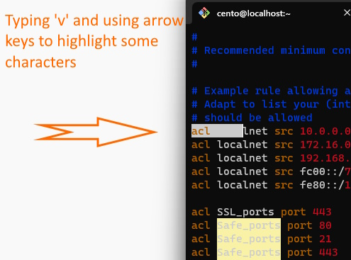
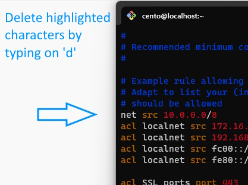
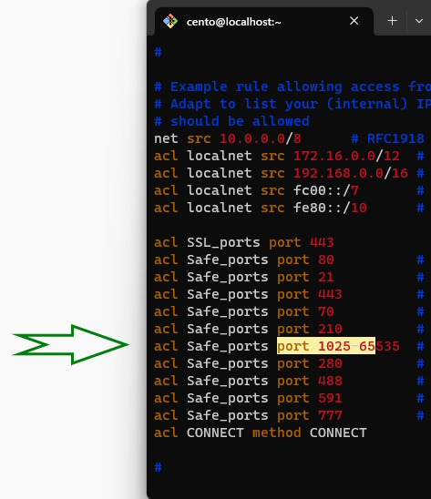

# VIM Notes

> We will use a config file like **squid.conf** (you need to install squid first)
>
> https://www.keycdn.com/blog/vim-commands
>
> https://vim.fandom.com/wiki/Search_and_replace

## Exit Vim

Before executing the following commands, **you need to exit <ins>Insert mode</ins> first**

- To save and quit

```vi
:wq
```

- To quit without any changes

```vi
:q!
```

&nbsp;

## Command-line mode

#### 🔖 <ins>Movement</ins>

**`0`** - Places the cursor at the beginning of a line

**`$`** - Places the cursor at the end of a line

**`)`** - Takes you to the start of the next sentence

**`(`** - Takes you to the start of the previous sentence

**`Ctrl`** + **`f`** - Takes you one page forward

**`Ctrl`** + **`b`** - Takes you one page back

> **`gg`** - Places the cursor at the start of the file
>
> **`G`** - Places the cursor at the end of the file

> **`:[line_number]`** - Where after colon (**`:`**) we specify the line's number. This command takes you to the line specified

<!--- Center image --->
<div align="center">
    <a href="assets/Vim_1.jpg" target="_blank">
        
    </a>
</div>

<br/>

#### 🔖 <ins>Editing</ins>

> **`yy`** - Copies a line
> 
> **`yw`** - Copies a word
> 
> **`y$`** - Copies from where your cursor is to the end of a line
> 
> **`p`** - Paste whatever has been copied to the unnamed register

<!--- Center image --->
<div align="center">
    <a href="assets/Vim_2.jpg" target="_blank">
        
    </a>
    <a href="assets/Vim_3.jpg" target="_blank">
        
    </a>
</div>

<br/>

> **`v`** - Highlight one character at a time using arrow buttons or the h, k, j, l buttons
>
> **`V`** - Highlights one line, and movement keys can allow you to highlight additional lines

> **`d`** - Deletes highlighted text
>
> **`dd`** - Deletes a line of text
>
> **`dw`** - Deletes a word
>
> **`D`** - Deletes everything from where your cursor is to the end of the line
>
> **`d0`** - Deletes everything from where your cursor is to the beginning of the line

<!--- Center image --->
<div align="center">
    <a href="assets/Vim_4.jpg" target="_blank">
        
    </a>
    <a href="assets/Vim_5.jpg" target="_blank">
        
    </a>
</div>

<br/>

> **`dgg`** - Deletes everything from where your cursor is to the beginning of the file
>
> **`dG`** - Deletes everything from where your cursor is to the end of the file

<br/>

> **`u`** - Undo the last operation
>
> **`u#`** - Undo multiple actions
>
> **`Ctrl`** + **`r`** - Redo the last undo

<br/>

>**`.`** - Repeats the last action

<br/>

#### 🔖 <ins>Searching</ins>

> **`/[keyword]`** - Searches for text in the document where keyword is whatever keyword, phrase or string of characters you're looking for
>
> **`?[keyword]`** - Searches previous text for your keyword, phrase or character string

<!--- Center image --->
<div align="center">
    <a href="assets/Vim_6.jpg" target="_blank">
        
    </a>
    <a href="assets/Vim_7.jpg" target="_blank">
        
    </a>
</div>

<br/>

> **`n`** - Searches your text again in whatever direction your last search was
>
> **`N`** - Searches your text again in the opposite direction

<br/>

> **`:%s/[pattern]/[replacement]/g`** - This replaces all occurrences of a pattern without confirming each one
>
> **`:%s/[pattern]/[replacement]/gc`** - Replaces all occurrences of a pattern and confirms each one

<!--- Center image --->
<div align="center">
    <a href="assets/Vim_8.jpg" target="_blank">
        
    </a>
    <a href="assets/Vim_9.jpg" target="_blank">
        
    </a>
</div>

&nbsp;

## Insert mode

This mode allows you to enter text into your document. You can enter insert mode by pressing the **`i`** key. 

> To exit this mode, press **`ESC`**