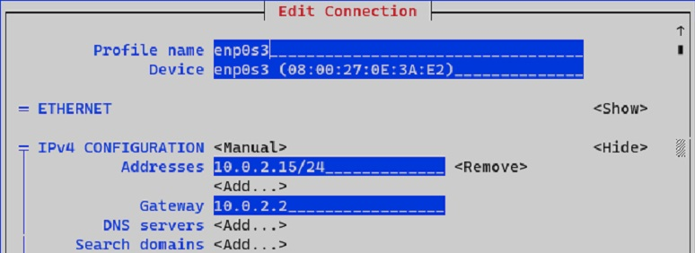

# Linux Labs LFCS

## Lab 1 : Setting a server as a gateway

<!--- Center image --->
<div align="center">
  <a href="../assets/labs/Schema_1.jpg" target="_blank">
    
  </a>
</div>

<br/>

- on CentOS 7-WEB we need to download packages for setting up a HTTP server
- only CentOS 7-AD has Internet access

<br/>

### Install DNF package

```sh
$ yum install epel-release
$ yum install dnf
```

### SSH port forwarding

On the server **7-AD**, we must allow SSH communications. Then on VirtualBox, we must do a port forwarding.

```sh
$ dnf install openssh-server
$ firewall-cmd --add-port 22/tcp --permanent
$ firewall-cmd --reload
```

<!--- Center image --->
<div align="center">
  <a href="../assets/labs/Lab_1_Port_Forwarding.jpg" target="_blank">
    
  </a>
</div>

<br/>

### Setting static IP address

We can set up a NIC using this utility :

```sh
$ nmtui
```

<!--- Center image --->
<div align="center">
  <a href="../assets/labs/Lab_1_Nmtui_1.jpg" target="_blank">
    
  </a>
</div>

<br/>

<ins>The VirtualBox NAT interface has a default gateway of **10.0.2.2/24** :</ins>

<!--- Center image --->
<div align="center">
  <a href="../assets/labs/Lab_1_Nmtui_2.jpg" target="_blank">
    
  </a>
</div>

<br/>

Once set, we have to apply the new settings :

```sh
$ nmcli device reapply enp0s3

Connection successfully reapplied to device 'enp0s3'.
```

<span style="color:#02B126">**Connection to Internet works**</span> :

```sh
$ ping 8.8.8.8

PING 8.8.8.8 (8.8.8.8) 56(84) bytes of data.
64 bytes from 8.8.8.8: icmp_seq=1 ttl=128 time=13.5 ms
```

<br/>

### Set CentOS 7-AD as a router

By setting it temporarily as a Router, the device CentOS 7-WEB should be able to download packages from the Internet.

```sh
$ ip r

default via 10.0.2.2 dev enp0s3 proto static metric 100
10.0.2.0/24 dev enp0s3 proto kernel scope link src 10.0.2.15 metric 100
192.168.25.0/24 dev enp0s8 proto kernel scope link src 192.168.25.140 metric 101
```

Let’s try to delete the default route and ping to Internet :

```sh
$ ip route del default via 10.0.2.2 dev enp0s3
$ ip r

10.0.2.0/24 dev enp0s3 proto kernel scope link src 10.0.2.15 metric 100
192.168.25.0/24 dev enp0s8 proto kernel scope link src 192.168.25.140 metric 101
```
```sh
$ ping 8.8.8.8

connect: Network is unreachable
```
```sh
$ ip route add default via 10.0.2.2 dev enp0s3

$ ping 8.8.8.8

PING 8.8.8.8 (8.8.8.8) 56(84) bytes of data.
64 bytes from 8.8.8.8: icmp_seq=1 ttl=128 time=13.5 ms
```

<br/>

### Communication between CentOS 7-AD and CentOS 7-WEB

**7-AD** has an IP address of 192.168.25.140/24

<!--- Center image --->
<div align="center">
  <a href="../assets/labs/Lab_1_AD_IP.jpg" target="_blank">
    
  </a>
</div>

<br/>

**7-WEB** will have an IP address of 192.168.25.141/24. 

Let’s also define a Gateway IP address.

<!--- Center image --->
<div align="center">
  <a href="../assets/labs/Lab_1_WEB_IP.jpg" target="_blank">
    
  </a>
</div>

<br/>

Let’s ping to **7-WEB** from **7-AD** :

```sh
$ ping 192.168.25.141

PING 192.168.25.141 (192.168.25.141) 56(84) bytes of data.
64 bytes from 192.168.25.141: icmp_seq=1 ttl=64 time=0.929 ms
64 bytes from 192.168.25.141: icmp_seq=2 ttl=64 time=0.759 ms
```

We can also do a ssh connection and get its ip route table :

```sh
$ ssh centoweb@192.168.25.141
$ ip r

default via 192.168.25.140 dev enp0s3 proto static metric 100
192.168.25.0/24 dev enp0s3 proto kernel scope link src 192.168.25.141 metric 100
```

<span style="color:#FF8A8A">**But Internet from 7-WEB is still unreachable**</span>

```sh
$ ping 8.8.8.8

PING 8.8.8.8 (8.8.8.8) 56(84) bytes of data.
--- 8.8.8.8 ping statistics ---
36 packets transmitted, 0 received, 100% packet loss, time 35024ms
```

<br/>

### IP forwarding CentOS 7-AD 

First we enable the IPv4 forward

```sh
$ cat /proc/sys/net/ipv4/ip_forward

0
```
```sh
$ sysctl -w net.ipv4.ip_forward=1

net.ipv4.ip_forward = 1
```

<br/>

To make permanent, edit <mark>/etc/sysctl.conf</mark> :

```sh
$ vi /etc/sysctl.conf

net.ipv4.ip_forward = 1
```

<span style="color:#02B126">Then we should enable NAT in 7-AD, especially on the NIC communicating to outside :</span>

```sh
$ ip a

2: enp0s3: <BROADCAST,MULTICAST,UP,LOWER_UP> mtu 1500 qdisc pfifo_fast state UP group default qlen 1000
    link/ether 08:00:27:0e:3a:e2 brd ff:ff:ff:ff:ff:ff
    inet 10.0.2.15/24 brd 10.0.2.255 scope global noprefixroute enp0s3
       valid_lft forever preferred_lft forever
    inet6 fe80::a00:27ff:fe0e:3ae2/64 scope link
       valid_lft forever preferred_lft forever
```
```sh
$ iptables -t nat -A POSTROUTING -o enp0s3 -j MASQUERADE
```

<span style="color:#02B126">We ping to 8.8.8.8 from 7-WEB :</span>

```sh
$ ssh centoweb@192.168.25.141
$ ping 8.8.8.8

ping 8.8.8.8
PING 8.8.8.8 (8.8.8.8) 56(84) bytes of data.
64 bytes from 8.8.8.8: icmp_seq=1 ttl=117 time=13.6 ms
64 bytes from 8.8.8.8: icmp_seq=2 ttl=117 time=12.8 ms
64 bytes from 8.8.8.8: icmp_seq=3 ttl=117 time=12.6 ms
```