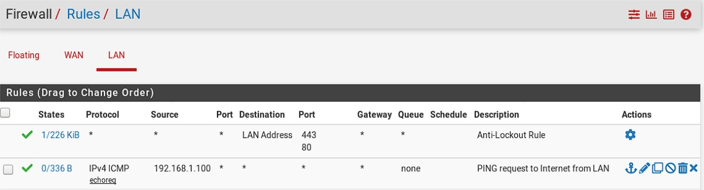

# Linux Labs LFCS

## Lab 2 : Setting a DNS resolver + Forward

<!--- Center image --->
<div align="center">
  <a href="../assets/labs/Schema_2.jpg" target="_blank">
    
  </a>
</div>

<br/>

- We have a <span style="color:#FF8F00">**pfSense**</span> firewall communicating to the Internet, on the Home network. Its credentials are **admin**/**pfsense**.
- CentOS **7-AD** and CentOS **7-Web** are in the Intranet network.

- <ins>The purpose are :</ins>
  - **7-AD** should ping to `8.8.8.8` and `google.com`
  - To download package, 7-AD should also ping to `mirrorlist.centos.org`
  - Once we are done with 7-AD, we should configure **7-Web** to send requests to 7-AD, that will forward to pfSense

<br/>

### Install DNF package on CentOS 7-AD (<span style="color:#FF8A8A">**Could not resolve host**</span>)

When trying to install DNF package, we got this error. To download the package, it needs to download it from `mirrorlist.centos.org`
 
```sh
$ yum install epel-release

Could not retrieve mirrorlist http://mirrorlist.centos.org/?release=7&arch=x86_64&repo=os&infra=stock error was
14: curl#6 - "Could not resolve host: mirrorlist.centos.org; Unknown error"
```

<br/>

### Setting 7-AD NIC

To send requests to pfSense, we need to correctly configure our 7-AD NIC. 

> Gateway and DNS server should point to the IP address of pfSense intranet NIC

<!--- Center image --->
<div align="center">
  <a href="../assets/labs/Lab_2_Nmtui_1.jpg" target="_blank">
    
  </a>
</div>

<br/>

### Configuring pfSense to resolve IP and domain name

Here are our default rules on our pfSense firewall :

- **WAN**

<!--- Center image --->
<div align="center">
  <a href="../assets/labs/Lab_2_pfSense_Rule_1.jpg" target="_blank">
    
  </a>
</div>

<br/>

- **LAN**

<!--- Center image --->
<div align="center">
  <a href="../assets/labs/Lab_2_pfSense_Rule_2.jpg" target="_blank">
    
  </a>
</div>

<br/>

<ins>From **7-AD** we will access our pfSense to configure our firewall rules :</ins>

- Let’s test the ping `8.8.8.8`

```sh
$ ping 8.8.8.8

--- 8.8.8.8 ping statistics ---
160 packets transmitted, 0 received, 100% packet loss, time 159006ms
```

<br/>

- We will allow the ICMP <span style="color:#0080FF">**echo requests**</span> to outside, from this server

<!--- Center image --->
<div align="center">
  <a href="../assets/labs/Lab_2_pfSense_Rule_3.jpg" target="_blank">
    
  </a>
</div>

<br/>

<span style="color:#02B126">**IP pinging works**</span>, but not <span style="color:#FF8A8A">**Name pinging**</span> :

```sh
$ ping 8.8.8.8

PING 8.8.8.8 (8.8.8.8) 56(84) bytes of data.
64 bytes from 8.8.8.8: icmp_seq=1 ttl=117 time=14.2 ms


$ ping google.com

ping: google.com: Name or service not known
```

<br/>

- To get ICMP echo requests with domain name, we should allow <span style="color:#0080FF">**DNS requests**</span> to outside :

<!--- Center image --->
<div align="center">
  <a href="../assets/labs/Lab_2_pfSense_Rule_4.jpg" target="_blank">
    
  </a>
</div>

<br/>

```sh
$ ping google.com
PING google.com (172.217.16.206) 56(84) bytes of data.
64 bytes from fra16s08-in-f14.1e100.net (172.217.16.206): icmp_seq=1 ttl=118 time=14.4 ms


$ ping mirrorlist.centos.org
PING mirrorlist.centos.org (18.225.36.18) 56(84) bytes of data.
64 bytes from ec2-18-225-36-18.us-east-2.compute.amazonaws.com (18.225.36.18): icmp_seq=1 ttl=51 time=101 ms
```

<br/>

- To be able to download packages, you need to allow <span style="color:#0080FF">**HTTP / HTTPS requests**</span> to outside :

```sh
$ yum install epel-release

Could not retrieve mirrorlist http://mirrorlist.centos.org/?release=7&arch=x86_64&repo=os&infra=stock error was
14: curl#7 - "Failed connect to mirrorlist.centos.org:80; Operation now in progress"
```

<!--- Center image --->
<div align="center">
  <a href="../assets/labs/Lab_2_pfSense_Rule_5.jpg" target="_blank">
    
  </a>
</div>

<br/>

```sh
$ yum install epel-release

base                                      | 3.6 kB  00:00:00                                                                                                      
extras                                    | 2.9 kB  00:00:00                                                                                                                                                    
updates                                   | 2.9 kB  00:00:00 
```

<br/>

### Install DNS server on CentOS 7-AD

We will install a <span style="color:#0080FF">**Bind DNS**</span> server on 7-AD to **forward DNS requests** from 7-WEB

```sh
$ dnf install bind bind-utils
```

Let’s start it and make sure to enable it when booting up the server : 

```sh
$ systemctl start named.service
$ systemctl enable named.service

Created symlink from /etc/systemd/system/multi-user.target.wants/named.service to /usr/lib/systemd/system/named.service.
```

<br/>

###  Resolving name with resolv.conf file (if we have a <span style="color:#02B126">**standalone server**</span>) 

Let’s edit <mark>/etc/resolv.conf</mark> on 7-AD to resolve name from their IP addresses : 

```sh
$ vi /etc/resolv.conf

# It should be nameserver, instead of google.com
# Generated by NetworkManager
nameserver 8.8.8.8

$ ping google.com

PING google.com (172.217.16.206) 56(84) bytes of data.
64 bytes from fra16s08-in-f206.1e100.net (172.217.16.206): icmp_seq=1 ttl=118 time=13.4 ms

$ ping mirrorlist.centos.org

PING mirrorlist.centos.org (18.225.36.18) 56(84) bytes of data.
64 bytes from ec2-18-225-36-18.us-east-2.compute.amazonaws.com (18.225.36.18): icmp_seq=1 ttl=51 time=101 ms
```

<br/>

On the **7-AD** server the default Bind configuration :

```sh
$ vi /etc/named.conf

options {
        listen-on port 53 { 127.0.0.1; };
        listen-on-v6 port 53 { ::1; };
        directory       "/var/named";
        dump-file       "/var/named/data/cache_dump.db";
        statistics-file "/var/named/data/named_stats.txt";
        memstatistics-file "/var/named/data/named_mem_stats.txt";
        recursing-file  "/var/named/data/named.recursing";
        secroots-file   "/var/named/data/named.secroots";
        allow-query     { localhost; }; # SPECIFY we receive request from localhost
        recursion yes;

        dnssec-enable yes;
        dnssec-validation yes;

        /* Path to ISC DLV key */
        bindkeys-file "/etc/named.root.key";

        managed-keys-directory "/var/named/dynamic";

        pid-file "/run/named/named.pid";
        session-keyfile "/run/named/session.key";
};
```

<br/>

### Change hostname on CentOS 7-AD 

```sh
$ hostnamectl

   Static hostname: localhost.localdomain
         Icon name: computer-vm
           Chassis: vm
        Machine ID: a0297384887847deb80a73af54562e12
           Boot ID: 8678b24426c84ec3a5dfdb4050900955
    Virtualization: vmware
  Operating System: CentOS Linux 7 (Core)
       CPE OS Name: cpe:/o:centos:centos:7
            Kernel: Linux 3.10.0-1160.el7.x86_64
      Architecture: x86-64
```
```sh
$ hostnamectl set-hostname centos-ad
$ hostnamectl 

   Static hostname: centos-ad
         Icon name: computer-vm
           Chassis: vm
        Machine ID: a0297384887847deb80a73af54562e12
           Boot ID: 8678b24426c84ec3a5dfdb4050900955
    Virtualization: vmware
  Operating System: CentOS Linux 7 (Core)
       CPE OS Name: cpe:/o:centos:centos:7
            Kernel: Linux 3.10.0-1160.el7.x86_64
      Architecture: x86-64
```

<br/>

### Testing `dig` utility

```sh
$ dig google.com
            
;; QUESTION SECTION:
;google.com.			IN	A

;; ANSWER SECTION:
google.com.		105	IN	A	172.217.16.206

...

$ dig @8.8.8.8 mirrorlist.centos.org
               
; QUESTION SECTION:
;mirrorlist.centos.org.		IN	A

;; ANSWER SECTION:
mirrorlist.centos.org.	60	IN	A	18.225.36.18
mirrorlist.centos.org.	60	IN	A	35.180.43.213

...
```

<br/>

### Forwarding requests to CentOS 7-AD (from **7-Web**)

On the 7-Web server we need to redirect the DNS requests to 7-AD. We need to configure our NIC with the gateway and DNS pointing to 7-AD :

<!--- Center image --->
<div align="center">
  <a href="../assets/labs/Lab_2_Nmtui_2.jpg" target="_blank">
    
  </a>
</div>

<br/>

If we want to use the **nmcli** instead :

```sh
$ nmcli conn show

NAME    UUID                                  TYPE      DEVICE
enp0s3  99e42377-c5dc-4ab9-88e8-a44988916906  ethernet  enp0s3

$ nmcli conn show enp0s3 | grep dns:

ipv4.dns:                               --

$ nmcli conn modify enp0s3 ipv4.dns  "192.168.1.100"
```

<br/>

We can see that ICMP requests can be forwarded (<span style="color:#FF8A8A">**excepted the domain name**</span>)

```sh
# Because we set the gateway to 192.168.1.100, we got nexthop 
$ ping 8.8.8.8

PING 8.8.8.8 (8.8.8.8) 56(84) bytes of data.
From 192.168.1.100: icmp_seq=2 Redirect Host(New nexthop: 192.168.1.1)


$ ping google.com

ping: google.com: Name or service not known
```

<br/>

We need to be sure that in <mark>/etc/resolv.conf</mark> the `nameserver` is pointing to **7-AD**. **7-Web** will by default use the DNS servers in /etc/resolv.conf to resolve records that it isn't authoritative :

```sh
$ vi /etc/resolv.conf

# Generated by NetworkManager
nameserver 192.168.1.100
```

<br/>

On **7-AD** , we check if the internal firewall is enabled: we must add the **`port 53`**.

```sh
$ firewall-cmd --state

running

$ firewall-cmd --add-port=53/tcp
$ firewall-cmd --add-port=53/udp
$ firewall-cmd --runtime-to-permanent

success
```

<br/>

On **7-AD** ,edit the Bind main configuration file <mark>/etc/named.conf</mark>

```sh
$ vi /etc/named.conf

options {
        # We should listen to DNS queries on 192.168.1.100
        listen-on port 53 { 127.0.0.1; 192.168.1.100; };
        directory       "/var/named";
        dump-file       "/var/named/data/cache_dump.db";
        statistics-file "/var/named/data/named_stats.txt";
        memstatistics-file "/var/named/data/named_mem_stats.txt";
        recursing-file  "/var/named/data/named.recursing";

        secroots-file   "/var/named/data/named.secroots";

        # We should allow DNS queries from 192.168.1.0/24, so we ADD localnets
        allow-query     { localhost; localnets; };

        # We should forward queries to pfSense if BIND can not resolve them
        forwarders {
           192.168.1.1;
        };

       
        recursion yes;

        dnssec-enable yes;
        dnssec-validation yes;

        /* Path to ISC DLV key */
        bindkeys-file "/etc/named.root.key";

        managed-keys-directory "/var/named/dynamic";
        pid-file "/run/named/named.pid";
        session-keyfile "/run/named/session.key";
};
```

<br/>

Be sure that  7-AD can send requests to pfSense through <mark>/etc/resolv.conf</mark>

```sh
$ vi /etc/resolv.conf

# Generated by NetworkManager
nameserver 192.168.1.1

$ ping google.com

PING google.com (142.250.185.110) 56(84) bytes of data.
From gateway (192.168.1.100): icmp_seq=2 Redirect Host(New nexthop: 192.168.1.1 (192.168.1.1))

$ ping mirrorlist.centos.org

PING mirrorlist.centos.org (35.180.43.213) 56(84) bytes of data.
From gateway (192.168.1.100): icmp_seq=2 Redirect Host(New nexthop: 192.168.1.1 (192.168.1.1))
```