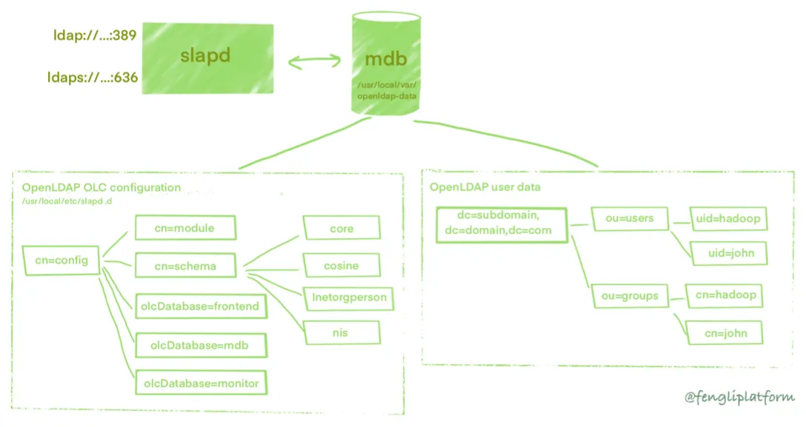

# Linux Labs LFCS

## Lab 6 : Setting a LDAP server

<!--- Center image --->
<div align="center">
  <a href="../assets/labs/Schema_6.jpg" target="_blank">
    
  </a>
</div>

<br/>

We will :

-  install and configure the OpenLDAP server.
-  install phpLDAPadmin, a web interface for viewing and manipulating LDAP information. 
-  secure the web interface and the LDAP service with SSL certificates from **Let’s Encrypt**, a provider of free and automated certificates If not possible, we will use our organization’s own certificate authority.

```txt
With Let’s Encryptn, we're assuming that your server is accessible to the public internet. 
```

<br/>

**Lightweight Directory Access Protocol** (LDAP) is a standard protocol designed to manage and access hierarchical directory information over a network. 

It can be used to store any kind of information, though it is most often used as a **centralized authentication** system or for **corporate email** and phone directories.

<br/>

### Key concepts and terms

> https://ubuntu.com/server/docs/service-ldap-introduction

- A **directory** is a tree of data *entries* that is hierarchical in nature and is called the Directory Information Tree (DIT).

- An **entry** consists of a set of *attributes*.

- An **attribute** has a key (a name/description) and one or more values.

- Every attribute must be defined in at least one *objectClass*.

- Attributes and objectClasses are defined in schemas (an **objectClass** is considered as a special kind of attribute).

- Each entry has a unique identifier: its **Distinguished Name** (DN or dn). This, in turn, consists of a **Relative Distinguished Name** (RDN) followed by the parent entry’s DN.

- The entry’s DN is not an attribute. It is not considered part of the entry itself.

<br/>

For example, below we have a single entry consisting of 11 attributes where the following is true :

- DN is “cn=John Doe,dc=example,dc=com”
- RDN is “cn=John Doe”
- parent DN is “dc=example,dc=com”

The below entry is in LDIF format (LDAP Data Interchange Format).

```txt
 dn: cn=John Doe,dc=example,dc=com
 cn: John Doe
 givenName: John
 sn: Doe
 telephoneNumber: +1 888 555 6789
 telephoneNumber: +1 888 555 1232
 mail: john@example.com
 manager: cn=Larry Smith,dc=example,dc=com
 objectClass: inetOrgPerson
 objectClass: organizationalPerson
 objectClass: person
 objectClass: top
```

<br/>

<br/>

### Installing and Configuring the LDAP Server

- Let's install the package on **7-AD**

```sh
$ dnf install openldap* -y

$ systemctl start slapd
$ systemctl enable slapd
$ systemctl status slapd 
```

<br/>

- Generate OpenLDAP password and save it

```sh
$ slappasswd

New password: cento
Re-enter new password: cento
{SSHA}KWcinQC1QtfxzwYOYKbB6DDk3+a9gnhQ
```

<br/>

- We have to update <mark>`/etc/openldap/slapd.d/cn=config/olcDatabase={2}hdb.ldif`</mark>. For this **we first create a DB file**.

<ins>**Content to replace :**</ins>


1. **olcSuffix** (should be replaced by your domain, e.g. **`cactus.local`** -> **`dc=cactus`**, **`dc=local`**)
2. **olcRootDN** (should be replaced by your domain admin name, can be any name you prefer, e.g. **admin** -> <mark>**`cn=admin`**, **`dc=cactus`**, **`dc=local`**</mark>)
3. **olcRootPW** (should be the password you generate above)


```sh
$ vi db.ldif

dn: olcDatabase={2}hdb,cn=config
changetype: modify
replace: olcSuffix
olcSuffix: dc=cactus,dc=local

dn: olcDatabase={2}hdb,cn=config
changetype: modify
replace: olcRootDN
olcRootDN: cn=admin,dc=cactus,dc=local

dn: olcDatabase={2}hdb,cn=config
changetype: modify
replace: olcRootPW
olcRootPW: {SSHA}KWcinQC1QtfxzwYOYKbB6DDk3+a9gnhQ
```

<br/>

- We now update <mark>`/etc/openldap/slapd.d/cn=config/olcDatabase={2}hdb.ldif`</mark> with **`ldapmodify `**.

```sh
# -H ldapi:/// - use UNIX-domain socket (/var/run/ldapi)
# -Y EXTERNAL - use EXTERNAL mechanism for SASL
$ ldapmodify -Y External -H ldapi:/// -f db.ldif

SASL username: gidNumber=0+uidNumber=0,cn=peercred,cn=external,cn=auth
SASL SSF: 0
modifying entry "olcDatabase={2}hdb,cn=config"
modifying entry "olcDatabase={2}hdb,cn=config"
modifying entry "olcDatabase={2}hdb,cn=config"
```

- Configuration should have changed

```sh
$ cat /etc/openldap/slapd.d/cn=config/olcDatabase={2}hdb.ldif


# AUTO-GENERATED FILE - DO NOT EDIT!! Use ldapmodify.
# CRC32 8341e34d
dn: olcDatabase={2}hdb
objectClass: olcDatabaseConfig
objectClass: olcHdbConfig
olcDatabase: {2}hdb
olcDbDirectory: /var/lib/ldap
olcDbIndex: objectClass eq,pres
olcDbIndex: ou,cn,mail,surname,givenname eq,pres,sub
structuralObjectClass: olcHdbConfig
entryUUID: 4408a202-18ae-103e-90d4-5d958c172dad
creatorsName: cn=config
createTimestamp: 20231116092837Z
olcSuffix: dc=cactus,dc=local
olcRootDN: cn=admin,dc=cactus,dc=local
olcRootPW:: e1NTSEF9S1djaW5RQzFRdGZ4endZT1lLYkI2RERrMythOWduaFE=
entryCSN: 20231116092950.356978Z#000000#000#000000
modifiersName: gidNumber=0+uidNumber=0,cn=peercred,cn=external,cn=auth
modifyTimestamp: 20231116092950Z
```

<br/>

### Add schemas

Apply some commonly used schema. The 2nd & 3rd schema allow us to create an object with `InetOrgPerson` & `ShadowAccount` which we will use to create an user.

```sh
$ ldapadd -Y EXTERNAL -H ldapi:/// -f /etc/openldap/schema/cosine.ldif

SASL/EXTERNAL authentication started
SASL username: gidNumber=0+uidNumber=0,cn=peercred,cn=external,cn=auth
SASL SSF: 0
adding new entry "cn=cosine,cn=schema,cn=config"
```
```sh
$ ldapadd -Y EXTERNAL -H ldapi:/// -f /etc/openldap/schema/nis.ldif

SASL/EXTERNAL authentication started
SASL username: gidNumber=0+uidNumber=0,cn=peercred,cn=external,cn=auth
SASL SSF: 0
adding new entry "cn=nis,cn=schema,cn=config"
```
```sh
$ ldapadd -Y EXTERNAL -H ldapi:/// -f /etc/openldap/schema/inetorgperson.ldif
SASL/EXTERNAL authentication started
SASL username: gidNumber=0+uidNumber=0,cn=peercred,cn=external,cn=auth
SASL SSF: 0
adding new entry "cn=inetorgperson,cn=schema,cn=config"
```

<br/>

**COSINE** (Co-operation and Open Systems Interconnection in Europe) is schema a project, created in 1990s, for standardizing the directory schema and naming
architecture.

**NIS**, like COSINE, was another shema standard. There are articles mentionning data migration from NIS maps to LDAP, by extracting data for creating LDAP objects.

**inetorgperson** is a person object class for Internet and Intranet directory service deployments. 

```txt
https://docplayer.fr/1223354-Tutorial-openldap-installation-et-configuration-clients-serveurs-migration-nis-ldap-dans-grid5000-securisation-par-ssl-et-optimisations.html

https://docs.oracle.com/cd/E19513-01/806-4251-10/mapping.htm

https://etutorials.org/Server+Administration/ldap+system+administration/Part+II+Application+Integration/Chapter+6.+Replacing+NIS/6.3+Information+Migration/
```

<br/>

<!--- Center image --->
<div align="center">
  <a href="../assets/labs/Lab_6_LDAP_Architecture.jpg" target="_blank">
    
  </a>
</div>
<div align="center">
  <i>
    An overview of LDAP architecture
  </i>
</div>

<br/>

### Create objects, Organizational Unit and group

We will create a file, <mark>**`entries.ldif`**</mark>, and add below content for creating the following users :

- `bob.dyler@cactus.local`
- `carlos.santa@cactus.local`

The domain is the top-level entity in an LDAP hierarchy. Later, you will create OUs and add users to OUs.

<!--- Center image --->
<div align="center">
  <a href="../assets/labs/Lab_6_LDAP_Structure.jpg" target="_blank">
    
  </a>
</div>

<br/>

> **posixGroup** and **organizationalUnit** are two different object classes used in LDAP (Lightweight Directory Access Protocol) directories, including OpenLDAP. These object classes serve different purposes within the directory schema.

- **posixGroup**:

  - The posixGroup object class is typically used to represent POSIX (Portable Operating System Interface) group entries in LDAP directories. POSIX groups are commonly used in Unix and Unix-like operating systems to manage access control and permissions.
  - Attributes associated with posixGroup include cn (common name), gidNumber (group ID), memberUid (user IDs that are members of the group), etc.
  - Example LDIF (LDAP Data Interchange Format) entry for a posixGroup :
```sh
dn: cn=developers,ou=groups,dc=cactus,dc=local
objectClass: posixGroup
cn: developers
gidNumber: 20199
memberUid: user1
memberUid: user2
```

- **organizationalUnit**:

  - The **organizationalUnit** (OU) object class is used to represent organizational units in LDAP directories. Organizational units are a way to organize directory entries in a hierarchical manner for administrative purposes.
  - Common attributes associated with organizationalUnit include **ou** (organizational unit name) and **description**.
  - Example LDIF entry for an organizationalUnit :
```sh
dn: ou=development,dc=cactus,dc=local
objectClass: organizationalUnit
ou: development
description: Development department
```

<br/>

#### <mark>MANDATORY</mark>

To be able to create a user account :

- you must import the **`objectClass: posixAccount`**
- Specify the following properties :
  - **`uidNumber`**
  - **`gidNumber`** (Check if the FID alreay exists by typing **`grep -i 500 /etc/group`**)
  - **`homeDirectory`**

<br/>

The final config will be like this :

- Domain config

```sh
$ vi domain_ou.ldif

# Domain Name
dn: dc=cactus,dc=local
dc: cactus
objectClass: top
objectClass: domain

# Organizational Unit
dn: ou=development,dc=cactus,dc=local
objectClass: organizationalUnit
ou: development
description: Development department
```

<br/>

- <mark>**Create the group on your 7-AD (for future testing). We will add an user in this group, through the next config file below.**</mark>

```sh
$ groupadd -g 500 developers
```

- User config

```sh
$ vi users.ldif


# User account (we will create a password later)
#
# shadowMax : Maximum number of days a password may be used before it must be changed.
#
# NO EMPTY SPACE after each property
dn: cn=csanta,ou=development,dc=cactus,dc=local
objectclass: inetOrgPerson
objectClass: posixAccount
objectClass: shadowAccount
cn: Carlos Santa
sn: Santa
uid: csanta
carlicense: HISCAR 124
homephone: 555-111-2223
mail: c.santa@cactus.local
mail: carlos.santa@cactus.com
shadowMax: 30
uidNumber: 10098
gidNumber: 500
homeDirectory: /home/csanta
# NO EMPTY LINE
-
dn: cn=bdyler,ou=development,dc=cactus,dc=local
objectclass: inetOrgPerson
# posixAccount allows us to authenticate through terminal
objectClass: posixAccount
objectClass: shadowAccount
cn: Bob Dyler
sn: Dyler
uid: bdyler
carlicense: HERCAR 125
homephone: 555-111-2225
mail: b.dyler@cactus.local
mail: bob.dyler@cactus.com
shadowMax: 30
uidNumber: 10099
# We can add a group in /etc/group. We must be sure that GID 500 is not used, by typing 'grep -i 500 /etc/group'
gidNumber: 500
homeDirectory: /home/bdyler
```

<br/>

Apply the content :

```sh
# -x: Use simple authentication.
# -D: Bind DN (Distinguished Name) for authentication (replace with your admin DN).
# -W: Prompt for the password.
# -f: Specify the LDIF file.
$ ldapadd -x -W -D "cn=admin,dc=cactus,dc=local" -f entries.ldif


Enter LDAP Password: cento
adding new entry "dc=cactus,dc=local"

adding new entry "ou=development,dc=cactus,dc=local"

adding new entry "cn=bdyler,ou=development,dc=cactus,dc=local"
```

<br/>

- If you're getting this error, there must be an empty space on one property :

```sh
adding new entry "cn=csanta,ou=development,dc=cactus,dc=local"
ldap_add: Type or value exists (20)
	additional info: cn: value #0 provided more than once
```
```sh
dn: cn=csanta,ou=development,dc=cactus,dc=local

# This one ahas an empty space at the end
dn: cn=csanta,ou=development,dc=cactus,dc=local 
```

<br/>

### Test querying LDAP

- Query all entries :

```sh
$ ldapsearch -D cn="admin,dc=cactus,dc=local" -W -b "dc=cactus,dc=local"
```
```sh
Enter LDAP Password: 
# extended LDIF
#
# LDAPv3
# base <dc=cactus,dc=local> with scope subtree
# filter: (objectclass=*)
# requesting: ALL
#

# cactus.local
dn: dc=cactus,dc=local
dc: cactus
objectClass: top
objectClass: domain

# development, cactus.local
dn: ou=development,dc=cactus,dc=local
objectClass: organizationalUnit
ou: development
description: Development department

# bdyler, development, cactus.local
dn: cn=bdyler,ou=development,dc=cactus,dc=local
objectClass: inetOrgPerson
objectClass: shadowAccount
cn: Bob Dyler
cn: bdyler
sn: Dyler
uid: bdyler
carLicense: HERCAR 125
homePhone: 555-111-2225
mail: b.dyler@cactus.local
mail: bob.dyler@cactus.com
shadowMax: 30

# csanta, development, cactus.local
dn: cn=csanta,ou=development,dc=cactus,dc=local
objectClass: inetOrgPerson
objectClass: shadowAccount
cn: Carlos Santa
cn: csanta
sn: Santa
uid: csanta
carLicense: HISCAR 124
homePhone: 555-111-2223
mail: c.santa@cactus.local
mail: carlos.santa@cactus.com
shadowMax: 30

# search result
search: 2
result: 0 Success

# numResponses: 5
# numEntries: 4
```

<br/>

- Get user **Bob Dyler** :

```sh
#     -x: Use simple authentication.
#    -LLL: Output in LDIF format without comments.
#    -b: Base DN (Distinguished Name) specifies the starting point for the search.
#    -D: Bind DN for authentication.
#    -W: Prompt for the password.
#    -H: LDAP URI specifying the LDAP server.
#    -v: Verbose output.
#
#
# $ ldapsearch -x -LLL -b "baseDN" -D "bindDN" -W -H ldap://ldap_server -v "(filter)"
#
#
# Replace the placeholders with your specific information:

#    baseDN: The starting point for the search. It's usually the root suffix of your LDAP directory.
#    bindDN: The DN for binding to the LDAP server (username used for authentication).
#    ldap_server: The URI of your LDAP server (e.g., ldap://localhost).
#    filter: The search filter. For searching a user, you might use a filter like (uid=username).
$ ldapsearch -x -LLL -b "dc=cactus,dc=local" -D "cn=admin,dc=cactus,dc=local" -W -H ldap://localhost -v "(uid=bdyler)"
```
```sh
Enter LDAP Password: 
filter: (uid=bdyler)
requesting: All userApplication attributes
dn: cn=bdyler,ou=development,dc=cactus,dc=local
objectClass: inetOrgPerson
objectClass: shadowAccount
cn: Bob Dyler
cn: bdyler
sn: Dyler
uid: bdyler
carLicense: HERCAR 125
homePhone: 555-111-2225
mail: b.dyler@cactus.local
mail: bob.dyler@cactus.com
```

<br/>

- Change account password :

```sh
$ ldappasswd -x -D "cn=admin,dc=cactus,dc=local" -W -S cn=bdyler,ou=development,dc=cactus,dc=local
```
```sh
New password: centi
Re-enter new password: centi
Enter LDAP Password: cento
# You use a wrong user for authenticating to LDAP
ldap_bind: Invalid credentials (49)
```
```sh
$ ldapsearch -x -LLL -b "dc=cactus,dc=local" -D "cn=admin,dc=cactus,dc=local" -W -H ldap://localhost -v "(uid=bdyler)"


ldap_initialize( ldap://localhost:389/??base )
Enter LDAP Password: 
filter: (uid=bdyler)
requesting: All userApplication attributes
dn: cn=bdyler,ou=development,dc=cactus,dc=local
objectClass: inetOrgPerson
objectClass: shadowAccount
cn: Bob Dyler
cn: bdyler
sn: Dyler
uid: bdyler
carLicense: HERCAR 125
homePhone: 555-111-2225
mail: b.dyler@cactus.local
mail: bob.dyler@cactus.com
shadowMax: 30

# Password was added
userPassword:: e1NTSEF9bG5kTVBKdkZJS2NFbW82aE9CQWZETkZOWVhuNld0T0c=
```

<br/>

- Delete an user
```
$ ldapdelete -x -D "cn=admin,dc=cactus,dc=local" -w cento -H ldap://127.0.0.1 "cn=bdyler,ou=development,dc=cactus,dc=local"
```
```sh
$ ldapsearch -x -LLL -b "dc=cactus,dc=local" -D "cn=admin,dc=cactus,dc=local" -W -H ldap://localhost -v "(uid=bdyler)"


ldap_initialize( ldap://localhost:389/??base )
Enter LDAP Password: 
filter: (uid=bdyler)
requesting: All userApplication attributes
```

<br/>

&nbsp;

### Preparing a Public Key Infrastructure Directory

On another server (**7-CA**), follow these steps.

To encrypt our connections, we’ll need to configure a **certificate authority** and use it to sign the keys for the LDAP server(s) in our infrastructure. 

We will use **Easy-RSA** is a utility for managing a PKI CA (Certificate Authority) in addition to X.509 PKI, or Public Key Infrastructure. A PKI is based on the notion of trusting a particular authority to authenticate a remote peer.

<br/>

- Install **`easy-rsa`**

```sh
$ dnf install easy-rsa -y
```

<br/>

-  Preparing a Public Key Infrastructure Directory

```sh
[centos-ca@centos-ca ~]$ mkdir ~/easy-rsa
[centos-ca@centos-ca ~]$ ls -l ~ | grep easy


drwxrwxr-x. 2 centos-ca centos-ca 6 Nov 16 15:32 easy-rsa
```

<br/>

- Create symbolic links pointing to the **`easy-rsa`** package files that we’ve installed in the previous step. These files are located in the **`/usr/share/easy-rsa/3`** folder on the CA Server.

```sh
[centos-ca@centos-ca ~]$ ln -s /usr/share/easy-rsa/3/* ~/easy-rsa/
```

> While other guides might instruct you to copy the **`easy-rsa`** package files into your PKI directory, this tutorial adopts a symlink approach.
>
> As a result, any updates to the **`easy-rsa`** package will be automatically reflected in your PKI’s scripts.

<br/>

- To restrict access to your new PKI directory, ensure that **only the owner can access it** using the chmod command :

```sh
[centos-ca@centos-ca ~]$ chmod 700 /home/centos-ca/easy-rsa
```

<br/>

- Finally, initialize the PKI inside the easy-rsa directory:

```sh
[centos-ca@centos-ca ~]$ cd ~/easy-rsa
[centos-ca@centos-ca easy-rsa]$ ./easyrsa init-pki


init-pki complete; you may now create a CA or requests.
Your newly created PKI dir is: /home/centos-ca/easy-rsa/pki
```
After completing this section you have a directory that contains all the files that are needed t**o create a Certificate Authority**. In the next section you will create the private key and public certificate for your CA.

<br/>

&nbsp;

### Creating a Certificate Authority

Before you can create your CA’s private key and certificate, you need to create and **populate a file** called vars with some default values.

```sh
[centos-ca@centos-ca ~]$ cd ~/easy-rsa
[centos-ca@centos-ca easy-rsa]$ vi vars
```
```txt
~/easy-rsa/varsset_var EASYRSA_REQ_COUNTRY    "US"
set_var EASYRSA_REQ_PROVINCE   "NewYork"
set_var EASYRSA_REQ_CITY       "New York City"
set_var EASYRSA_REQ_ORG        "Cactus"
set_var EASYRSA_REQ_EMAIL      "caadmin@cactus.com"
set_var EASYRSA_REQ_OU         "IT"
set_var EASYRSA_ALGO           "rsa"
set_var EASYRSA_DIGEST         "sha512"
```

<br/>

To create the root public and private key pair for your Certificate Authority, run the **`./easy-rsa`** command again, this time with the **`build-ca`** option.

```sh
[centos-ca@centos-ca ~]$ cd ~/easy-rsa
[centos-ca@centos-ca easy-rsa]$ ./easyrsa build-ca
```
```txt
Using SSL: openssl OpenSSL 1.0.2k-fips  26 Jan 2017

Enter New CA Key Passphrase: centi
Re-Enter New CA Key Passphrase: centi
Generating RSA private key, 2048 bit long modulus
......+++
........+++
e is 65537 (0x10001)
You are about to be asked to enter information that will be incorporated
into your certificate request.
What you are about to enter is what is called a Distinguished Name or a DN.
There are quite a few fields but you can leave some blank
For some fields there will be a default value,
If you enter '.', the field will be left blank.
-----
Common Name (eg: your user, host, or server name) [Easy-RSA CA]: centos-ca

CA creation complete and you may now import and sign cert requests.
Your new CA certificate file for publishing is at:
/home/centos-ca/easy-rsa/pki/ca.crt
```

You now have two important files :

- **`~/easy-rsa/pki/ca.crt `**
- **`~/easy-rsa/pki/private/ca.key`** 

<br/>

which make up the public and private components of a Certificate Authority.

- **`ca.crt`** is the CA’s **public certificate** file. 

  Users, servers, and clients will use this certificate to verify that they are part of the same web of trust. 
  
  Every user and server that uses your CA will need to have a copy of this file. 
  
  All parties will rely on the public certificate to ensure that someone is not impersonating a system and performing a Man-in-the-middle attack.

- **`ca.key`** is the **private key** that the CA uses to sign certificates for servers and clients. 

  If an attacker gains access to your CA and, in turn, your ca.key file, you will need to destroy your CA. 
  
  This is why your ca.key file **should only be on your CA machine** and that, ideally, your CA machine should be kept offline when not signing certificate requests as an extra security measure.

<br/>

> With that, your CA is in place and it is ready to be used **to sign certificate requests**, and to revoke certificates.

<br/>

&nbsp;

### Distributing your Certificate Authority’s Public Certificate

Now your CA is configured and ready to act as a root of trust for any systems that you want to configure to use it. 

> You can add the CA’s certificate to your OpenVPN servers, web servers, mail servers, and so on. 
>
> Any user or server that needs to verify the identity of another user or server in your network should have a copy of the ca.crt file imported into their operating system’s certificate store.

- To import the CA’s public certificate into a second Linux system like another server or a local computer, first obtain a **copy** of the **`ca.crt`** file from your CA server.

```sh
[centos-ca@centos-ca ~]$ cat ~/easy-rsa/pki/ca.crt


-----BEGIN CERTIFICATE-----
MIIDLzCCAhegAwIBAgIJALmKt6OXC1JjMA0GCSqGSIb3DQEBCwUAMBQxEjAQBgNV
BAMMCWNlbnRvcy1jYTAeFw0yMzExMTYxNDU1MjBaFw0zMzExMTMxNDU1MjBaMBQx
EjAQBgNVBAMMCWNlbnRvcy1jYTCCASIwDQYJKoZIhvcNAQEBBQADggEPADCCAQoC
ggEBAMDLl86qcgiKeErCdktyECEQ//HFWjNm+k0F6auSeVI3vw/1F+X5GzWATaSD
nisvZHPyuYYxUYN1TvApIt1qE42Z3N1NHo9JlYtZNIxAQdfGMRfPkYko8ArDw2IS
eXtZc9bIntr9gbt2TFPTmbyVQi4NfBBtGraDeGd6MNwhnL7X7O/6w6M76bk82LgZ
uG686HQkg3WDmj6OQRqqD+nPNbQ+85YajLrYhXFHcswNUacQGALtewyaj4bWozAL
Zi82sGweyPsjPKy3buskTrjwhq8fl7fV24qjqJb7YCDmWjwNXWPBuqZPNqWadjzk
EQveq/j068plbvGkdkUzzRMGvCECAwEAAaOBgzCBgDAdBgNVHQ4EFgQUz63QL7U/
MPjv8BC8aJzq5eHDGyUwRAYDVR0jBD0wO4AUz63QL7U/MPjv8BC8aJzq5eHDGyWh
GKQWMBQxEjAQBgNVBAMMCWNlbnRvcy1jYYIJALmKt6OXC1JjMAwGA1UdEwQFMAMB
Af8wCwYDVR0PBAQDAgEGMA0GCSqGSIb3DQEBCwUAA4IBAQA8EQueKfqA9E3V406O
GBjDVF2s3TbQoDenD6buOJ8iIWbVRuYkV0iB37zhHge3LZlXR5YxNSHWd7Mf4Kl6
AtpYdfk+jgetaxRaiNXGHnfYfXzRAOdq5yc3bk8pYFL3U1WhxT2UWz4XGNMQJTiC
xYYri4wDB5ZZ4sw4x1bZpIm1xf5gJzPRh7reMsp4f2FSc1c/jaulR5yb+Nh8/N8A
SdBVCJ3Dt3ftnGDLmpzwC4H27+QBHF2jg5ZAhvWYbQ3lJmwGZDyOuKOfriyyfHaE
lbUNurlKc6jbfi8NHz+ce7pUpAXV5GoT00OOrIYn+RG2ddPxAU7O0QhF4MhOf3w8
/su5
-----END CERTIFICATE-----
```

<br/>

- On your second Linux system (let's say **7-AD**) paste the content in a file called **`/tmp/ca.crt`**

```sh
$ vi /tmp/ca.crt
```

- Import the certificate into its operating system certificate store

```sh
$ cp /tmp/ca.crt /etc/pki/ca-trust/source/anchors/
$ update-ca-trust
```

<br/>

> Now your second Linux system will **trust any certificate that has been signed by the CA** server.

<br/>

&nbsp;

### (Optional) — Creating and Signing a Practice Certificate Request

Now that you have a CA ready to use, you can practice generating a private key and certificate request to get familiar with the signing and distribution process.

A **Certificate Signing Request** (CSR) consists of three parts: 

- a public key
- identifying information about the requesting system
- a signature of the request itself, which is created using the requesting party’s private key.

 The private key will be kept secret, and will be used to encrypt information that anyone with the signed public certificate can then decrypt.

 <br/>

 On **7-AD**, we will use **`openssl`** tool to create a practice private key and certificate.

 ```sh
 $ dnf install openssl
 ```

<br/>

- First, generate a private key. We will make this request for our LDAP server (**centos-ad**), as opposed to creating a certificate that is used to identify a user or another CA.

```sh
$ mkdir /etc/pki/private
$ cd /etc/pki/private
$ openssl genrsa -out ldap-server.key


Generating RSA private key, 2048 bit long modulus
........................................................................................................+++
...........+++
e is 65537 (0x10001)
```

- Now that you have a private key you can create a corresponding **CSR**, again using the **`openssl`** utility. 

```sh
$ mkdir /etc/pki/csr
$ cd /etc/pki/csr
$ openssl req -new -key /etc/pki/private/ldap-server.key -out ldap-server.req
```
```sh
You are about to be asked to enter information that will be incorporated
into your certificate request.
What you are about to enter is what is called a Distinguished Name or a DN.
There are quite a few fields but you can leave some blank
For some fields there will be a default value,
If you enter '.', the field will be left blank.
-----
Country Name (2 letter code) [XX]:US
State or Province Name (full name) []:NewYork
Locality Name (eg, city) [Default City]:New York City
Organization Name (eg, company) [Default Company Ltd]:Cactus
Organizational Unit Name (eg, section) []:IT
Common Name (eg, your name or your server's hostname) []:ldap.cactus.local
Email Address []:ldapadmin@cactus.local

Please enter the following 'extra' attributes
to be sent with your certificate request
A challenge password []:
An optional company name []:
```

<br/>

- If you would like to automatically add those values as part of the openssl invocation instead of via the interactive prompt, you can pass the **`-subj`** argument to OpenSSL. Be sure to edit the highlighted values to match your practice location, organization, and server name:

  ```txt
  openssl req -new -key sammy-server.key -out sammy-server.req -subj \
  /C=US/ST=New\ York/L=New\ York\ City/O=DigitalOcean/OU=Community/CN=sammy-server
  ```

<br/>

To verify the contents of a CSR, you can read in a request file with openssl and examine the fields inside :

```sh
$ openssl req -in ldap-server.req -noout -subject


subject=/C=US/ST=NewYork/L=New York City/O=Cactus/OU=IT/CN=ldap.cactus.local/emailAddress=ldapadmin@cactus.local
```

<br/>

Copy the content of CSR to your **7-CA** server, using a **`scp`** utility :

```sh
$ cd /etc/pki/csr
$ scp ldap-server.req centos-ca@192.168.1.99:/tmp/ldap-server.req


The authenticity of host '192.168.1.99 (192.168.1.99)' can't be established.
ECDSA key fingerprint is SHA256:fsPc5zh/BwuN6zuRRW2YWH0581Ue5kZYC+BngQjs+Ww.
ECDSA key fingerprint is MD5:e0:7c:a9:41:6f:d8:f8:2f:27:fa:a9:8f:1b:2f:bd:0f.
Are you sure you want to continue connecting (yes/no)? yes
Warning: Permanently added '192.168.1.99' (ECDSA) to the list of known hosts.
centos-ca@192.168.1.99's password: 
ldap-server.req                                 100% 1070     1.2MB/s   00:00
```

<br/>

&nbsp;

### (Optional) — Signing a CSR

On **7-CA**, we have copied a CSR content to **`/tmp`** directory :

```sh
centos-ca@centos-ca /]$ ls -l /tmp | grep ldap


-rw-r--r--. 1 centos-ca centos-ca   1070 Nov 16 17:19 ldap-server.req
```

<br/>

The CA Server needs to import the practice certificate and sign it. Once a certificate request is validated by the CA and relayed back to a server, clients that trust the Certificate Authority will also be able to trust the newly issued certificate.

<br/>

- The first step to sign the fictional CSR is **to import** the certificate request using the **`easy-rsa`** script :

```sh
$ cd ~/easy-rsa
[centos-ca@centos-ca easy-rsa]$ ./easyrsa import-req /tmp/ldap-server.req ldap-server


Using SSL: openssl OpenSSL 1.0.2k-fips  26 Jan 2017

The request has been successfully imported with a short name of: ldap-server
You may now use this name to perform signing operations on this request.
```

- Now you can **sign** the request by running the **`easyrsa`** script with the **`sign-req`** option, followed by the request type and the Common Name that is included in the CSR. 

  The request type can either be one of client, server, or ca. Since we’re practicing with a certificate for a fictional server, be sure to use the **`server`** request type

```sh
$ cd ~/easy-rsa
[centos-ca@centos-ca easy-rsa]$ ./easyrsa sign-req server ldap-server
```
```txt
You are about to sign the following certificate.
Please check over the details shown below for accuracy. Note that this request
has not been cryptographically verified. Please be sure it came from a trusted
source or that you have verified the request checksum with the sender.

Request subject, to be signed as a server certificate for 825 days:

subject=
    countryName               = US
    stateOrProvinceName       = NewYork
    localityName              = New York City
    organizationName          = Cactus
    organizationalUnitName    = IT
    commonName                = ldap.cactus.local
    emailAddress              = ldapadmin@cactus.local


Type the word 'yes' to continue, or any other input to abort.
  Confirm request details: yes
Using configuration from /home/centos-ca/easy-rsa/pki/easy-rsa-52812.llJ4CF/tmp.eQcPUZ
Enter pass phrase for /home/centos-ca/easy-rsa/pki/private/ca.key: centi
Check that the request matches the signature
Signature ok
The Subject's Distinguished Name is as follows
countryName           :PRINTABLE:'US'
stateOrProvinceName   :ASN.1 12:'NewYork'
localityName          :ASN.1 12:'New York City'
organizationName      :ASN.1 12:'Cactus'
organizationalUnitName:ASN.1 12:'IT'
commonName            :ASN.1 12:'ldap.cactus.local'
emailAddress          :IA5STRING:'ldapadmin@cactus.local'
Certificate is to be certified until Feb 18 16:28:59 2026 GMT (825 days)

Write out database with 1 new entries
Data Base Updated

Certificate created at: /home/centos-ca/easy-rsa/pki/issued/ldap-server.crt
```

If you encrypted your CA key, you’ll be prompted for your password at this point.

With those steps complete, you have signed the **`ldap-server.req`** CSR using the CA Server’s private key in **`/home/centos-ca/easy-rsa/pki/private/ca.key`**. 

The resulting **`ldap-server.crt`** file contains the practice server’s public encryption key, as well as a new signature from the CA Server. The point of the signature is to tell anyone who trusts the CA that they can also trust the ldap-server certificate.

If this request was for a real server like a web server or VPN server, the last step on the CA Server would be to distribute the new ldap-server.crt and ca.crt files from the CA Server to the remote server that made the CSR request :

```sh
$ scp /home/centos-ca/easy-rsa/pki/issued/ldap-server.crt centos-ad@192.168.1.100:/tmp

# You can skip this one if you have distributed the CA certificate before.
$ scp /home/centos-ca/easy-rsa/pki/ca.crt centos-ad@192.168.1.100:/tmp
```

At this point, you would be able to use the issued certificate with something like a web server, a VPN, configuration management tool, database system, or for client authentication purposes.

<br/>

&nbsp;

### Configure OpenLDAP to Use the Certificate and Keys

On **7-AD**

To make configuration changes, we need to target the **`cn=config`** entry of the configuration DIT. 

We need to specify that we are wanting to modify the attributes of the entry, using **`changetype: modify`**. 

Afterwards we need to add the **`olcTLSCACertificateFile`**, **`olcCertificateFile`**, and **`olcCertificateKeyFile`** attributes and set them to the correct file locations.


- First let's check the permissions of each file

```sh
$ ls -l /tmp/
-rw-r--r--. 1 root      root        1164 Nov 16 16:14 ca.crt
-rw-------. 1 centos-ad centos-ad   4848 Nov 17 10:48 ldap-server.crt


$ ls -l /etc/pki/private/
-rw-r--r--. 1 root root 1675 Nov 16 17:10 ldap-server.key
```

<br/>
<br/>

- One mistake to **AVOID** : name of the certificate MUST MATCH name of the server !! 

```sh
$ vi /var/named/cactus.local.zone


@TTL 1H
@       IN SOA  ns1.cactus.local. hostmaster.cactus.local. (
                                        43       ; serial
                                        1D      ; refresh
                                        1H      ; retry
                                        1W      ; expire
                                        3H )    ; minimum


@               NS      ns1.cactus.local.
@               NS      ns2.cactus.local.
@               NS      ldap.cactus.local.    # HERE

@               NS      store.cactus.local.
@               NS      blog.cactus.local.
@               NS      admin.cactus.local.

@               NS      ca.cactus.local.

ns1             A       192.168.1.100
ns2             A       192.168.1.200
ldap            A       192.168.1.100         # HERE

store           A       192.168.1.101
blog            A       192.168.1.101
admin           A       192.168.1.101
ca              A       192.168.1.99

www             CNAME   cactus.local.
```
```sh
$ ldapsearch -Y EXTERNAL -H ldapi:/// -b cn=config | grep olcTLS

olcTLSCACertificatePath: /etc/openldap/certs
olcTLSCertificateFile: "OpenLDAP Server"
olcTLSCertificateKeyFile: /etc/openldap/certs/password
```
```sh
# Rename and move files. Also Rename ldap cert to .pem
$ mv /etc/pki/private/ldap-server.key /etc/pki/tls/private/ldap.key
$ mv /tmp/ldap-server.crt  /etc/pki/tls/certs/ldap.pem

$ mv /tmp/ca.crt /etc/pki/CA/certs/ca.crt
```
```sh
$ ls -l /etc/openldap/certs

total 96
-rw-r--r--. 1 root      root       1164 Nov 16 16:14 ca.crt
-rw-r--r--. 1 root      root      65536 Nov 16 10:28 cert8.db
-rw-r--r--. 1 root      root      16384 Nov 16 10:28 key3.db
-rw-r--r--. 1 root      root       1675 Nov 16 17:10 ldap.key
-rw-------. 1 centos-ad centos-ad  4848 Nov 17 10:48 ldap.pem
-r--r-----. 1 root      ldap         45 Nov 15 23:10 password
-rw-r--r--. 1 root      root      16384 Nov 15 23:10 secmod.db
```


```sh
$ vi addcerts.ldif


dn: cn=config
changetype: modify
add: olcTLSCACertificateFile
olcTLSCACertificateFile: /etc/pki/CA/certs/ca.crt
-
add: olcTLSCertificateFile
olcTLSCertificateFile: /etc/pki/tls/certs/ldap.pem
-
add: olcTLSCertificateKeyFile
olcTLSCertificateKeyFile: /etc/pki/tls/private/ldap.key
```

<br/>

Apply the changes to your OpenLDAP system using the ldapmodify command :

```sh
$ ldapmodify -H ldapi:// -Y EXTERNAL -f addcerts.ldif


SASL/EXTERNAL authentication started
SASL username: gidNumber=0+uidNumber=0,cn=peercred,cn=external,cn=auth
SASL SSF: 0
modifying entry "cn=config"
ldap_modify: Inappropriate matching (18)
	additional info: modify/add: olcTLSCertificateFile: no equality matching rule
```

- If we have the error above, replace `add` by `replace` :

```sh
$ vi addcerts.ldif


dn: cn=config
changetype: modify
# HERE replace `add` by `replace`
replace: olcTLSCACertificateFile
olcTLSCACertificateFile:  /etc/pki/CA/certs/ca.crt
-
replace: olcTLSCertificateFile
olcTLSCertificateFile: /etc/pki/tls/certs/ldap.pem
-
replace: olcTLSCertificateKeyFile
olcTLSCertificateKeyFile: /etc/pki/tls/private/ldap.key
```
```sh
# Or use sed
$ sed s/add/replace/g addcerts.ldif
$ sed -i s/add/replace/g addcerts.ldif
```

<br/>

- If you got this error (80) :

```sh
$ ldapmodify -H ldapi:// -Y EXTERNAL -f addcerts.ldif


SASL/EXTERNAL authentication started
SASL username: gidNumber=0+uidNumber=0,cn=peercred,cn=external,cn=auth
SASL SSF: 0
modifying entry "cn=config"
ldap_modify: Other (e.g., implementation specific) error (80)
```

<br/>
<br/>

- try declare the security files in the following order :

  1. **`olcTLSCertificateKeyFile`**
  2. **`olcTLSCertificateFile`**
  3. **`olcTLSCACertificateFile`**


```sh
$ vi addcerts.ldif


dn: cn=config
changetype: modify
replace: olcTLSCertificateKeyFile
olcTLSCertificateKeyFile: /etc/pki/tls/private/ldap.key
-
replace: olcTLSCertificateFile
olcTLSCertificateFile: /etc/pki/tls/certs/ldap.pem
-
replace: olcTLSCACertificateFile
olcTLSCACertificateFile: etc/pki/CA/certs/ca.crt
```


<br/>
<br/>

- **<ins><span style="color:#FF8A8A"><mark>Change permissions and groups</mark></span></ins>**

```sh
$ chmod 640 /etc/pki/tls/certs/ldap.pem
$ chmod 640 /etc/pki/tls/private/ldap.key
$ chmod 644 /etc/pki/CA/certs/ca.crt
$ chgrp ldap /etc/pki/tls/certs/ldap.pem
$ chgrp ldap /etc/pki/tls/private/ldap.key
$ chgrp ldap /etc/pki/CA/certs/ca.crt
```

- Apply changes
```sh
$ ldapmodify -H ldapi:// -Y EXTERNAL -f addcerts.ldif

SASL/EXTERNAL authentication started
SASL username: gidNumber=0+uidNumber=0,cn=peercred,cn=external,cn=auth
SASL SSF: 0
modifying entry "cn=config"
```

<br/>

&nbsp;

### Force OpenLDAP to use LDAPS

On **7-AD**

Edit **`/etc/openldap/ldap.conf`** :

```sh
$ vi /etc/openldap/ldap.conf


#
# LDAP Defaults
#

# See ldap.conf(5) for details
# This file should be world readable but not world writable.

#BASE   dc=example,dc=com
#URI    ldap://ldap.example.com ldap://ldap-master.example.com:666

#SIZELIMIT      12
#TIMELIMIT      15
#DEREF          never

# TLS_CACERTDIR /etc/openldap/cacerts

# Turning this off breaks GSSAPI used with krb5 when rdns = false
SASL_NOCANON    on


BASE dc=cactus,dc=local
URI ldaps://ldap.cactus.local
TLS_CACERTDIR /etc/pki/CA/certs/
TLS_REQCERT try
SLAPD_LDAPS=yes
```

The **`cacertdir_rehash`** command creates a symbolic link to the CA certificate whose name corresponds to the hash of this certificate. **This is necessary for openLDAP to work in TLS** ! 

In Debian, you will have to turn to the **`update-ca-certificates`** command.

```sh
$ cacertdir_rehash /etc/pki/CA/certs
```

By default, the slapd service does not listen on port 636 (ldaps) and you should favor startTLS on port 389.

To activate le LDAPS :

```sh
$ vi /etc/openldap/ldap.conf

SLAPD_LDAPS=yes
```

Restart the service

```sh
$ systemctl restart slapd.service
```

<br/>

&nbsp;

### Testing TLS connection

On **7-AD**

```sh
$ openssl s_client -connect ldap.cactus.local:666 -showcerts

socket: Bad file descriptor
connect:errno=9
```
```sh
$ openssl s_client -connect ldap.cactus.local:389 -showcerts

CONNECTED(00000003)
140230986184592:error:140790E5:SSL routines:ssl23_write:ssl handshake failure:s23_lib.c:177:
---
no peer certificate available
---
No client certificate CA names sent
---
SSL handshake has read 0 bytes and written 289 bytes
---
New, (NONE), Cipher is (NONE)
Secure Renegotiation IS NOT supported
Compression: NONE
Expansion: NONE
No ALPN negotiated
SSL-Session:
    Protocol  : TLSv1.2
    Cipher    : 0000
    Session-ID: 
    Session-ID-ctx: 
    Master-Key: 
    Key-Arg   : None
    Krb5 Principal: None
    PSK identity: None
    PSK identity hint: None
    Start Time: 1700236248
    Timeout   : 300 (sec)
    Verify return code: 0 (ok)
```

<br/>
<br/>
<br/>

- To force the TLS communication, use **`-ZZ`** 

```sh
$ ldapsearch -x -LLL -b "dc=cactus,dc=local" -D "cn=admin,dc=cactus,dc=local" -W -H ldap://localhost -v "(uid=bdyler)" -ZZ

ldap_initialize( ldap://localhost:389/??base )
ldap_start_tls: Connect error (-11)
	additional info: TLS: hostname does not match CN in peer certificate

# subject=
#     countryName               = US
#     stateOrProvinceName       = NewYork
#     localityName              = New York City
#     organizationName          = Cactus
#     organizationalUnitName    = IT
#     commonName                = ldap.cactus.local
#     emailAddress              = ldapadmin@cactus.local 


$ ldapsearch -x -LLL -b "dc=cactus,dc=local" -D "cn=admin,dc=cactus,dc=local" -W -H ldap://ldap.cactus.local -v "(uid=bdyler)" -ZZ

ldap_initialize( ldap://ldap.cactus.local:389/??base )
Enter LDAP Password: 
filter: (uid=bdyler)
requesting: All userApplication attributes
dn: cn=bdyler,ou=development,dc=cactus,dc=local
objectClass: inetOrgPerson
objectClass: shadowAccount
cn: Bob Dyler
cn: bdyler
sn: Dyler
uid: bdyler
carLicense: HERCAR 125
homePhone: 555-111-2225
mail: b.dyler@cactus.local
mail: bob.dyler@cactus.com
shadowMax: 30
userPassword:: e1NTSEF9bG5kTVBKdkZJS2NFbW82aE9CQWZETkZOWVhuNld0T0c=
```

<br/>

&nbsp;

### Configure client to authenticate LDAP user (from terminal)

On **7-AD**, follow the steps.

- You need to install the OpenLDAP client packages and dependencies.

```sh
$ dnf install openldap-clients nss-pam-ldapd -y
```

- Start the service nslcd

```sh
$ systemctl start nslcd.service
$ systemctl enable nslcd.service

Created symlink from /etc/systemd/system/multi-user.target.wants/nslcd.service to /usr/lib/systemd/system/nslcd.service.
```

- Test the LDAP login, using Bob Dyler account (**bdyler**)

```sh
[centos-ad@centos-ad ~]$ getent passwd -s ldap bdyler

(nothing happens)
```

- The client then needs to be configured to authenticate from the specified server IP address. 

  Replace the server IP address and domain controller with your own. This will allow a new home directory to be created once you enter the single sign on (SSO) password.

```sh
$ authconfig --enableldap --enableldapauth --ldapserver=ldap.cactus.local --ldapbasedn="dc=cactus,dc=local" --enablemkhomedir --update

(no return message)
```

- Restart the service

```sh
$ systemctl restart nslcd
```

- Test **again** the LDAP login, using Bob Dyler account (**bdyler**)

```sh
# authconfig REALLY did its effect !!
# and of course we needed to restart
[centos-ad@centos-ad ~]$ getent passwd -s ldap bdyler

bdyler:*:10099:500:Bob Dyler:/home/bdyler:
```
```sh
[centos-ad@centos-ad ~]$  su - bdyler

Creating home directory for bdyler.
-sh-4.2$ 
-sh-4.2$ id
uid=10099(bdyler) gid=500(developers) groups=500(developers) context=unconfined_u:unconfined_r:unconfined_t:s0-s0:c0.c1023

# dn: cn=bdyler,ou=development,dc=cactus,dc=local
# objectClass: inetOrgPerson
# objectClass: posixAccount
# objectClass: shadowAccount
# uid: bdyler
# ...
# homeDirectory: /home/bdyler
```

<br/>

We see that it displays **`-sh-4.2`** instead of **`[bdyler@centos-ad ~]`**

<mark>We will login through **7-AD** GUI</mark>

<!--- Center image --->
<div align="center">
  <a href="../assets/labs/Lab_6_LDAP_GUI_Login_1.jpg" target="_blank">
    
  </a>
</div>
<div align="center">
  <i>
    Only local users are listed. <b>That’s on purpose</b>
  </i>
</div>

<br/>

<!--- Center image --->
<div align="center">
  <a href="../assets/labs/Lab_6_LDAP_GUI_Login_2.jpg" target="_blank">
    
  </a>
</div>
<div align="center">
  <i>
    Next you enter <b>the password</b>
  </i>
</div>

<br/>

<!--- Center image --->
<div align="center">
  <a href="../assets/labs/Lab_6_LDAP_GUI_Login_3.jpg" target="_blank">
    
  </a>
</div>
<div align="center">
  <i>
    You can see the result.
  </i>
</div>

<br/>

<br/>

&nbsp;

### Configure client to authenticate LDAP user (from remote server)

- On 7-WEB, first install  the packages

```sh
$ dnf install openldap-clients nss-pam-ldapd -y
```

- Start the service nslcd

```sh
$ systemctl start nslcd.service
$ systemctl enable nslcd.service

Created symlink from /etc/systemd/system/multi-user.target.wants/nslcd.service to /usr/lib/systemd/system/nslcd.service.
```

- Test the **`ldapsearch`**, using the **`-ZZ`** argument to force the TLS communication.

```sh
[centoweb@centos-web ~]$ ldapsearch -x -LLL -b "dc=cactus,dc=local" -D "cn=admin,dc=cactus,dc=local" -W -H ldap://ldap.cactus.local -v "(uid=bdyler)" -ZZ


ldap_initialize( ldap://ldap.cactus.local:389/??base )
ldap_start_tls: Can't contact LDAP server (-1)
```

- On **7-AD**, opent the port 389

```sh
$ firewall-cmd --permanent --add-port=389/tcp
$ firewall-cmd --permanent --add-port=389/udp
$ systemctl restart firewalld.service
```

- 2nd attempt to query LDAP from **7-WEB**

```sh
$ [centoweb@centos-web ~]$ ldapsearch -x -LLL -b "dc=cactus,dc=local" -D "cn=admin,dc=cactus,dc=local" -W -H ldap://ldap.cactus.local -v "(uid=bdyler)" -ZZ

ldap_initialize( ldap://ldap.cactus.local:389/??base )
ldap_start_tls: Connect error (-11)
	additional info: error:14090086:SSL routines:ssl3_get_server_certificate:certificate verify failed (self signed certificate in certificate chain)
```

<br/>

- On **7-WEB**, you need to copy the CA certificate to <mark>**`/etc/openldap/cacerts`**</mark>

```sh
$ vi /etc/nslcd.conf

ssl no
tls_cacertdir /etc/openldap/cacerts
```
```sh
$ ls /etc/openldap/cacerts
ca.crt
```
```sh
$ vi /etc/openldap/ldap.conf

SASL_NOCANON    on
URI ldaps://ldap.cactus.local/
BASE dc=cactus,dc=local
TLS_REQCERT try
SLAPD_LDAPS=yes
```
```sh
# Import the certificate into its operating system certificate store
$ cp /etc/openldap/cacerts/ca.crt /etc/pki/ca-trust/source/anchors/
$ update-ca-trust
```
```sh
$ systemctl restart nslcd.service
```

- Last attempt for querying LDAP 

```sh
[centoweb@centos-web ~]$ ldapsearch -x -LLL -b "dc=cactus,dc=local" -D "cn=admin,dc=cactus,dc=local" -W -H ldap://ldap.cactus.local -v "(uid=bdyler)" -ZZ


ldap_initialize( ldap://ldap.cactus.local:389/??base )
Enter LDAP Password: 
filter: (uid=bdyler)
requesting: All userApplication attributes
dn: cn=bdyler,ou=development,dc=cactus,dc=local
objectClass: inetOrgPerson
objectClass: posixAccount
objectClass: shadowAccount
cn: Bob Dyler
cn: bdyler
sn: Dyler
uid: bdyler
carLicense: HERCAR 125
homePhone: 555-111-2225
mail: b.dyler@cactus.local
mail: bob.dyler@cactus.com
shadowMax: 30
uidNumber: 10099
gidNumber: 500
homeDirectory: /home/bdyler
userPassword:: e1NTSEF9WDhya0pUSmJ3andsQlRvSnQrVEFNTlo0YVZJQUM1Sks=
```

<br/>

- Check if **`ldap`** is added in <mark>**`/etc/nsswitch.conf`**</mark> :

```sh
$ vi /etc/nsswitch.conf

:q!
passwd:     files sss ldap
shadow:     files sss ldap
group:      files sss ldap
```

- Follow the same steps like **`authconfig`**, etc. and test LDAP login :

```sh
[centoweb@centos-web ~]$ getent passwd -s ldap bdyler

bdyler:x:10099:500:Bob Dyler:/home/bdyler:
```