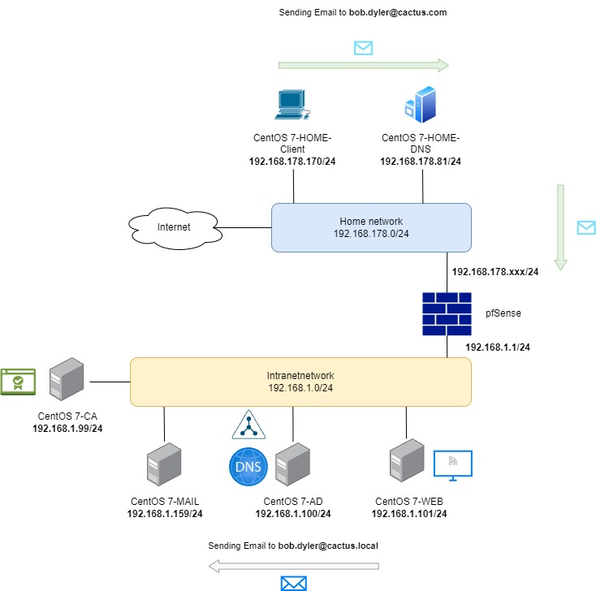

# Linux Labs LFCS

## Lab 7 : Setting a Mail server

<!--- Center image --->
<div align="center">
  <a href="../assets/labs/Schema_7.jpg" target="_blank">
    
  </a>
</div>

<br/>

We will install the following servers :

-  **7-MAIL** for sending / receiving emails. We will also set up the TLS encryption.
-  **7-HOME-Client** for sending emails from outside
-  **7-HOME-DNS** for adding MX records for resolving the email address / IP address.

<br/>

We will use the following components for our **7-MAIL** server:

- **`Dovecot`**: an open-source IMAP and POP3 email server for Linux/UNIX-like systems, written with security primarily in mind.
- **`Postfix`**: a free and open-source mail transfer agent (MTA) that routes and delivers electronic mail from one server to another over the internet.
- **`Roundcube`**: a browser-based multilingual IMAP client with an application-like user interface. It provides full functionality you expect from an email client, including MIME support, address book, folder manipulation, message searching and spell checking.

<br/>

### What is a Mail Server ?

A mail server is an application that gives us the possibility of sending messages, in the form of emails, between the different users of the organization or outside it independent of the network to which they are connected.

The basic terms that we will use in a mail server are:

**POP3**: POP (Post Office Protocol – Post Office Protocol) is the protocol that allows the message to be received and this protocol does not require a permanent connection to the internet for its operation.

**IMAP**: IMAP (Internet Message Access Protocol) is a protocol that allows the email client to connect to the email account and display the stored email messages.

**SMTP**: SMTP (Simple Mail Transfer Protocol) is a text-based protocol that is used to exchange mail messages between different devices.

**MTA**: MTA (Mail Transfer Agent) is a server whose function is to transfer emails and their management on the Internet. Some known MTAs are Sendmail, Postfix, etc.

<br/>

### Setting hostname and DNS

On **`7-MAIL`**, change the hostname :

```sh
$ hostnamectl set-hostname centos-mail
```

On **`7-AD`**, add the DNS records (A and MX):

```sh
$ vi /var/named/cactus.local.zone


$TTL 1H
@       IN SOA  ns1.cactus.local. hostmaster.cactus.local. (
                                        43       ; serial
                                        1D      ; refresh
                                        1H      ; retry
                                        1W      ; expire
                                        3H )    ; minimum

...

# MX (Mail Exchanger) record is used for resolving SMTP addresses. It tells other servers where they should send their emails.
#
# Compared to the others, we have 4 fields instead of 3 : 
# 10 and 20 represent the priority of each entry : when we send a mail John@cactus.local, we try to send 1st to mail.cactus.local
cactus.local.    MX 10   mail.cactus.local.
                 MX 20   mail2.cactus.local.

# Like with NS records, we need to precise the IP address
mail            A       192.168.1.159
mail2           A       192.168.1.161
```

<br/>

### Install postfix, Dovecot

#### &nbsp;&nbsp;&nbsp;&nbsp;&nbsp;&nbsp;&nbsp;&nbsp;&nbsp;&nbsp; <ins>postfix</ins>

- First, we must install the EPEL repositories to install the MTA later to use for the mail service

```sh
yum install epel-release -y
```

- We need the **Mail Transfer Agent** to handle the sending and delivery of mails from our mail server. We will use **`postfix`**.

```sh
$ dnf install postfix* -y
```

- Start the service

```sh
$ systemctl start postfix
$ systemctl enable postfix
```

- Add firewall Rule of Send Mail Transfer Protocol (SMTP) on CentOS Linux 7 that require for Postfix (Mail Transfer Agent).

```sh
$ firewall-cmd --permanent --add-service=smtp
$ firewall-cmd --reload
```

- In <mark>**`/etc/postfix/main.cf`**</mark> configure the Postfix Server **myhostname**, **mydomain** and **myorigin**.

```sh
$ vi /etc/postfix/main.cf


# INTERNET HOST AND DOMAIN NAMES
#
# The myhostname parameter specifies the internet hostname of this
# mail system. The default is to use the fully-qualified domain name
# from gethostname(). $myhostname is used as a default value for many
# other configuration parameters.
#
myhostname = mail.cactus.local

# The mydomain parameter specifies the local internet domain name.
# The default is to use $myhostname minus the first component.
# $mydomain is used as a default value for many other configuration
# parameters.
#
mydomain = cactus.local

# SENDING MAIL
#
# The myorigin parameter specifies the domain that locally-posted
# mail appears to come from. The default is to append $myhostname,
# which is fine for small sites.  If you run a domain with multiple
# machines, you should (1) change this to $mydomain and (2) set up
# a domain-wide alias database that aliases each user to
# user@that.users.mailhost.
#
# For the sake of consistency between sender and recipient addresses,
# myorigin also specifies the default domain name that is appended
# to recipient addresses that have no @domain part.
#
myorigin = $mydomain
```

- Modify the below lines to define the network to send and receive emails from anywhere and comment the allow localhost interface (because we already allow send and receive emails from anywhere).

```sh
$ vi /etc/postfix/main.cf


# RECEIVING MAIL

# The inet_interfaces parameter specifies the network interface
# addresses that this mail system receives mail on.  By default,
# the software claims all active interfaces on the machine. The
# parameter also controls delivery of mail to user@[ip.address].
#
# See also the proxy_interfaces parameter, for network addresses that
# are forwarded to us via a proxy or network address translator.
#
# Note: you need to stop/start Postfix when this parameter changes.
#
inet_interfaces = all
#inet_interfaces = $myhostname
#inet_interfaces = $myhostname, localhost
#inet_interfaces = localhost
```

- Set the **mydestination** by comment line number 164 and uncomment line number 166 with addition of **`mail.$mydomain`** (<mark>according to the MX record in the DNS server</mark>) at the end of line number 166, as shown below.

```sh
$ vi /etc/postfix/main.cf


# The mydestination parameter specifies the list of domains that this
# machine considers itself the final destination for.
#
# These domains are routed to the delivery agent specified with the
# local_transport parameter setting. By default, that is the UNIX
# compatible delivery agent that lookups all recipients in /etc/passwd
# and /etc/aliases or their equivalent.
#
# The default is $myhostname + localhost.$mydomain.  On a mail domain
# gateway, you should also include $mydomain.
#
# Do not specify the names of virtual domains - those domains are
# specified elsewhere (see VIRTUAL_README).
#
# Do not specify the names of domains that this machine is backup MX
# host for. Specify those names via the relay_domains settings for
# the SMTP server, or use permit_mx_backup if you are lazy (see
# STANDARD_CONFIGURATION_README).
#
# The local machine is always the final destination for mail addressed
# to user@[the.net.work.address] of an interface that the mail system
# receives mail on (see the inet_interfaces parameter).
#
# Specify a list of host or domain names, /file/name or type:table
# patterns, separated by commas and/or whitespace. A /file/name
# pattern is replaced by its contents; a type:table is matched when
# a name matches a lookup key (the right-hand side is ignored).
# Continue long lines by starting the next line with whitespace.
#
# See also below, section "REJECTING MAIL FOR UNKNOWN LOCAL USERS".
#
#mydestination = $myhostname, localhost.$mydomain, localhost
#mydestination = $myhostname, localhost.$mydomain, localhost, $mydomain
mydestination = $myhostname, localhost.$mydomain, localhost, $mydomain, mail.$mydomain
#       mail.$mydomain, www.$mydomain, ftp.$mydomain
```

- Modify **mynetworks** to configure your network.

```sh
$ vi /etc/postfix/main.cf


# Alternatively, you can specify the mynetworks list by hand, in
# which case Postfix ignores the mynetworks_style setting.
#
# Specify an explicit list of network/netmask patterns, where the
# mask specifies the number of bits in the network part of a host
# address.
#
# You can also specify the absolute pathname of a pattern file instead
# of listing the patterns here. Specify type:table for table-based lookups
# (the value on the table right-hand side is not used).
#
mynetworks = 192.168.1.0/24
#mynetworks = $config_directory/mynetworks
#mynetworks = hash:/etc/postfix/network_table
```

- Set mail directory.

```sh
$ vi /etc/postfix/main.cf


# The mail_spool_directory parameter specifies the directory where
# UNIX-style mailboxes are kept. The default setting depends on the
# system type.
#
#mail_spool_directory = /var/mail
mail_spool_directory = /var/spool/mail
```

<br/>
<br/>

- Restart the Postfix Service.

```sh
$ systemctl restart postfix
```

- Check the Send Mail Transfer Protocol (SMTP) that is listen or not after configure the main configuration file of Postfix Server.

```sh
$ netstat -tunlp | grep 25


tcp        0      0 0.0.0.0:25              0.0.0.0:*               LISTEN      3247/master         
tcp6       0      0 :::25                   :::*                    LISTEN      3247/master   
```

<br/>
<br/>

#### &nbsp;&nbsp;&nbsp;&nbsp;&nbsp;&nbsp;&nbsp;&nbsp;&nbsp;&nbsp; <ins>Dovecot</ins>

- Install packages :

```sh
$ dnf install dovecot* -y
```

- Set the Protocols POP, IMAP and LMTP by uncommenting the lines in <mark>**`/etc/dovecot/dovecot.conf`**</mark> 

```sh
$ vi etc/dovecot/dovecot.conf

# Protocols we want to be serving.
protocols = imap pop3 lmtp
```

- After configure the Mail Delivery Agent "Dovecot", Restart and Enable the Dovecot Service

```sh
$ systemctl restart dovecot
$ systemctl enable dovecot
```

- Allow the firewall port POP3 and IMAP after configure the Mail Delivery Agent Dovecot.

```sh
$ firewall-cmd --permanent --add-port=110/tcp
$ firewall-cmd --permanent --add-port=143/tcp
$ firewall-cmd --reload
```

<br/>

### Testing SMTP connection

- Install telnet

```sh
$ dnf install telnet -y
```

- Test connection. Once you get 250 DSN you can use `sendmail` or `mailx`.

```sh
$  telnet localhost smtp
Trying ::1...
Connected to localhost.
Escape character is '^]'.
220 mail.cactus.local ESMTP Postfix

ehlo localhost
250-mail.cactus.local
250-PIPELINING
250-SIZE 10240000
250-VRFY
250-ETRN
250-ENHANCEDSTATUSCODES
250-8BITMIME
250 DSN
```

<br/>

### Sending Emails with Mailx

- Check whether **`mailx`** is installed or not. No messages means it is not installed :

```sh
$ rpm -qa | grep mailx
```

- Let's install mailx :

```sh
$ dnf install mailx -y
$ rpm -qa | grep mailx


libreport-plugin-mailx-2.1.11-53.el7.centos.x86_64
mailx-12.5-19.el7.x86_64
```

<br/>

- Send an email to **`root@cactus.local`**

```sh
$ mail -v root@cactus.local

Subject: Test
Bonjour
.  # Type . the Enter before sending
EOT
Mail Delivery Status Report will be mailed to <root>.
```

- Check in <mark>**`/var/spool/mail/<USER_NAME>`**</mark> 

```sh
$ cat /var/spool/mail/root


From root@cactus.local  Sun Nov 19 16:20:19 2023
Return-Path: <root@cactus.local>
X-Original-To: root@cactus.local
Delivered-To: root@cactus.local
Received: by mail.cactus.local (Postfix, from userid 0)
	id C63D82042A40; Sun, 19 Nov 2023 16:20:19 +0100 (CET)
Date: Sun, 19 Nov 2023 16:20:19 +0100
To: root@cactus.local
Subject: Test
User-Agent: Heirloom mailx 12.5 7/5/10
MIME-Version: 1.0
Content-Type: text/plain; charset=us-ascii
Content-Transfer-Encoding: 7bit
Message-Id: <20231119152019.C63D82042A40@mail.cactus.local>
From: root@cactus.local (root)

Bonjour
```

<br/>
<br/>

- Another test, to Bob Dyler (**<span style="color:#FF8A8A">Failed Delivery</span>**) :

```sh
$ mail -v b.dyler@cactus.local


Subject: Hi Bob Dyler
Let's have a drink
.
EOT
```
```
$ cat /var/spool/mail/centos-mail


--6974E2042A40.1700408283/mail.cactus.local
Content-Description: Delivery report
Content-Type: message/delivery-status

Reporting-MTA: dns; mail.cactus.local
X-Postfix-Queue-ID: 6974E2042A40
X-Postfix-Sender: rfc822; centos-mail@cactus.local
Arrival-Date: Sun, 19 Nov 2023 16:38:03 +0100 (CET)

Final-Recipient: rfc822; b.dyler@cactus.local
Action: failed
Status: 5.1.1
Diagnostic-Code: X-Postfix; delivery via local: unknown user: "b.dyler"

--6974E2042A40.1700408283/mail.cactus.local
Content-Description: Message Headers
Content-Type: text/rfc822-headers

Return-Path: <centos-mail@cactus.local>
Received: by mail.cactus.local (Postfix, from userid 1000)
	id 6974E2042A40; Sun, 19 Nov 2023 16:38:03 +0100 (CET)
Date: Sun, 19 Nov 2023 16:38:03 +0100
To: b.dyler@cactus.local
Subject: Hey dyler
User-Agent: Heirloom mailx 12.5 7/5/10
MIME-Version: 1.0
Content-Type: text/plain; charset=us-ascii
Content-Transfer-Encoding: 7bit
Message-Id: <20231119153803.6974E2042A40@mail.cactus.local>
From: centos-mail@cactus.local (CentOS-MAIL)

--6974E2042A40.1700408283/mail.cactus.local--
```

<br/>

- You need to install the OpenLDAP client packages and dependencies.

```sh
$ dnf install openldap-clients nss-pam-ldapd -y
```

- Start the service nslcd

```sh
$ systemctl start nslcd.service
$ systemctl enable nslcd.service

Created symlink from /etc/systemd/system/multi-user.target.wants/nslcd.service to /usr/lib/systemd/system/nslcd.service.
```

- Test the LDAP login, using Bob Dyler account (**bdyler**)

```sh
[centos-ad@centos-ad ~]$ getent passwd -s ldap bdyler

(nothing happens)
```

- The client then needs to be configured to authenticate from the specified server IP address. 

  Replace the server IP address and domain controller with your own. This will allow a new home directory to be created once you enter the single sign on (SSO) password.

```sh
$ authconfig --enableldap --enableldapauth --ldapserver=ldap.cactus.local --ldapbasedn="dc=cactus,dc=local" --enablemkhomedir --update

(no return message)
```

- Restart the service

```sh
$ systemctl restart nslcd
```

- Test **again** the LDAP login, using Bob Dyler account (**bdyler**)

```sh
# authconfig REALLY did its effect !!
# and of course we needed to restart
[centos-ad@centos-ad ~]$ getent passwd -s ldap bdyler

bdyler:*:10099:500:Bob Dyler:/home/bdyler:
```

- Then resend the email to b.dyler@cactus.local (**<span style="color:#00A550">Problem solved</span>**)

```sh
$ mail -v b.dyler@cactus.local


Subject: Test
test
.
EOT
Mail Delivery Status Report will be mailed to <root>.
```
```sh
$ cat /var/spool/mail/root


--BBE87203B5C4.1700413312/mail.cactus.local
Content-Description: Delivery report
Content-Type: message/delivery-status

Reporting-MTA: dns; mail.cactus.local
X-Postfix-Queue-ID: BBE87203B5C4
X-Postfix-Sender: rfc822; root@cactus.local
Arrival-Date: Sun, 19 Nov 2023 18:01:52 +0100 (CET)

Final-Recipient: rfc822; bdyler@cactus.local
Original-Recipient: rfc822; b.dyler@cactus.local
Action: delivered
Status: 2.0.0
Diagnostic-Code: X-Postfix; delivery via local: delivered to mailbox

--BBE87203B5C4.1700413312/mail.cactus.local
Content-Description: Message Headers
Content-Type: text/rfc822-headers

Return-Path: <root@cactus.local>
Received: by mail.cactus.local (Postfix, from userid 0)
	id BBE87203B5C4; Sun, 19 Nov 2023 18:01:52 +0100 (CET)
Date: Sun, 19 Nov 2023 18:01:52 +0100
To: b.dyler@cactus.local
Subject: Test
User-Agent: Heirloom mailx 12.5 7/5/10
MIME-Version: 1.0
Content-Type: text/plain; charset=us-ascii
Content-Transfer-Encoding: 7bit
Message-Id: <20231119170152.BBE87203B5C4@mail.cactus.local>
From: root@cactus.local (root)

--BBE87203B5C4.1700413312/mail.cactus.local--
```
```sh
$ cat /var/spool/mail/bdyler


From root@cactus.local  Sun Nov 19 18:01:52 2023
Return-Path: <root@cactus.local>
X-Original-To: b.dyler@cactus.local
Delivered-To: b.dyler@cactus.local
Received: by mail.cactus.local (Postfix, from userid 0)
	id BBE87203B5C4; Sun, 19 Nov 2023 18:01:52 +0100 (CET)
Date: Sun, 19 Nov 2023 18:01:52 +0100
To: b.dyler@cactus.local
Subject: Test
User-Agent: Heirloom mailx 12.5 7/5/10
MIME-Version: 1.0
Content-Type: text/plain; charset=us-ascii
Content-Transfer-Encoding: 7bit
Message-Id: <20231119170152.BBE87203B5C4@mail.cactus.local>
From: root@cactus.local (root)

test

You have mail in /var/spool/mail/root
```

<br/>

### Sending Emails from other computer (Intranet)

- First you need to open port 25 on **7-MAIL**

```sh
$ firewall-cmd --add-port=25/tcp
$ firewall-cmd --add-port=25/udp


$ firewall-cmd --list-all
public (active)
  target: default
  icmp-block-inversion: no
  interfaces: ens33
  sources: 
  services: dhcpv6-client ssh
  ports: 25/udp 25/tcp
  protocols: 
  masquerade: no
  forward-ports: 
  source-ports: 
  icmp-blocks: 
  rich rules: 
```

<br/>

- On **7-AD** , edit the DNS records :

```sh
$ vi /var/named/cactus.local.zone

$TTL 1H
@       IN SOA  ns1.cactus.local. hostmaster.cactus.local. (
                                        43       ; serial
                                        1D      ; refresh
                                        1H      ; retry
                                        1W      ; expire
                                        3H )    ; minimum

@               NS      mail.cactus.local.
mail            A       192.168.1.159

cactus.local.    MX 10   mail.cactus.local.
```
```sh
$ vi /var/named/cactus.local.rev.zone

$TTL 1H
$ORIGIN 1.168.192.IN-ADDR.ARPA.
@            IN  SOA   ns1.cactus.local. hostmaster.cactus.local. (
                              0          ; serial
                              1D         ; refresh
                              1H         ; retry
                              1w         ; expire
                              3H         ; minimum
                              )


@               NS      ns1.cactus.local.
@               NS      ns2.cactus.local.

159             IN  PTR   mail.cactus.local.
```

<br/>

- On **7-WEB** , test the connection with telnet :

```sh
$ telnet mail.cactus.local smtp


Trying 192.168.1.159...
Connected to mail.cactus.local.
Escape character is '^]'.
220 mail.cactus.local ESMTP Postfix
ehlo mail.cactus.local
250-mail.cactus.local
250-PIPELINING
250-SIZE 10240000
250-VRFY
250-ETRN
250-ENHANCEDSTATUSCODES
250-8BITMIME
250 DSN
```

<br/>

- Test the email again on **7-WEB**

```sh
$ mail -v b.dyler@cactus.local

Subject: Hello from web
WEB test
.
EOT
Mail Delivery Status Report will be mailed to <root>.
```
```sh
$ cat /var/spool/mail/root


This is the mail system at host centos-web.localdomain.

Enclosed is the mail delivery report that you requested.

                   The mail system

<b.dyler@cactus.local>: delivery via mail.cactus.local[192.168.1.159]:25: 250
    2.0.0 Ok: queued as 16D6E203B5C4

--527FA2044ECA.1700416877/centos-web.localdomain
Content-Description: Delivery report
Content-Type: message/delivery-status

Reporting-MTA: dns; centos-web.localdomain
X-Postfix-Queue-ID: 527FA2044ECA
X-Postfix-Sender: rfc822; root@centos-web.localdomain
Arrival-Date: Sun, 19 Nov 2023 19:01:17 +0100 (CET)

Final-Recipient: rfc822; b.dyler@cactus.local
Action: relayed
Status: 2.0.0
Remote-MTA: dns; mail.cactus.local
Diagnostic-Code: smtp; 250 2.0.0 Ok: queued as 16D6E203B5C4

--527FA2044ECA.1700416877/centos-web.localdomain
Content-Description: Message Headers
Content-Type: text/rfc822-headers

Return-Path: <root@centos-web.localdomain>
Received: by centos-web.localdomain (Postfix, from userid 0)
	id 527FA2044ECA; Sun, 19 Nov 2023 19:01:17 +0100 (CET)
Date: Sun, 19 Nov 2023 19:01:17 +0100
To: b.dyler@cactus.local
Subject: Hello from web
User-Agent: Heirloom mailx 12.5 7/5/10
MIME-Version: 1.0
Content-Type: text/plain; charset=us-ascii
Content-Transfer-Encoding: 7bit
Message-Id: <20231119180117.527FA2044ECA@centos-web.localdomain>
From: root@centos-web.localdomain (root)

--527FA2044ECA.1700416877/centos-web.localdomain--
```